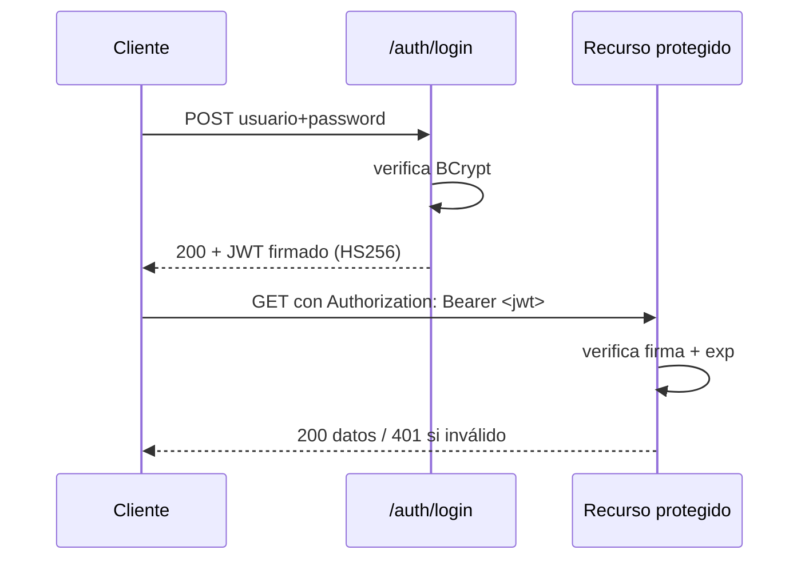
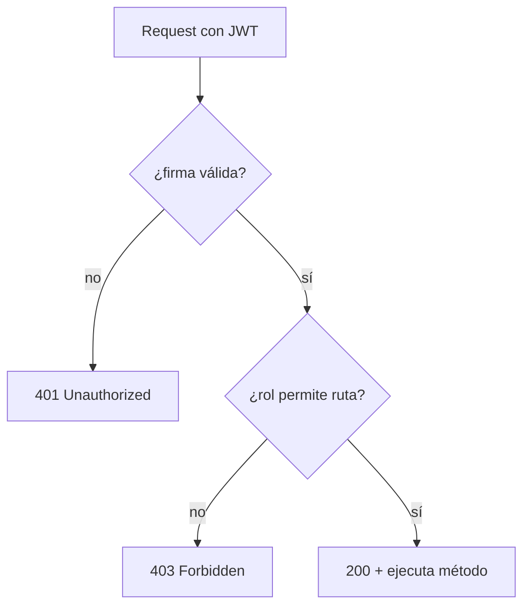
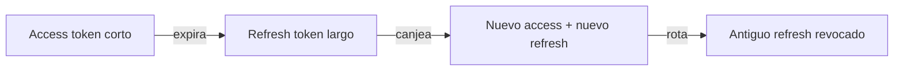

# Bloque XVIII · Seguridad: Spring Security + JWT

> Una API sin seguridad no es una API, es una brecha esperando a ocurrir.
> Autenticar es saber QUIÉN eres; autorizar es saber QUÉ puedes hacer.

---

## 18.1 SecurityFilterChain

La cadena de filtros decide, antes del controller, si una petición es pública
o requiere autenticación. Política = función pura: `esPublica(metodo, ruta)`.
Regla de oro: **deny by default** (lo no listado, privado).

## 18.2 Usuarios en memoria

`InMemoryUserDetailsManager`: un mapa `username -> Usuario`. Útil para demos y
tests. Búsqueda case-insensitive; cuenta deshabilitada = no existe.

## 18.3 PasswordEncoder (BCrypt)

Nunca se guarda la contraseña en claro: solo su hash con salt aleatorio.
BCrypt es lento a propósito (resistencia a fuerza bruta). El mismo input
produce hashes distintos; `matches` recupera el salt del propio hash.

## 18.4 UserDetailsService

Carga el usuario desde la BD. `loadUserByUsername` no debe lanzar excepción
que filtre la existencia (evita *user enumeration*). Comprueba `enabled` y
`locked` antes de autenticar.

## 18.5–18.6 Flujo JWT (login → token → request autenticada)



El JWT es **stateless**: el servidor no guarda sesión, confía en la firma.

## 18.7–18.8 Autorización por rol y a nivel de método



`@PreAuthorize` evalúa ANTES del método; `@PostAuthorize` filtra el retorno
(p.ej. propietario o admin → evita IDOR). 401 ≠ 403.

## 18.9 Refresh tokens



Rotación *single-use*: reusar un refresh ya rotado = posible robo.

## 18.10 Endurecimiento CSRF y CORS

JWT en header `Authorization` es inmune a CSRF clásico (no usa cookie de
sesión). CORS lo aplica el navegador: allowlist exacta, nunca `*` con
credenciales, no reflejar el `Origin` entrante sin validar.

---

### Qué practicarás

Política de SecurityFilterChain, usuarios en memoria, hashing BCrypt,
UserDetailsService desde BD, emisión y validación de JWT con jjwt,
filtro de validación, autorización por rol, method security, rotación de
refresh tokens y endurecimiento CSRF/CORS.


## Teoría Extendida y Ejemplos de Código

### 1. La Cadena de Filtros (SecurityFilterChain)
El núcleo de Spring Security 6+. Adiós al antíguo `WebSecurityConfigurerAdapter`.
```java
@Bean
public SecurityFilterChain filterChain(HttpSecurity http) throws Exception {
    return http
        .csrf(csrf -> csrf.disable()) // Desactivado para APIs Stateless (JWT)
        .cors(Customizer.withDefaults())
        .sessionManagement(s -> s.sessionCreationPolicy(SessionCreationPolicy.STATELESS))
        .authorizeHttpRequests(auth -> auth
            .requestMatchers("/api/auth/**").permitAll()
            .requestMatchers(HttpMethod.GET, "/api/publico").permitAll()
            .requestMatchers("/api/admin/**").hasRole("ADMIN")
            .anyRequest().authenticated()
        )
        .addFilterBefore(jwtValidationFilter, UsernamePasswordAuthenticationFilter.class)
        .build();
}
```

### 2. Generación y Validación de JWT
Un JWT consta de Header, Payload (Claims) y Firma. La firma criptográfica evita la manipulación.
```java
// Usando io.jsonwebtoken (jjwt)
public String generarToken(UserDetails user) {
    return Jwts.builder()
        .setSubject(user.getUsername())
        .claim("rol", "ROLE_ADMIN")
        .setIssuedAt(new Date())
        .setExpiration(new Date(System.currentTimeMillis() + 1000 * 60 * 60)) // 1 hora
        .signWith(claveSecreta, SignatureAlgorithm.HS256)
        .compact();
}
```

### 3. Hasheo de Contraseñas
La BD NUNCA debe almacenar texto plano ni algoritmos débiles (MD5). Usa BCrypt.
```java
@Bean
public PasswordEncoder passwordEncoder() {
    return new BCryptPasswordEncoder(); // Genera un salt único automáticamente por hash
}
```
