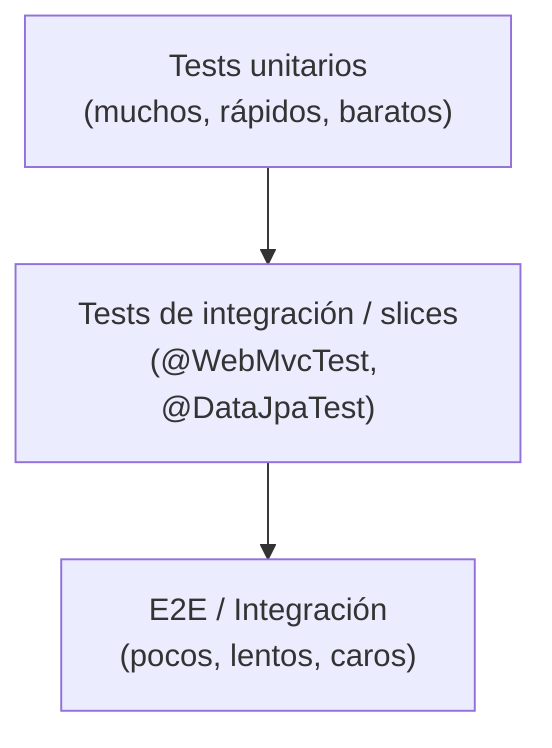
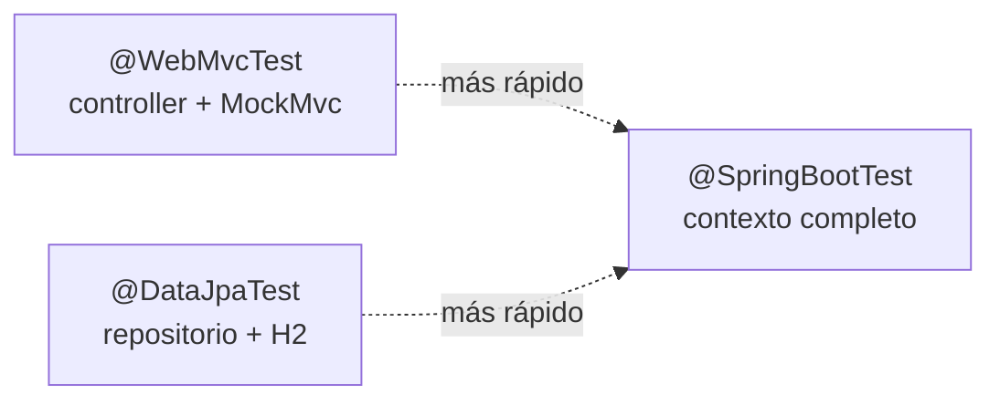

# Bloque XIX · Testing de APIs

> El código sin tests es código que no sabes si funciona; es solo código que aún no ha fallado.
> Un test no demuestra ausencia de bugs, pero un test rojo demuestra su presencia.

Testear una API no es un acto de fe: es ingeniería. En este bloque
aprendes a verificar tu API en capas, desde el método aislado hasta el
sistema completo, eligiendo el tipo de test correcto para cada coste.

## 19.1 La pirámide de tests

Muchos tests rápidos y baratos en la base; pocos tests lentos y caros
arriba. Invertir la pirámide (mucho e2e) hace el suite frágil y lento.



## 19.2 Test unitario con JUnit 5

`@Test`, `assertEquals`, `assertThrows`, `assertAll`. Aísla la lógica
pura: sin Spring, sin BD, sin red. Milisegundos por test.

## 19.3 Dobles de prueba: mocks y stubs

Un *stub* devuelve respuestas fijas; un *mock* además verifica
interacciones. Mockito automatiza esto, pero el concepto es un objeto
que sustituye una dependencia para controlar el entorno del test.

## 19.4 Test de servicio

El servicio se prueba con sus colaboradores mockeados: verificas la
orquestación de la lógica de negocio sin tocar infraestructura.

## 19.5 Slices de Spring

Un *slice* arranca solo la porción del contexto que necesitas. Más
rápido que `@SpringBootTest`, más realista que un unitario.



## 19.6 Aserciones sobre JSON

Comparar respuestas JSON por nodos (no por String) tolera orden de
claves y espacios. JsonPath / un matcher de árbol Jackson.

## 19.7 @DataJpaTest

Arranca solo JPA + un H2 en memoria; rollback automático por test.

## 19.8 @SpringBootTest e integración

Levanta el contexto completo y un servidor; prueba el flujo HTTP real
de extremo a extremo.

## 19.9 Testcontainers

Una BD real (Postgres) en un contenedor efímero: máxima fidelidad,
mayor coste. Útil cuando H2 no replica el dialecto real.

## 19.10 Testing de seguridad

Verifica que un endpoint protegido responde 401 sin credenciales, 403
con rol insuficiente y 200 con autorización correcta.

## 19.11 Tests parametrizados

`@ParameterizedTest` ejecuta el mismo test con N juegos de datos:
una tabla `entrada -> esperado` en vez de copiar/pegar.

## 19.12 Perfiles de test

`@ActiveProfiles("test")` selecciona configuración aislada (BD en
memoria, secretos falsos) para no contaminar entornos reales.

## 19.13 Cobertura y quality gate

La cobertura (líneas ejecutadas / total) es una señal, no un objetivo.
Un *quality gate* falla el build si baja de un umbral mínimo.

---

### Qué practicarás

JUnit 5 puro, dobles de prueba (mock/stub manual), test unitario de
servicio, `@WebMvcTest` como función request→response, aserciones
sobre JSON con Jackson, `@DataJpaTest` con repositorio en memoria,
integración e2e, Testcontainers/Postgres modelado, testing de
endpoints protegidos, tests parametrizados, slices y perfil test, y
cálculo de cobertura con quality gate como función pura.


## Teoría Extendida y Ejemplos de Código

### 1. Test Unitario Puro (Mockito)
Velocidad extrema. No arranca Spring. Aísla la lógica del negocio.
```java
@ExtendWith(MockitoExtension.class)
class UsuarioServiceTest {
    @Mock private UsuarioRepository repo;
    @InjectMocks private UsuarioService service;

    @Test
    void siUsuarioNoExiste_lanzaExcepcion() {
        when(repo.findById(1L)).thenReturn(Optional.empty());
        
        assertThrows(RecursoNoEncontradoException.class, () -> {
            service.obtener(1L);
        });
        
        verify(repo).findById(1L); // Verifica que el repo se llamó
    }
}
```

### 2. Test de Capa Web (@WebMvcTest)
Arranca solo el Controller para testear validaciones HTTP y Seguridad. Usa `MockMvc`.
```java
@WebMvcTest(UsuarioController.class)
class UsuarioControllerTest {
    @Autowired private MockMvc mockMvc;
    @MockBean private UsuarioService service;

    @Test
    void postInvalido_devuelve400() throws Exception {
        mockMvc.perform(post("/usuarios")
               .contentType(MediaType.APPLICATION_JSON)
               .content("{\"email\": \"invalido\" }")) // Falla Bean Validation
               .andExpect(status().isBadRequest())
               .andExpect(jsonPath("$.errores_detalle").exists());
    }
}
```

### 3. Test de Integración E2E (@SpringBootTest)
Prueba todo el sistema integrado, desde la petición HTTP hasta la base de datos (con Testcontainers o H2).
```java
@SpringBootTest(webEnvironment = SpringBootTest.WebEnvironment.RANDOM_PORT)
class ApiTest {
    @Autowired private TestRestTemplate restTemplate;
    
    @Test
    void getUsuarioFunciona() {
        ResponseEntity<UsuarioDto> response = restTemplate.getForEntity("/usuarios/1", UsuarioDto.class);
        assertEquals(HttpStatus.OK, response.getStatusCode());
    }
}
```
