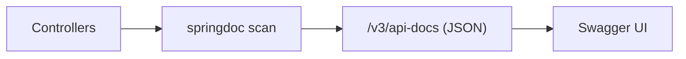
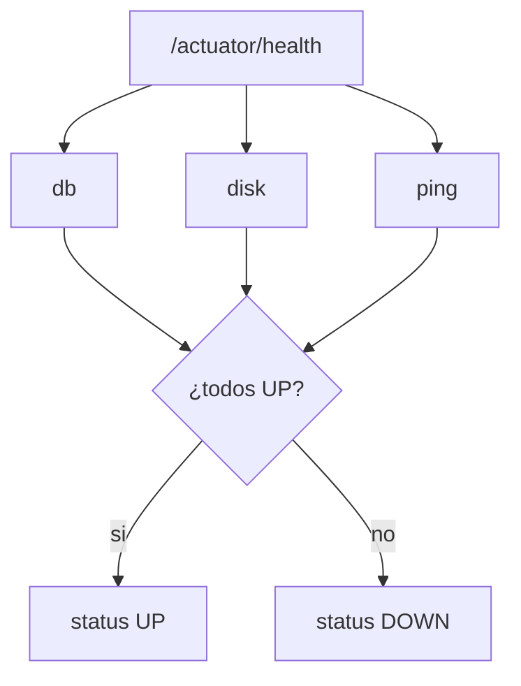
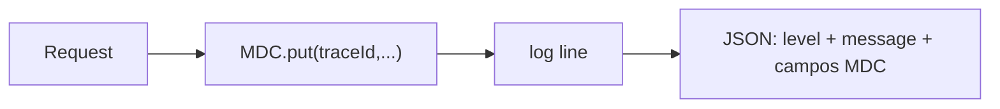
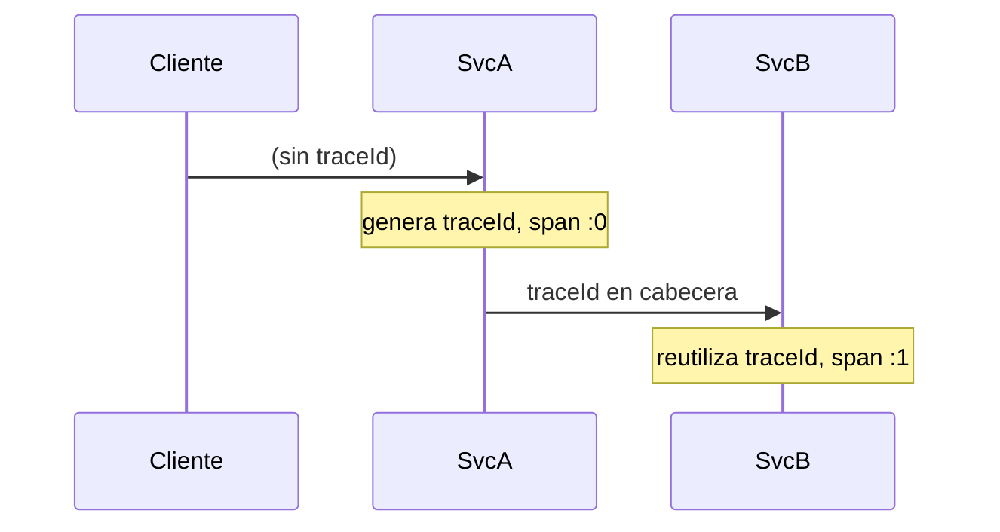

# Bloque XX · Observabilidad y documentacion

> Una API sin documentacion es un enigma; una API sin observabilidad es una
> caja negra. Documenta lo que ofreces y observa lo que ocurre.

---

## 20.1 OpenAPI / Swagger con springdoc

springdoc-openapi escanea los controladores y genera un documento OpenAPI 3
servido en `/v3/api-docs` y una UI en `/swagger-ui.html`.

El documento es un arbol `info` + `paths -> path -> metodo -> operacion`.

## 20.2 Anotaciones de documentacion

`@Operation(summary=...)` y `@Schema(description=...)` enriquecen cada endpoint
y modelo. Reglas de precedencia: summary > description > valor por defecto.

## 20.3 Actuator: health agregado

El estado global es estrictamente AND: un solo componente DOWN tumba el todo.

## 20.4 Health y metricas propias

`HealthIndicator` custom + Micrometer. Tasa de error sobre contadores
acumulados decide el estado de salud frente a un umbral.

## 20.5 Logging estructurado con MDC

JSON es parseable por ELK/Loki; el MDC adjunta contexto a cada linea.

## 20.6 Trazas y correlacion

El `traceId` se propaga intacto; el `spanId` es unico por salto.

---

### Qué practicarás

Generar un mini documento OpenAPI, resolver anotaciones `@Operation`/`@Schema`,
agregar el health de Actuator, calcular metricas y health propios, formatear
logs estructurados JSON con MDC y propagar traceId/spanId entre saltos.
