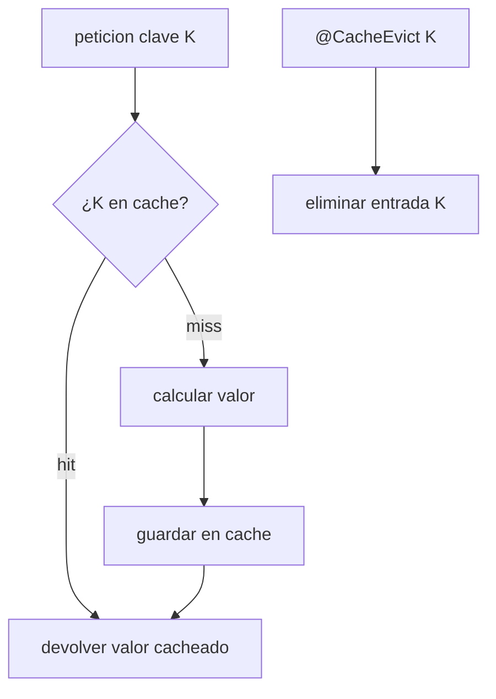
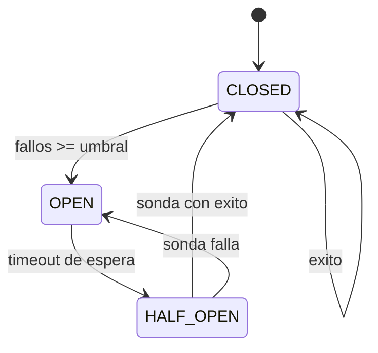
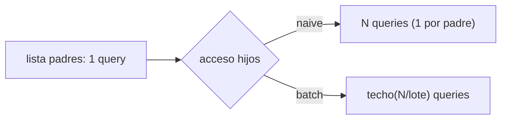

# Bloque XXI · Rendimiento y resiliencia

> Una API rapida que se cae no sirve; una API resiliente que es lenta tampoco.
> El objetivo es ser veloz bajo carga y seguir en pie cuando algo falla.

---

## 21.1 Cache (Spring Cache Abstraction)

`@Cacheable` guarda el resultado por clave; `@CacheEvict` lo invalida. La idea
clave es **get-or-compute**: si hay hit no se ejecuta el calculo costoso.



## 21.2 Endpoints asincronos

`@Async` + `CompletableFuture` lanzan trabajo en paralelo y combinan resultados
sin bloquear el hilo de peticion (`allOf`, `thenApply`).

## 21.3 Rate limiting (token bucket)

El bucket tiene una capacidad; se recarga 1 token cada `refillMs`. Cada
peticion consume 1 token; sin tokens se responde 429.

## 21.4 Reintentos y circuit breaker

Los reintentos con backoff absorben fallos transitorios. El circuit breaker
corta el trafico a un servicio caido y deja pasar una sonda al recuperarse.



## 21.5 Timeouts y bulkhead

Un timeout cancela operaciones que exceden su presupuesto. El bulkhead aisla
recursos con N permisos (semaforo): saturado, rechaza rapido (fail-fast) para
proteger el resto del sistema.

## 21.6 Problema N+1 y tuning de consultas

Acceso ingenuo: 1 consulta de padres + N consultas de hijos (1+N). Con
fetch/batch los hijos se cargan por lotes y el coste cae a 1 + techo(N/lote).



---

### Qué practicarás

Cache get-or-compute y evict, composicion de `CompletableFuture`, algoritmo
token-bucket, maquina de estados de circuit breaker con reintentos, timeouts
deterministas y bulkhead con semaforo, y diagnostico/solucion del N+1.


## Teoría Extendida y Ejemplos de Código

### 1. Caché Absoluta (@Cacheable)
Guarda en memoria RAM (o en Redis) resultados pesados para no martillear la base de datos.
```java
@Cacheable(value = "tarifas", key = "#codigoPais")
public TarifaDto calcularTarifaCompleja(String codigoPais) {
    // Si esta línea se ejecuta, es un Cache Miss. Tarda 3 segundos.
    // La próxima vez, ni entrará a este método.
    return calculoPesado(codigoPais); 
}

@CacheEvict(value = "tarifas", allEntries = true)
public void actualizarTarifas() {
    // Limpia la caché cuando los precios base cambian
}
```

### 2. Rate Limiting (Protección contra DDoS/Scraping)
Limita la cantidad de peticiones que un cliente/IP puede hacer. Usa librerías como Bucket4j.
```java
// Ejemplo conceptual con Token Bucket
Bucket bucket = Bucket.builder()
        .addLimit(Bandwidth.classic(10, Refill.intervally(10, Duration.ofMinutes(1))))
        .build();

if (bucket.tryConsume(1)) {
    return procesarPeticion();
} else {
    return ResponseEntity.status(429).body("Too Many Requests");
}
```

### 3. Tareas Asíncronas Fire-And-Forget
Si envías un email tras un registro, no hagas que el usuario espere 2 segundos viendo un "Cargando...".
```java
@Service
public class EmailService {
    
    @Async // Se ejecuta en un Thread Pool separado (Requiere @EnableAsync)
    public void enviarEmailBienvenida(String email) {
        servidorSmtp.send(...);
    }
}
```
