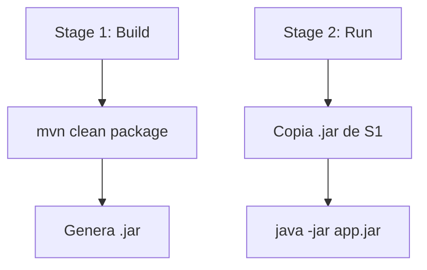

# Bloque XXII · Docker y despliegue

> Las APIs no viven en tu IDE, viven en contenedores. Empaquetar tu API en
> Docker de forma segura, ligera y orquestarla junto a su base de datos es vital.

---

## 22.1 Dockerfile Multi-stage

El patrón *multi-stage* es obligatorio en producción. Un *stage* compila (con Maven/JDK) y otro ejecuta (solo JRE). Esto reduce drásticamente el tamaño de la imagen y aumenta la seguridad, ya que no llevas herramientas de compilación a producción ni su código fuente.

### Ejemplo de Multi-stage
```dockerfile
# Stage 1: Build
FROM maven:3.9-eclipse-temurin-21 AS build
WORKDIR /app
# Descarga dependencias de forma cacheada
COPY pom.xml .
RUN mvn dependency:go-offline
COPY src ./src
RUN mvn clean package -DskipTests

# Stage 2: Runtime
FROM eclipse-temurin:21-jre-alpine
WORKDIR /app
# Principio de menor privilegio: crear usuario sin permisos root
RUN addgroup -S spring && adduser -S spring -G spring
USER spring:spring
# Solo se transfiere el JAR limpio
COPY --from=build /app/target/*.jar app.jar
EXPOSE 8080
# Exec form para propagar señales del SO (SIGTERM)
ENTRYPOINT ["java", "-jar", "app.jar"]
```



## 22.2 Docker Compose Stack y Redes

Orquesta la API y la base de datos (ej. PostgreSQL) juntos para facilitar el desarrollo y el despliegue de conjuntos. Permite definir redes privadas (`bridge`) para que la base de datos no sea accesible desde el exterior.

### Ejemplo de docker-compose.yml
```yaml
version: '3.8'
services:
  db:
    image: postgres:15-alpine
    environment:
      POSTGRES_USER: admin
      POSTGRES_PASSWORD: ${DB_PASS}
    volumes:
      - pgdata:/var/lib/postgresql/data
    healthcheck:
      test: ["CMD-SHELL", "pg_isready -U admin"]
      interval: 5s
      timeout: 3s
      retries: 5

  api:
    build: .
    ports:
      - "8080:8080"
    environment:
      SPRING_DATASOURCE_URL: jdbc:postgresql://db:5432/postgres
    depends_on:
      db:
        condition: service_healthy

volumes:
  pgdata:
```

## 22.3 Healthchecks y depends_on

Como se ve en el YAML anterior, la API fallará si arranca antes de que la base de datos esté lista para aceptar conexiones. Un simple ping TCP al puerto `5432` no basta, porque el puerto se abre microsegundos antes de que Postgres haya iniciado realmente su motor interno. Usar comandos nativos como `pg_isready` garantiza que aceptará conexiones y que la condición `service_healthy` funcione.

## 22.4 Configuración por entorno (12-factor)

Nunca subas contraseñas a Git. La metodología *12-Factor App* dicta que la configuración debe inyectarse a través del entorno de despliegue. En Spring Boot, cualquier propiedad de `application.yml` (ej. `spring.datasource.password`) puede sobreescribirse automáticamente con una variable de entorno equivalente en mayúsculas (`SPRING_DATASOURCE_PASSWORD`).

```yaml
# application.yml
spring:
  datasource:
    # Soporta valores por defecto locales vía ':'
    url: ${DB_URL:jdbc:postgresql://localhost:5432/localdb}
```

## 22.5 Apagado ordenado (Graceful Shutdown)

Si el contenedor recibe un `SIGTERM` (cuando haces `docker stop` o cuando Kubernetes destruye un Pod para actualizarlo), la API debe dejar de aceptar peticiones nuevas de inmediato (devolviendo `503 Service Unavailable` a balanceadores), pero debe terminar de procesar las peticiones que ya están en vuelo.

```yaml
# application.yml
server:
  shutdown: graceful
spring:
  lifecycle:
    timeout-per-shutdown-phase: 20s
```
**Importante:** Para que esto funcione, el `ENTRYPOINT` en el Dockerfile DEBE usar la sintaxis `["java", "-jar", "app.jar"]` (*exec form*), y no `java -jar app.jar` (*shell form*). En *shell form*, el proceso PID 1 es el shell de bash, el cual traga y no traslada la señal SIGTERM a la JVM, provocando una muerte súbita (kill -9) tras el tiempo de gracia del demonio Docker.

## 22.6 Reverse Proxy (Traefik / Nginx)

En producción real, tu contenedor de la API Spring Boot no se expone a internet directamente (no gestiona certificados SSL ni balanceo directamente). Un Reverse Proxy como **Traefik** se sitúa delante como única puerta de entrada al exterior, mapeando nombres de dominio, renovando SSL con Let's Encrypt automáticamente y delegando internamente a los contenedores apropiados.

---

### Qué practicarás

Generación programática de `Dockerfile` validando reglas estrictas de seguridad (usuario non-root, exec-form), validación estructural de `docker-compose.yml`, configuración de propiedades inyectadas por variables de entorno y emulación del apagado ordenado de Tomcat.
