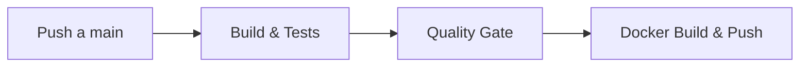

# Bloque XXIII · CI/CD y calidad

> Si no hay integración continua, hay sufrimiento continuo. La calidad de
> tu API debe evaluarse y desplegarse de forma automatizada y predecible.

---

## 23.1 GitHub Actions Pipeline (Continuous Integration)

El ciclo de Integración Continua (CI) se asegura de que la rama `main` siempre esté compilable y con los tests en verde tras el código subido por cada desarrollador. GitHub Actions se configura con un YAML en la carpeta `.github/workflows/`.

### Ejemplo de Workflow Básico (Build & Test)
```yaml
name: Java CI with Maven

on:
  push:
    branches: [ "main" ]
  pull_request:
    branches: [ "main" ]

jobs:
  build-and-test:
    runs-on: ubuntu-latest
    steps:
    - uses: actions/checkout@v4
    
    - name: Configurar Java JDK 21
      uses: actions/setup-java@v4
      with:
        java-version: '21'
        distribution: 'temurin'
        cache: maven # Acelera la descarga de dependencias
        
    - name: Compilar y Testear (con Jacoco)
      run: mvn -B clean verify
```



## 23.2 Static Analysis y Quality Gate (SonarQube / Jacoco)

No basta con que los tests "pasen" sin errores; deben cubrir suficiente código y el código resultante no debe tener vulnerabilidades de seguridad (*code smells*, OWASP Top 10, deudas técnicas masivas).

**Jacoco (Cobertura local automatizada):**
Se añade como plugin en tu `pom.xml`. Puedes programarlo para que fuerce un fallo (rompa la compilación) si tu código no alcanza un umbral mínimo de cobertura.

```xml
<plugin>
    <groupId>org.jacoco</groupId>
    <artifactId>jacoco-maven-plugin</artifactId>
    <version>0.8.11</version>
    <executions>
        <!-- Prepara el agente antes de los test -->
        <execution>
            <id>prepare-agent</id>
            <goals><goal>prepare-agent</goal></goals>
        </execution>
        <!-- Umbral restrictivo que frena el build -->
        <execution>
            <id>check</id>
            <goals><goal>check</goal></goals>
            <configuration>
                <rules>
                    <rule>
                        <element>BUNDLE</element>
                        <limits>
                            <limit>
                                <counter>LINE</counter>
                                <value>COVEREDRATIO</value>
                                <minimum>0.80</minimum> <!-- Mínimo 80% -->
                            </limit>
                        </limits>
                    </rule>
                </rules>
            </configuration>
        </execution>
    </executions>
</plugin>
```

**SonarQube (Análisis estático en la nube):**
Realiza pasadas por el código verificando complejidad ciclomática y duplicidades. Si el *Quality Gate* definido en Sonar falla, enviará una señal a GitHub para bloquear el botón de "Merge" del Pull Request.

## 23.3 Docker Build & Push (Continuous Delivery)

Una vez que el código es evaluado y certificado (tests en verde, validación de Sonar correcta), el pipeline empaqueta la aplicación usando tu Dockerfile (el *Build*) y sube el resultado a un registro remoto (como Docker Hub o GitHub Container Registry - GHCR) (el *Push*).

Es una muy buena práctica utilizar el SHA del commit como *Tag* de la imagen de Docker para mantener una trazabilidad rigurosa y poder revertir a la versión exacta si ocurre un desastre:
`docker build -t miusuario/api-app:${{ github.sha }} .`

## 23.4 Deploy vía Webhook (Continuous Deployment)

El último paso automático es actualizar el servidor en la nube o en tu red de casa (Homelab). Herramientas como Watchtower o el Webhook de Portainer exponen una URL secreta.

El pipeline de GitHub (en un último `Job`) realiza un simple HTTP `POST` a esa URL secreta. Inmediatamente el servidor procede a bajarse (`pull`) la nueva imagen que se acaba de construir y reiniciar el contenedor sin intervención manual. Combinado con el apagado ordenado, tus usuarios ni lo notarán (Zero-Downtime Deployment).

---

### Qué practicarás

Modelar pipelines de GitHub Actions verificando sintaxis YAML, configuración de umbrales en plugins de Jacoco para fallar la compilación por baja cobertura, integración de variables de entorno para Docker y diseño mental de una canalización ininterrumpida desde que haces git push hasta que se levanta en producción.
