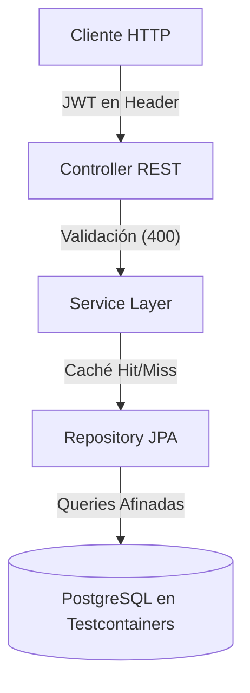

# Bloque XXIV · Boss Final (multi-parte)

> Todo el bootcamp culmina aquí. Debes construir una API corporativa completa
> desde cero, integrando los 23 bloques anteriores. No hay atajos.

---

## 24.1 Task Tracker Core API (Dominio y JPA)

El núcleo de la aplicación corporativa será un **Gestor de Proyectos y Tareas**. En este paso debes construir el fundamento sin fisuras:

1. **Dominio Rico y Relaciones Robustas:** 
   Clases `Proyecto` y `Tarea` modeladas como `@Entity`. La relación en el proyecto será de tipo `@OneToMany(mappedBy="proyecto", cascade=CascadeType.ALL, orphanRemoval=true)`. Las claves primarias deberán ser aleatorias y no secuenciales usando UUIDs.
   
2. **Consultas Eficientes contra la BD:** 
   Debes esquivar los temidos problemas N+1 que saturan la red. Si necesitas pedir un Proyecto y acceder a sus Tareas, deberás usar la anotación `@EntityGraph(attributePaths = {"tareas"})` en tu `JpaRepository` para forzar que JPA haga un *Left Outer Join* subyacente.

3. **Validación Férrea e Integridad:** 
   Uso estricto de Bean Validation (`@NotNull`, `@NotBlank`, `@Size`). Además, requerirás crear validadores personalizados para lógicas *cross-field* a nivel de clase (Ej: "Una tarea en estado COMPLETADA tiene que tener una fechaResolucion obligatoria").

4. **Manejo Centralizado de Errores (RFC 7807):**
   Todos los errores deben capturarse globalmente para que el cliente reciba un formato único estandarizado.
```java
// Ejemplo RFC 7807 (ProblemDetail) en tu ControllerAdvice
@ExceptionHandler(EntityNotFoundException.class)
public ProblemDetail handleNotFound(EntityNotFoundException ex) {
    ProblemDetail problem = ProblemDetail.forStatusAndDetail(HttpStatus.NOT_FOUND, ex.getMessage());
    problem.setTitle("Recurso no encontrado");
    problem.setProperty("timestamp", Instant.now());
    return problem;
}
```

## 24.2 Secured, Observable & Testcontainers

Una API no está terminada cuando funciona en tu máquina, sino cuando es lista para ser consumida en producción (Enterprise-Grade).

### 1. Seguridad de Cero Confianza (Spring Security + JWT)
Bloquea todos los endpoints. Usa filtros *stateless* (`OncePerRequestFilter`) que decodifican un token JWT de la cabecera `Authorization`.
Refuerza las lógicas de negocio a nivel de método, no de controlador:
```java
@PreAuthorize("hasRole('ADMIN') or @proyectoSecurity.esDueño(#proyectoId, authentication.name)")
public void eliminarProyecto(UUID proyectoId) { ... }
```

### 2. Observabilidad (Actuator y Trazabilidad MDC)
Habilita los endpoints `/actuator/health` y `/actuator/prometheus`.
Para tener *trazabilidad cruzada*, inyecta un ID de correlación en cada petición y ponlo en el *Mapped Diagnostic Context* (MDC) de SLF4J. Así, todos los logs que imprimas compartirán un ID, facilitando buscar errores en herramientas como Datadog o Kibana.
```java
// Dentro de un Filter
String traceId = UUID.randomUUID().toString();
MDC.put("traceId", traceId);
try {
    filterChain.doFilter(request, response);
} finally {
    MDC.remove("traceId");
}
```

### 3. Testing E2E con Testcontainers
Se acabó usar H2 en memoria para probar lógicas específicas de base de datos.
Los tests deben levantar de forma completamente opaca (al inicio de la suite) un contendor en Docker real de PostgreSQL que se destruirá automáticamente al final.
```java
@SpringBootTest(webEnvironment = SpringBootTest.WebEnvironment.RANDOM_PORT)
@AutoConfigureMockMvc
@Testcontainers // Extensión vital
class TaskTrackerIntegrationTest {
    
    // Inicia un contenedor real de PostgreSQL
    @Container
    static PostgreSQLContainer<?> postgres = new PostgreSQLContainer<>("postgres:15-alpine");

    // Inyecta dinámicamente las variables de la BD creada
    @DynamicPropertySource
    static void setProperties(DynamicPropertyRegistry registry) {
        registry.add("spring.datasource.url", postgres::getJdbcUrl);
        registry.add("spring.datasource.username", postgres::getUsername);
        registry.add("spring.datasource.password", postgres::getPassword);
    }
    
    // @Test void probarFlujoEndToEnd()...
}
```



---

### Qué practicarás

El **Boss Final**. Crearás repositorios JPA, validaciones anidadas, interceptores JWT, Dockerfiles multi-stage y escribirás una suite de testing inapelable usando PostgreSQL en contenedores de vida efímera. Demostrarás que dominas las tecnologías del backend moderno y estás listo para cualquier entorno corporativo.
