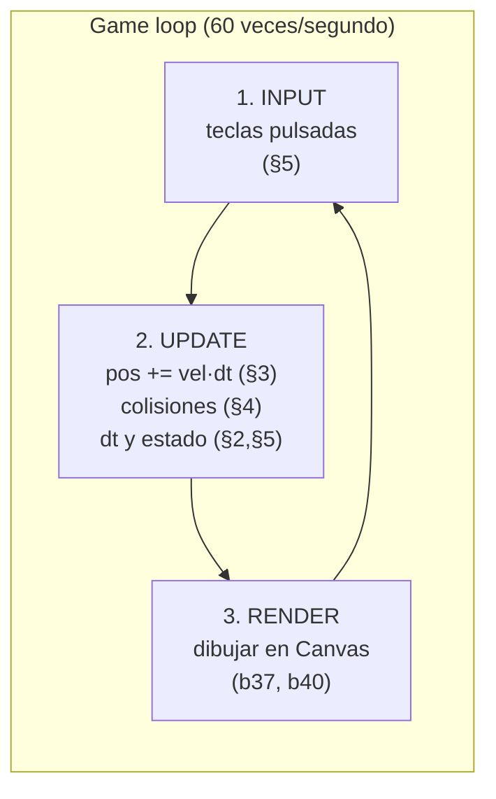
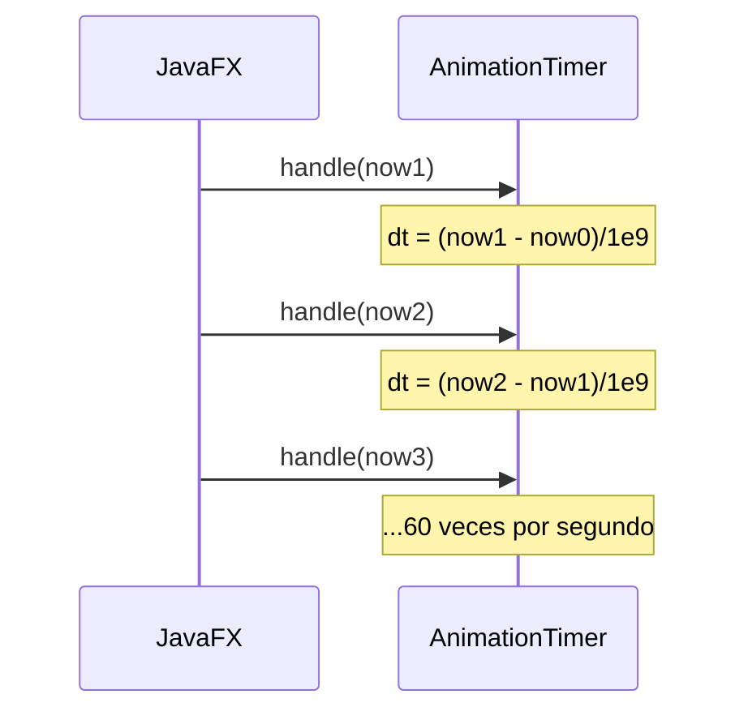
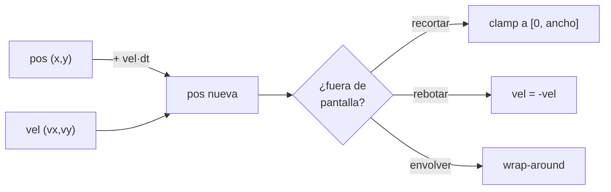
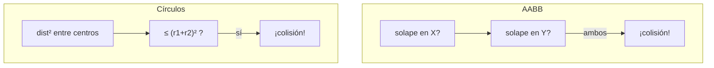
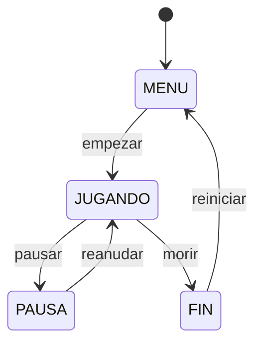
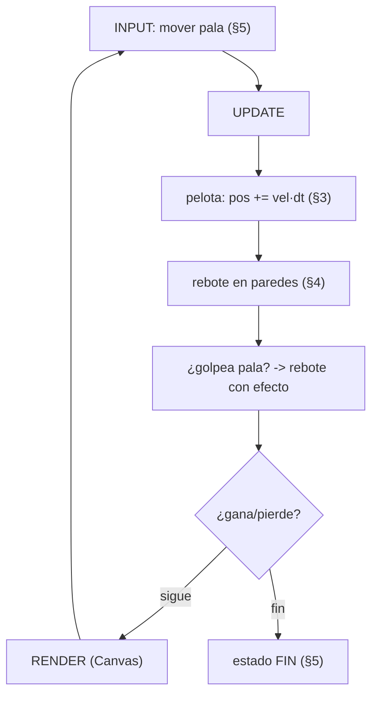

# Bloque 41 · Animación, *game loop* y juego 2D (PMDM · RA2/RA5)

> Hasta ahora tus interfaces eran ESTÁTICAS: pintabas una ventana (b32–b36), dibujabas formas en un
> `Canvas` (b37_fxcustom) y procesabas imágenes (b40_media), pero todo se quedaba quieto esperando un
> clic. Un juego es lo contrario: el mundo se MUEVE solo, 60 veces por segundo, respondiendo a lo que
> haces. Lo que te falta no es dibujar mejor —eso ya lo sabes—, es el **motor que repite**: el *game
> loop*. La buena noticia es que la "física" de un juego 2D no es física de verdad: es la fórmula
> `espacio = velocidad · tiempo` que diste en 1º de la ESO, más comparar rectángulos. Cuando lo ves
> así, mover una nave, rebotar una pelota o detectar que el láser tocó al enemigo deja de ser magia y
> pasa a ser aritmética que escribes tú, y que se puede probar con JUnit sin abrir una sola ventana.

---

## Cómo usar este documento

- **Lee UNA sección → haz SU ejercicio → vuelve.** Cada sección `N` corresponde al ejercicio
  `Ej31(8+N)`: la sección 1 es `Ej319`, la 2 es `Ej320`, … la 6 es `Ej324`. No lo leas entero de un
  tirón: el bloque está pensado para alternar lectura y práctica.
- **Los tests son la especificación real.** Cuando una GUÍA dice "el test comprueba X", esa frase
  vale más que cualquier explicación: te dice exactamente qué debe devolver tu método y con qué caso
  límite te van a pillar.
- **Esta teoría va MÁS ALLÁ de los ejercicios.** Los ejercicios tocan una parte de cada tema; aquí se
  explica el tema entero (todos los tipos de animación, todas las técnicas de colisión, el patrón de
  paso fijo completo) para que puedas resolver un caso nuevo que el ejercicio no plantea. Las tablas
  marcan con "(consulta)" lo que es ampliación.
- **Nota de testing:** los `core` son **lógica pura headless** (interpolación, deltaTime, física,
  colisiones, máquinas de estado): se prueban con JUnit normal, sin abrir ventana ni arrancar un
  `AnimationTimer`. Solo el **Playground visual** (`PlaygroundJuego`, `extends Application`) monta un
  game loop real sobre un `Canvas`, y se ejecuta con `mvn -pl b41_anim javafx:run`.

---

## Antes de empezar (trampas de entorno que bloquean al novato)

1. **El game loop NO se hace con un `Thread` y un `while(true)`.** En JavaFX TODO lo que toca la
   interfaz debe correr en el *JavaFX Application Thread*. Para repetir cada frame se usa
   `AnimationTimer` (o `Timeline`), que JavaFX llama automáticamente en ese hilo. Un `while(true)` en
   un hilo aparte que toque la escena lanza `IllegalStateException` o congela la ventana. (El hilo
   y el bucle como concepto vienen de **b27_concur**; aquí el bucle lo gestiona JavaFX por ti.)
2. **`AnimationTimer.handle(long now)` recibe NANOSEGUNDOS, no milisegundos.** `now` es un instante en
   nanosegundos (1 segundo = 1.000.000.000 ns). Si lo confundes con milisegundos, tu `dt` sale un
   millón de veces mal y los sprites se teletransportan o no se mueven. Es el error nº 1 del bloque.
3. **Sin `dt`, tu juego va más rápido en un PC potente.** Si mueves "5 píxeles por frame", en un
   equipo a 120 fps el sprite va al doble de velocidad que en uno a 60 fps. La solución es medir el
   `deltaTime` (segundos entre frames) y mover "300 píxeles por SEGUNDO" multiplicando por `dt`.
4. **Coordenadas de pantalla: Y crece hacia ABAJO.** El origen `(0,0)` está arriba-izquierda. Por eso
   "ir hacia arriba" es restar a la Y y la gravedad es una Y positiva. No lo confundas con los ejes
   de matemáticas. (Es la misma convención de píxeles de b40_media y de `Canvas` en b37.)
5. **Compara cuadrados, no distancias.** `Math.sqrt` es caro y un juego lo haría miles de veces por
   frame. Para saber si dos círculos chocan, compara `distancia² <= (r1+r2)²`: mismo resultado, sin
   raíz cuadrada.

---

## Índice del bloque

| Sección | Tema | Ejercicio |
|---|---|---|
| 1 | Interpolación: la matemática de animar (Timeline, transiciones, easing) | `Ej319TimelineTransitions` |
| 2 | El game loop: `AnimationTimer`, `deltaTime` y fps | `Ej320AnimationTimerLoop` |
| 3 | Sprites: posición, velocidad y límites de pantalla | `Ej321SpriteAndMovement` |
| 4 | Colisiones: AABB, círculos y respuesta | `Ej322CollisionDetection` |
| 5 | Entrada de teclado y máquina de estados del juego | `Ej323InputGameState` |
| 6 | Mini-juego 2D integrador (Breakout/Pong) | `Ej324MiniGame2D` |

> **Modelo mental del bloque.** Un juego es un BUCLE que repite tres pasos para siempre:
> **1) leer la ENTRADA** (sección 5) → **2) ACTUALIZAR el mundo** con física (secciones 3 y 4) en
> función del tiempo transcurrido (sección 2) → **3) DIBUJAR** (lo que ya sabes de b37/b40). La
> animación de la sección 1 es el caso simple del mismo principio: un valor que cambia con el tiempo.
> La sección 6 junta todas las piezas en un juego jugable.



---

## 1. Interpolación: la matemática de animar

Una animación es un **valor que pasa de A a B a lo largo del tiempo**. Mover un botón de `x=0` a
`x=200` en un segundo, fundir su opacidad de 0 a 1, cambiar un color de rojo a azul… todas son lo
mismo por dentro: en cada instante calculas "¿qué fracción del tiempo ha pasado?" (la llamamos `t`,
entre 0 y 1) y mezclas el valor inicial con el final en esa proporción. Esa mezcla es la
**interpolación lineal** o *lerp* (de *linear interpolation*):

```
valor(t) = desde + (hasta − desde) · t
```

Con `t=0` da `desde`; con `t=1` da `hasta`; con `t=0.5`, el punto medio. JavaFX te da tres formas de
animar sobre esta idea, de menos a más potente:

| Herramienta | Para qué sirve | Ejemplo |
|---|---|---|
| `TranslateTransition` | mover un nodo (cambia `translateX/Y`) | deslizar un panel |
| `FadeTransition` | cambiar la opacidad (aparecer/desaparecer) | un *toast* que se desvanece |
| `RotateTransition` | girar un nodo | una rueda de carga |
| `ScaleTransition` | escalar (zoom) | un botón que "late" |
| `FillTransition` (consulta) | animar el color de relleno de una forma | parpadeo de aviso |
| `PathTransition` (consulta) | mover un nodo siguiendo una curva | una mariposa en zigzag |
| `Timeline` + `KeyFrame` | animar CUALQUIER propiedad a instantes dados | lo que las anteriores no cubren |
| `SequentialTransition` / `ParallelTransition` (consulta) | encadenar o solapar varias animaciones | una intro de varios pasos |

Un `Timeline` es la herramienta general: defines `KeyFrame`s ("en el segundo 0 la X vale 0; en el
segundo 1 vale 200") y JavaFX interpola entre ellos frame a frame.

```java
// Mueve 'nodo' de su sitio a x=200 en 1 segundo (transición de alto nivel).
TranslateTransition t = new TranslateTransition(Duration.seconds(1), nodo);
t.setToX(200);
t.play();

// Lo mismo con un Timeline genérico (más control):
Timeline tl = new Timeline(
    new KeyFrame(Duration.ZERO,        new KeyValue(nodo.translateXProperty(), 0)),
    new KeyFrame(Duration.seconds(1),  new KeyValue(nodo.translateXProperty(), 200)));
tl.play();
```

### 1.6 Easing: deformar el tiempo

Una animación lineal se siente robótica: arranca y para de golpe. Los *easings* (o `Interpolator` en
JavaFX) deforman la curva del tiempo para que parezca natural. En vez de usar `t`, usas `f(t)`:

| Easing | Fórmula | Sensación |
|---|---|---|
| Lineal | `t` | velocidad constante (robótico) |
| Ease-in | `t·t` | arranca lento, acelera |
| Ease-out | `t·(2−t)` | arranca rápido, frena al final (lo más usado) |
| Ease-in-out (consulta) | combinación | lento-rápido-lento |
| `Interpolator.EASE_BOTH` (consulta) | el de JavaFX por defecto en muchas transiciones | natural |

> **Trampa del lerp.** Recorta SIEMPRE `t` a `[0,1]` antes de interpolar. Un `t=1.5` (instante mayor
> que la duración) sin recortar te devuelve un valor MÁS ALLÁ del final: el botón se sale de su sitio.

> **Lo practicas en `Ej319TimelineTransitions`**: los core `interpolarLineal` y `valorEnInstante` son
> el lerp y la conversión tiempo→fracción. Los retos cubren el tópico entero: opacidad (fade),
> progreso en %, duración con ciclos/retardo, interpolación entera (píxeles), los dos easings
> cuadráticos, el yo-yo del `autoReverse`, el fotograma de un sprite-sheet, la interpolación de un
> canal de color y el *inverse lerp* (scrubbing).

---

## 2. El game loop: `AnimationTimer`, `deltaTime` y fps

Una animación de la sección 1 está PREDEFINIDA: sabes desde el principio que durará 1 segundo. Un
juego no: reacciona a lo que el jugador hace en cada instante. Necesitas un **bucle** que se repita
indefinidamente. JavaFX te lo da con `AnimationTimer`:

```java
new AnimationTimer() {
    private long anterior = 0;
    @Override public void handle(long now) {      // 'now' en NANOSEGUNDOS
        double dt = (anterior == 0) ? 0 : (now - anterior) / 1_000_000_000.0;
        anterior = now;
        actualizar(dt);   // mover el mundo según el tiempo transcurrido
        pintar();         // dibujarlo
    }
}.start();
```

`handle(now)` se llama una vez por frame (intentando 60 veces por segundo). El **`deltaTime` (`dt`)**
es la clave: los segundos que han pasado desde el frame anterior. Multiplicar la velocidad por `dt`
hace que el movimiento sea **independiente de los fps**: a 30 o a 144 fps, el sprite recorre los
mismos píxeles por segundo.



| Concepto | Qué es | Valor típico a 60 fps |
|---|---|---|
| `now` | instante actual en nanosegundos | número enorme |
| `dt` (deltaTime) | segundos desde el frame anterior | ~0,0167 s (16,7 ms) |
| fps | frames por segundo (`1/dt`) | 60 |
| presupuesto de frame | ms disponibles por frame (`1000/fps`) | 16,7 ms |

### 2.6 El "espiral de la muerte" y el paso fijo

Si el juego se congela un momento (un *breakpoint*, la pestaña en segundo plano), el siguiente `dt`
puede valer medio segundo. Con `pos += vel·dt`, el sprite **se teletransporta** y puede atravesar una
pared sin chocar (*tunneling*). Dos defensas:

1. **Recortar `dt`** a un máximo (`Math.min(dt, 0.05)`): nunca simulas más de 50 ms de golpe.
2. **Paso fijo (*fixed timestep*)**: acumulas el tiempo y ejecutas la física en trozos iguales (p.ej.
   1/60 s). Así la simulación es siempre idéntica, pase lo que pase con los fps:

```
acumulado += dt
mientras (acumulado >= PASO) {
    actualizarFisica(PASO)   // siempre el mismo PASO
    acumulado -= PASO
}
// el 'acumulado' que sobra se arrastra al siguiente frame
```

El sobrante (`acumulado % PASO`) dividido por `PASO` da un *alpha* en `[0,1)` que se usa para
**interpolar el render** entre dos estados de física y que el dibujo no "vibre".

> **Trampa del long.** `now - anterior` se hace en `long`, pero la división DEBE ser en `double`:
> escribe `/ 1_000_000_000.0` (con el `.0`). Si divides por `1_000_000_000` (entero), `dt` será 0
> para cualquier frame de menos de un segundo y nada se moverá.

> **Lo practicas en `Ej320AnimationTimerLoop`**: los core `deltaSegundos` y `fpsDesdeDelta`. Los retos
> cubren el tópico entero: nanos→ms, frames en un tiempo, recorte de `dt` (anti-tunneling), el patrón
> de paso fijo completo (acumular, contar pasos, resto, alpha de interpolación), fps promedio, tiempo
> total de partida y presupuesto de frame.

---

## 3. Sprites: posición, velocidad y límites de pantalla

Un *sprite* es cualquier objeto del juego con **posición** y **velocidad**. La física básica es una
sola fórmula, la **integración de Euler** (que es `espacio = velocidad · tiempo` de toda la vida):

```
posición_nueva = posición + velocidad · dt
```

La velocidad es un **vector** `(vx, vy)`: tiene componente en X y en Y. Su **módulo** (la "rapidez")
es `√(vx² + vy²)` —Pitágoras—, que en Java se calcula con `Math.hypot(vx, vy)` (no desborda con
números grandes). Su **dirección** se obtiene con `Math.atan2(vy, vx)`.



Cuando un sprite llega al borde hay **tres respuestas** clásicas (cubre las tres, no solo una):

| Respuesta | Qué hace | Juego típico |
|---|---|---|
| **Clamp** (recortar) | lo frena en el borde | el jugador de un plataformas |
| **Rebote** | invierte la velocidad (`vel = -vel`) | la pelota de Pong/Breakout |
| **Wrap-around** (envolver) | reaparece por el lado contrario | Asteroids, Pac-Man |

Conceptos del tópico que conviene dominar aunque el ejercicio toque solo algunos:

- **Velocidad diagonal:** moverte a `(v, v)` te da rapidez `v·√2` (un 41% más rápido). Para igualar la
  rapidez en diagonal y en recto, cada eje vale `v/√2`. Es un bug clásico de los juegos amateur.
- **Gravedad y fricción:** la gravedad es una aceleración (`vy += g·dt` cada frame); la fricción
  multiplica la velocidad por un factor `<1` (`vel *= 0.9`) para que el sprite frene poco a poco.
- **Velocidad terminal:** un tope a la rapidez para que sumar gravedad no dé velocidades absurdas; se
  escala el vector para que su módulo no pase de `maxVel`.
- **Perseguir un objetivo:** avanzar `paso` hacia un punto pero sin pasarte (clavas el objetivo si lo
  alcanzas), base de la IA más simple.

> **Trampa del signo.** Una velocidad NEGATIVA mueve hacia la izquierda/arriba; no la fuerces a
> positiva. Y recuerda: en pantalla, Y hacia abajo es positiva, así que la gravedad es `g > 0`.

> **Lo practicas en `Ej321SpriteAndMovement`**: los core `nuevaPosicion`, `limitarAPantalla` y
> `reboteEnBorde`. Los retos cubren el tópico entero: módulo del vector, velocidad diagonal corregida,
> perseguir objetivo, distancia, test de "dentro de pantalla", wrap-around, gravedad, fricción,
> velocidad terminal y ángulo con `atan2`.

---

## 4. Colisiones: AABB, círculos y respuesta

Detectar colisiones es cómo el juego "siente" el mundo: la pelota toca el ladrillo, el láser al
enemigo. Dos técnicas básicas:

**AABB (Axis-Aligned Bounding Box)** — una caja rectangular alineada con los ejes. Dos cajas
colisionan si se solapan en X **Y** en Y a la vez:

```
colisionan = ax < bx+bw  &&  ax+aw > bx  &&  ay < by+bh  &&  ay+ah > by
```

**Círculos** — colisionan si la distancia entre centros es menor que la suma de radios. Se compara el
CUADRADO de ambos para no usar `sqrt`:

```
dx = bx-ax;  dy = by-ay
colisionan = (dx*dx + dy*dy) <= (ar+br)*(ar+br)
```



| Técnica | Coste | Precisión | Cuándo usarla |
|---|---|---|---|
| AABB | muy barato | tosca (esquinas) | la mayoría de objetos rectangulares |
| Círculo | barato | buena para cosas redondas | pelotas, ondas, radios de acción |
| Rect–círculo (consulta) | medio | buena | pelota contra ladrillo/pala |
| Punto en rect/círculo | trivial | exacta | clics, ratón |
| Por píxel (consulta) | caro | perfecta | rara vez; solo si hace falta |

### 4.7 Respuesta a la colisión

Detectar es solo la mitad: hay que **responder**. La respuesta más simple es invertir la velocidad
(rebote). Para hacerlo bien necesitas saber **por qué lado** se ha producido el choque (la *penetración*
mínima dice el lado: por donde menos se ha metido el objeto), y separar los cuerpos lo justo para que
no se queden "pegados" invirtiendo la velocidad cada frame.

La técnica **rect–círculo** (la de Breakout) usa el "punto más cercano": recortas (*clamp*) el centro
del círculo a la caja del rectángulo; si ese punto está dentro del radio, hay colisión.

> **Trampa del rebote pegajoso.** Si inviertes la velocidad solo por "estar tocando el borde", el
> objeto puede quedarse vibrando dentro de la pared invirtiéndose cada frame. Solución: invierte solo
> si además va HACIA el borde (`pos <= 0 && vel < 0`). Lo verás en la sección 6.

> **Lo practicas en `Ej322CollisionDetection`**: los core `colisionanAABB` y `colisionanCirculos`. Los
> retos cubren el tópico entero: punto en rect/círculo, profundidad de solape, centro, respuesta de
> rebote, distancia entre centros, colisión rect–círculo, contención total, lado de colisión por
> penetración mínima y choque con paredes laterales.

---

## 5. Entrada de teclado y máquina de estados del juego

Un juego responde a la **entrada** (qué teclas pulsa el jugador) y gestiona su propio **estado**
(menú, jugando, pausa, fin). Dos ideas:

**Entrada por estado, no por evento.** En un game loop NO procesas cada pulsación suelta: mantienes
un conjunto de "teclas actualmente pulsadas" (`Set<KeyCode>`), lo rellenas en `setOnKeyPressed` y lo
vacías en `setOnKeyReleased`, y cada frame lo CONSULTAS. Así puedes moverte mientras mantienes la
tecla, o leer dos teclas a la vez (diagonal). Un eje se calcula así: `0`, `−1` si está la de ir hacia
atrás, `+1` si la de avanzar; pulsar ambas se cancela (`−1+1=0`).

**Estado del juego = máquina de estados.** Un conjunto finito de situaciones y las transiciones
permitidas entre ellas. Cualquier transición no contemplada deja el estado igual (robusto):



| Estado | Qué ocurre | Se actualiza la física |
|---|---|---|
| `MENU` | pantalla de inicio | no |
| `JUGANDO` | partida en curso | sí |
| `PAUSA` | congelado; se sigue dibujando | no |
| `FIN` | game over / marcador final | no |

> **Trampa del `==` con cadenas.** Compara estados con `.equals` y, mejor aún, ponlo del lado de la
> constante: `JUGANDO.equals(estado)` tolera un `estado` nulo sin `NullPointerException`. Y usa
> constantes (`public static final String MENU = "MENU"`) en vez de escribir la cadena suelta cada
> vez: una errata como `"JUGANGO"` no la detecta el compilador.

> **Lo practicas en `Ej323InputGameState`**: los core `siguienteEstado` (la tabla de transición) y
> `ejeHorizontal` (combinar teclas). Los retos cubren el tópico entero: eje vertical, consultas de
> estado (pausado/activo/puede pausar), toggle de pausa, validación de estado, mapeo WASD→dirección,
> aplicar el eje a la posición, contar teclas y el vector de movimiento 2D completo.

---

## 6. Mini-juego 2D integrador (Breakout/Pong)

Este ejercicio JUNTA todo el bloque en un juego jugable: una pelota que se mueve (sección 3), rebota
en paredes y pala (sección 4), controlada por teclado (sección 5), dentro de un game loop (sección 2).
El `PlaygroundJuego` monta la versión visual; aquí escribes la **lógica pura** que la sostiene.



Piezas de la lógica de juego que se modelan, todas testeables sin pantalla:

| Pieza | Función | Idea |
|---|---|---|
| Rebote en pared | `velocidadTrasPared` | invierte la velocidad solo si va hacia el borde (anti-pegajoso) |
| Impacto en pala | `golpeaPala`, `efectoRebotePala` | ¿la pelota está a la altura de la pala? ¿por dónde la golpea? |
| Condición de fin | `hayGanador`, `juegoTerminado` | quién llega al objetivo / quién se queda sin vidas |
| Marcador y vidas | `puntuar`, `vidasTrasFallo` | acumuladores con suelo en 0 |
| Dificultad | `velocidadPorNivel` | cada nivel acelera la pelota |
| Ladrillos | `ladrillosRestantes`, `nivelCompletado`, `indiceLadrillo` | rejilla de booleanos en un array plano |
| Progresión | `siguienteNivel` | avanzar de fase con un tope |

El **efecto en la pala** (`efectoRebotePala`) es lo que da vida a Breakout/Pong: golpear el extremo de
la pala devuelve un valor en `[-1,1]` (dónde pegó respecto al centro) que tuerce la trayectoria de
salida; así el jugador controla el ángulo. El **índice de ladrillo** (`fila·columnas+columna`) es el
mismo truco *row-major* del píxel de b40 (Ej317): una rejilla 2D guardada en un array de una dimensión.

> **Lo practicas en `Ej324MiniGame2D`**: los core `velocidadTrasPared`, `golpeaPala` y `hayGanador`.
> Los retos cierran el ciclo de la partida: puntuar, vidas, game over, dificultad por nivel, clamp de
> la pala, efecto del rebote, gestión de ladrillos (contar/completar/indexar) y progresión de niveles.

---

## Errores comunes del bloque

| # | Error | Antídoto |
|---|---|---|
| 1 | Tratar `now` de `handle` como milisegundos | son NANOSEGUNDOS: divide por `1_000_000_000.0` para tener `dt` en segundos |
| 2 | `dt` siempre 0 y nada se mueve | la división del `dt` debe ser en `double`: usa `/ 1_000_000_000.0` (con `.0`), no entero |
| 3 | El juego va más rápido en un PC potente | multiplica la velocidad por `dt`: mueve "px por SEGUNDO", no "px por frame" |
| 4 | Sprites que atraviesan paredes tras un parón | recorta `dt` a un máximo (`Math.min(dt, 0.05)`) o usa paso fijo |
| 5 | No recortar `t` a `[0,1]` en el lerp | un `t>1` devuelve un valor más allá del final; recórtalo antes de interpolar |
| 6 | Usar `Math.sqrt` para comparar distancias | compara los CUADRADOS: `dist² <= (r1+r2)²`, sin raíz |
| 7 | Movimiento en diagonal más rápido que en recto | normaliza el vector o usa `v/√2` por eje |
| 8 | Confundir los ejes: "arriba" sumando a la Y | en pantalla Y crece hacia ABAJO; "arriba" RESTA a la Y |
| 9 | Pelota "pegada" rebotando cada frame en la pared | invierte la velocidad solo si va HACIA el borde (`pos<=0 && vel<0`) |
| 10 | Comparar estados con `==` o cadena nula | usa `CONSTANTE.equals(estado)` y define los estados como constantes |
| 11 | `atan2` con los argumentos al revés | el orden es `Math.atan2(y, x)`: primero Y, luego X |
| 12 | Wrap-around con un solo `%` deja negativos | usa el doble módulo `((p % w) + w) % w` para posiciones negativas |
| 13 | Vidas o marcador negativos | pon un suelo con `Math.max(0, vidas-1)` |
| 14 | Hacer el game loop con `new Thread(while(true))` | usa `AnimationTimer`: corre en el hilo de JavaFX, sin congelar la UI |

---

## Chuleta final del bloque

```
lerp                 = desde + (hasta-desde) * t      // t recortado a [0,1]
valor en instante    = lerp(desde, hasta, instante/duracion)
inverse lerp         = (valor - desde) / (hasta - desde)
easing ease-in       = t*t          ease-out = t*(2-t)
autoReverse (yo-yo)  = t<=0.5 ? 2t : 2(1-t)
deltaTime            = (now - anterior) / 1_000_000_000.0   // ¡double!
fps                  = round(1.0 / dt)        presupuesto ms = 1000.0/fps
limitar dt           = min(dt, 0.05)          // anti-tunneling
paso fijo            = while(acum>=PASO){ fisica(PASO); acum-=PASO }
mover sprite         = pos + vel * dt
módulo / ángulo      = hypot(vx,vy) / toDegrees(atan2(vy,vx))
clamp a pantalla     = max(min, min(pos, max))
wrap-around          = ((pos % ancho) + ancho) % ancho
rebote               = vel = -vel   (solo si va hacia el borde)
colisión AABB        = ax<bx+bw && ax+aw>bx && ay<by+bh && ay+ah>by
colisión círculos    = dx*dx+dy*dy <= (r1+r2)*(r1+r2)
rect-círculo         = clamp(centro a la caja); dist² <= r²
eje de entrada       = (der?1:0) - (izq?1:0)   // ambas se cancelan
estado               = CONSTANTE.equals(estado)
índice rejilla       = fila * columnas + columna
```

---

## Autoevaluación (responde sin mirar; si fallas 2+, relee la sección)

1. ¿Cuál es la fórmula del *lerp* y qué pasa si `t=0`, `t=1` y `t=0.5`? *(1)*
2. ¿En qué se diferencia un *easing* ease-out de uno lineal y por qué se usa más? *(1)*
3. ¿Qué es el *inverse lerp* y para qué sirve (pista: scrubbing de un vídeo)? *(1)*
4. ¿En qué unidad llega `now` a `handle` y cómo obtienes el `deltaTime` en segundos? *(2)*
5. ¿Por qué se multiplica la velocidad por `dt` en vez de mover píxeles fijos por frame? *(2)*
6. ¿Qué es el "espiral de la muerte" y cómo lo evita el paso fijo? *(2)*
7. ¿Cuál es la fórmula de la nueva posición de un sprite? ¿Qué tres respuestas hay al llegar a un borde? *(3)*
8. ¿Por qué moverse en diagonal puede ir más rápido y cómo se corrige? *(3)*
9. Escribe la condición de colisión AABB entre dos rectángulos. *(4)*
10. ¿Por qué se comparan los cuadrados de las distancias en la colisión de círculos? *(4)*
11. ¿Cómo evitas el "rebote pegajoso" de una pelota en una pared? *(4, 6)*
12. ¿Por qué se lee la entrada con un `Set` de teclas pulsadas en vez de con eventos sueltos? *(5)*
13. Dibuja la máquina de estados del juego y di qué pasa con una transición no permitida. *(5)*
14. ¿Cómo conviertes una coordenada de rejilla `(fila, columna)` a un índice de array 1D? *(6)*
