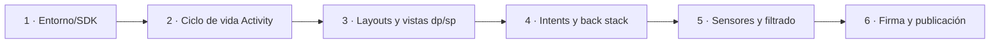
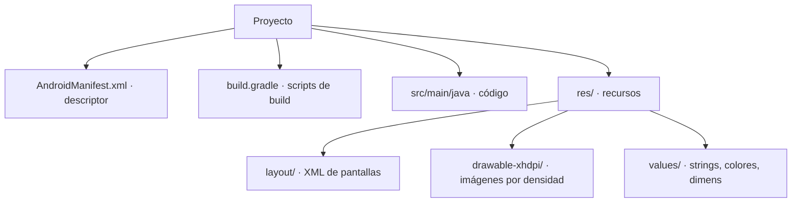
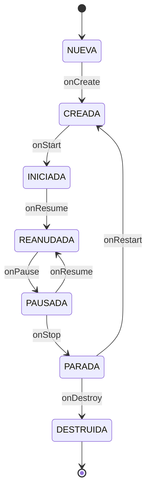
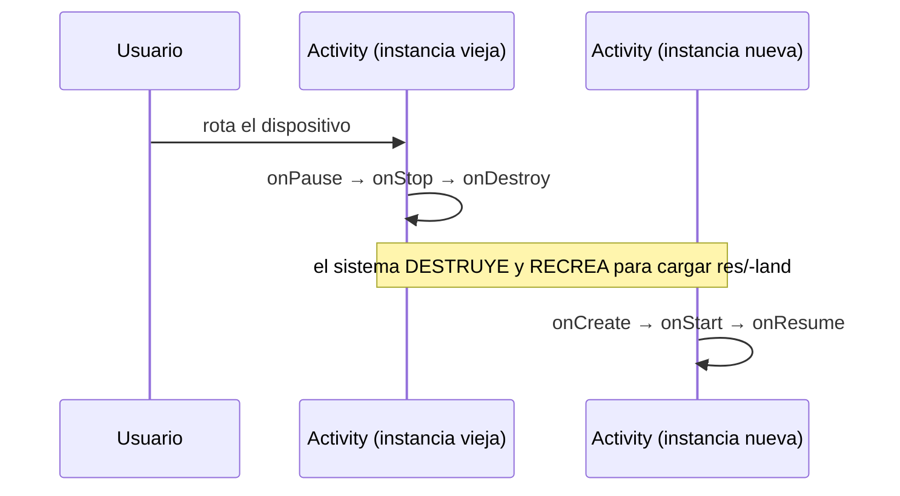
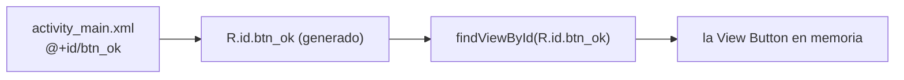
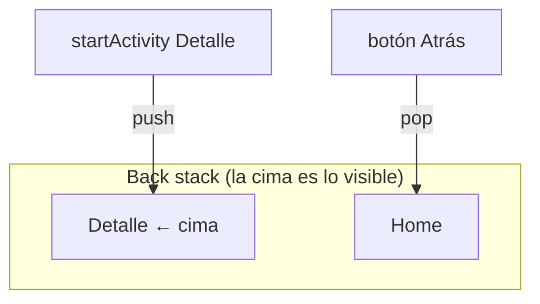
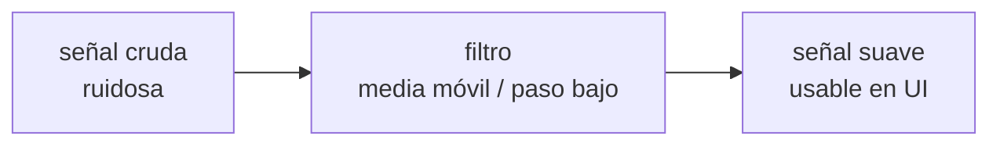
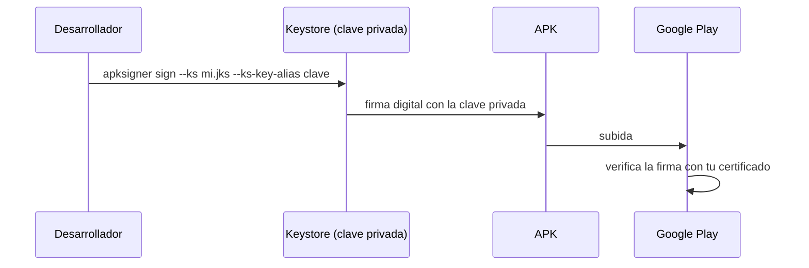

# Bloque 42 · Desarrollo móvil / Android (PMDM · RA3/RA4/RA6)

> Vienes de pintar interfaces de escritorio con JavaFX (b32–b39) y de procesar multimedia y
> animación (b40–b41). Sabes mover datos (b26), concurrencia (b27), criptografía (b30) y consumir
> APIs (b05). Lo que te falta es **el otro gran cliente**: el móvil. Android no es "Java con otra
> librería de botones": cambia el **motor de build** (Gradle, no Maven), el **lenguaje preferente**
> (Kotlin, aunque Java sigue valiendo), el **ciclo de vida** (el sistema crea y destruye tus
> pantallas cuando quiere) y el **modelo de ejecución** (un emulador o un dispositivo real). Importa
> porque la mayoría del software que usa la gente vive en un teléfono.

---

## Aviso honesto (léelo antes que nada)

Una app Android se compila con **Gradle** (no Maven), normalmente en **Kotlin/Java**, y se prueba en
un **emulador (AVD)** o en un dispositivo físico. **Nada de eso vive dentro de este proyecto Maven.**
Por eso este bloque **NO construye una app Android de verdad**: sería mentirte montar aquí un Gradle
de juguete. Lo que SÍ hacemos es cubrir **lo transferible y testeable en Java puro**:

- la **máquina de estados** del ciclo de vida de una `Activity` (Ej326),
- el **mapa conceptual** layouts Android ↔ JavaFX y las **unidades dp/sp** (Ej327),
- el **modelo de navegación** por `Intent` y el **back stack** (Ej328),
- el **filtrado de sensores**: media móvil, paso bajo, umbral, magnitud (Ej329),

y dos ejercicios **"guion"** (Ej325 entorno/SDK, Ej330 firma/publicación) cuyos *cores* construyen y
validan configuraciones y comandos como **cadenas**, exactamente igual que los "guion" de `b22`
(Dockerfile) y `b39` (`jlink`/`jpackage`). Esto es honesto: aprendes el **modelo mental** correcto,
que es lo que de verdad cuesta de Android; la sintaxis concreta del XML y de Kotlin se aprende
después en minutos, con el modelo ya claro.

---

## Cómo usar este documento

- **Lee UNA sección → haz SU ejercicio → vuelve.** Cada `## N` corresponde a un `EjNNN`.
- **Los tests son la especificación real.** Si dudas de qué debe devolver un método, abre su
  `EjNNN…Test.java`: ahí están los casos exactos (incluidos los límite que te harán fallar).
- **La teoría va más allá del ejercicio.** Te cuento todo el ciclo de vida aunque el core solo use
  parte, todos los tipos de `Intent` aunque el reto toque dos, etc. El objetivo es que afrontes un
  caso nuevo (uno que el ejercicio NO toca) por tu cuenta.
- **Nota de testing:** todo es JDK puro y determinista. No hay toolkit, ni emulador, ni red. Los
  cores son funciones sobre números, cadenas, `List`/`Map` y `double[]`. Si un test necesitara un
  móvil real para pasar, estaría mal diseñado.

---

## Antes de empezar (trampas de entorno que conviene conocer)

Aunque aquí no instales el SDK, estos son los obstáculos reales de un primer proyecto Android, para
que no te pillen el día que abras Android Studio:

| Obstáculo | Qué es | Cómo se resuelve de verdad |
|---|---|---|
| **No es Maven** | Android usa **Gradle** (`build.gradle` o `.gradle.kts`) | El "mvn package" equivale a `./gradlew assembleRelease` |
| **SDK aparte** | El JDK no trae el Android SDK | Se instala con Android Studio / `sdkmanager`; define `minSdk/target/compile` |
| **Emulador pesado** | El AVD es una máquina virtual completa | Necesita virtualización (HAXM/Hyper-V); un dispositivo real va más rápido |
| **Tres niveles de API** | `minSdk ≤ targetSdk ≤ compileSdk`, fácil de cruzar | Regla fija; si no se cumple, Gradle falla (Ej325) |
| **Permisos en runtime** | Desde API 23 algunos permisos se piden EN EJECUCIÓN | Declararlos en el manifest NO basta; hay que pedirlos con un diálogo |
| **El sistema te mata** | Android destruye Activities en segundo plano sin avisar | Guardar estado en `onSaveInstanceState` (Ej326) |

> **Regla grabada:** en escritorio TÚ controlas el ciclo de vida de la ventana; en móvil lo controla
> **el sistema operativo**. Esa inversión de control es el cambio mental nº 1 de PMDM.

---

## Índice del bloque

| Sección | Tema | Ejercicio |
|---|---|---|
| 1 | Entorno móvil, SDK/AVD y estructura de proyecto (guion) | `Ej325MobileEnvOverview` |
| 2 | Ciclo de vida de la `Activity` como máquina de estados | `Ej326ActivityLifecycle` |
| 3 | Layouts y vistas: Android vs JavaFX, dp/sp, `findViewById` | `Ej327LayoutsAndViews` |
| 4 | Eventos y navegación por `Intent`, back stack, extras | `Ej328EventsAndIntents` |
| 5 | Sensores: lectura y filtrado (acelerómetro/GPS/luz) | `Ej329SensorsModel` |
| 6 | Firma del APK, stores y distribución (guion) | `Ej330PublishDistribution` |

> **Modelo mental del bloque:** una app móvil es **pantallas (`Activity`) que el sistema crea y
> destruye**, **apiladas en un back stack**, **navegadas con `Intent`**, **dibujadas con un árbol de
> vistas medido en dp**, **alimentadas por sensores ruidosos que hay que filtrar**, y finalmente
> **firmadas y publicadas** en una store. Las seis secciones recorren ese viaje en orden.



---

## 1 · Entorno móvil, SDK/AVD y estructura de proyecto (Ej325 · guion)

Un proyecto Android se define, antes de una sola línea de UI, por tres cosas: su **configuración de
SDK**, su **estructura de carpetas** y su **AVD** (emulador). Como Android no usa Maven, modelamos
estas reglas como funciones puras: validar la configuración y clasificar ficheros.

### 1.1 Los tres niveles de API (la trampa más común)

Android versiona su plataforma con **API levels** (enteros): API 33 = Android 13. Tu app declara
**tres** niveles y deben cumplir un orden estricto:

```
minSdk  ≤  targetSdk  ≤  compileSdk
```

| Nivel | Qué significa | Si lo subes... |
|---|---|---|
| `minSdk` | La API MÁS ANTIGUA que soportas | Menos dispositivos pueden instalar la app |
| `targetSdk` | La API para la que está probada/optimizada | Activa comportamientos nuevos del sistema |
| `compileSdk` | La API contra la que compilas | Acceso a las clases/métodos más recientes |

> **Trampa (la del test):** `minSdk=34, target=33` es **inválido** (apuntas más bajo que tu mínimo).
> No existe la API 0: el nivel 1 fue Android 1.0. `esConfiguracionSdkValida` exige los tres ≥ 1 y el
> orden completo.

### 1.2 Versiones y nombres comerciales

| API | Versión | Nota |
|---|---|---|
| 31 | Android 12 | Material You |
| 32 | Android 12L | tablets/plegables |
| 33 | Android 13 | Tiramisu |
| 34 | Android 14 | Upside Down Cake |

(El reto `nombreVersionAndroid` mapea estos; cualquier otro → `"Desconocido"`.)

### 1.3 El `applicationId` (nombre de paquete)

Identifica tu app de forma única en Google Play. Es un **dominio invertido**: `com.empresa.app`.
Reglas: al menos dos segmentos, cada uno en minúsculas, sin empezar por dígito (`com.2fast` es
inválido porque un identificador Java no puede empezar por número).

### 1.4 Estructura de carpetas y recursos



Los **recursos** (`res/`) se agrupan por **tipo** (`layout`, `drawable`, `values`, `mipmap`) y se
cualifican por contexto con sufijos llamados **resource qualifiers**: `-land` (apaisado), `-night`
(modo oscuro), `-xhdpi` (densidad). Android elige el recurso adecuado en tiempo de ejecución. Por
eso `carpetaDensidad("xhdpi") → "drawable-xhdpi"` y `esRecursoApaisado("layout-land") → true`.

| Bucket de densidad | dpi aprox. | Factor vs base |
|---|---|---|
| `mdpi` | 160 | 1× (base) |
| `hdpi` | 240 | 1.5× |
| `xhdpi` | 320 | 2× |
| `xxhdpi` | 480 | 3× |
| `xxxhdpi` | 640 | 4× |

### 1.5 AVD (Android Virtual Device)

Un AVD es un emulador con un **perfil de hardware** (p. ej. Pixel 6) más una **imagen de sistema**
(un API level). Por convención su nombre une ambos: `Pixel_6_API_33` (espacios → `_`).

### 1.6 Permisos y build types

Los **permisos** se declaran en el manifest con su nombre completo `android.permission.CAMERA`
(el reto `permisoCompleto` antepone el prefijo y normaliza a mayúsculas, de forma **idempotente**:
si ya viene completo, no lo duplica). Gradle define dos **build types** por defecto: `debug`
(desarrollo) y `release` (publicación).

### 1.8 Gradle, el "Maven de Android"

```bash
./gradlew assembleDebug      # compila un APK de depuración (≈ mvn package)
./gradlew assembleRelease    # compila el APK de publicación
./gradlew bundleRelease      # genera el .aab para subir a Play
```

El `./gradlew` (Gradle **wrapper**) fija la versión exacta de Gradle del repositorio, igual que el
`mvnw` de Maven. `comandoGradle("assembleDebug") → "./gradlew assembleDebug"`.

> **Lo practicas en `Ej325`**: cores `esConfiguracionSdkValida` y `clasificarFichero`; retos que van
> de validar el `applicationId` (1) y rutas de recursos (2) hasta el comando Gradle completo (10).

---

## 2 · Ciclo de vida de la `Activity` (Ej326)

Una **`Activity`** es una pantalla de Android. La diferencia clave con una ventana de escritorio: tú
**no** la creas ni la destruyes; el **sistema** invoca una serie de *callbacks* (métodos que tú
sobrescribes) según el usuario entra, sale, recibe una llamada, o el sistema necesita memoria.
Modelar esto como una **máquina de estados** (un autómata: estados + transiciones) lo hace
verificable sin emulador.

### 2.1 Los estados y sus callbacks



| Callback | Transición | Qué haces ahí |
|---|---|---|
| `onCreate` | NUEVA → CREADA | Inflar el layout, inicializar variables (UNA vez) |
| `onStart` | CREADA → INICIADA | La pantalla se vuelve **visible** |
| `onResume` | INICIADA/PAUSADA → REANUDADA | Adquirir cámara/sensores; ya **interactúa** |
| `onPause` | REANUDADA → PAUSADA | **Liberar** lo de onResume; guardado rápido |
| `onStop` | PAUSADA → PARADA | Liberar lo pesado; ya **no es visible** |
| `onRestart` | PARADA → CREADA | Volver de "parada" (luego onStart de nuevo) |
| `onDestroy` | PARADA → DESTRUIDA | Limpieza final (estado **terminal**) |

> **Regla grabada (simetría):** lo que adquieres en `onResume` lo sueltas en `onPause`; lo de
> `onStart`, en `onStop`. Por eso `debeLiberarRecursos` es `true` para los tres callbacks de salida.

### 2.2 Visible vs interactuable (matiz que confunde)

- **Visible** = entre `onStart` y `onStop` (INICIADA, REANUDADA, **y PAUSADA**: una Activity pausada
  se sigue viendo detrás de un diálogo translúcido).
- **Interactuable** (recibe toques) = **solo** en REANUDADA. En PAUSADA la ves pero está "congelada".

Esta distinción es la clave de `esVisible` vs `esInteractuable`. Confundirlas es el error nº 1 del
bloque.

### 2.3 Callbacks fuera de orden = sin efecto

El core `siguienteEstado` devuelve el **mismo** estado si la transición no es válida: aplicar
`onResume` sobre `CREADA` no hace nada (no puedes saltarte `onStart`). Esto modela que Android nunca
invoca callbacks fuera de la secuencia. `transicionValida` y `contarTransicionesValidas` se apoyan
en esa regla.

### 2.4 Rotación: el caso que rompe a los novatos



Al rotar, Android **destruye y recrea** la Activity para recargar los recursos de la nueva
orientación. Si guardabas datos solo en variables de instancia, **se pierden**. La solución:
`onSaveInstanceState(Bundle)` antes de `onStop`, y restaurar en `onCreate`. `callbacksRotacion`
modela esa secuencia de 6 callbacks.

> **Puente con b32/b34:** el `Stage` de JavaFX también tiene ciclo de vida (`init → start → stop`),
> pero NO se recrea al redimensionar: por eso en escritorio no sufres el problema de la rotación. Es
> una diferencia esencial móvil ↔ escritorio.

> **Lo practicas en `Ej326`**: cores `siguienteEstado` y `estadoTrasCallbacks`; retos del más simple
> (`esVisible`, 1) al más completo (`callbacksRotacion`, 10).

---

## 3 · Layouts y vistas: Android vs JavaFX (Ej327)

Una pantalla Android es un **árbol de vistas**: un `ViewGroup` (contenedor) que contiene `View`s
(hojas: `Button`, `TextView`). Es el mismo concepto que el *scene graph* de JavaFX (b32): un `Pane`
con `Node`s dentro.

### 3.1 Equivalencias de contenedores

| Android (`ViewGroup`) | JavaFX (`Pane`) | Idea |
|---|---|---|
| `LinearLayout` vertical | `VBox` | apila en columna |
| `LinearLayout` horizontal | `HBox` | apila en fila |
| `FrameLayout` | `StackPane` | uno encima de otro (z-order) |
| `RelativeLayout` / `ConstraintLayout` | `AnchorPane` | posicionar por relaciones/anclas |
| `GridLayout` | `GridPane` | rejilla filas×columnas |
| `ScrollView` | `ScrollPane` | contenido desplazable |

`equivalenteJavaFx` mapea estos; lo no reconocido → `""`. Y `esContenedor` se apoya en él: si tiene
equivalente JavaFX, es un contenedor (un `Button` no lo tiene).

### 3.2 dp y sp: la matemática de no romper la UI

Android **no** mide en píxeles físicos (varían enormemente entre pantallas) sino en **dp**
(density-independent pixels). La densidad **base** es 160 dpi: ahí 1 dp = 1 px. La fórmula:

```
px = dp × (dpi / 160)            dp = px × (160 / dpi)
```

A 320 dpi (xhdpi), 16 dp = **32 px**. El core `dpAPx` hace esto (¡ojo: `Math.round` devuelve `long`,
castea a `int`!), y `pxADp` la inversa.

El **sp** (scale-independent pixel) es como el dp **pero además** multiplica por la preferencia de
tamaño de fuente del usuario (accesibilidad). Por eso el texto se mide en sp: con `escalaFuente=1.5`,
16 sp = 24 px. Esa es la diferencia entre `dpAPx` y `spAPx`.

> **Trampa:** maquetar en px crudos hace que tu botón "perfecto" se vea diminuto en un móvil de alta
> densidad. Razona SIEMPRE en dp.

### 3.3 `findViewById` ≈ `lookup("#id")`

Para tocar una vista desde el código necesitas su **id**, declarado en el XML como `@+id/btn_ok` (el
`+` lo **crea**; `@id/btn_ok` solo lo **referencia**). En código: `findViewById(R.id.btn_ok)`. Lo
modelamos con un `Map<id, tipo>` y `buscarVistaPorId`, que devuelve `""` si no existe (un null
seguro).



> **Puente con b34:** esto es EXACTAMENTE el `fx:id` + `lookup("#btn_ok")` de FXML. Android y JavaFX
> resuelven el mismo problema (enlazar XML declarativo con código) de forma casi idéntica.

### 3.4 Pesos, orientación y gravedad

- **`layout_weight`** reparte el espacio sobrante en proporción al peso (`anchoConPeso`), igual que
  `HBox.setHgrow(...)` en JavaFX.
- **Orientación**: portrait (`"vertical"`, más alto que ancho) vs landscape (`"horizontal"`).
- **`gravity`** alinea el contenido (`start/end/top/bottom/center`); `gravedadOpuesta` da el
  contrario, útil para reflejar un layout en idiomas RTL.

> **Lo practicas en `Ej327`**: cores `equivalenteJavaFx` y `dpAPx`; retos de conversión de unidades
> (1–2), del árbol de vistas y `findViewById` (4–5) y de maquetación (7–10).

---

## 4 · Eventos y navegación por `Intent` (Ej328)

En Android no "llamas a otra pantalla": lanzas un **`Intent`** (una intención). Hay dos tipos:

- **Explícito**: nombras la Activity destino (`new Intent(this, DetalleActivity.class)`).
- **Implícito**: describes la ACCIÓN (`ACTION_VIEW` una URL, `ACTION_SEND` compartir, `ACTION_DIAL`
  llamar) y el **sistema** elige qué app la resuelve.

### 4.1 El back stack (pila de pantallas)



Abrir una pantalla la **empuja** (`navegar`); el botón **Atrás** la **saca** (`volverAtras`). Si el
stack queda vacío, la app se cierra; por eso `volverAtras` no quita la última pantalla. `cima`
devuelve lo que el usuario ve; `estaVacia` y `contarPantallas` inspeccionan la profundidad.

### 4.2 Extras: los datos que viajan

Los datos pasan como **extras**: pares clave→valor (`putExtra`/`getStringExtra`). Lo modelamos con
`Map<String,String>`: `extraComoTexto` lee (con `""` como null seguro) y `ponerExtra` añade
devolviendo un mapa **nuevo** (inmutable: el original no se toca).

### 4.3 Resultados y request codes (trampa numérica)

Al pedir un resultado a otra pantalla (`startActivityForResult`), Android usa constantes
**contraintuitivas**:

| Constante | Valor | Significado |
|---|---|---|
| `RESULT_OK` | **-1** | éxito |
| `RESULT_CANCELED` | **0** | cancelado |

> **Trampa:** `0` NO es éxito (al revés que un proceso de consola, b28). `esResultadoOk(codigo)` es
> `codigo == -1`. El `requestCode` debe caber en 16 bits sin signo: `[0, 65535]`.

### 4.4 Deep links

Un **deep link** es una URL que abre directamente una pantalla concreta:
`app://detalle?id=42&tab=info`. Sus *query params* son extras. `parametroDeepLink` los parsea.

> **Puente con b05:** un deep link es una URL con routing + query params, idéntico a
> `/detalle?id=42` de tu API REST. Android resuelve URLs como un servidor web resuelve rutas.

> **Lo practicas en `Ej328`**: cores `navegar` y `extraComoTexto`; retos de la pila (1–2, 7–8), los
> extras (3), las acciones y resultados (4–6) y los deep links (9–10).

---

## 5 · Sensores: lectura y filtrado (Ej329)

Un sensor (acelerómetro, giroscopio, GPS, luz) entrega un **torrente de muestras ruidosas**. Android
te las da con un `SensorEventListener`; lo difícil —y lo transferible— no es leerlas, es
**filtrarlas**. Todo es matemática sobre `double[]`.

### 5.1 Tipos de sensor y rangos

| Sensor | Mide | Unidad típica |
|---|---|---|
| Acelerómetro | aceleración (incluye gravedad) | m/s² |
| Giroscopio | velocidad de rotación | rad/s |
| Luz ambiental | iluminancia | lux |
| GPS | posición | grados (lat/lon) |

Cada sensor tiene un **rango válido**; fuera de él es ruido a descartar (`lecturaValida`).

### 5.2 Suavizado: media móvil y paso bajo

La señal cruda tiembla. Dos técnicas:

- **Media móvil** (`filtrarLecturaSensor`): cada salida es el promedio de la muestra actual y las
  `ventana-1` anteriores. Con `{2,4,6}` y ventana 2 → `{2, 3, 5}`. Reduce ruido pero introduce
  retardo.
- **Filtro de paso bajo** de un polo (`filtroPasoBajo`): `salida = α·actual + (1-α)·anterior`. No
  guarda histórico (solo el valor previo). α alto = sigue rápido; α bajo = más suave. Con α=1 no hay
  suavizado.



### 5.3 Magnitud y aceleración lineal

El acelerómetro mide **gravedad + movimiento** mezclados. La **magnitud** del vector
(`magnitud = √(x²+y²+z²)`) en reposo ≈ 9.81. La **aceleración lineal** resta la gravedad
(`magnitud - 9.81`): en reposo da ~0. `enReposo` comprueba `|magnitud - 9.81| ≤ epsilon`.

### 5.4 Detección de gestos y pasos

- **Sacudida**: `|valor| > umbral` (`superaUmbral`, en **valor absoluto**: -12 también supera 9.8).
- **Pasos (podómetro)**: un paso es un **máximo local** que supera el umbral, no basta con cruzarlo.
  `contarPicos({0,12,0,11,0}, 9.8)` → 2 (dos máximos locales). Necesita ≥ 3 muestras.

### 5.5 Normalización y orientación

- **Normalizar** una lectura a `[0,1]` respecto a un máximo (brillo lux → control de pantalla),
  **saturando** (no pasa de 1): `normalizar(150, 100) → 1.0`.
- **Eje dominante**: el de mayor `|componente|` indica sobre qué cara reposa el móvil
  (`ejeDominante(1, 9.8, 2) → "Y"`).
- Las APIs de orientación trabajan en **radianes** (`gradosARadianes`).

> **Puente con b01:** filtrar un stream de muestras es un `reduce` que acumula estado; la media móvil
> es una ventana deslizante. Mismo patrón funcional, otro dominio.

> **Lo practicas en `Ej329`**: cores `filtrarLecturaSensor` y `magnitud`; retos del más simple
> (`media`, 1) al detector de pasos (`contarPicos`, 8) y la orientación (10).

---

## 6 · Firma del APK, stores y distribución (Ej330 · guion)

Publicar tiene reglas duras. Este ejercicio es "guion": modela y valida configuraciones y comandos
como cadenas (no construye un APK real).

### 6.1 Las dos versiones de una app

| Campo | Tipo | Para quién | Regla |
|---|---|---|---|
| `versionCode` | entero | el **sistema/Play** | debe **crecer** en cada subida (monótono) |
| `versionName` | texto SemVer `1.4.2` | el **usuario** | legible; sin reglas de orden estrictas |

`esVersionNameValida` exige exactamente 3 números ≥ 0 separados por puntos (reutiliza el SemVer de
b39). `siguienteVersionCode(n) = n+1`, con `IllegalArgumentException` si es negativo e
`IllegalStateException` si ya es `Integer.MAX_VALUE` (no puede crecer sin desbordar).

### 6.2 Firma: tu identidad criptográfica



Sin firma, Play rechaza el artefacto. La firma es tu **clave privada** aplicada al APK; el `alias`
identifica la clave dentro del keystore. `comandoFirma` construye el comando; `aliasValido` exige un
alias sin espacios.

> **Puente con b30:** firmar = criptografía de clave pública. El APK lleva una firma digital que Play
> verifica con tu certificado, igual que verificas un JWT o un mensaje firmado. Mismo principio.

### 6.3 APK vs AAB y formatos

- **APK**: el paquete clásico, instalable directamente (sideload).
- **AAB** (Android App Bundle): el formato moderno que Play recomienda; Play genera APKs optimizados
  por dispositivo a partir de él.

`esFormatoPublicacion` acepta `apk`/`aab`; `extensionPorFormato` da `.apk`/`.aab`. Una **release**
lista debe ir **firmada**, **minificada/ofuscada** y **NO debuggable** (`esReleaseListo`).

### 6.4 Ficha de la store y build final

`categoriaStoreValida` valida la categoría de Play (lista cerrada). `tamanoLegible` formatea el
tamaño con `Locale.US` (punto decimal, no coma). El paso final:

```bash
./gradlew bundleRelease    # genera el .aab firmado que se sube a Google Play
```

`comandoBundleRelease` lo devuelve. Aquí confluye todo: versionado (b39), firma (b30) y build
(Gradle ≈ Maven b04).

> **Lo practicas en `Ej330`**: cores `esVersionNameValida` y `siguienteVersionCode`; retos del
> versionado (1), nombres de artefacto y formatos (2–4), firma (5–6) y publicación (7–10).

---

## Errores comunes del bloque

| # | Error | Antídoto |
|---|---|---|
| 1 | Creer que `0 = éxito` en resultados de Activity | `RESULT_OK == -1`; `RESULT_CANCELED == 0` (Ej328 reto 5) |
| 2 | Confundir **visible** con **interactuable** | PAUSADA es visible pero NO interactúa; solo REANUDADA recibe toques (Ej326) |
| 3 | `minSdk > targetSdk` o usar API 0 | Orden `min ≤ target ≤ compile`, todos ≥ 1 (Ej325) |
| 4 | Maquetar en píxeles físicos | Razonar en **dp**: `px = dp × dpi/160` (Ej327) |
| 5 | Olvidar liberar cámara/sensores en `onPause` | Simetría: adquiere en `onResume`, libera en `onPause` (Ej326 reto 9) |
| 6 | Perder datos al **rotar** | Guardar en `onSaveInstanceState`; la Activity se recrea (Ej326 reto 10) |
| 7 | `Math.round` devuelve `long`, no `int` | Castea `(int) Math.round(...)` en `dpAPx`/`spAPx` (Ej327) |
| 8 | Vaciar el back stack con "Atrás" | No quitar la última pantalla: cerraría la app (Ej328 reto 7) |
| 9 | Creer que un paso = "cruzar el umbral" | Un paso es un **máximo local** sobre el umbral (Ej329 reto 8) |
| 10 | Olvidar la gravedad en el acelerómetro | Resta 9.81 para la aceleración lineal real (Ej329 reto 4) |
| 11 | Subir un APK sin firmar o `versionCode` repetido | Firmar (`apksigner`) y subir el `versionCode` (Ej330) |
| 12 | Formatear el tamaño con coma decimal | `Locale.US` fuerza el punto: `"1.0 MB"` (Ej330 reto 8) |
| 13 | `applicationId` con mayúsculas o segmento numérico inicial | Minúsculas, ≥ 2 segmentos, sin empezar por dígito (Ej325 reto 1) |

---

## Chuleta final del bloque

```
sdk            = minSdk <= targetSdk <= compileSdk, todos >= 1
gradle         = ./gradlew assembleDebug | assembleRelease | bundleRelease   (≈ mvn package)
applicationId  = com.empresa.app (minúsculas, >=2 segmentos, no empieza por dígito)
dp -> px       = dp * dpi/160      (160 dpi = base, 1dp=1px);  px->dp = px*160/dpi
sp             = dp + escala de fuente del usuario (accesibilidad)
lifecycle      = NUEVA→CREADA→INICIADA→REANUDADA →(onPause)→ PAUSADA →(onStop)→ PARADA →(onDestroy)→ DESTRUIDA
visible        = INICIADA/REANUDADA/PAUSADA ;  interactuable = solo REANUDADA
liberar        = onPause / onStop / onDestroy (simetría con onResume/onStart)
rotación       = destruye+recrea -> guarda en onSaveInstanceState
findViewById   = lookup("#id") de FXML ;  @+id crea, @id referencia
intent         = explícito (clase destino) | implícito (ACTION_VIEW/SEND/DIAL)
backstack      = navegar=push, volverAtras=pop (no vacía la última); cima=visible
RESULT_OK      = -1   ;   RESULT_CANCELED = 0   ;   requestCode in [0,65535]
magnitud       = sqrt(x²+y²+z²) ; reposo≈9.81 ; lineal = magnitud-9.81
filtros        = media móvil (ventana) | paso bajo (α·act+(1-α)·ant)
paso/podómetro = máximo local que supera umbral (necesita >=3 muestras)
versionCode    = entero, crece en cada subida ; versionName = SemVer "1.4.2"
firma          = apksigner sign --ks keystore --ks-key-alias alias (clave privada, b30)
release lista  = firmada && minificada && !debuggable
publicar       = .aab (bundleRelease) > .apk ; tamaño con Locale.US (punto)
```

---

## Autoevaluación (responde sin mirar; si fallas 2+, relee la sección)

1. ¿Por qué `minSdk=34, targetSdk=33` es una configuración inválida? *(1.1)*
2. ¿Qué reglas hacen válido un `applicationId` como `com.empresa.app`? *(1.3)*
3. Dibuja la máquina de estados del ciclo de vida e indica qué callback lleva a `REANUDADA`. *(2.1)*
4. ¿Cuál es la diferencia entre que una Activity sea *visible* y que sea *interactuable*? *(2.2)*
5. ¿Qué secuencia de callbacks ocurre al **rotar** la pantalla y por qué se pierden datos? *(2.4)*
6. Convierte 24 dp a px en una pantalla de 480 dpi. ¿Y la fórmula inversa? *(3.2)*
7. ¿Qué problema de Android resuelve `findViewById` y cuál es su equivalente en FXML? *(3.3)*
8. ¿Cuánto valen `RESULT_OK` y `RESULT_CANCELED`? ¿Por qué es una trampa? *(4.3)*
9. ¿Qué hace el botón Atrás con el back stack y qué pasa si solo queda una pantalla? *(4.1)*
10. Diferencia entre media móvil y filtro de paso bajo. ¿Qué pondera α? *(5.2)*
11. ¿Cómo separas el movimiento real de la gravedad en una lectura del acelerómetro? *(5.3)*
12. ¿Qué define un "paso" en un podómetro y por qué no basta con superar el umbral? *(5.4)*
13. ¿En qué se diferencian `versionCode` y `versionName` y qué regla cumple cada uno? *(6.1)*
14. ¿Por qué firmar un APK es un problema de criptografía y con qué bloque enlaza? *(6.2)*
15. ¿Qué tres condiciones debe cumplir una build para considerarse una *release* lista? *(6.3)*
