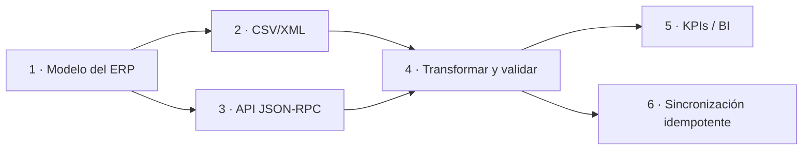
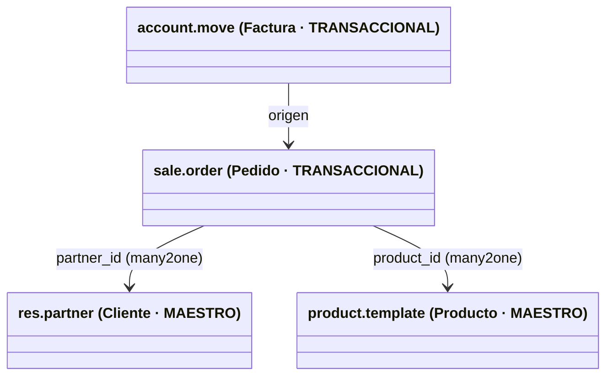
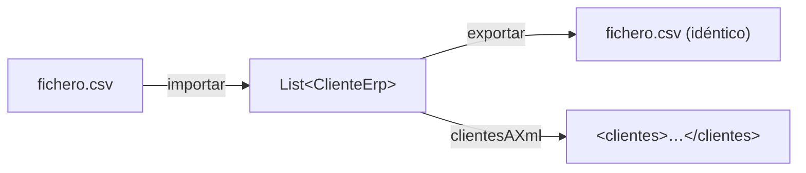
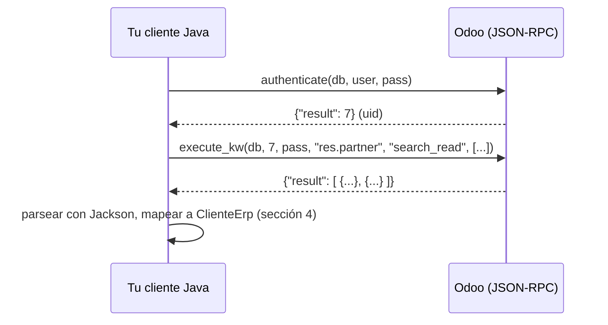
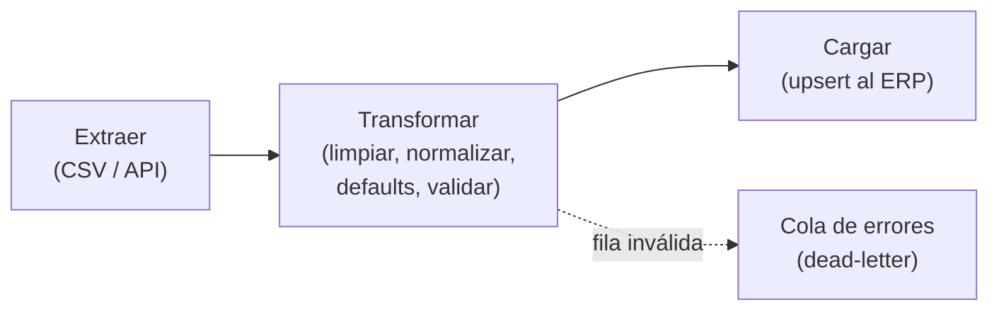
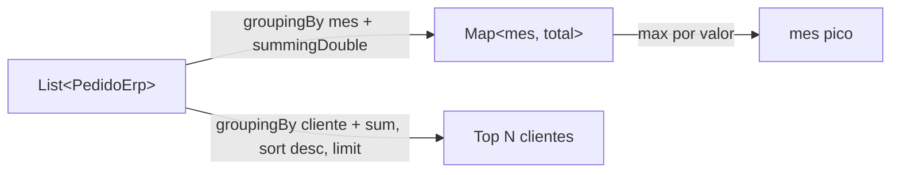
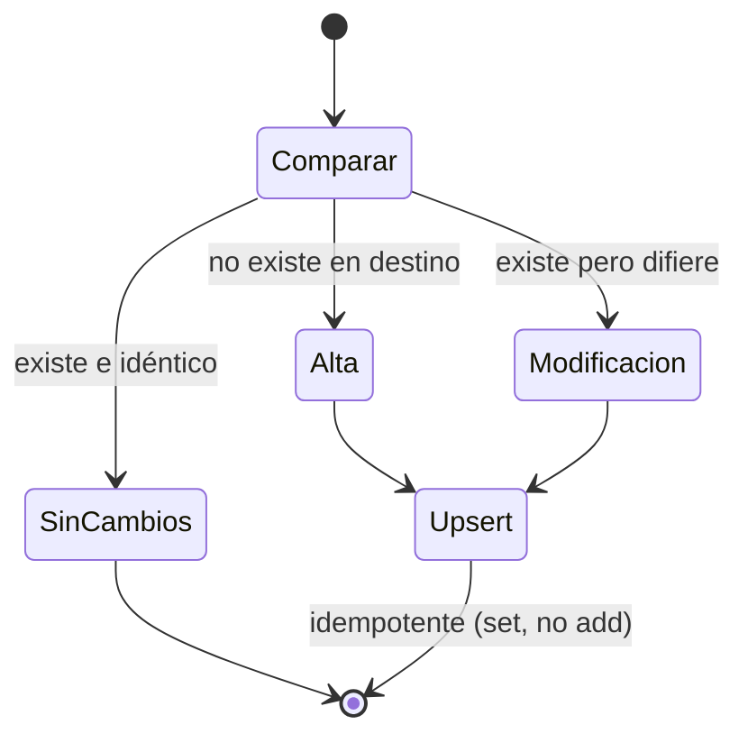

# Bloque 43 · Integración, ETL e inteligencia de negocio — SGE (RA4/RA5/RA6)

> Vienes de saber montar una API REST (b05/b06), mover datos en CSV/XML (b16), cifrar y firmar
> (b30), agregar con SQL/JPA (b15) y consumir servicios por HTTP (b06). Lo que te falta es el
> oficio que une todo eso en el mundo de la empresa: **integrar tu software con un ERP**. Un ERP
> (Odoo, SAP, Dynamics…) es el sistema central donde una empresa gestiona clientes, pedidos,
> almacén y contabilidad. Casi nunca lo programas entero: lo que de verdad te van a pedir es
> **conectar** tu aplicación con él, **migrar** datos de un lado a otro y **explotarlos** para
> sacar indicadores. Eso es exactamente lo que este bloque te enseña, y es la parte de **Sistemas
> de Gestión Empresarial (SGE)** que sí es programación Java.

---

## Aviso honesto (léelo antes que nada)

El módulo SGE de 2º DAM gira sobre **implantar y parametrizar un ERP** (típicamente **Odoo**, que
está escrito en Python). Configurar pantallas, flujos y permisos dentro de Odoo **no es Java** y se
hace en la propia herramienta: eso son sus RA1–RA3 y se practican administrando una instancia, no
programando. **Este bloque NO te enseña a parametrizar Odoo**; sería mentirte montar aquí un Odoo
de juguete.

Lo que SÍ es Java —y lo que de verdad aporta un titulado en DAM a un proyecto de ERP— son sus
**RA4, RA5 y RA6**:

- **RA4 · desarrollar componentes** que extienden o consumen el ERP (clientes de su API).
- **RA5 · inteligencia de negocio**: agregar los datos del ERP en KPIs e informes.
- **RA6 · integrar y migrar datos** entre el ERP y otros sistemas (ETL, sincronización).

Todo eso es **lógica pura, testeable y determinista**, y reutiliza lo que ya sabes. Por eso los
*cores* de este bloque no tocan la red: construyen y parsean las peticiones, transforman los datos
y calculan los planes de sincronización. La llamada **real** contra un Odoo vivo se prueba a mano
con el **MCP de Odoo** disponible en el entorno (ver sección 3). Esto es honesto, igual que los
"guion" de Docker (b22), `jpackage` (b39) o Android (b42): aprendes el **modelo mental** correcto,
que es lo que cuesta; la sintaxis exacta de cada endpoint se mira en su documentación en minutos.

---

## Cómo usar este documento

- **Lee UNA sección → haz SU ejercicio → vuelve.** Cada `## N` se corresponde con un `EjNNN`.
- **Los tests son la especificación real.** Si dudas de qué debe devolver un método, abre su
  `EjNNN…Test.java`: ahí están los casos exactos, incluidos los límite que te harán fallar.
- **La teoría va más allá del ejercicio.** Te explico el flujo entero de integración aunque el core
  solo toque una parte, para que afrontes un caso nuevo (uno que el ejercicio NO cubre) por tu cuenta.
- **Nota de testing:** todo es JDK + Jackson (b02), sin red ni base de datos. Los cores son
  funciones sobre `String`, `Map`, `List` y JSON. Si un test necesitara un ERP real para pasar,
  estaría mal diseñado: la frontera con la red es deliberada.

---

## Antes de empezar (conceptos de empresa que conviene fijar)

Vienes del mundo "API + base de datos". El mundo "empresa + ERP" añade vocabulario que da por
sabido todo profesional de integración. Fíjalo ahora para no perderte:

| Término | Qué es | Equivalente que ya conoces |
|---|---|---|
| **ERP** | Sistema central de gestión (ventas, compras, almacén, contabilidad) | Un "monolito de negocio" con su BD |
| **CRM** | Parte del ERP centrada en el cliente (leads, oportunidades) | El subdominio "clientes" de tu API |
| **Dato maestro** | Entidad estable y referenciada: cliente, producto | Una entidad JPA "padre" (b13) |
| **Dato transaccional** | Movimiento puntual: pedido, factura | Una entidad "hija" que apunta al maestro |
| **ETL** | Extraer → Transformar → Cargar datos entre sistemas | Un pipeline: leer (b16) → mapear → escribir |
| **Idempotencia** | Repetir la operación no cambia el resultado | Un `PUT` de HTTP (b05), no un `POST` |
| **Conciliación** | Comprobar que dos sistemas cuadran | Comparar dos `Map` de totales |
| **BI** | *Business Intelligence*: explotar datos en KPIs | `GROUP BY`/`SUM` de SQL (b15) en Java |

> **Regla grabada nº 1:** en integración, la **clave de negocio** (el "ref" estable: `CLI-001`)
> manda sobre el id técnico autoincremental. Dos sistemas distintos tienen ids técnicos distintos
> para el mismo cliente; lo único que los une es esa clave de negocio. Toda la sincronización de
> este bloque se apoya en ella.

> **Regla grabada nº 2:** nunca integres con un `INSERT` ciego. Usa **upsert** (inserta o
> actualiza según la clave de negocio): así, si el proceso se repite por un fallo de red, no
> duplicas datos. Esa es la diferencia entre una integración profesional y un duplicado en producción.

---

## Índice del bloque

| Sección | Tema | Ejercicio |
|---|---|---|
| 1 | Conceptos de ERP/CRM: módulos y modelo de datos | `Ej331ErpConcepts` |
| 2 | Importar/exportar maestros en CSV y XML | `Ej332CsvXmlImportExport` |
| 3 | Consumir la API del ERP (Odoo JSON-RPC) | `Ej333ErpApiClient` |
| 4 | ETL: mapear, transformar y validar datos | `Ej334DataMappingEtl` |
| 5 | Agregaciones para inteligencia de negocio (KPIs) | `Ej335BiAggregations` |
| 6 | Sincronización idempotente entre sistemas | `Ej336IntegrationSync` |

> **Modelo mental del bloque:** una integración es una **tubería**. Primero **entiendes** el modelo
> del ERP (1), luego **extraes** datos por fichero (2) o por su API (3), los **transformas y validas**
> (4), los **explotas** en indicadores (5) y finalmente los **sincronizas** de vuelta sin duplicar (6).
> Las seis secciones recorren esa tubería en orden.



---

## 1. Conceptos de ERP/CRM: módulos y modelo de datos

Antes de integrar con algo hay que entender **con qué** se integra. Un ERP organiza la empresa en
**módulos** (áreas funcionales) y cada módulo expone **modelos** de datos (lo que en JPA llamarías
entidades). En **Odoo**, el ERP de referencia de este bloque, los modelos se nombran con puntos:

| Modelo Odoo | Área (módulo) | ¿Maestro o transaccional? |
|---|---|---|
| `res.partner` | CRM (clientes/proveedores) | **Maestro** |
| `product.template` | Inventario | **Maestro** |
| `sale.order` | Ventas | Transaccional |
| `purchase.order` | Compras | Transaccional |
| `account.move` | Contabilidad (asientos/facturas) | Transaccional |
| `stock.move` | Inventario (movimientos) | Transaccional |
| `crm.lead` | CRM (oportunidades) | Transaccional |

La distinción **maestro vs. transaccional** es la que más vas a usar. Un **dato maestro** es
estable y *referenciado* (un cliente, un producto): cambia poco y muchos movimientos lo apuntan.
Un **dato transaccional** es un *movimiento* puntual (un pedido, una factura): se crea, no se
reedita, y apunta a los maestros.

Esto tiene una consecuencia práctica enorme en la **migración**: hay que cargar primero lo
referenciado. No puedes insertar un pedido (`sale.order`) que apunta a un cliente si ese cliente
todavía no existe en el destino. Es el mismo problema de las **claves foráneas** que viste en las
relaciones JPA (b13): el padre antes que el hijo. A ese orden se le llama **orden de carga** (un
orden topológico de dependencias).



Otra convención de Odoo que conviene leer de un vistazo es el **nombre de los campos relación**:
un sufijo `_id` (singular) es un **many2one** (apunta a un registro: `partner_id`), y `_ids`
(plural) es un **one2many/many2many** (apunta a varios: `order_line_ids`). Son las anotaciones
`@ManyToOne`/`@OneToMany` de JPA (b13) con otro nombre.

El proceso de negocio estrella de un ERP es el ciclo **order-to-cash** (O2C): el viaje de un
pedido hasta el cobro, `presupuesto → pedido → entrega → factura → cobro`. Entender ese flujo (y
su gemelo de compras, *procure-to-pay*) es lo que de verdad te piden en SGE, más que memorizar
pantallas.

> **Lo practicas en `Ej331ErpConcepts`**: el core `areaDeModelo`/`esDatoMaestro` clasifica modelos;
> los retos cubren el glosario, validar el nombre del modelo, las dependencias entre módulos, el
> orden de carga, la ruta REST del modelo y la convención `_id`/`_ids`.

---

## 2. Importar/exportar maestros en CSV y XML

La forma **más vieja y más usada** de integrar con un ERP sigue siendo el **fichero plano**: el
cliente te manda un CSV con sus 5.000 clientes para la carga inicial, o tú exportas un XML para
que otro sistema lo consuma. Parsear CSV y XML ya lo dominas (b16); aquí lo aplicas al caso de
integración: convertir filas en objetos de dominio (`ClienteErp`) y de vuelta.

El criterio de calidad de una import/export es el **round-trip estable**: si exportas e
inmediatamente reimportas, debes obtener exactamente los mismos datos. Si no, has perdido o
deformado información por el camino (un separador mal escapado, un encoding, un campo vacío que
desaparece).



**CSV.** El formato es cabecera + filas separadas por un delimitador (aquí `;`). Las trampas
clásicas: la cabecera tiene que coincidir con la pactada, las filas vacías intermedias se ignoran,
y `split(";")` **descarta los campos vacíos del final** salvo que uses `split(";", -1)` (el límite
negativo conserva los huecos). Esto último es un error que pierde el último campo si va vacío.

```java
String[] campos = fila.split(";", -1);   // -1: conserva "a;b;" -> ["a","b",""]
if (campos.length != 4) throw new IllegalArgumentException("fila malformada");
```

**XML.** Construir XML a mano obliga a **escapar** los caracteres reservados, o el documento se
rompe: `&` → `&amp;`, `<` → `&lt;`, `>` → `&gt;`. **El orden importa**: el `&` debe escaparse
PRIMERO, porque si no, el `&` de `&lt;` se volvería a escapar (doble escape `&amp;lt;`). Al leer,
se deshace en orden inverso. En producción usarías JAXB o Jackson-XML (b16), que hacen esto por ti;
hacerlo a mano una vez te enseña *por qué* importa.

| Carácter | Entidad XML | Cuándo escapar |
|---|---|---|
| `&` | `&amp;` | **Primero** (al escapar) / **último** (al desescapar) |
| `<` | `&lt;` | Siempre dentro de texto |
| `>` | `&gt;` | Por simetría/seguridad |
| `"` | `&quot;` | Dentro de atributos con comillas dobles |
| `'` | `&apos;` | Dentro de atributos con comillas simples |

Los ficheros de integración traen **duplicados** (el mismo cliente repetido). La regla habitual es
**quedarse con el primero** de cada clave: recorres en orden y usas un `Set` de ids ya vistos como
guarda (`if (vistos.add(id)) añade`). Y un endpoint que recibe ficheros de varios orígenes necesita
**detectar el formato**: si el contenido empieza por `<` es XML; si no, mira si hay delimitadores
de CSV. Es la misma idea de detectar por *magic number* de b26/b40, pero a nivel de texto.

> **Lo practicas en `Ej332CsvXmlImportExport`**: cores `importarClientesCsv`/`exportarClientesCsv`
> con round-trip; retos de cabecera, conteo, email, escape/desescape XML, serializar un cliente y la
> lista entera a XML, extraer una etiqueta, deduplicar y detectar formato.

---

## 3. Consumir la API del ERP (Odoo JSON-RPC)

La forma **moderna** de integrar es por la **API** del ERP, en tiempo real. Odoo expone su API por
**JSON-RPC**: un protocolo RPC (llamada a procedimiento remoto) sobre HTTP que viaja en JSON. El
*transporte* (la petición HTTP) ya lo sabes hacer con `java.net.http` (b06); lo nuevo es
**construir el cuerpo correcto y parsear la respuesta**, y eso es lo que practicas con Jackson (b02)
sin tocar la red.

Una petición JSON-RPC tiene esta forma:

```json
{ "jsonrpc": "2.0", "method": "call",
  "params": { "service": "object", "method": "execute_kw",
              "args": [ "miBaseDatos", 7, "miClave", "res.partner", "search_read", [] ] } }
```

Y la respuesta es **o** un resultado **o** un error, nunca ambos:

```json
{ "jsonrpc": "2.0", "id": 1, "result": [ {"id": 1, "name": "Acme"} ] }
{ "jsonrpc": "2.0", "id": 1, "error": { "message": "Access Denied" } }
```



Tres detalles que separan un cliente que funciona de uno que se cuelga:

1. **`result` vs. `error`.** Antes de leer `result`, comprueba si la respuesta trae `error`. Un
   `result` ausente con un `error` presente es un fallo de negocio (permisos, modelo inexistente),
   no de red.
2. **El centinela `-1` no es `0`.** Al contar registros de `result`, distingue "falló" (`-1`) de
   "0 registros" (una búsqueda válida sin resultados es una lista vacía, no un error).
3. **El "domain".** Para filtrar, Odoo usa un *domain*: una lista de triples
   `[["campo","=","valor"]]`. Es el `WHERE` de SQL (b11) o la `Specification` de JPA (b15) en
   formato JSON. Y la paginación se hace con `{"limit": L, "offset": O}` — exactamente el `Pageable`
   de b15 y el `skip/limit` de streams (b01).

Construir JSON con Jackson se hace con `ObjectNode`/`ArrayNode` (el *árbol* mutable) y
`writeValueAsString`; parsear, con `readTree` y navegación segura por `path()`/`get()`:

```java
ObjectNode raiz = MAPPER.createObjectNode();
raiz.put("jsonrpc", "2.0").put("method", "call");
ObjectNode params = raiz.putObject("params");
params.put("model", "res.partner").put("method", "search_read");
String cuerpo = MAPPER.writeValueAsString(raiz);   // lanza JsonProcessingException (checked)
```

> **Trampa:** `path("x")` devuelve un nodo "missing" (nunca null) si la clave no existe, mientras
> que `get("x")` devuelve `null`. Usa `path()` + un valor por defecto (`asText("")`) para navegar
> sin `NullPointerException` cuando un nivel puede faltar.

**El MCP de Odoo (práctica real).** En el entorno hay un conector MCP de Odoo. Con el modelo mental
de esta sección, prueba a mano una `search_read` sobre `res.partner` y comprueba que el `result`
que recibes es el array de registros que tu `Ej333` sabe parsear. Ese es el cierre honesto: el
core lo testeas determinista; el viaje real lo confirmas contra una instancia viva.

> **Lo practicas en `Ej333ErpApiClient`**: cores `construirLlamada`/`contarRegistrosRespuesta`;
> retos de código HTTP, URL del endpoint, detección y lectura de errores, uid de autenticación,
> dominio de búsqueda, paginación, lista de ids, lectura de un campo y la llamada `execute_kw` completa.

---

## 4. ETL: mapear, transformar y validar datos

Ya sabes **extraer** datos (por fichero en la sección 2, por API en la 3). Ahora viene el corazón
de la integración: **transformar** y **cargar**. Es la **T** y la **L** de **ETL**. Los datos del
sistema A casi nunca encajan tal cual en el sistema B: hay que limpiarlos, normalizarlos, darles
valores por defecto, convertir formatos y **validarlos** antes de cargar, porque el ERP rechaza un
maestro mal formado.



**Transformaciones típicas** (cada una es una función pura):

| Transformación | Ejemplo | Por qué |
|---|---|---|
| Trim + colapsar espacios | `"  Acme   SA "` → `"Acme SA"` | Los datos manuales traen ruido |
| Normalizar mayúsculas | código `"cli-1"` → `"CLI-1"` | Las claves deben ser homogéneas |
| Valor por defecto | país vacío → `"ES"` | El ERP exige el campo obligatorio |
| Mapeo de catálogo | `"Activo"` → `"A"` | Cada sistema codifica distinto |
| Reformatear fecha | `"07/03/2026"` → `"2026-03-07"` | El destino quiere ISO-8601 |
| Truncar a longitud | nombre de 300 → 200 chars | El campo del ERP tiene límite |
| Normalizar teléfono | `"+34 600-12"` → `"+34600012"` | Quitar formato visual |

**Validar antes de cargar.** Un buen ETL no lanza una excepción y aborta el lote entero a la
primera fila mala. Devuelve una **lista de errores** por registro (vacía = válido), y la fila
irrecuperable se **descarta y se registra** (la "cola de errores" o *dead-letter*), pero el resto
del lote sigue. Es la misma idea de **degradación controlada** de b09 y de **tolerancia a fallos
por elemento** de las colas (b27/b29).

```java
List<String> errores = new ArrayList<>();
if (c.idExterno() == null || c.idExterno().isBlank()) errores.add("idExterno obligatorio");
if (c.pais() == null || c.pais().length() != 2)        errores.add("pais debe ser ISO-2");
return errores;   // vacía = válido
```

> **Trampa de la fecha:** al reordenar `dd/MM/yyyy` → `yyyy-MM-dd`, trabaja con las **cadenas** tal
> cual (`p[2] + "-" + p[1] + "-" + p[0]`). Si conviertes a `int` para "limpiar", `"07"` se vuelve
> `7` y pierdes el cero a la izquierda que el formato ISO exige.

> **Lo practicas en `Ej334DataMappingEtl`**: cores `mapearCliente`/`validarMaestro`; retos de
> normalizar texto/país/teléfono, valor por defecto, mapeo de estado, fecha ISO, truncar, fila
> completa, contar válidos y la tubería `mapearLista` que descarta las filas inmapeables.

---

## 5. Agregaciones para inteligencia de negocio (KPIs)

Con los datos ya integrados, el negocio quiere **explotarlos**: ventas por mes, clientes top,
ticket medio, crecimiento, tasa de conversión. Eso es **Business Intelligence (BI)**. La operación
estrella es **agrupar y agregar** (`GROUP BY` + `SUM`/`AVG`/`COUNT`), que ya viste en SQL/JPA (b15).
Aquí lo haces en Java con **Streams** (b01) sobre listas de `PedidoErp` — porque a veces los datos
ya están en memoria (vienen de la API) y agregarlos con SQL no es opción.

El traductor mental SQL ↔ Streams es directo:

| SQL (b15) | Java Streams | KPI que produce |
|---|---|---|
| `SUM(importe)` | `mapToDouble(...).sum()` | Facturación total |
| `AVG(importe)` | `mapToDouble(...).average().orElse(0)` | Ticket medio |
| `GROUP BY mes` | `groupingBy(p -> p.fecha().substring(0,7))` | Ventas por mes |
| `GROUP BY ... SUM` | `groupingBy(k, summingDouble(v))` | Total por categoría |
| `GROUP BY ... COUNT` | `groupingBy(k, counting())` | Pedidos por cliente |
| `ORDER BY total DESC LIMIT n` | `sorted(comparingByValue().reversed()).limit(n)` | Top N clientes |
| `WHERE fecha BETWEEN` | `filter(p -> p.fecha().compareTo(d) >= 0 ...)` | Ventas de un periodo |



Dos trampas numéricas que arruinan un cuadro de mando:

1. **División por cero.** El ticket medio de una lista vacía no es una excepción: es `0.0`. Usa
   `average().orElse(0.0)`. El crecimiento porcentual con base 0 tampoco es `Infinity`: decide que
   sea `0.0`. Un `NaN`/`Infinity` se propaga y rompe todo el informe.
2. **División entera.** `cerrados / oportunidades * 100` con `int` da `0` siempre (la división
   entera ocurre antes que el `*100`). Multiplica por `100.0` (double) **antes** de dividir.

Las fechas ISO (`yyyy-MM-dd`) tienen una propiedad muy cómoda: su **orden lexicográfico coincide
con el cronológico**. Por eso puedes filtrar un rango de fechas comparando cadenas con `compareTo`,
sin parsear a `LocalDate`. Funciona **solo** porque el formato es ISO; con `dd/MM/yyyy` fallaría
(por eso la sección 4 normaliza a ISO primero).

> **Lo practicas en `Ej335BiAggregations`**: cores `ventasPorMes`/`topNClientes`; retos de total,
> ticket medio, total por categoría, pedido mayor (`Optional`), conteo por cliente, mes pico,
> crecimiento %, acumulado, ventas entre fechas y tasa de conversión del embudo de CRM.

---

## 6. Sincronización idempotente entre sistemas

El reto final: mantener dos sistemas **en sincronía** (tu API y el ERP) sin duplicar ni corromper
datos, una y otra vez, de forma automática. La palabra clave es **idempotencia**: ejecutar la
sincronización dos veces debe dejar el destino **exactamente igual** que ejecutarla una vez. Si un
fallo de red corta la sync a la mitad y se reintenta, no puede acabar con clientes duplicados.

La técnica tiene dos piezas que conviene **separar**: primero **calcular el plan** (qué hacer con
cada registro) y luego **ejecutarlo**. Separar cálculo de ejecución te deja revisar el plan,
testearlo y registrarlo antes de tocar nada.



**El plan** compara origen y destino **por clave de negocio** (`idExterno`, no el id técnico) y
reparte cada registro en tres cubos: **altas** (está en origen, no en destino), **modificaciones**
(está en ambos pero el contenido difiere) y **sin cambios** (idéntico, no se toca). Para comparar
contenido sin ir campo a campo se usa una **huella** (`hashContenido`): combina los campos *menos
el id* en un hash; misma entrada → mismo hash, cambió algo → cambió el hash. Es la idea del hash de
integridad de b30 (`MessageDigest`), simplificada con `Objects.hash`.

**La ejecución** es un **upsert**: si la clave ya existe, **reemplaza** (`list.set(i, nuevo)`); si
no, **añade** (`list.add(nuevo)`). El reemplazo es lo que da la idempotencia: aplicar el mismo
upsert dos veces deja la lista igual que aplicarlo una.

Lo que rodea a la sincronización en producción y también practicas:

| Pieza | Qué resuelve | De dónde viene |
|---|---|---|
| **Upsert** | No duplicar al reintentar | `PUT` idempotente de HTTP (b05) |
| **Huella/hash** | Detectar cambios baratos | Hashing de b30 |
| **Backoff exponencial** | Reintentar sin saturar (100·2ⁿ ms, con tope) | Resiliencia de b21, tiempo de b27 |
| **Lotes (batch)** | El ERP limita registros por llamada | `addBatch` de JDBC (b11), batching JPA (b14) |
| **Conciliación** | Comprobar que los totales cuadran | Comparar `Map` con tolerancia de doubles (b01) |
| **Fusión (merge/patch)** | El parche solo trae lo que cambia | `PATCH` parcial de HTTP (b06/b07) |
| **Resumen del plan** | Dejar traza de qué se hizo | Observabilidad de b20 |

> **Trampa de la conciliación:** al comparar importes (`double`) entre dos sistemas, **nunca** uses
> `==`. La coma flotante (lección de b01) hace que `0.1 + 0.2 != 0.3`. Compara con una tolerancia:
> `Math.abs(a - b) > 0.001`.

> **Trampa del backoff:** un retardo `100 * 2^intento` crece sin límite; el intento 20 serían días.
> Pon siempre un **tope** (`Math.min(d, 10000)`): es lo que hace todo cliente serio ante un `429`/`503`.

> **Lo practicas en `Ej336IntegrationSync`**: cores `planificarSync`/`aplicarUpsert` (con test de
> idempotencia); retos de clasificar acción, indexar por id, huella de contenido, detección de
> cambios, ids a eliminar, backoff, lotes, conciliación, fusión parcial y resumen del plan.

---

## Errores comunes del bloque

| # | Error | Antídoto |
|---|---|---|
| 1 | Integrar con `INSERT` ciego y duplicar al reintentar | **Upsert** por clave de negocio (sección 6); idempotencia |
| 2 | Usar el id técnico autoincremental como clave entre sistemas | Usar el **idExterno** (clave de negocio estable) |
| 3 | `split(";")` pierde el último campo si va vacío | `split(";", -1)` (límite negativo conserva los huecos) |
| 4 | Escapar XML en mal orden y producir doble escape `&amp;lt;` | Escapar `&` **primero**; desescapar `&amp;` **último** |
| 5 | Leer `result` sin comprobar antes `error` | Comprobar `node.has("error")` antes de usar `result` |
| 6 | Confundir "falló" (`-1`) con "0 registros" (lista vacía) | Centinela `-1` para error; `0`/lista vacía es válido |
| 7 | `node.get("x")` lanza NPE si falta un nivel | Navegar con `path("x").asText("")` (nunca null) |
| 8 | Reordenar fecha convirtiendo a `int` y perder el `0` inicial | Trabajar con las **cadenas** (`p[2]+"-"+p[1]+"-"+p[0]`) |
| 9 | Ticket medio / crecimiento que da `NaN`/`Infinity` | Tratar el caso base 0 → `0.0` (`average().orElse(0)`) |
| 10 | `cerrados / oportunidades * 100` da 0 (división entera) | Multiplicar por `100.0` (double) **antes** de dividir |
| 11 | Comparar importes con `==` y fallar por coma flotante | Comparar con tolerancia `Math.abs(a-b) > 0.001` |
| 12 | Backoff exponencial sin tope (esperas de días) | `Math.min(100 * 2^n, 10000)` |
| 13 | Un lote entero se cae por una sola fila mala | Descartar la fila (try/catch) y seguir; *dead-letter* |
| 14 | Creer que este bloque parametriza Odoo | SGE en Java = integrar/migrar/explotar (RA4/5/6), no RA1–3 |

---

## Chuleta final del bloque

```text
# CONCEPTOS (1)
modelo_odoo        = res.partner / sale.order / product.template (puntos)
maestro            = estable, referenciado (cliente, producto) -> cargar PRIMERO
transaccional      = movimiento (pedido, factura) -> apunta al maestro
_id / _ids         = many2one / one2many (b13 con otro nombre)
order-to-cash      = presupuesto -> pedido -> entrega -> factura -> cobro

# FICHEROS (2)
csv                = cabecera + filas; split(";", -1) conserva huecos
round-trip         = exportar+importar == original
xml_escape         = & primero -> &amp; ; < -> &lt; ; > -> &gt;
deduplicar         = Set de ids vistos; if (vistos.add(id)) añade

# API JSON-RPC (3)
peticion           = {"jsonrpc":"2.0","method":"call","params":{...}}
respuesta          = result XOR error (comprueba error ANTES)
domain             = [["campo","=","valor"]]  (WHERE de SQL / Specification b15)
paginacion         = {"limit":L,"offset":O}   (Pageable b15)
jackson            = createObjectNode/readTree ; path() no es null, get() sí

# ETL (4)
etl                = Extraer -> Transformar -> Cargar
transformar        = trim, mayúsculas, default, mapear catálogo, fecha ISO, truncar
validar            = List<String> errores (vacía = válido)
fila mala          = descartar+log (dead-letter), NO abortar el lote

# BI / KPIs (5)
ventas_por_mes     = groupingBy(fecha.substring(0,7), summingDouble(importe))
top_n              = sort por valor desc + limit(n)
div_cero           = average().orElse(0) ; crecimiento base 0 -> 0
div_entera         = *100.0 ANTES de dividir
fechas_iso         = compareTo de String == orden cronológico

# SYNC (6)
idempotente        = ejecutar 2 veces == 1 vez (upsert: set, no add)
plan               = altas / modificaciones / sin_cambios por idExterno
huella             = Objects.hash(campos SIN id) para detectar cambios
backoff            = min(100 * 2^intento, 10000) ms
conciliar          = comparar Map con tolerancia (Math.abs > 0.001)
fusionar           = parche no vacío gana (PATCH parcial b07)
```

---

## Autoevaluación (responde sin mirar; si fallas 2+, relee la sección)

1. ¿Qué diferencia un dato **maestro** de uno **transaccional**, y por qué cambia el orden de carga
   en una migración? *(1)*
2. ¿Qué significan los sufijos `_id` y `_ids` en un campo de Odoo, y con qué de JPA se corresponden? *(1)*
3. ¿Por qué `split(";")` puede perder un campo y cómo lo evitas? *(2)*
4. ¿En qué orden se escapan `&`, `<`, `>` al construir XML, y por qué ese orden? *(2)*
5. En una respuesta JSON-RPC, ¿qué compruebas **antes** de leer `result` y por qué `-1` no es `0`? *(3)*
6. ¿Qué es un *domain* de Odoo y a qué equivale en SQL y en JPA? *(3)*
7. ¿Por qué un ETL no debe abortar el lote entero ante una fila mala, y qué hace en su lugar? *(4)*
8. Al reordenar `dd/MM/yyyy` a ISO, ¿por qué no debes pasar por `int`? *(4)*
9. ¿Por qué `cerrados / oportunidades * 100` da 0 con enteros y cómo se arregla? *(5)*
10. ¿Por qué puedes filtrar un rango de fechas comparando cadenas, y cuándo deja de funcionar? *(5)*
11. ¿Qué hace que un `upsert` sea idempotente y por qué importa al reintentar? *(6)*
12. ¿Por qué la huella de contenido (`hashContenido`) excluye el `idExterno`? *(6)*
13. ¿Por qué nunca comparas dos importes `double` con `==` al conciliar? *(6)*
14. ¿Qué parte de SGE cubre este bloque y cuál se hace en la propia herramienta Odoo? *(aviso honesto)*
