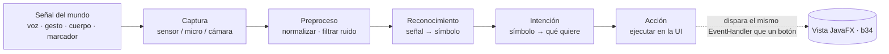
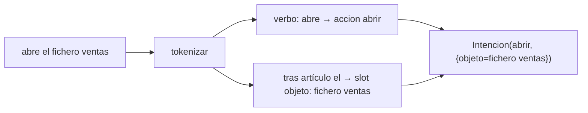
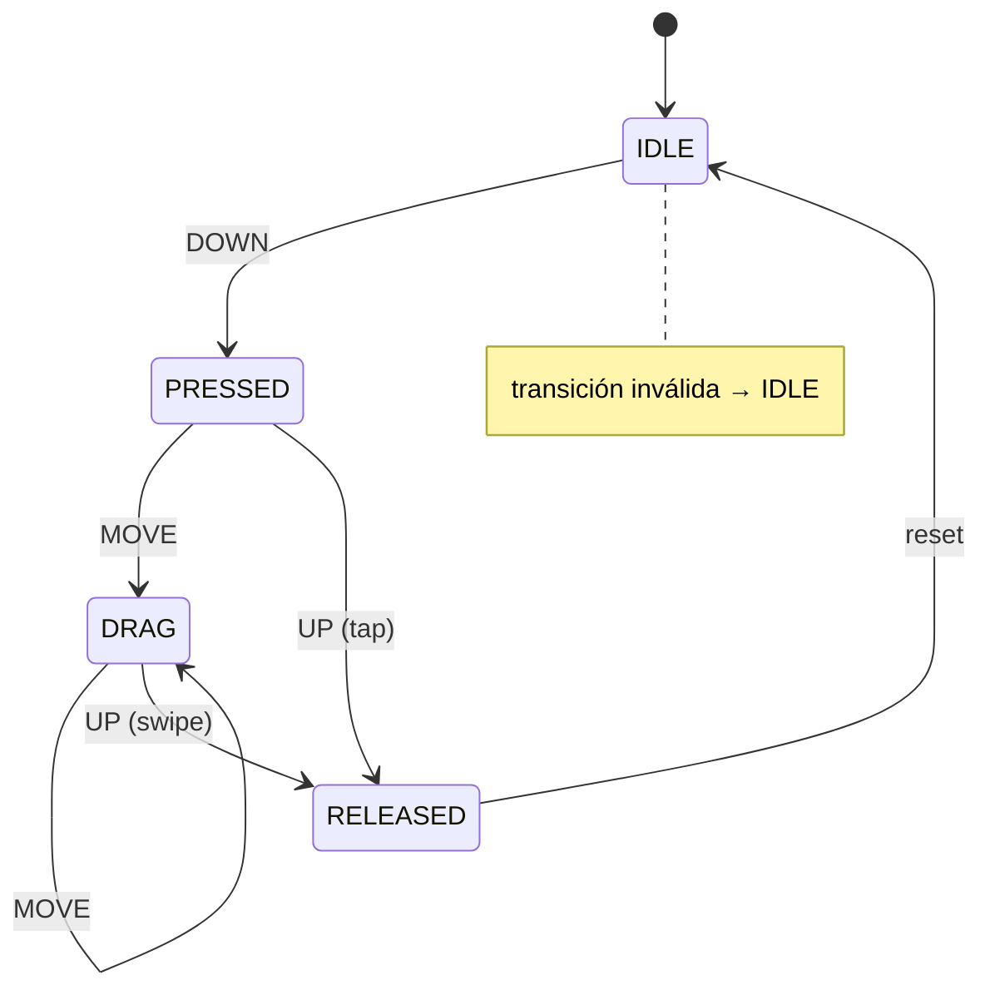
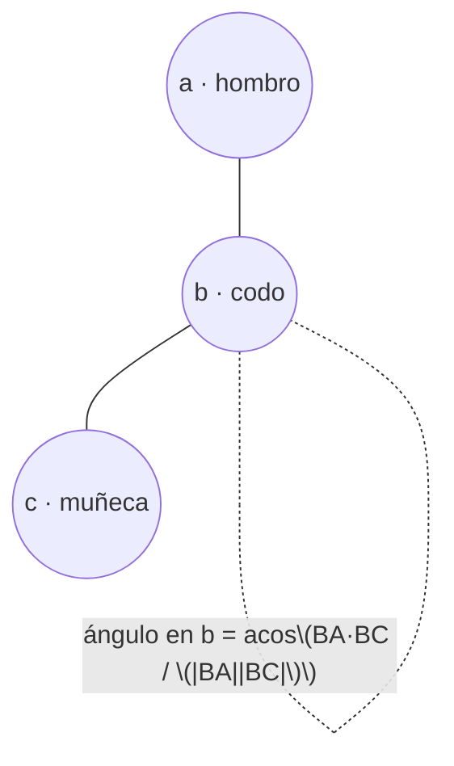
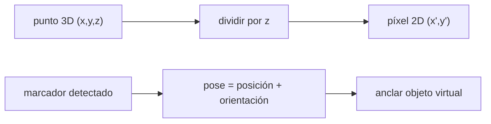
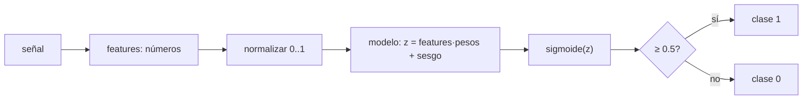

# Bloque 44 · Interfaces Naturales de Usuario (Desarrollo de Interfaces · 0488 · RA2)

> Vienes de construir interfaces gráficas con botones, menús y formularios (b32–b39): el usuario
> *aprende* a usar la máquina. Una **interfaz natural** invierte la relación: la máquina aprende a
> entender al usuario tal y como ya se comunica —hablando, gesticulando, moviéndose, señalando el
> mundo—. Eso es lo que pide el **RA2 de Desarrollo de Interfaces** y es el único RA de DI que ningún
> bloque tocaba. Importa porque es el presente (asistentes de voz, cámaras que cuentan repeticiones,
> filtros de realidad aumentada) y porque te obliga a pensar la UI como un **pipeline de percepción**,
> no como una pantalla estática.

---

## Cómo usar este documento

- **Lee UNA sección → haz SU ejercicio → vuelve.** Cada sección `N` corresponde al ejercicio
  `Ej(336+N)`. No leas los ocho de un tirón: el bloque es una escalera.
- **Los tests son la especificación real.** Cuando una guía dice "el test comprueba X", ve a mirar el
  `@Test`: ahí está el contrato exacto (entradas, salida esperada, caso límite).
- **La teoría va MÁS ALLÁ del ejercicio.** Explica el tópico entero (incluidas piezas que el ejercicio
  no usa) para que puedas resolver un caso nuevo tú solo. Las filas marcadas *(consulta)* en las
  tablas son eso: más de lo que pide el `@Test`.
- **Nota de testing:** todos los cores de este bloque son **lógica pura** (strings, geometría,
  aritmética sobre arreglos). **No** necesitan toolkit gráfico ni motores externos: se prueban con
  JUnit puro. El "Playground" de cada ejercicio es su `main()` de consola.

---

## Antes de empezar: la frontera honesta (motor real vs. modelo)

Una NUI de verdad necesita **motores** que no son Java y que viven **fuera** de este proyecto Maven:

| Modalidad | Motor real (ejemplos) | Qué hace el motor | Qué construyes TÚ aquí |
|---|---|---|---|
| Voz | Vosk, CMU Sphinx, Whisper | audio → texto + confianza | la **gramática** texto → intención (Ej338/339) |
| Gesto | sistema táctil del SO | toques → trayectoria de puntos | **clasificar** la trayectoria (Ej340) |
| Cuerpo | MediaPipe, OpenPose | imagen → keypoints | la **geometría** de los keypoints (Ej341) |
| Movimiento | OpenCV | cámara → frames | la **diferencia de frames** (Ej342) |
| Realidad aumentada | ARCore, Vuforia, ARKit | cámara → pose de marcador | la **matemática 3D↔2D** (Ej343) |
| ML para UI | Weka, Deeplearning4j | datos → modelo entrenado | el **pipeline de inferencia** (Ej344) |

> **Regla grabada.** Lo que es **transferible y testeable** en Java puro se construye; la integración
> con el motor concreto se deja en **"guion"** (documentada, sin ejecutar). Es el mismo criterio
> honesto de `b42_mobile` (Android sin emulador) y `b43_erp` (Odoo sin servidor). No es un atajo: es
> separar la **lógica de tu aplicación** (tuya, eterna, testeable) de la **dependencia del motor**
> (de terceros, cambiante).

**Modelo mental del bloque:**

> Una NUI **traduce señales del mundo físico —voz, imagen, movimiento— en una _intención_** que la
> aplicación sabe ejecutar. Sea cual sea la modalidad, todas recorren el mismo pipeline.



### Tabla índice

| Sección | Tema | Ejercicio |
|---|---|---|
| 1 | Panorama NUI: modalidades y pipeline percepción→acción | `Ej337NuiOverview` |
| 2 | Gramática de comandos de voz: frase → intención + slots | `Ej338VoiceCommandGrammar` |
| 3 | Transcripción → acción: confianza, sinónimos, fuzzy match | `Ej339SpeechToIntent` |
| 4 | Clasificar gestos por trayectoria; máquina de estados táctil | `Ej340GestureStateMachine` |
| 5 | Geometría de keypoints del cuerpo: ángulos y posturas | `Ej341BodyKeypointsGeometry` |
| 6 | Detección de movimiento: diferencia de frames y suavizado | `Ej342MotionDetection` |
| 7 | Realidad aumentada: proyección y pose de marcador | `Ej343ARMarkerMath` |
| 8 | ML para UI: features → modelo → predicción y métricas | `Ej344MlForUiPipeline` |

---

## 1. Panorama NUI: modalidades y el pipeline de percepción

Una **interfaz natural** (NUI, *Natural User Interface*) es la que usa formas de comunicación que el
ser humano ya domina —voz, gestos, postura, mirada— en lugar de exigir aprender una sintaxis de
clics y menús. El término lo popularizó la industria táctil/Kinect alrededor de 2010.

La idea central es que, **sea cual sea la modalidad**, el procesamiento sigue siempre las mismas
cinco etapas. Definirlas te da un mapa para colocar cualquier técnica del bloque:

| Etapa | Qué hace | Ejemplo en voz | Ejemplo en cuerpo |
|---|---|---|---|
| Captura | leer el sensor | grabar audio | capturar frame de cámara |
| Preproceso | limpiar/normalizar | quitar ruido, normalizar volumen | normalizar keypoints por escala |
| Reconocimiento | señal → símbolo | audio → texto | imagen → keypoints |
| Intención | símbolo → qué quiere el usuario | texto → "abrir fichero" | postura → "brazo levantado" |
| Acción | ejecutar en la UI | abrir la ventana | disparar el evento |

Las **cinco modalidades** que cita el RA2 del BOE 2023 son: reconocimiento de **voz**, **gestos**,
detección del **movimiento del cuerpo** y de **partes del cuerpo**, **realidad aumentada** y el uso de
**aprendizaje automático** para la interfaz. En este bloque las modelamos con el `enum Modalidad`.

> **Trampa de novato: la NUI nunca debe ser el ÚNICO camino.** Quien no puede hablar (mudez,
> entorno ruidoso) o gesticular (movilidad reducida) debe poder usar la app igual. La NUI es
> **apoyo**, no sustituto. Por eso `mantieneAlternativa(...)` devuelve si existe entrada clásica:
> sin ella, la app sería **inaccesible** (enlaza con la accesibilidad de b36·RA3).

### Privacidad: los datos biométricos son sensibles

Voz, cara y cuerpo son **datos biométricos**. El RGPD los considera categoría especial: exigen
**consentimiento explícito** y minimización (no almacenarlos en claro, no loguearlos). Por eso
`requiereConsentimientoBiometrico(...)` devuelve `true` para VOZ, CUERPO y RA. Conecta con b30
(cifrado, no guardar secretos) y reaparece en Ej339 (no loguear audio con contraseñas).

```java
// Clasificar la modalidad por palabras clave (guion + modelo):
Modalidad m = clasificarModalidad("comando de voz"); // -> VOZ
List<String> etapas = pipelineDe(m);                  // -> [captura, preproceso, ..., accion]
```

> **Trampa.** La **wake word** ("Ok Google") existe por privacidad: hasta oírla, el micro **no**
> transcribe de verdad. Y el **confidence gating** (actuar solo si la confianza supera un umbral)
> evita falsos positivos: mejor no hacer nada que hacer lo equivocado.

> **Lo practicas en `Ej337NuiOverview`**: los cores `clasificarModalidad` (palabras clave → enum) y
> `pipelineDe` (las 5 etapas en orden). Retos: latencia por etapa, modalidad de respaldo,
> accesibilidad, multimodal, consentimiento biométrico, wake word, confidence gating, i18n del
> comando, manos libres y etiqueta accesible (enlaza con b36).

---

## 2. Gramática de comandos de voz: de la frase a la intención

Reconocer voz tiene **dos mitades**. La acústica (audio → texto) la hace el motor (Vosk/Whisper). La
**lingüística** (texto → acción ejecutable) la haces tú, y es lógica pura. El resultado se modela como
una **intención**: una *acción* canónica más unos huecos o **slots** con los datos.



El patrón clave es separar **vocabulario** (muchas formas de decir lo mismo) de **intención** (una
sola acción). Tres palabras —"abre", "muestra", "despliega"— mapean a la misma acción `abrir`.

| Concepto | Qué es | En el código |
|---|---|---|
| Acción | verbo canónico de la app | `"abrir"`, `"cerrar"`, `"guardar"` |
| Slot | hueco con un dato | `objeto = "fichero ventas"` |
| Stop word | palabra de relleno | `el`, `la`, `de`, `un` |
| Intención | acción + slots | `record Intencion(String accion, Map slots)` |
| Gramática como datos | tabla verbo→acción | `Map<String,String>` *(consulta: escala sin tocar código)* |

Modelamos la intención con un **record** (inmutable, `equals` por valor → el test puede comparar
intenciones directamente) y un centinela `Intencion.desconocida()` para lo no reconocido:

```java
public record Intencion(String accion, Map<String,String> slots) {
    public static Intencion desconocida() { return new Intencion("desconocida", Map.of()); }
}
```

> **Trampa: la gramática NO debe ser una cadena infinita de `if`.** El reto `accionDesdeGramatica`
> usa un `Map<String,String>` como **tabla de datos**: añadir un comando es añadir una entrada, no
> tocar el código. Así funcionan los frameworks de *intents* reales (Dialogflow, Alexa Skills): un
> fichero declara la gramática.

Otros matices que cubre el ejercicio: **sinónimos**, **stop words**, **comandos compuestos**
("abre y cierra" = dos intenciones), **idioma** (la misma intención en es/en), **corrección de
typos** por distancia de edición (el motor se equivoca; corriges al término más cercano),
**prioridad** (borrar pide más cautela que mostrar) y **contexto** ("guardar" significa cosas
distintas según la vista activa).

> **Lo practicas en `Ej338VoiceCommandGrammar`**: cores `interpretarComando` (frase → Intencion) y
> `accionDeVerbo` (verbo → acción). Retos del más simple (sinónimos, stop words) al más avanzado
> (gramática como datos, comando contextual, y `disparaEventoUi`, que conecta la voz con el mismo
> `EventHandler` de un botón en b34).

---

## 3. De la transcripción a la acción: confianza y *fuzzy match*

El motor de voz **nunca** está 100 % seguro: entrega una transcripción **y una confianza** en [0,1].
Una NUI robusta hace dos cosas con eso:

1. **Confidence gating / rejection:** si la confianza no llega al umbral, **descarta** (no actúa). Es
   mejor pedir "¿puedes repetir?" que ejecutar lo equivocado.
2. **Fuzzy match:** tolera pequeños errores buscando el comando válido **más parecido** por
   **distancia de Levenshtein** (número mínimo de inserciones/borrados/sustituciones).

### Distancia de Levenshtein (el corazón del bloque)

Es programación dinámica sobre una matriz `(|a|+1) × (|b|+1)`:

```
dp[i][j] = (a[i-1]==b[j-1]) ? dp[i-1][j-1]
                            : 1 + min(dp[i-1][j],   // borrar
                                      dp[i][j-1],   // insertar
                                      dp[i-1][j-1]) // sustituir
```

`distanciaEdicion("casa","cosa")` = 1 (una sustitución). `distanciaEdicion("","abc")` = 3 (insertar
tres). La fila/columna 0 valen `i` y `j` (borrar/insertar todo). La misma función la usa
`mejorCoincidencia` para elegir el comando del catálogo de menor distancia.

> **Trampa: empate = ambigüedad.** Si dos comandos están a la misma distancia mínima,
> `mejorCoincidencia` devuelve `""`: adivinar entre dos opciones igual de probables es peor que no
> hacer nada. Diséñalo así en tu implementación.

| Métrica/Concepto | Qué mide | Detalle |
|---|---|---|
| Confianza | seguridad del motor [0,1] | viene del reconocedor |
| Umbral | confianza mínima para actuar | fijo o **adaptativo** (sube con el ruido) |
| WER (*Word Error Rate*) | calidad del reconocedor | errores / palabras de referencia |
| Levenshtein | parecido entre cadenas | base del fuzzy match |
| n-best | varias hipótesis del motor | reordenar por tu gramática *(consulta)* |
| Soundex/fonética | palabras que suenan igual | "vaca"/"baca" *(consulta)* |

> **Trampa de privacidad (otra vez).** `registrarSinAudio` oculta transcripciones con secretos
> ("password", "tarjeta") antes de loguearlas: el log **nunca** debe filtrar datos biométricos ni
> credenciales (minimización RGPD, enlaza con b30).

> **Lo practicas en `Ej339SpeechToIntent`**: cores `aAccionUi` (descarta por confianza + mapea a
> `enum AccionUi`) y `mejorCoincidencia` (Levenshtein). Retos: rechazo, historial, confirmación de
> acciones destructivas, distancia de edición, umbral adaptativo, números hablados, normalización
> fonética, WER, n-best y registro sin datos sensibles.

---

## 4. Clasificar gestos por su trayectoria; la máquina de estados táctil

Un gesto es una **secuencia de puntos en el tiempo**. Para reconocerlo se miran dos cosas: el
**desplazamiento total** (¿hacia dónde y cuánto?) y la **duración** (¿toque corto o mantenido?).



La clasificación por trayectoria es geometría simple: con el primer y el último punto calculas
`dx`, `dy` y la magnitud `hypot(dx,dy)`:

- magnitud **< umbral** → `TAP` (apenas se movió).
- si **|dx| ≥ |dy|** → horizontal: `dx>0` → `SWIPE_DER`, si no `SWIPE_IZQ`.
- si no → vertical: `dy>0` → `SWIPE_ABAJO`, si no `SWIPE_ARRIBA`.

> **Trampa: en pantalla, el eje Y crece hacia ABAJO.** Por eso `dy>0` es "swipe abajo", no arriba.
> Es el mismo convenio que en JavaFX (b32) y en imagen (b40): el origen está arriba a la izquierda.

| Gesto | Cómo se detecta | Nota |
|---|---|---|
| TAP | magnitud < umbral | toque corto |
| SWIPE (4 dir.) | dirección dominante del vector | horizontal vs. vertical primero |
| HOLD | duración ≥ umbral | long-press → menú contextual |
| Flick | velocidad alta (distancia/tiempo) | lanza scroll por inercia *(consulta)* |
| Doble tap | dos taps con intervalo corto | zoom |
| Pinch | dos punteros | `cuentaPunteros ≥ 2` *(consulta)* |

> **Trampa: la zona muerta (*dead zone*).** El dedo tiembla; un micro-movimiento NO debe convertir
> un tap en un arrastre. Por debajo de un radio mínimo, se ignora el desplazamiento.

> **Lo practicas en `Ej340GestureStateMachine`**: cores `clasificarGesto` (trayectoria → enum) y
> `estadoSiguiente` (la máquina IDLE→PRESSED→DRAG→RELEASED, con transición inválida → IDLE). Retos:
> flick, longitud de trazo, hold, doble tap, ángulo, zona muerta, cancelación, punteros, suavizado y
> velocidad media (que en b41 se convertía en la velocidad del sprite).

---

## 5. Geometría de los keypoints del cuerpo

Un motor de pose entrega **keypoints**: puntos 2D de las articulaciones (hombro, codo, muñeca…). A
partir de ahí, **todo es geometría**. La pieza estrella es el **ángulo de una articulación**: el
ángulo en `b` formado por los segmentos hacia `a` y hacia `c`, mediante el **producto escalar**.



```
BA = a - b ;  BC = c - b
dot = BA.x*BC.x + BA.y*BC.y
ángulo = toDegrees( acos( dot / (|BA| * |BC|) ) )   // recortar el coseno a [-1,1]
```

`anguloArticulacion((0,1),(0,0),(1,0))` = 90° (segmentos perpendiculares). Si algún segmento tiene
**longitud cero** (p. ej. `a == b`), el ángulo es indefinido → centinela `-1`.

> **Trampa: recorta el coseno a [-1,1] antes del `acos`.** Por errores de redondeo en `double`, el
> cociente puede salir 1.0000000002 y `Math.acos` devolvería `NaN`. Es el error silencioso más común
> de este cálculo.

Sobre esa base se construyen aplicaciones reales: **contar repeticiones** (cada flexión es bajar de
un umbral y volver a subir por encima de otro: histéresis), **detección de caídas** (asistencia a
mayores), **simetría** izquierda/derecha, y robustez (**filtro de jitter**, **oclusión** cuando un
keypoint falta, **confianza** por punto).

| Técnica | Para qué | Clave |
|---|---|---|
| Ángulo por producto escalar | postura, flexión | recortar coseno a [-1,1] |
| Centro de masa | equilibrio, caída | promedio de keypoints |
| Histéresis (2 umbrales) | contar reps | bajo→abajo, alto→arriba |
| Normalizar por altura | escala invariante | dividir por la altura del cuerpo |
| Filtro de jitter | quitar saltos | descartar cambios > máximo |
| Esqueleto como grafo | validez | nodos=keypoints, aristas=huesos |

> **Trampa: la escala importa.** Una persona lejos da puntos pequeños; cerca, grandes. Para comparar
> posturas hay que **normalizar** (dividir distancias por la altura del cuerpo): así el cálculo es
> invariante a la distancia a la cámara.

> **Lo practicas en `Ej341BodyKeypointsGeometry`**: cores `anguloArticulacion` (producto escalar) y
> `distanciaArticulaciones` (con keypoint ausente → -1). Retos: simetría, centro de masa, contar
> repeticiones, caída, jitter, confianza, oclusión, normalización, parecido de posturas y esqueleto
> como grafo (los keypoints vienen de procesar imagen en b40).

---

## 6. Detección de movimiento: diferencia de frames

La forma más simple y robusta de detectar movimiento es **restar dos fotogramas consecutivos**: los
píxeles que cambian más que un **umbral** son movimiento. Cada frame es una matriz `int[][]` de
intensidades (gris 0..255, como en b40).

```mermaid
flowchart LR
    F1[frame t] --> D{|f1 - f2| > umbral?}
    F2[frame t+1] --> D
    D -->|sí| M[píxel en movimiento]
    D -->|no| Q[quieto]
    M --> FR[fracción = movidos / total]
    FR --> SUAV[media móvil → quita ruido]
```

`fraccionMovimiento(f1,f2,umbral)` devuelve la fracción [0,1] de píxeles que cambian (o `-1` si las
dimensiones no coinciden: **siempre valida que ambos frames midan igual**). La señal resultante es
ruidosa, así que se **suaviza** con una **media móvil**: cada valor se promedia con los anteriores de
una ventana.

| Concepto | Qué es | Detalle |
|---|---|---|
| Diferencia de frames | `|f1-f2|` por píxel | base de todo |
| Umbral | mínimo para contar | separa ruido de movimiento |
| Máscara binaria | 0/1 por píxel | marca **dónde** hay movimiento |
| ROI (*region of interest*) | vigilar solo una zona | la puerta, no toda la escena |
| Media móvil | suavizado | quita parpadeo |
| Alarma sostenida | racha mínima | evita falsos positivos |
| Umbral adaptativo | escala con la media | robusto a iluminación *(consulta)* |

> **Trampa: un cambio global de luz NO es movimiento.** Si se encienden las luces, *todos* los
> píxeles cambian, pero nadie se ha movido. Por eso existen el ajuste por iluminación y el umbral
> adaptativo (media · factor). Y una **alarma** solo debe dispararse con movimiento **sostenido**
> varios frames seguidos: un parpadeo no es una intrusión.

> **Lo practicas en `Ej342MotionDetection`**: cores `fraccionMovimiento` (con validación de
> dimensiones) y `mediaMovil`. Retos: diferencia absoluta, umbral, contar activos, binarizar,
> detectar, frame skipping, ajuste por iluminación, ROI, umbral adaptativo y alarma sostenida (enlaza
> con b40 —convolución— y b27 —procesar frames en paralelo—).

---

## 7. Realidad aumentada: proyección y pose de marcador

La realidad aumentada superpone objetos virtuales sobre la imagen real. La pieza clave es
**proyectar** un punto 3D del mundo en un píxel 2D de la pantalla. Y el truco de la perspectiva es
**dividir por la profundidad** `z`: lo lejano (z grande) se ve pequeño.

```
x' = focal * x / z
y' = focal * y / z      // si z == 0 → indefinido (el punto está en el plano de la cámara)
```



El otro pilar es la **pose** del marcador (ArUco, QR): su **posición** y **orientación**, que se
manejan con **vectores y matrices**. En el ejercicio: multiplicar una matriz 3×3 (rotación) por un
vector, normalizar coordenadas homogéneas (dividir por `w`), rotar alrededor de un eje, detectar si
una matriz es **singular** (determinante 0 → pose ambigua, no invertible) y leer el **ID** del
marcador desde su patrón de bits (binario → decimal).

| Operación | Para qué | Clave |
|---|---|---|
| Proyección perspectiva | 3D → píxel | dividir por z |
| Coord. homogéneas | unificar transformaciones | dividir por w al final |
| Matriz · vector | aplicar rotación/pose | filas × vector |
| Determinante | ¿pose válida? | 0 = singular |
| Centro de marcador | ancla del objeto | promedio de esquinas |
| ID por patrón | identificar marcador | bits → decimal |

> **Trampa: nunca dividas por z (o w) sin comprobar que no es cero.** Un punto en el plano de la
> cámara (`z=0`) no tiene proyección: devuelve `null`, no `Infinity`/`NaN`. Es el error nº 1 de
> cualquier motor 3D.

> **Lo practicas en `Ej343ARMarkerMath`**: cores `proyectar` (división perspectiva, z=0 → null) y
> `multiplicarMatrizVector`. Retos: normalizar homogéneas, error de reproyección, matriz singular,
> rotar Z, grados↔radianes, escalar al mundo, centro de marcador, dentro del marcador, ID por patrón
> y anclar objeto. **La misma matemática 3D reaparece en b45 (juegos 3D).**

---

## 8. Machine Learning para la UI: features → modelo → predicción

Detrás de cada NUI hay un **clasificador**. El flujo es siempre el mismo: convertir la señal en
**features** (números), **normalizarlas**, y un **modelo** entrenado predice la **clase**.



Construimos un **modelo logístico** mínimo pero completo:

```
z = Σ features[i]·pesos[i] + sesgo          // producto punto + bias
p = 1 / (1 + e^(-z))                         // sigmoide: aplasta a (0,1)
clase = (p ≥ 0.5) ? 1 : 0                     // umbral de decisión
```

La **normalización min-max** lleva cada feature a [0,1]: `(x-min)/(max-min)`, con clamp. Si
`max==min` (feature constante, sin información) → 0. **Sin normalizar, una feature de rango grande
domina a las demás** y el modelo aprende mal: es el error clásico.

### Evaluar el modelo (no basta con la *accuracy*)

| Métrica | Fórmula | Qué penaliza |
|---|---|---|
| Exactitud (*accuracy*) | aciertos/total | engaña con clases desbalanceadas |
| Precisión (*precision*) | VP/(VP+FP) | falsos positivos ("cuando dice sí, ¿acierta?") |
| Exhaustividad (*recall*) | VP/(VP+FN) | falsos negativos ("de los sí, ¿cuántos pilló?") |
| Matriz de confusión | {VP,FP,FN,VN} | base de todas las anteriores |

> **Trampa: la accuracy miente con clases desbalanceadas.** Si el 99 % de los frames no tienen gesto,
> un modelo que siempre dice "no gesto" acierta el 99 %… y es inútil. Por eso miras **precision** y
> **recall**, que se calculan de la **matriz de confusión**.

El ejercicio incluye también **one-hot** (categórica → vector con un 1), **online learning**
(`peso += tasa·error·entrada`: el descenso de gradiente en una línea) y **exportar los pesos** a
texto, que enlaza con la serialización de componentes de b46.

> **Lo practicas en `Ej344MlForUiPipeline`**: cores `normalizarFeatures` (min-max + clamp) y
> `predecir` (logístico). Retos: producto punto, sigmoide, clamp, one-hot, precision, recall, matriz
> de confusión, exactitud, actualizar peso (gradiente) y exportar pesos (→ b46).

---

## Errores comunes del bloque

| # | Error | Antídoto |
|---|---|---|
| 1 | Actuar con confianza baja (falsos positivos) | confidence gating: descarta si `confianza < umbral` (Ej337/339) |
| 2 | Hacer la NUI el único método de entrada | mantén siempre alternativa clásica → accesibilidad (Ej337, b36) |
| 3 | Loguear voz/biometría con secretos | minimiza: oculta password/tarjeta antes de loguear (Ej339, b30) |
| 4 | Olvidar la wake word / escuchar siempre | activa la transcripción solo tras la palabra clave (Ej337) |
| 5 | Gramática como cadena infinita de `if` | tabla de datos `Map<verbo,acción>` (Ej338) |
| 6 | Confundir eje Y (creer que crece hacia arriba) | en pantalla Y crece hacia ABAJO: `dy>0` = swipe abajo (Ej340) |
| 7 | Convertir el temblor del dedo en arrastre | zona muerta: ignora desplazamientos < radio (Ej340) |
| 8 | `Math.acos` devuelve `NaN` | recorta el coseno a [-1,1] antes del `acos` (Ej341) |
| 9 | Comparar posturas sin normalizar por escala | divide por la altura del cuerpo (Ej341) |
| 10 | Tratar un cambio global de luz como movimiento | ajuste/umbral por iluminación; exige racha sostenida (Ej342) |
| 11 | Dividir por `z` o `w` igual a cero | valida antes; devuelve `null`, no `NaN`/`Infinity` (Ej343) |
| 12 | Una feature de rango grande domina el modelo | normaliza min-max a [0,1] antes de predecir (Ej344) |
| 13 | Fiarse solo de la *accuracy* | mira precision/recall sobre la matriz de confusión (Ej344) |
| 14 | Empate en el fuzzy match resuelto a lo loco | empate al mínimo → `""` (no adivines) (Ej339) |

---

## Chuleta final del bloque

```
pipeline NUI       = captura → preproceso → reconocimiento → intención → acción
modalidades        = VOZ, GESTO, CUERPO, RA, ML
NUI = apoyo        = mantén entrada clásica; biométricos → consentimiento (RGPD)
confidence gating  = actuar solo si confianza >= umbral
intención          = record Intencion(accion, slots); centinela desconocida()
gramática          = tabla Map<verbo,acción>, NO cadena de if
Levenshtein        = dp[i][j]=igual? dp[i-1][j-1] : 1+min(borrar,insertar,sustituir)
empate fuzzy       = "" (no adivinar)
gesto              = dx,dy,hypot; tap si magnitud<umbral; |dx|>=|dy| → horizontal
eje Y              = crece HACIA ABAJO (dy>0 = abajo)
máquina táctil     = IDLE→PRESSED→DRAG→RELEASED; inválida→IDLE
ángulo articular   = acos(BA·BC/(|BA||BC|)); recorta coseno a [-1,1]; deg
contar reps        = histéresis: bajo umbralBajo → arriba umbralAlto
movimiento         = |f1-f2|>umbral; fracción=movidos/total; valida dimensiones
suavizado          = media móvil sobre la señal
proyección 3D→2D   = x'=f·x/z ; nunca dividas por z=0 (→ null)
matriz·vector      = fila_i · v ; det=0 → singular
modelo logístico   = sigmoide(features·pesos + sesgo) >= 0.5
normalizar feature = (x-min)/(max-min), clamp [0,1]; max==min → 0
métricas           = precision=VP/(VP+FP); recall=VP/(VP+FN); accuracy engaña
```

---

## Autoevaluación (responde sin mirar; si fallas 2+, relee la sección)

1. ¿Cuáles son las cinco etapas del pipeline de percepción de una NUI, en orden? *(1)*
2. ¿Por qué una NUI nunca debe ser el único método de entrada, y qué tiene que ver con b36? *(1)*
3. ¿Qué modalidades requieren consentimiento biométrico y por qué? *(1)*
4. ¿Qué diferencia hay entre la *acción* y los *slots* de una intención? *(2)*
5. ¿Por qué conviene modelar la gramática como una tabla de datos en vez de con `if`? *(2)*
6. Define la distancia de Levenshtein y di cuánto vale entre "casa" y "cosa". *(3)*
7. ¿Qué hace el *confidence gating* y por qué un empate en el fuzzy match se resuelve con `""`? *(3)*
8. Al clasificar un gesto, ¿qué significa `dy>0` y por qué? ¿Qué es la zona muerta? *(4)*
9. ¿Cómo se calcula el ángulo de una articulación y por qué hay que recortar el coseno a [-1,1]? *(5)*
10. ¿Por qué un cambio global de iluminación no debe contar como movimiento? *(6)*
11. ¿Qué pasa si proyectas un punto 3D con `z=0` y cómo debe responder tu código? *(7)*
12. ¿Por qué la *accuracy* puede engañar y qué métricas miras en su lugar? *(8)*
