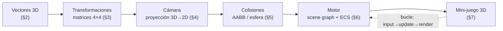
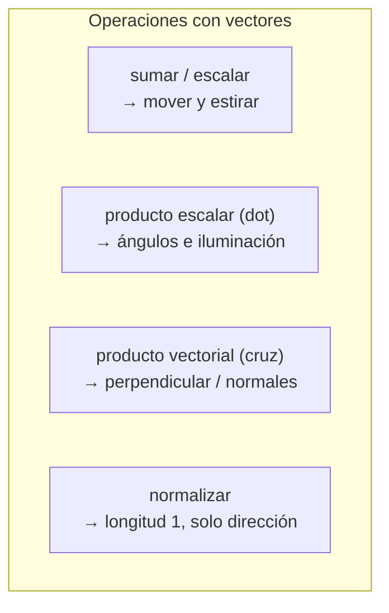
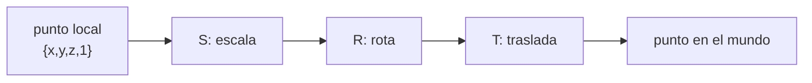
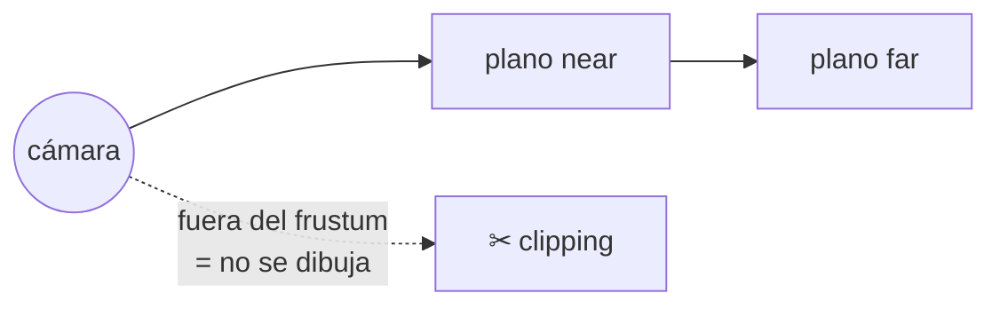
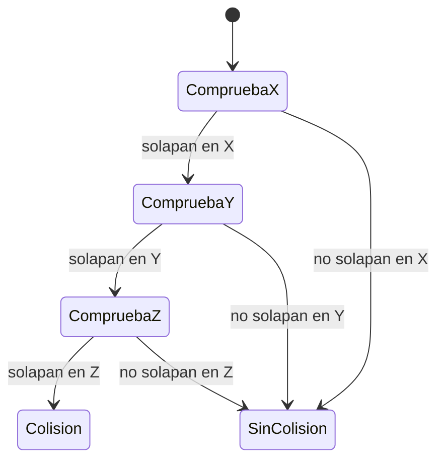
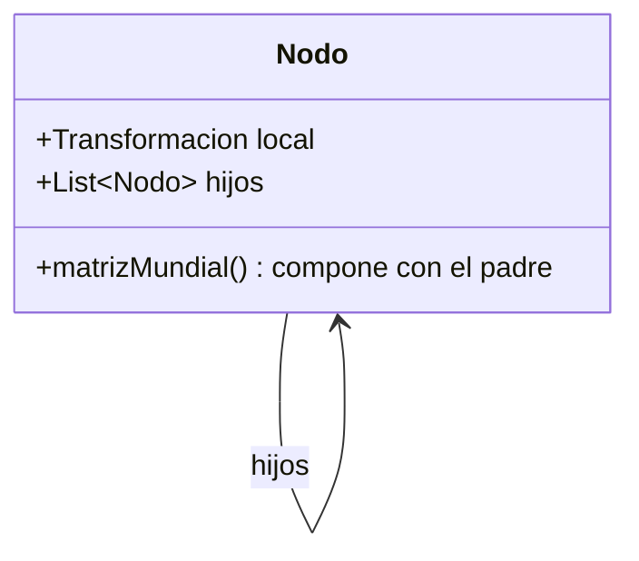
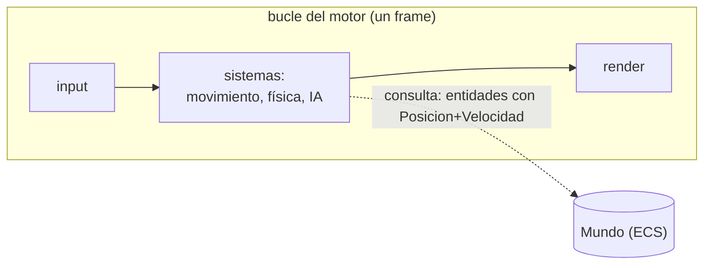
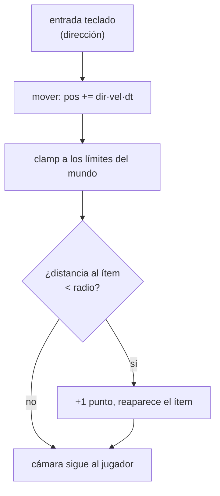

# Bloque 45 · JavaFX 3D y arquitectura de motores de juego (PMDM · RA4/RA5)

> Vienes de `b41_anim`, donde montaste un juego **2D**: una pelota que rebotaba en un `Canvas` con su
> *game loop*, su física `pos + vel·dt` y sus colisiones AABB. Te falta la otra mitad que el BOE pide
> con todas las letras: **"2D Y 3D"**, **"escenas"**, **"materiales"**, **"cámaras e iluminación"** y
> **"los componentes de un motor de juegos"**. Eso es este bloque. Y la buena noticia es que el 3D no
> es magia: es la misma física de b41 con **un eje más** y un poco de álgebra (vectores y matrices)
> que aquí vas a construir a mano para entenderla de verdad. Importa porque casi todo el software
> interactivo moderno —juegos, visores médicos, configuradores de producto, realidad aumentada— vive
> en tres dimensiones, y porque saber *cómo* un motor coloca, gira, ilumina y colisiona objetos te
> convierte de usuario de motores en alguien que entiende lo que pasa por dentro.

---

## Cómo usar este documento

- **Lee UNA sección y haz SU ejercicio.** Cada sección de aquí abajo corresponde a un `EjNNN`. Lee la
  teoría, abre el ejercicio, implementa sus 10 TODOs y luego los 10 retos. Vuelve cuando te atasques.
- **Los tests son la especificación real.** El enunciado del método te dice *qué*; el test te dice
  *exactamente* qué casos límite comprueba (z = 0, vector cero, lista vacía, índice fuera de rango).
  Si el test espera `null` cuando el vector no mide 3, tu código tiene que devolver `null`, no lanzar.
- **La teoría va MÁS ALLÁ del ejercicio.** Aquí se explica el tópico entero (todas las rotaciones,
  todos los tipos de luz, todo el frustum) aunque el ejercicio solo toque una parte. Es a propósito:
  el examen y la vida te pedirán casos que el ejercicio no practica.
- **Nota de testing.** Toda la matemática 3D es **lógica pura**: los tests son JUnit normal, sin abrir
  ventana. La escena 3D real solo aparece en los **Playground** (`Playground3D`,
  `PlaygroundMiniGame3D`), que se lanzan aparte con `mvn -pl b45_juego3d javafx:run`.

---

## Antes de empezar (trampas de entorno que bloquean a un novato)

1. **JavaFX 3D no viene en el JDK.** Igual que en b32–b41, las clases `PerspectiveCamera`, `Box`,
   `Sphere`, `PhongMaterial` o `PointLight` están en el módulo `org.openjfx:javafx-controls` que el
   `pom.xml` del bloque ya declara. Si tu IDE no las encuentra, recarga el proyecto Maven.
2. **El 3D necesita una tubería gráfica (pipeline).** JavaFX intenta usar la GPU (*Prism*). En
   máquinas sin aceleración o en CI hay que forzar la tubería por software con
   `-Dprism.order=sw`. Si el Playground arranca en negro o casca con un error de *Prism*, esa es la
   bandera que falta.
3. **No confundas "ver" con "calcular".** Los **cores** de este bloque NO abren ventana: calculan
   números (proyectar un punto, detectar una colisión). Por eso se prueban con JUnit puro y son
   deterministas. La ventana es solo el escaparate.
4. **El eje Y "apunta hacia abajo" en pantalla.** En el mundo 3D, Y suele crecer hacia arriba; al
   pasar a píxeles de pantalla se **invierte** (ver §4). Es la causa nº 1 de "mi objeto sale del
   revés".
5. **Coma flotante: nunca compares con `==`.** `cos(90°)` no es exactamente 0 en `double`. Todos los
   tests usan tolerancia (`1e-9`); tú compara igual con `Math.abs(a - b) < epsilon`.

---

## Tabla índice del bloque

| Sección | Tema | Ejercicio |
|---|---|---|
| [2](#2--vectores-3d-la-pieza-atómica-ej345) | Vectores 3D: suma, escala, dot, cruz, normalizar | `Ej345Vector3DMath` |
| [3](#3--transformaciones-3d-mover-girar-escalar-ej346) | Matrices 4×4: traslación, rotación, escala, composición | `Ej346Transforms3D` |
| [4](#4--la-cámara-en-perspectiva-y-la-proyección-ej347) | Cámara, proyección perspectiva, frustum, materiales, luces | `Ej347PerspectiveCameraScene` |
| [5](#5--colisiones-en-3d-ej348) | AABB y esferas en tres ejes, raycast, rebote | `Ej348Collision3DAABB` |
| [6](#6--arquitectura-de-un-motor-scene-graph-y-ecs-ej349) | Scene graph, ECS, sistemas, bucle | `Ej349GameEngineArchitecture` |
| [7](#7--mini-juego-3d-integrador-ej350) | Integración: mover, recoger, cámara, IA, score | `Ej350MiniGame3D` |

> **Modelo mental del bloque.** Quédate con esta frase y no la sueltes:
> **un juego 3D es un grafo de nodos, cada uno con una transformación, vistos por una cámara que los
> proyecta a 2D, y actualizados por un bucle que avanza el tiempo.** Vectores y matrices colocan y
> mueven; la cámara aplana 3D→2D; las colisiones deciden qué toca qué; el motor (scene graph + ECS)
> organiza todo; el bucle lo hace vivir. Las seis secciones son justo esas seis piezas.



---

## 2 · Vectores 3D: la pieza atómica (Ej345)

Un **vector 3D** es una terna `{x, y, z}`. Con la misma terna representamos cosas distintas según el
contexto: un **punto** (una posición en el espacio), una **dirección** (hacia dónde), una
**velocidad** (dirección + rapidez) o una **normal** (la perpendicular a una superficie, que decide
cómo se ilumina). Dominar cinco operaciones te da el 90 % de la geometría de un juego.



### Las operaciones, una a una

| Operación | Fórmula | Devuelve | ¿Para qué sirve? |
|---|---|---|---|
| Suma | `{a+d, b+e, c+f}` | vector | Encadenar desplazamientos; `pos + vel·dt` |
| Escala | `{a·k, b·k, c·k}` | vector | Cambiar rapidez; multiplicar por `dt` |
| Magnitud | `√(x²+y²+z²)` | escalar | Longitud del vector; distancia al origen |
| Producto escalar (dot) | `a·d + b·e + c·f` | **escalar** | Ángulos, iluminación, proyección |
| Producto vectorial (cruz) | ver abajo | **vector** ⟂ a ambos | Normales, orientación, área |
| Normalizar | `v / |v|` | vector unitario | Direcciones puras (para luz, rumbo) |
| Distancia | `|a − b|` | escalar | Colisiones, "¿está cerca?" |

**Producto escalar (dot), el más importante.** `u·v = |u||v|·cos θ`. De ahí salen tres lecturas:
si es **0**, los vectores son perpendiculares; si es **positivo**, apuntan "más o menos al mismo
sitio"; si es **negativo**, apuntan en sentidos opuestos. Por eso lo usa la iluminación: una cara
de frente a la luz tiene `dot` alto (muy iluminada), de espaldas tiene `dot` negativo (a oscuras).

**Producto vectorial (cruz).** `u × v` da un vector **perpendicular** a `u` y a `v`:

```
(u × v) = { u.y·v.z − u.z·v.y ,
            u.z·v.x − u.x·v.z ,
            u.x·v.y − u.y·v.x }
```

> **Reglas grabadas:** el *dot* devuelve un **número**; la *cruz* devuelve un **vector**. La cruz **no
> conmuta**: `u × v = −(v × u)`. Normalizar un vector de magnitud 0 es imposible (división por cero):
> por convención devolvemos el vector cero `{0,0,0}`, no `NaN`.

```java
// Normalizar con guarda del caso magnitud 0:
double m = Math.sqrt(x*x + y*y + z*z);
return (m == 0) ? new double[]{0,0,0} : new double[]{x/m, y/m, z/m};
```

**Trampa del ángulo:** `Math.acos` solo acepta argumentos en `[-1, 1]`. Por redondeo, `dot/(|u||v|)`
puede salir `1.0000000002` y `acos` devuelve `NaN`. **Recorta** siempre el coseno a `[-1, 1]` antes.

> **Lo practicas en `Ej345Vector3DMath`**: los cores `productoVectorial`, `normalizar` y `distancia`;
> los retos suben de `productoEscalar`/`magnitud` (simples) a `proyeccion`, `reflejar` (rebote, que
> reaparece en §5), `lerp` (interpolar movimiento), `tripleProducto` y `sonCoplanares` (volumen).

---

## 3 · Transformaciones 3D: mover, girar, escalar (Ej346)

Para colocar un objeto en el mundo se usa una **matriz 4×4**. ¿Por qué 4×4 si el espacio es 3D? Por
un truco genial llamado **coordenadas homogéneas**: un punto `{x, y, z}` se escribe como
`{x, y, z, 1}`. Esa cuarta componente permite que **una sola** multiplicación matriz·punto incluya la
**traslación** (mover), que con matrices 3×3 sería imposible (una matriz 3×3 solo puede rotar y
escalar alrededor del origen, nunca desplazar).

### Las tres transformaciones básicas

```
Traslación T(dx,dy,dz)     Escala S(sx,sy,sz)        Rotación (ej.: sobre Z, ángulo θ)
[1 0 0 dx]                 [sx 0  0  0]              [cosθ -sinθ 0 0]
[0 1 0 dy]                 [0  sy 0  0]              [sinθ  cosθ 0 0]
[0 0 1 dz]                 [0  0  sz 0]              [0     0    1 0]
[0 0 0 1 ]                 [0  0  0  1]              [0     0    0 1]
```

| Transformación | Dónde van los datos | Notas |
|---|---|---|
| **Identidad** | 1 en la diagonal, 0 el resto | El "no hacer nada"; punto de partida |
| **Traslación** | 4.ª columna: `m[0..2][3]` | La única que necesita la fila homogénea |
| **Escala** | diagonal: `m[i][i]` | `sx, sy, sz`; escala uniforme si los tres iguales |
| **Rotación X** | submatriz Y-Z | gira en el plano YZ |
| **Rotación Y** | submatriz X-Z | ¡los signos de `sin` van al revés que en X! |
| **Rotación Z** | submatriz X-Y | es la rotación 2D de toda la vida, metida en 3D |

**Componer = multiplicar.** Encadenar transformaciones es multiplicar sus matrices. Y aquí está la
trampa que más cuesta: **el producto de matrices NO conmuta**. `T·R·S` (escala, luego rota, luego
traslada) NO es lo mismo que `S·R·T`. La convención de casi todos los motores es **T·R·S**: cuando
aplicas la matriz a un punto, la que actúa *primero* es la de más a la derecha (la escala).



> **Trampa de la rotación: el *gimbal lock*.** Si compones rotaciones X, Y, Z por separado (ángulos de
> Euler), en ciertas orientaciones dos ejes se "alinean" y pierdes un grado de libertad: el objeto da
> tirones. La solución profesional son los **cuaterniones** (fuera del alcance del ejercicio, pero
> debes saber que existen y *por qué*). Por eso los motores serios no guardan la orientación como tres
> ángulos sueltos.

> **Lo practicas en `Ej346Transforms3D`**: cores `componer` (producto de una lista de matrices) y
> `aplicar` (matriz·punto con división homogénea). Retos: construyes identidad, traslación, escala y
> las tres rotaciones, las multiplicas y compones `T·R·S`. La `transpuesta` de una rotación pura es su
> inversa (truco habitual). En §6 verás que el *scene graph* compone padre·hijo con esta misma
> multiplicación.

---

## 4 · La cámara en perspectiva y la proyección (Ej347)

La cámara es lo que convierte un mundo 3D en píxeles 2D. La idea es de Brunelleschi (siglo XV): en
**perspectiva**, lo lejano se ve pequeño. Matemáticamente, **se divide entre la profundidad z**.

```
Proyección perspectiva de un punto {x, y, z} con distancia focal f:
    x' = f · x / z
    y' = f · y / z          (cuanto mayor es z, más pequeño sale: lo lejano encoge)
```

Después de proyectar hay que **mapear al viewport** (la ventana en píxeles): el centro de la pantalla
es el origen, y como en pantalla la Y crece hacia abajo, se **resta**:

```
screenX = ancho/2 + x'
screenY = alto/2  − y'     (¡el menos invierte el eje Y!)
```

### El frustum: lo que la cámara ve

La cámara no ve todo el espacio, solo una **pirámide truncada** llamada *frustum*, limitada por dos
planos: **near** (lo más cerca que dibuja) y **far** (lo más lejos). Lo que cae fuera se **recorta**
(*clipping*) y no se pinta. El plano *near* existe por una razón práctica: si `z → 0`, la división
`x/z` explota; recortar antes evita el desastre.



| Parámetro | Qué controla | Efecto si lo cambias |
|---|---|---|
| **Distancia focal / FOV** | "zoom" de la lente | FOV grande = gran angular (más mundo, deformado); pequeño = teleobjetivo |
| **near** | plano cercano | demasiado pequeño → *z-fighting* (parpadeo de superficies) |
| **far** | plano lejano | demasiado grande → pierdes precisión de profundidad |
| **aspect ratio** | ancho/alto | si no coincide con la ventana, todo sale achatado o estirado |

Relación FOV ↔ focal: `focal = (alto/2) / tan(FOV/2)`. La **profundidad normalizada**
`(z − near)/(far − near)` lleva la z a `[0,1]`: es lo que guarda el **z-buffer** para decidir, píxel a
píxel, qué objeto tapa a cuál.

### Materiales e iluminación (RA5: "materiales, cámaras e iluminación")

Un objeto no se ve solo por su forma, sino por cómo **refleja la luz**. JavaFX usa el modelo de
**Phong**, que suma tres componentes:

| Componente | Qué es | Cómo se calcula (idea) |
|---|---|---|
| **Ambiente** | luz de relleno uniforme | color · luz ambiente |
| **Difusa (Lambert)** | brillo según el ángulo a la luz | `max(0, normal · dirLuz)` (normalizados) |
| **Especular** | el "brillo" puntual, el reflejo | depende del ángulo a la cámara y la "dureza" |

Tipos de luz que debes conocer (aunque el ejercicio use dos):

| Luz | Comportamiento | Clase JavaFX |
|---|---|---|
| **Ambiente** | ilumina todo por igual, sin dirección | `AmbientLight` |
| **Puntual** | una bombilla; cae con el **cuadrado** de la distancia | `PointLight` |
| **Direccional** *(consulta — más de lo que usa el ejercicio)* | rayos paralelos, como el sol | se simula con `PointLight` lejana |
| **Foco/spot** *(consulta)* | cono de luz | no nativo; se aproxima |

> **Reglas grabadas:** lo lejano encoge porque se **divide por z**. El eje Y se **invierte** al pasar a
> pantalla. La luz puntual cae con `1/distancia²` (ley del inverso del cuadrado). La iluminación difusa
> usa `max(0, dot)`: un `dot` negativo es una cara **de espaldas** a la luz → 0, nunca negativo.

```java
// Iluminación difusa de Lambert (cuánto ilumina una luz a una cara):
double[] n = normalizar(normal);
double[] l = normalizar(dirLuz);
return Math.max(0, productoEscalar(n, l));   // 1 = de frente, 0 = de lado o de espaldas
```

> **Lo practicas en `Ej347PerspectiveCameraScene`**: cores `posicionEnPantalla` (proyección + viewport,
> `z ≤ 0 → null`) y `dentroDelFrustum` (near/far). Retos: `aspecto`, `focalDesdeFov`, near clipping,
> profundidad normalizada (z-buffer), NDC→viewport, cámara orbital con coordenadas esféricas, culling,
> luz puntual (inverso del cuadrado) e iluminación difusa. El `Playground3D` monta la escena real con
> `PerspectiveCamera`, `PhongMaterial` y `PointLight`.

---

## 5 · Colisiones en 3D (Ej348)

En b41 una colisión AABB era solape en X **y** en Y. En 3D solo añadimos un eje: dos cajas chocan si
sus intervalos se solapan en X **y** en Y **y** en Z. Basta que falte el solape en **un** eje para que
no haya colisión (es un AND de tres condiciones).



### Las primitivas de colisión

| Prueba | Condición | Coste | Cuándo usarla |
|---|---|---|---|
| **AABB vs AABB** | solape en los 3 ejes | barato | primer filtro (*broad phase*) |
| **Esfera vs esfera** | `dist² < (r1+r2)²` | barato | personajes, proyectiles |
| **Esfera vs AABB** | clamp del centro a la caja, luego distancia | medio | objeto redondo contra muros |
| **Rayo vs AABB** | método de las *slabs* (rango de t) | medio | disparos, *picking* con el ratón |

**El truco de oro: compara distancias al cuadrado.** Para saber si dos esferas chocan, NO calcules la
raíz cuadrada (es cara). Compara `dx²+dy²+dz²` con `(r1+r2)²`: es equivalente y más rápido. La raíz
solo hace falta cuando necesitas la distancia *real* (p. ej. la profundidad de penetración).

```java
// Esfera vs caja AABB: el punto de la caja más cercano al centro de la esfera.
double cx = Math.max(min[0], Math.min(centro[0], max[0]));   // clamp por eje
double cy = Math.max(min[1], Math.min(centro[1], max[1]));
double cz = Math.max(min[2], Math.min(centro[2], max[2]));
double d2 = (cx-centro[0])*(cx-centro[0]) + (cy-centro[1])*(cy-centro[1]) + (cz-centro[2])*(cz-centro[2]);
return d2 <= radio*radio;   // si el punto más cercano está dentro del radio, chocan
```

**Resolver la colisión (el rebote).** Cuando algo choca, hay que responder. El rebote contra una
superficie usa la misma reflexión que viste en §2: `v' = v − 2·(v·n)·n`, con `n` la **normal** de la
cara. En b41 esto era "invertir vx o vy"; en 3D se generaliza con la normal.

> **Trampa de las cajas:** una AABB **no rota**. Si tu objeto gira, su AABB deja de ajustarse y "sobra"
> espacio. Para objetos rotados se usan OBB (cajas orientadas) o se recalcula la AABB cada frame. Para
> la *broad phase* la AABB sigue siendo la reina porque es baratísima.

> **Lo practicas en `Ej348Collision3DAABB`**: cores `colisionanAABB3D` y `colisionEsfera`. Retos:
> punto en caja, volumen, centro, solape de eje, distancia², esfera-caja (clamp), contención,
> penetración, raycast (slabs) y `resolverRebote` (la reflexión de §2 aplicada a la velocidad).

---

## 6 · Arquitectura de un motor: scene graph y ECS (Ej349)

Es el **núcleo conceptual** del bloque y donde el BOE pide "conocer los componentes de un motor de
juegos". Hay dos formas clásicas de organizar los objetos de una escena:

### Scene graph (grafo de escena)

Un **árbol de nodos**: cada nodo tiene una transformación (§3) **relativa a su padre**. Mover el
brazo mueve la mano; mover el cuerpo mueve todo. La transformación final de un nodo es la
**composición** (multiplicación de matrices) de su transformación con la de todos sus ancestros. Es
exactamente el modelo de JavaFX (`Group` con hijos) y de Godot (nodos).



### ECS (Entity-Component-System): cómo lo hacen los motores modernos

En vez de una jerarquía de herencia (`Enemigo extends Personaje extends Objeto…`, que se vuelve
ingobernable), el patrón **ECS** separa datos de lógica en tres piezas:

| Pieza | Qué es | Ejemplo | Tiene… |
|---|---|---|---|
| **Entidad** | solo un **id** (un número) | "el jugador" = id 0 | nada por sí misma |
| **Componente** | un trozo de **datos** | `Posicion`, `Velocidad`, `Salud` | datos, sin lógica |
| **Sistema** | la **lógica** que recorre entidades | sistema de movimiento | lógica, sin datos |

La gracia: una entidad "es" lo que sus componentes dicen. Le añades `Velocidad` y de pronto el sistema
de movimiento la mueve; se la quitas y se queda quieta. Es **composición en vez de herencia**.



**El sistema de movimiento** es el "tick": recorre las entidades que tienen `Posicion` **y**
`Velocidad`, y a cada una le aplica `pos += vel·dt`. Idéntico a b41, pero ahora desacoplado en un
sistema reutilizable. El **orden de los sistemas importa**: input antes que física, física antes que
render.

**Paso fijo (fixed timestep).** Igual que en b41: la física se actualiza a pasos de tamaño constante
(p. ej. 1/60 s) aunque los fps varíen, y el sobrante se acumula para el siguiente frame. Si no, la
simulación "deriva" y deja de ser determinista (y reproducible en los tests).

### Motores reales (RA4: "diferentes motores")

| Motor | Lenguaje de script | Arquitectura | 2D/3D | Licencia |
|---|---|---|---|---|
| **Unity** | C# | GameObject + Component (ECS opcional) | ambos | gratis con límites |
| **Godot** | GDScript / C# | árbol de nodos (scene graph) | ambos | libre (MIT) |
| **Unreal** | C++ / Blueprints | Actor + Component | ambos (fuerte 3D) | regalías |
| **jMonkeyEngine** | Java | scene graph | 3D | libre (BSD) |

> **Lo practicas en `Ej349GameEngineArchitecture`**: la clase `Mundo` (almacén de entidades) viene
> hecha; tú implementas los **sistemas**: `tick` (movimiento) y `entidadesCon` (consulta por
> componente). Retos: contar, consulta multi-componente, prefab (clonar), gravedad, integrar, orden
> de sistemas, paso fijo (de b41), serializar el mundo (guardar partida, enlaza con b46) y la tabla de
> motores reales.

---

## 7 · Mini-juego 3D integrador (Ej350)

Aquí se junta todo: vectores (§2) para mover, la cámara que sigue al jugador (§4), colisiones de
esfera (§5) para recoger ítems y la idea de actualizar el estado en un tick (§6). El juego es mínimo
pero completo: mueves un objeto en 3D, una cámara lo sigue desde atrás, recoges ítems al tocarlos y
sumas puntos.



Conceptos que se integran:

- **Mover con dirección + rapidez:** `pos_nueva = pos + direccion · (velocidad · dt)`. La misma física
  de b41, con tres ejes.
- **Mantener al jugador dentro del nivel:** *clamp* de cada coordenada a `[−límite, límite]`. Más
  suave que rechazar el movimiento (el jugador "resbala" por el borde).
- **Recoger por colisión de esfera:** si la distancia jugador-ítem es menor que el radio, +1 punto.
- **Cámara en tercera persona:** `posCamara = posJugador + offset` (un desplazamiento fijo detrás y
  arriba). Es lo que hace que la cámara "siga".
- **IA simple (perseguir):** un enemigo se mueve hacia el jugador con `normalizar(jugador − enemigo) ·
  vel · dt`. Normalizar es clave: si no, va más rápido cuanto más lejos está.
- **Progresión:** nivel por puntos, vidas, *game over*, *spawn* cíclico de ítems.

> **Lo practicas en `Ej350MiniGame3D`**: cores `mover` y `puntuarSiRecoge`. Retos: distancia, dentro
> del mundo, clamp, cámara en 3.ª persona, nivel, vidas, game over, spawn cíclico, gravedad de salto e
> IA de persecución. El `PlaygroundMiniGame3D` lo hace jugable con una escena 3D real.

---

## Errores comunes del bloque

| # | Error | Antídoto |
|---|---|---|
| 1 | Confundir *dot* (número) con *cruz* (vector) | El dot mide parecido/ángulo; la cruz da un perpendicular |
| 2 | Normalizar un vector de magnitud 0 → `NaN` | Si `m == 0`, devuelve `{0,0,0}` por convención |
| 3 | `Math.acos` devuelve `NaN` | Recorta el coseno a `[-1, 1]` antes de `acos` |
| 4 | Olvidar dividir por `z` al proyectar | Sin la división no hay perspectiva (todo del mismo tamaño) |
| 5 | El objeto sale del revés en pantalla | El eje Y se **invierte**: `screenY = alto/2 − y'` |
| 6 | Proyectar con `z ≤ 0` | Recorta con el plano *near*; `z = 0` → `null` (división explota) |
| 7 | Invertir el orden de las matrices | No conmuta; la convención es `T·R·S` (la S actúa primero) |
| 8 | *Gimbal lock* con ángulos de Euler | Sábelo y, en serio, usa cuaterniones |
| 9 | Sacar la raíz para comparar distancias | Compara `dist²` con `(r1+r2)²`; la raíz solo si la necesitas |
| 10 | Una AABB "sobra" cuando el objeto rota | La AABB no rota; usa OBB o recalcula la caja cada frame |
| 11 | El enemigo va más rápido cuanto más lejos | **Normaliza** la dirección antes de multiplicar por la velocidad |
| 12 | La física "deriva" según los fps | Usa **paso fijo** y acumula el sobrante (como en b41) |
| 13 | Comparar `double` con `==` | Siempre con tolerancia (`Math.abs(a-b) < 1e-9`) |

---

## Chuleta final del bloque

```text
# Vectores (§2)
dot(u,v)        = ux*vx + uy*vy + uz*vz            # número; 0 = perpendicular
cruz(u,v)       = {uy*vz-uz*vy, uz*vx-ux*vz, ux*vy-uy*vx}  # vector perpendicular
magnitud(v)     = sqrt(x²+y²+z²)
normalizar(v)   = v / magnitud(v)  (mag 0 -> {0,0,0})
angulo(u,v)     = acos( clamp(dot/(|u||v|), -1, 1) )       # ¡recorta antes de acos!
reflejar(d,n)   = d - 2*dot(d,n)*n                         # rebote

# Transformaciones (§3) — matrices 4x4, coordenadas homogéneas {x,y,z,1}
traslacion -> 4ª columna ; escala -> diagonal ; rotación -> submatriz del plano
componer = multiplicar matrices ; NO conmuta ; convención T·R·S (S primero)

# Cámara (§4)
proyección  x' = f*x/z ;  y' = f*y/z          # lo lejano encoge
viewport    sx = ancho/2 + x' ; sy = alto/2 - y'   # Y se invierte
frustum     near <= z <= far                  # fuera = clipping
focal       f = (alto/2) / tan(FOV/2)
luz puntual intensidad / distancia²           # inverso del cuadrado
difusa      max(0, dot(normal, dirLuz))       # Lambert

# Colisiones (§5)
AABB 3D     solape en X ∧ Y ∧ Z
esferas     dist² < (r1+r2)²                  # compara cuadrados, sin raíz
esfera-caja clamp del centro a [min,max], luego distancia <= radio

# Motor (§6) — ECS
entidad = id ; componente = datos ; sistema = lógica
tick: por cada entidad con Posicion+Velocidad -> pos += vel*dt
orden de sistemas: input -> física -> render ; paso fijo para determinismo

# Mini-juego (§7)
mover       pos += dir * (vel*dt)
cámara 3ª p pos + offset
perseguir   normalizar(objetivo - yo) * vel*dt
```

---

## Autoevaluación (responde sin mirar; si fallas 2+, relee la sección)

1. ¿Qué devuelve el producto **escalar** y qué el **vectorial**, y para qué sirve cada uno? *(2)*
2. ¿Por qué hay que recortar el coseno a `[-1, 1]` antes de llamar a `Math.acos`? *(2)*
3. ¿Por qué las transformaciones 3D usan matrices **4×4** y no 3×3? *(3)*
4. El orden `T·R·S`: ¿cuál de las tres transformaciones actúa **primero** sobre el punto? *(3)*
5. ¿Qué operación da la **perspectiva** (que lo lejano se vea pequeño)? *(4)*
6. ¿Por qué `screenY = alto/2 − y'` lleva un **menos**? *(4)*
7. ¿Qué es el *frustum* y para qué sirven los planos *near* y *far*? *(4)*
8. ¿Cómo cae la intensidad de una luz puntual con la distancia? *(4)*
9. ¿Por qué se comparan **distancias al cuadrado** en las colisiones de esferas? *(5)*
10. Explica la prueba de colisión **esfera contra caja AABB** (el *clamp*). *(5)*
11. En un **ECS**, ¿qué es una entidad, un componente y un sistema? *(6)*
12. ¿Por qué se usa **paso fijo** para la física? *(6)*
13. Al hacer que un enemigo persiga al jugador, ¿por qué hay que **normalizar** la dirección? *(7)*
14. ¿Cómo se calcula la posición de una cámara en **tercera persona**? *(7)*
