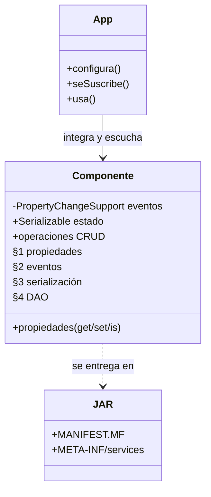
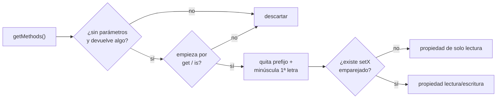
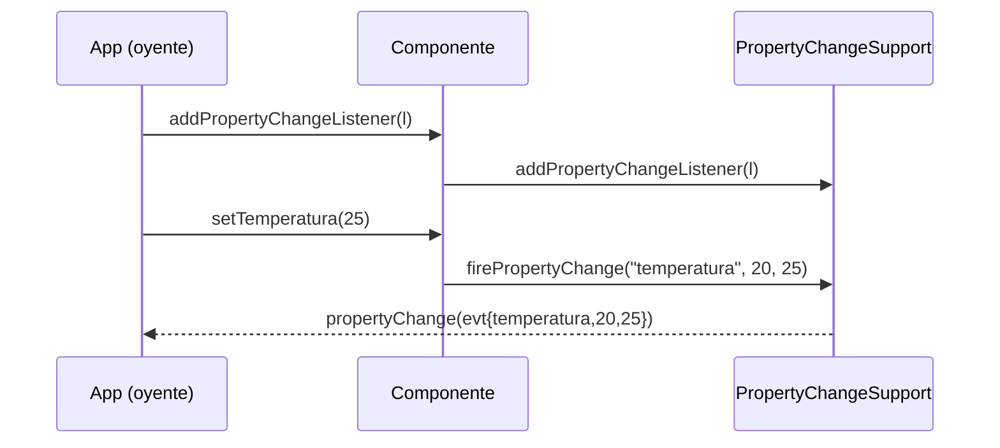
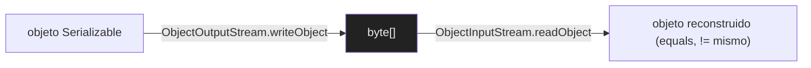
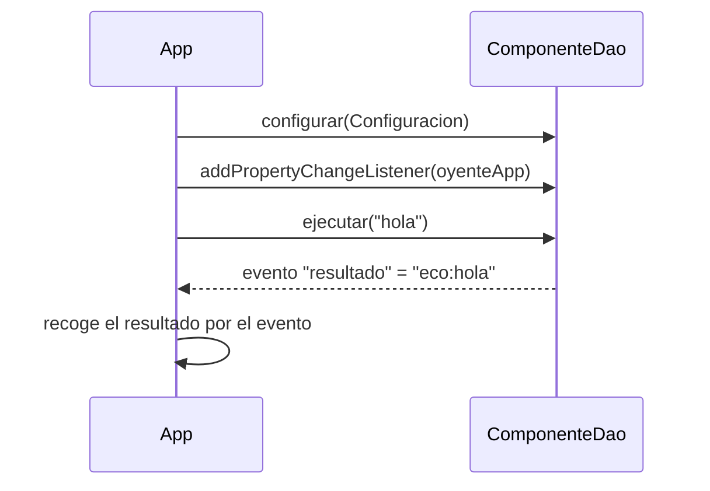

# Bloque 46 · Componentes de acceso a datos · el modelo JavaBean (Acceso a Datos · 0486 · RA6)

> Vienes de saber **acceder a datos** de mil formas: JDBC (b11), JPA/Hibernate (b12–b15), ficheros
> (b16/b26), bases objeto-relacionales (b31) y MongoDB (b17). Sabes *consultar*. Lo que te falta —y
> es el último RA de Acceso a Datos sin tocar— es **empaquetar ese saber en un COMPONENTE**: una
> pieza que otra persona enchufa en su programa sin leer tu código, que **se autodescribe**, **avisa
> cuando cambia**, **se guarda y se restaura** y **se entrega como un JAR**. Esa es la diferencia
> entre "tengo una clase que lee la base de datos" y "entrego un componente que cualquiera integra y
> escucha". El molde con el que Java lleva haciendo eso desde 1997 se llama **JavaBean**.

---

## Cómo usar este documento

- **Lee UNA sección → haz SU ejercicio → vuelve.** Cada sección `N` se corresponde con un único
  ejercicio (`Ej35N…`). No leas las seis de golpe: el bloque es una escalera (propiedad → evento →
  serialización → componente completo → empaquetado → integración) y cada peldaño usa el anterior.
- **Los tests son la especificación real.** Donde la teoría diga "devuelve la página", el test fija
  el caso límite exacto (página negativa, lista vacía, valor que no cambia…). Si dudas de qué debe
  hacer un método, **abre su test**: ahí está la verdad.
- **La teoría va MÁS ALLÁ del ejercicio.** Las tablas enumeran opciones que los ejercicios no usan
  (todos los atributos de un `Manifest`, todos los tipos de propiedad de un bean…) para que puedas
  resolver un caso nuevo por tu cuenta. Las filas "*(consulta)*" son eso: más de lo que pide el test.
- **Nota de testing:** todo en este bloque es **lógica pura del JDK** y se prueba con JUnit normal.
  No hay base de datos: el componente DAO se prueba contra un *store* en memoria **inyectado** (un
  `Map` que tú le pasas). El único test que cruza hilos (notificación entre hilos, 2.9) usa un
  `CountDownLatch` con *timeout*, nunca `Thread.sleep` a ciegas.

---

## Antes de empezar (trampas de entorno que bloquean al novato)

1. **`java.beans` SÍ está en el JDK… pero en su propio módulo.** Las clases `Introspector`,
   `PropertyChangeSupport`, `PropertyDescriptor` viven en el módulo `java.desktop` (el de Swing/AWT).
   En un proyecto Maven normal (sin `module-info`) las tienes sin hacer nada. Si algún día
   modularizas (b39), tendrás que `requires java.desktop;`. Lo verás en el reto 5.10.
2. **La reflexión "ve" más de lo que crees.** `clase.getMethods()` devuelve también los métodos
   **heredados** (incluido `getClass()` de `Object`). Por eso al descubrir propiedades hay que
   filtrar `getClass` a mano y exigir que exista el *setter* emparejado.
3. **La serialización Java es estricta con el `serialVersionUID`.** Si serializas con una versión de
   la clase y deserializas con otra cuyo UID no coincide, salta `InvalidClassException`. Declarar el
   UID a mano (lo hace `ConfiguracionComponente`) te da el control; no declararlo deja que el JDK
   calcule uno "frágil" que cambia con cualquier retoque.
4. **Un `transient` vuelve a su valor por defecto, no se "queda como estaba".** Tras deserializar, un
   `String transient` es `null`, un `int transient` es `0`. No es un bug: es lo que pediste al
   marcarlo `transient`. El componente debe **reconectar** ese campo (2.x y 3.10).

---

## Índice del bloque

| Sección | Tema | Ejercicio |
|---|---|---|
| 1 | Propiedades de un JavaBean e introspección | `Ej351BeanProperties` |
| 2 | Eventos: `PropertyChangeSupport` (*bound*) y *veto* (*constrained*) | `Ej352PropertyChangeEvents` |
| 3 | Persistencia: serialización, `transient`, `serialVersionUID` | `Ej353ComponentSerialization` |
| 4 | El componente DAO completo (propiedades + eventos + CRUD) | `Ej354DataAccessComponent` |
| 5 | Empaquetado: JAR, `Manifest`, SemVer y SPI | `Ej355ComponentPackaging` |
| 6 | Integración del componente en una aplicación | `Ej356ComponentIntegration` |

> **Modelo mental del bloque (grábalo):** *Un componente es una clase que **se autodescribe**
> (propiedades, §1), **avisa de sus cambios** (eventos, §2), **se guarda y se restaura**
> (serialización, §3), **encapsula su acceso a datos** (el DAO completo, §4) y **se entrega
> empaquetada** (JAR + manifiesto, §5) para que otro la **enchufe** (integración, §6).*



---

## 1. Propiedades de un JavaBean e introspección

Un **JavaBean** es una clase que cumple una convención para ser manipulable *sin conocer su código*:

1. **Constructor público sin argumentos** (para que una herramienta pueda crear instancias).
2. **Propiedades** expuestas como pares de métodos: getter `getX()` (o `isX()` si la propiedad es
   `boolean`) y, si es de lectura/escritura, setter `setX(valor)`.
3. Normalmente **`Serializable`** (lo veremos en §3).

Una **propiedad** no es un campo: es lo que los *métodos* dicen que es. Si tienes `getNombre()` y
`setNombre(...)`, existe la propiedad `nombre`, **aunque internamente el campo se llame `nom`**. Esa
indirección es la clave: la herramienta (Jackson, Spring, un editor visual) habla con los métodos,
no con los campos. Descubrir esas propiedades en tiempo de ejecución se llama **introspección**.

### 1.1 Cómo se deriva el nombre de una propiedad



Reglas de nombrado (de getter → propiedad):

| Getter | Tipo | Propiedad | Nota |
|---|---|---|---|
| `getNombre()` | cualquiera | `nombre` | quita `get`, baja la primera letra |
| `isActivo()` | `boolean` | `activo` | los booleanos usan `is`, no `get` |
| `getURL()` | — | `URL` | *(consulta)* si las 2 primeras van en mayúscula, NO se baja (regla de `Introspector`) |
| `getClass()` | — | — | se descarta: lo hereda de `Object`, no es una propiedad de tu bean |

> **Trampa del corte de prefijo:** `"is"` son **2** letras y `"get"` son **3**. Si cortas mal,
> sacas la letra equivocada (`isActivo` → "sActivo" en vez de "activo"). El test 1 lo comprueba.

### 1.2 Dos formas de introspeccionar: a mano vs. `Introspector`

Hay dos caminos, y el ejercicio te hace recorrer ambos para que veas la diferencia:

- **A mano con reflexión** (`propiedadesDe`): recorres `getMethods()`, filtras getters, exiges
  *setter* emparejado. Resultado: solo las propiedades de **lectura/escritura**.
- **Con la API oficial** `java.beans.Introspector` (reto 1.10): el JDK ya trae el motor que usaban
  los editores de Swing. `Introspector.getBeanInfo(clase).getPropertyDescriptors()` te da un
  `PropertyDescriptor` por propiedad, **incluidas las de solo lectura** y una pseudo-propiedad
  `class` (de `getClass()`) que debes descartar.

| Método | Solo lectura/escritura | Incluye read-only | Incluye `class` |
|---|---|---|---|
| `propiedadesDe` (tu core, reflexión + setter) | ✅ | ❌ | ❌ |
| `Introspector` (reto 1.10) | ✅ | ✅ | ⚠️ hay que quitarla |

```java
// Leer una propiedad por su nombre, tolerando getX e isX:
String cap = Character.toUpperCase(nombre.charAt(0)) + nombre.substring(1);
Method getter;
try { getter = bean.getClass().getMethod("get" + cap); }
catch (NoSuchMethodException e) { getter = bean.getClass().getMethod("is" + cap); }
Object valor = getter.invoke(bean);
```

> **Reglas grabadas de §1:** (a) una propiedad la definen los MÉTODOS, no el campo; (b) `boolean`
> usa `is`; (c) `getMethods()` trae las heredadas (por eso `EmpleadoBean` ve `nombre`); (d)
> solo-lectura = hay getter pero no setter.

> **Lo practicas en `Ej351BeanProperties`**: los cores `propiedadesDe` (descubrir por reflexión) y
> `leerPropiedad` (invocar el getter); los retos recorren nombre↔getter, validación de getter,
> propiedad de solo lectura, tipo de propiedad, copia entre beans, herencia y el `Introspector`.

---

## 2. Eventos del componente: propiedades *bound* y *constrained*

Un componente no se limita a dejarse leer: **avisa cuando su estado cambia**, para que quien lo usa
reaccione sin sondearlo en bucle. El JDK trae la maquinaria hecha en **`PropertyChangeSupport`**
(PCS): registra oyentes (`PropertyChangeListener`) y, cuando una propiedad cambia, les entrega un
**`PropertyChangeEvent`** con tres datos: `(nombrePropiedad, valorViejo, valorNuevo)`.



### 2.1 *Bound* vs *constrained* vs propiedad simple

| Tipo de propiedad | Maquinaria | Qué permite | Cuándo |
|---|---|---|---|
| **simple** | ninguna | leer/escribir | la mayoría |
| **bound** | `PropertyChangeSupport` | **avisar** del cambio (después) | UI que se refresca, logs, caché que se invalida |
| **constrained** | `VetoableChangeSupport` | **vetar** el cambio (antes) lanzando `PropertyVetoException` | validación previa: rechazar un valor inadmisible |

La diferencia clave de tiempo: una propiedad **bound** notifica *después* de cambiar (ya es tarde
para impedirlo); una **constrained** consulta a sus oyentes *antes*, y cualquiera puede abortar el
cambio lanzando `PropertyVetoException`. Vetar es validación; notificar es reacción.

### 2.2 La regla de oro de PCS: "no dispara si no cambia"

`firePropertyChange("p", viejo, nuevo)` **no hace nada si `viejo.equals(nuevo)`**. Es un mini-filtro
de ruido gratis: si pones la temperatura a 20 y ya valía 20, nadie se entera. Esto da pie a dos
patrones del ejercicio:

- **debounce por igualdad** (reto 2.8): disparar una secuencia con duplicados consecutivos y contar
  cuántas notificaciones reales salen (`[1,1,2,2,3]` → 3 cambios).
- **fire manual** (reto 2.1): cuando SÍ quieres notificar aunque no cambie (forzar un refresco),
  pasas un `PropertyChangeEvent` ya construido: `pcs.firePropertyChange(new PropertyChangeEvent(...))`.

```java
PropertyChangeSupport pcs = new PropertyChangeSupport("fuente");
List<String> recibido = new ArrayList<>();
pcs.addPropertyChangeListener(e ->
    recibido.add(e.getPropertyName() + ":" + e.getOldValue() + "->" + e.getNewValue()));
pcs.firePropertyChange("temperatura", 20, 25); // recibido = [temperatura:20->25]
pcs.firePropertyChange("temperatura", 20, 20); // NO dispara (no cambia)
```

### 2.3 Catálogo de operaciones de PCS (más de lo que usa el ejercicio)

| Operación | Para qué | ¿En el ejercicio? |
|---|---|---|
| `addPropertyChangeListener(l)` | escuchar TODO | sí (core) |
| `addPropertyChangeListener("p", l)` | escuchar SOLO la propiedad `p` | reto 2.5 |
| `removePropertyChangeListener(l)` | dejar de escuchar (evita fugas) | reto 2.6 |
| `firePropertyChange(p, v, n)` | notificar cambio simple | sí (core) |
| `fireIndexedPropertyChange(p, i, v, n)` | notificar cambio del elemento `i` de una colección | reto 2.7 |
| `firePropertyChange(evento)` | disparar un evento ya hecho (forzar) | reto 2.1 |
| `getPropertyChangeListeners()` | *(consulta)* listar oyentes | — |
| `hasListeners("p")` | *(consulta)* ¿alguien escucha `p`? | — |

> **Trampa de `removePropertyChangeListener`:** solo puedes quitar la **misma referencia** que
> registraste. Una lambda nueva, aunque tenga el mismo cuerpo, es **otro objeto**: no se quita. Por
> eso el reto 2.6 te obliga a guardar el listener en una variable. Lo mismo causa la **fuga de
> memoria** clásica: si nunca quitas el oyente, el componente lo retiene vivo para siempre.

### 2.4 Cruzar hilos con seguridad

Un evento puede dispararse desde **otro hilo** (una carga en segundo plano). Para que el hilo
principal "vea" el valor sin condiciones de carrera, el reto 2.9 usa estructuras seguras
(`AtomicReference`) y un **`CountDownLatch`** que avisa *exactamente* cuándo llegó el evento:

```java
CountDownLatch latch = new CountDownLatch(1);
AtomicReference<Integer> ref = new AtomicReference<>();
pcs.addPropertyChangeListener(e -> { ref.set((Integer) e.getNewValue()); latch.countDown(); });
new Thread(() -> pcs.firePropertyChange("v", 0, 42)).start();
latch.await(2, TimeUnit.SECONDS);   // NUNCA Thread.sleep "a ojo"
return ref.get();                   // 42
```

> **Lo practicas en `Ej352PropertyChangeEvents`**: cores `notificarCambio` (la regla "no dispara si
> no cambia") y `contarNotificaciones`; retos de fire manual, varios oyentes, orden, veto
> (*constrained*), escucha por propiedad, quitar oyente, evento indexado, debounce, notificación
> entre hilos (b27) y "recordar el último valor" (semilla del binding de JavaFX, b33).

---

## 3. Persistencia del componente: serialización, `transient` y versionado

Un componente debe poder **guardar su estado y restaurarlo**. La **serialización Java** convierte un
objeto que implemente `Serializable` en una secuencia de bytes (`ObjectOutputStream`) y lo
reconstruye (`ObjectInputStream`). A ese ida-y-vuelta lo llamamos **round-trip**.



```java
// serializar
var baos = new ByteArrayOutputStream();
try (var oos = new ObjectOutputStream(baos)) { oos.writeObject(componente); } // el try hace flush+close
byte[] datos = baos.toByteArray();
// deserializar
try (var ois = new ObjectInputStream(new ByteArrayInputStream(datos))) { return ois.readObject(); }
```

### 3.1 `transient`: lo que NO se guarda

Un campo `transient` se **excluye** del volcado. Tras deserializar vuelve a su valor por defecto
(`null`, `0`, `false`). Esto es deseable para:

| Campo típico `transient` | Por qué no se serializa |
|---|---|
| `password` / secretos | un volcado en disco no debe llevar credenciales en claro (b30) |
| `Connection` JDBC | una conexión viva no se puede "congelar"; se **reabre** al restaurar (b11) |
| cachés, *loggers* | son recalculables; ocupan y ensucian |

Por eso `ConfiguracionComponente` marca `password` como `transient`: tras el round-trip, `url` y
`usuario` vuelven, pero `password` es `null`, y el componente debe **reconectar** (reto 3.10).

### 3.2 `serialVersionUID`: el control de versiones del formato

Es un `static final long` que identifica la versión de la clase serializable. Al deserializar, Java
compara el UID de los bytes con el de la clase actual; si **no coinciden**, lanza
`InvalidClassException`. Declararlo a mano te da el control de cuándo "rompes" la compatibilidad.

| Situación | UID declarado a mano | UID automático (sin declarar) |
|---|---|---|
| Añades un campo nuevo | sigue siendo compatible (campo nuevo = default) | el JDK recalcula → **rompe** |
| Renombras la clase | tú decides | rompe |
| Recomendación | **decláralo siempre** en clases serializables | evítalo |

### 3.3 Variantes de serialización (panorama, más allá del ejercicio)

| Mecanismo | Control | Cuándo | ¿Ejercicio? |
|---|---|---|---|
| `Serializable` por defecto | automático | lo normal | sí (core) |
| `transient` + reconstruir en `readObject()` | parcial | excluir y recalcular campos | idea de 3.10 |
| `Externalizable` | total (escribes tú cada campo) | formato muy controlado | *(consulta)* |
| GZIP sobre los bytes | compresión | volcados grandes | reto 3.6/3.7 |
| JSON (Jackson, b02) | interoperable | hablar con no-Java | *(consulta)* |

> **Trampa de GZIP:** `GZIPOutputStream` escribe un *footer* al **cerrarse**. Si llamas a
> `toByteArray()` antes de cerrar el gzip, los bytes están incompletos y la descompresión falla.
> Cierra el `GZIPOutputStream` (o sal del try-with-resources) **antes** de leer el buffer.

> **Round-trip = copia profunda.** Serializar y deserializar produce un objeto **nuevo** e
> independiente (`clon != original` pero `clon.equals(original)`): copia todo el grafo, no la
> referencia. Es el truco de *deep copy* del reto 3.9.

> **Lo practicas en `Ej353ComponentSerialization`**: cores `serializar`/`deserializar`; retos de
> ¿serializable?, tamaño, password transient (b30), round-trip, leer el UID, GZIP, fichero (b26),
> clon profundo y reconexión del transient (≈ conexión JDBC, b11).

---

## 4. El componente DAO completo (núcleo del bloque)

Aquí se juntan §1, §2 y §3 en **un componente entregable**: un DAO de clientes escrito como JavaBean.

```mermaid
classDiagram
    class Ej354DataAccessComponent {
        -String url
        -String usuario
        -int tamanoPagina
        -Map store
        -PropertyChangeSupport eventos
        +buscar(pagina) List~Cliente~
        +guardar(c) Cliente
        +borrar(id) boolean
        +addPropertyChangeListener(l)
    }
    Ej354DataAccessComponent --> Cliente : gestiona
    Ej354DataAccessComponent ..> "cargaCompletada / error" : dispara eventos
```

Tiene las tres patas del componente:

- **Propiedades** (§1): `url`, `usuario`, `tamanoPagina` con sus getters/setters. `setTamanoPagina`
  valida (>0): un componente serio no se deja configurar con basura.
- **Eventos** (§2): dispara `"cargaCompletada"` tras buscar/guardar y `"error"` cuando una búsqueda
  por id falla. Quien lo usa se entera por el oyente, sin preguntar.
- **CRUD** contra un **store inyectable**: el `Map<Integer,Cliente>` entra por el constructor. Eso
  permite probar el componente con datos *fake*, **sin base de datos real**. Es el principio de
  inversión de dependencias: el componente no crea su almacén, lo recibe.

### 4.1 Paginación, igual que en una API

`buscar(pagina)` ordena por id y devuelve una "página": `skip(pagina * tamanoPagina).limit(tamanoPagina)`.
Es **exactamente** la paginación de una API REST (`?page=&size=`) y el `Pageable` de Spring Data
(b15): la misma idea de "saltar N y coger M".

```java
List<Cliente> ordenados = store.values().stream().sorted(Comparator.comparingInt(Cliente::id)).toList();
List<Cliente> pagina = ordenados.stream().skip(p * tamanoPagina).limit(tamanoPagina).toList();
eventos.firePropertyChange("cargaCompletada", null, pagina.size());
```

### 4.2 Los CINCO sabores del CE de AD·RA6

El BOE pide que el componente pueda apoyarse en distintos almacenes. **El contrato no cambia; solo
cambia lo de debajo.** Los retos modelan cada uno (sin arrastrar el driver, que ya se practicó):

| "Sabor" del componente | Almacén | Bloque donde se practicó | Reto 4.x |
|---|---|---|---|
| sobre **fichero** | CSV/objetos en disco | b16 / b26 | (serialización §3) |
| sobre **conector** (JDBC) | SQL (H2/PostgreSQL) | b11 | 4.3 `ddlCrearTabla` |
| sobre **ORM** | JPA/Hibernate | b12–b15 | 4.4 `anotacionesJpa` |
| sobre **OO/OR** | base objeto-relacional | b31 | *(panorama)* |
| sobre **documental** | MongoDB (`_id`) | b17 | 4.5 `documentoMongo` |

> **Excepción consciente a "todo static".** Todo el resto del masterclass usa clases `final` con
> métodos `static`. Aquí **no**: un componente es, por definición, un **objeto con estado** que
> alguien instancia, configura y al que se suscribe. Por eso `Ej354DataAccessComponent` (y los beans
> de apoyo de §1 y §3) son JavaBeans instanciables, con constructor público y métodos de instancia.
> La lógica sigue siendo pura y testeable: store fake, sin red.

> **Lo practicas en `Ej354DataAccessComponent`**: cores `buscar`/`guardar`/`borrar` (con sus
> eventos); retos de contar, health check (b10), los tres sabores SQL/ORM/Mongo, alta en lote, error
> por evento, configuración externa (b04), ciclo de conexión y resumen del componente.

---

## 5. Empaquetado: JAR, `Manifest`, versionado y SPI

Un componente se **entrega** como un **JAR**: un ZIP con tus `.class`, recursos y un fichero
especial **`META-INF/MANIFEST.MF`** que lo describe (nombre, versión, fabricante…). El JAR lo
construye Maven; lo que aquí se trabaja —y es testeable— es su pieza de metadatos: el
`java.util.jar.Manifest`.

### 5.1 Atributos del manifiesto (catálogo, más de lo que usa el ejercicio)

| Atributo | `Attributes.Name` | Significado | ¿Ejercicio? |
|---|---|---|---|
| `Manifest-Version` | `MANIFEST_VERSION` | versión del formato de manifiesto (siempre `1.0`) | base |
| `Implementation-Title` | `IMPLEMENTATION_TITLE` | nombre del componente | core (`nombre`) |
| `Implementation-Version` | `IMPLEMENTATION_VERSION` | versión de TU componente (SemVer) | core (`version`) |
| `Implementation-Vendor` | `IMPLEMENTATION_VENDOR` | quién lo publica | core (`vendor`) |
| `Main-Class` | `MAIN_CLASS` | *(consulta)* clase con `main` (JAR ejecutable) | — |
| `Class-Path` | `CLASS_PATH` | *(consulta)* dependencias relativas | — |
| `Automatic-Module-Name` | *(literal, sin constante)* | nombre de módulo JPMS para un JAR clásico | reto 5.3 |

> **Trampa:** `Automatic-Module-Name` **no tiene** constante en `Attributes.Name`. Se lee/escribe
> por su nombre como String: `attrs.getValue("Automatic-Module-Name")`.

### 5.2 Versionado semántico (SemVer): `MAJOR.MINOR.PATCH`

Una versión seria tiene tres números con un significado pactado:


| Cambias… | Subes… | ¿Rompe a quien lo usa? |
|---|---|---|
| API incompatible (quitas/renombras un método) | **MAJOR**, reseteas minor/patch a 0 | sí |
| funcionalidad nueva compatible | **MINOR**, reseteas patch a 0 | no |
| corrección interna | **PATCH** | no |

Dos consecuencias que el ejercicio comprueba:

- **Comparar versiones como NÚMEROS, no como texto:** `"1.10.0"` es mayor que `"1.2.0"` (10 > 2),
  pero como cadena `"2" > "10"`. Hay que partir por `.` y comparar `int`. (reto 5.5)
- **Compatibilidad binaria = mismo MAJOR:** de `2.1` a `2.8` no tocas tu código; de `2.x` a `3.0`
  probablemente sí. El MAJOR es el contrato. (reto 5.9)

### 5.3 SPI: descubrir implementaciones sin nombrarlas

El **Service Provider Interface** permite que un JAR declare qué implementaciones de una interfaz
aporta, en un fichero de texto:

```
META-INF/services/<nombre.completo.de.la.Interfaz>
   └── (dentro) una línea por clase de implementación
```

`java.util.ServiceLoader.load(Interfaz.class)` lee ese fichero, instancia las clases (necesitan
**constructor sin argumentos**) y te las entrega. Así carga Java los **drivers JDBC** (b11) o los
proveedores de *logging*: **enchufar** una implementación = añadir un JAR con su fichero de servicio,
sin tocar el código que la usa. Lo practicas de verdad en §6 (reto 6.8), aquí construyes su ruta y
contenido (retos 5.6/5.7).

> **Lo practicas en `Ej355ComponentPackaging`**: cores `leerMetadatos`/`validarManifiesto`; retos de
> versión, vendor por defecto, módulo automático, SemVer (validar/comparar/incrementar/compatibilidad)
> y SPI, más generar las líneas `requires` de un `module-info` (b39).

---

## 6. Integración del componente en una aplicación

El último peldaño: una **app recibe el componente y lo usa**, conociendo solo su **interfaz**
(`ComponenteDao`), nunca su clase concreta. Eso es programar contra abstracciones: mañana cambias el
`ComponenteEco` por uno sobre JDBC y la app **no se entera**.



### 6.1 Las cinco formas de "enchufar" un componente

| Técnica | Idea | Bloque | Reto 6.x |
|---|---|---|---|
| **Inyección por constructor** | la dependencia entra al crear el objeto (IoC) | b03 | 6.1 |
| **Factoría** | un método decide la implementación por un nombre | — | 6.2 |
| **Configuración externalizada** | la config viene de un `.properties`, no del código | b04 | 6.3 |
| **Descubrimiento por SPI** | `ServiceLoader` encuentra las implementaciones declaradas | b11 | 6.8 |
| **Mock** | sustituir el componente por un doble de prueba | b19 | 6.6 |

`integrar(comp, cfg)` aplica la configuración y suscribe a la app; `usar(comp, peticion)` ejecuta y
**recoge el resultado por el evento** (no por el `return`), demostrando el flujo dirigido por
eventos. El reto 6.10 (`integrarTodo`) encadena configurar → integrar → usar → recoger: el ciclo de
vida completo, que conecta con el Boss Final (b24).

> **Trampa del mock (reto 6.6):** `ComponenteDao` es una **interfaz**, así que un mock es solo una
> implementación a medida (clase anónima o lambda) que devuelve algo fijo. NO uses `ComponenteEco`
> ahí (daría `"eco:x"` en vez de `"mock:x"`). Eso es, en pequeño, lo que hace Mockito (b19).

> **Lo practicas en `Ej356ComponentIntegration`**: cores `integrar`/`usar`; retos de inyección por
> constructor (b03), factoría, config desde `Properties` (b04), coordinar varios componentes, ciclo
> de vida, mock (b19), propagar error por evento, `ServiceLoader` (b11) e integración extremo a
> extremo (b24).

---

## Errores comunes del bloque

| # | Error | Antídoto |
|---|---|---|
| 1 | Cortar mal el prefijo del getter (`is`=2, `get`=3) y sacar la letra equivocada | usa `m.startsWith("is") ? substring(2) : substring(3)` antes de bajar la 1ª letra |
| 2 | Contar `getClass()` como propiedad | descártalo a mano; exige *setter* emparejado |
| 3 | Buscar el getter de un `boolean` con `get` en vez de `is` | prueba `get`+Cap y, si no existe, `is`+Cap |
| 4 | Esperar que `firePropertyChange` dispare cuando `viejo.equals(nuevo)` | no dispara: usa un `PropertyChangeEvent` ya hecho para forzar |
| 5 | No poder quitar un oyente (fuga de memoria) | guarda la MISMA referencia que registraste; las lambdas nuevas no se quitan |
| 6 | Serializar la conexión/el secreto | márcalos `transient` y reconéctalos al restaurar |
| 7 | Olvidar `serialVersionUID` y romper la compatibilidad al retocar la clase | declára­lo `static final long` explícito |
| 8 | Leer `toByteArray()` antes de cerrar el `GZIPOutputStream` | cierra el gzip (sal del try) antes de tomar los bytes |
| 9 | Comparar versiones como texto (`"2">"10"`) | parte por `.` y compara `int` componente a componente |
| 10 | Buscar `Automatic-Module-Name` con una constante de `Attributes.Name` | léelo por String: `getValue("Automatic-Module-Name")` |
| 11 | Crear el componente con `new` dentro de la app (acoplamiento) | inyéctalo (constructor/factoría/`ServiceLoader`); programa contra la interfaz |
| 12 | Que el `ServiceLoader` no encuentre nada | el fichero `META-INF/services/<Interfaz>` debe existir y la impl tener ctor sin args |

---

## Chuleta final del bloque

```text
JavaBean          = ctor público sin args + getX/setX (isX para boolean) + Serializable
propiedad         = la definen los MÉTODOS, no el campo
introspección     = propiedadesDe (reflexión, solo R/W) | Introspector (oficial, incluye read-only + 'class')
getMethods()      = trae también las heredadas (EmpleadoBean ve 'nombre')
bound             = PropertyChangeSupport.firePropertyChange(p, viejo, nuevo)  // NO dispara si no cambia
constrained       = VetoableChangeSupport.fireVetoableChange -> PropertyVetoException veta el cambio
evento            = (nombrePropiedad, valorViejo, valorNuevo); por propiedad: addPCL("p", l)
quitar oyente     = misma referencia (variable), o fuga de memoria
serializar        = ObjectOutputStream.writeObject -> byte[]   (try-with-resources hace flush)
deserializar      = ObjectInputStream.readObject  -> Object (cast)
transient         = NO se serializa (secretos, Connection); vuelve a null/0 -> reconectar
serialVersionUID  = static final long; versiona el formato; decláralo siempre
round-trip        = deep copy (clon != original, clon.equals(original))
GZIP              = cierra el stream ANTES de toByteArray()
componente DAO    = propiedades + eventos + CRUD contra store INYECTABLE (fake, sin BD)
paginación        = skip(pagina*size).limit(size)  == ?page=&size=  == Pageable (b15)
Manifest          = Implementation-Title/Version/Vendor; Automatic-Module-Name por String
SemVer            = MAJOR.MINOR.PATCH; compara por int; compatible = mismo MAJOR
SPI               = META-INF/services/<Interfaz> -> ServiceLoader.load(Interfaz.class) (ctor sin args)
integrar          = configurar + suscribir; usar = ejecutar y recoger por EVENTO
enchufar          = inyección (b03) | factoría | Properties (b04) | ServiceLoader (b11) | mock (b19)
```

---

## Autoevaluación (responde sin mirar; si fallas 2+, relee la sección)

1. ¿Qué tres cosas necesita una clase para ser un JavaBean, y por qué el constructor sin argumentos
   es imprescindible? *(1)*
2. ¿Por qué `getMethods()` te obliga a descartar `getClass()` y a exigir el *setter* emparejado para
   contar una propiedad? *(1.1)*
3. ¿En qué se diferencia el resultado de tu `propiedadesDe` del de `Introspector`? *(1.2)*
4. Diferencia entre propiedad *bound* y *constrained*: ¿cuál puede ABORTAR el cambio y con qué
   excepción? *(2.1)*
5. ¿Qué hace `firePropertyChange` cuando el valor viejo es igual al nuevo, y cómo fuerzas la
   notificación de todos modos? *(2.2)*
6. ¿Por qué no puedes quitar un oyente pasando una lambda "igual" a la que registraste? *(2.3)*
7. ¿Qué le pasa a un campo `transient` tras un round-trip y qué debe hacer el componente con él?
   *(3.1)*
8. ¿Para qué sirve declarar `serialVersionUID` a mano y qué pasa si no coincide al deserializar?
   *(3.2)*
9. ¿Por qué un round-trip de serialización produce una copia PROFUNDA? *(3.3)*
10. En el componente DAO, ¿qué significa que el *store* sea "inyectable" y qué ventaja da para los
    tests? *(4)*
11. ¿Cómo se traduce `buscar(pagina)` a `skip`/`limit` y con qué concepto de b15 coincide? *(4.1)*
12. ¿Por qué hay que comparar versiones SemVer como enteros y no como texto? *(5.2)*
13. ¿Qué es "compatibilidad binaria" en SemVer y con qué número se relaciona? *(5.2)*
14. ¿Qué fichero necesita el `ServiceLoader` y qué requisito tiene la clase de implementación? *(5.3)*
15. Nombra tres formas de "enchufar" un componente en una app y di de qué bloque viene cada una. *(6.1)*
