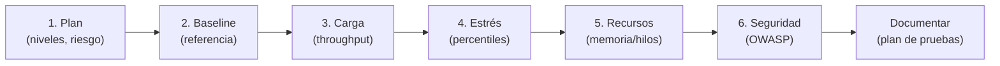
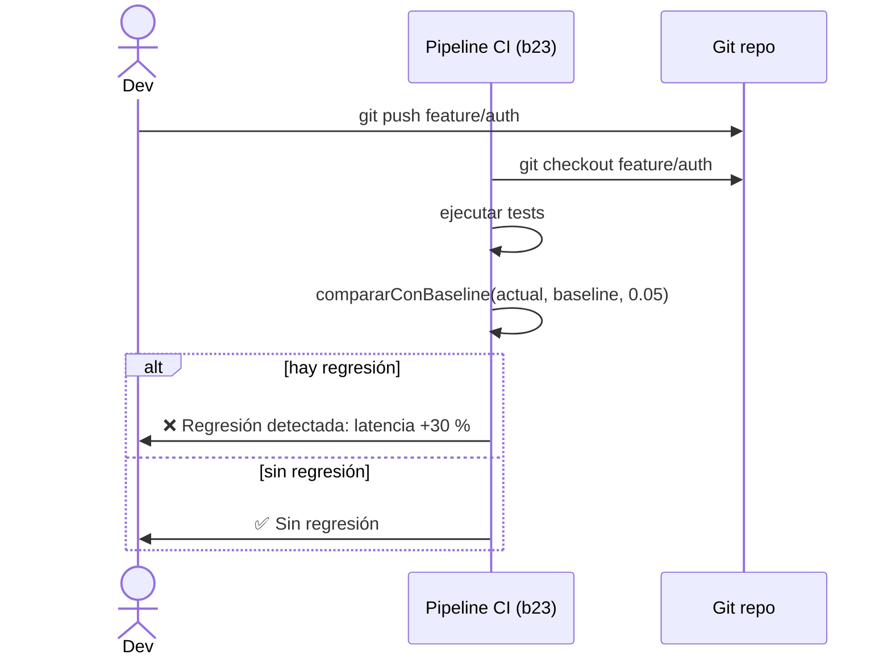

# Bloque XLVII · Estrategia de pruebas (0488 DI·RA8)

> **Vienes de b19**, donde aprendiste a *escribir* tests (JUnit5, Mockito, MockMvc,
> Testcontainers). Aquí subes un nivel: ya no importa solo *cómo* se escribe un test,
> sino **qué probar, en qué orden, cuánto es suficiente y cuándo parar**. Eso es una
> estrategia de pruebas — el artefacto que entrega el RA8 del BOE 2023 para DI.

---

## Cómo usar este documento

- Lee **una sección → haz SU ejercicio → vuelve**. No saltes adelante: cada ejercicio
  usa conceptos de los anteriores.
- Los **tests son la especificación real**. Si algo no está claro aquí, el test aclara
  la frontera exacta.
- Esta teoría va **más allá** de los ejercicios. Las tablas y secciones que dicen
  "consulta" enseñan conceptos que los retos no practican directamente pero que un
  profesional usa en su día a día.
- **No necesitas red ni proceso externo**: todos los ejercicios simulan la carga/recursos
  en memoria. El único reto que requiere un `ExecutorService` real lo gestiona con
  `awaitTermination` y `@Timeout`.

---

## Antes de empezar

Este bloque **no necesita dependencias especiales** más allá de JUnit 5 (aportado por
el parent). Las únicas clases externas al JDK que usamos son `ThreadMXBean` (en
`java.lang.management`) y `Runtime` (en `java.lang`), ambas en el JDK estándar.

Si en algún momento quieres probar JMH (reto 7 de Ej359), necesitas:
```xml
<dependency>
  <groupId>org.openjdk.jmh</groupId>
  <artifactId>jmh-core</artifactId>
  <version>1.37</version>
</dependency>
```
Pero para los tests del bloque **no es necesario**.

---

## Tabla índice

| Sección | Tema | Ejercicio |
|---|---|---|
| 1.1 | Plan de pruebas: niveles, pirámide, criterio de salida | Ej357 |
| 1.2 | Regresión: línea base y golden master | Ej358 |
| 1.3 | Volumen/carga: throughput y generación de carga | Ej359 |
| 1.4 | Estrés: percentiles de latencia y punto de saturación | Ej360 |
| 1.5 | Uso de recursos: memoria, CPU, hilos y fugas | Ej361 |
| 1.6 | Seguridad: checklist OWASP y smoke automatizado | Ej362 |

### Modelo mental del bloque

> **Una prueba dice si algo funciona HOY.**
> **Una estrategia dice QUÉ probar, CUÁNTO es suficiente y CUÁNDO parar.**

```
┌─────────────────────────────────────────────────────────────────┐
│              ESTRATEGIA DE PRUEBAS (b47)                        │
│                                                                  │
│  1. PLAN ─── qué tipos, cuántos casos, criterio de salida       │
│       │                                                          │
│  2. BASELINE ─── línea de referencia para detectar regresión    │
│       │                                                          │
│  3. CARGA ─── throughput, ramp-up, volumen de datos             │
│       │                                                          │
│  4. ESTRÉS ─── percentiles, saturación, tail latency            │
│       │                                                          │
│  5. RECURSOS ─── memoria, hilos, GC, descriptores               │
│       │                                                          │
│  6. SEGURIDAD ─── checklist OWASP + smoke automatizado          │
└─────────────────────────────────────────────────────────────────┘
```



---

## 1.1 Plan de pruebas: niveles, pirámide, cobertura y criterio de salida

### ¿Qué es un plan de pruebas?

Un **plan de pruebas** es el documento que responde a estas preguntas antes de
ejecutar una sola prueba:

- ¿Qué **tipos** de prueba se van a ejecutar? (unitarias, integración, sistema, aceptación)
- ¿Cuántos **casos** por nivel?
- ¿Cuál es el **criterio de salida**? (¿cuándo se considera que el módulo está probado?)
- ¿Qué **riesgo** tiene cada módulo?

Sin un plan, el equipo prueba lo que le parece bien ese día. Con un plan, el equipo
sabe *cuándo ha terminado*.

### La pirámide de pruebas

La pirámide es la distribución recomendada de tests:

```
        /\
       /  \   ← Tests E2E / Aceptación (pocos, lentos, caros)
      /────\
     /      \ ← Tests de integración (moderados)
    /────────\
   /          \ ← Tests unitarios (muchos, rápidos, baratos)
  /────────────\
```

La razón de la forma: los tests unitarios son los más baratos de escribir y ejecutar.
Cuantos más tengas en la base, más rápida es la retroalimentación. Los tests E2E son
costosos y frágiles — pocos, pero críticos.

**Alternativa: el trofeo de pruebas** (Kent C. Dodds, popularizado en React): la capa
de integración es la más ancha, porque en aplicaciones modernas (frontend + API) los
tests de integración detectan más bugs por euro invertido que los unitarios puros.

| Estrategia | Base más ancha | Cuándo usar |
|---|---|---|
| Pirámide | Unitarios | APIs puras, lógica de negocio compleja, microservicios |
| Trofeo | Integración | Frontends, aplicaciones CRUD con poca lógica de negocio |

### Análisis de riesgo

No todos los módulos merecen el mismo nivel de pruebas. El **riesgo** combina:
- **Probabilidad de fallo**: ¿cuánto cambia el módulo? ¿qué tan complejo es?
- **Impacto del fallo**: ¿qué pasa si falla en producción? (dinero, datos, reputación)

Un módulo con riesgo 9/10 merece tests de aceptación, cobertura 90 %, tests de estrés.
Un módulo con riesgo 2/10 con tests unitarios básicos es suficiente.

### Criterio de salida

El criterio de salida define cuándo dejas de probar. Ejemplos reales:

- "0 defectos críticos abiertos Y cobertura de línea ≥ 80 %"
- "Todas las pruebas de regresión pasan Y tiempo de respuesta p95 < 200 ms"

Sin criterio de salida, el equipo prueba indefinidamente (o deja de probar sin razón).

### Matriz de trazabilidad RA → prueba

Para el BOE 2023 se requiere que cada Resultado de Aprendizaje (RA) quede trazado a
al menos un caso de prueba. La matriz tiene este formato:

| RA | Descripción | Casos de prueba | Cobertura |
|---|---|---|---|
| RA8.a | Diseña plan de pruebas | Ej357::planDePruebas | ✓ |
| RA8.b | Regresión con baseline | Ej358::compararConBaseline | ✓ |
| RA8.c | Pruebas de carga | Ej359::medirThroughput | ✓ |

> **Trampa típica:** olvidar los casos límite (módulo null, riesgo=0, lista vacía).
> El test siempre incluye al menos uno. Si tu implementación solo funciona con datos
> "bien formados", fallará.

> **Lo practicas en `Ej357TestStrategyPlan`**: `planDePruebas` (TODOs 1–8) genera el
> plan completo; `cumpleCriterioSalida` (TODOs 9–10) evalúa los resultados. Los retos
> cubren pirámide vs trofeo, análisis de riesgo, trazabilidad y test doubles.

---

## 1.2 Regresión: línea base y golden master

### ¿Qué es una regresión?

Una **regresión** es cuando algo que funcionaba deja de funcionar (o empeora).
En rendimiento: la latencia sube sin justificación. En funcionalidad: una feature
existente se rompe al añadir una nueva.

La herramienta para detectar regresiones es la **línea base** (baseline): un
conjunto de métricas medidas en un estado conocido-bueno, contra el que comparas
las métricas actuales.

### Golden master / snapshot testing

El **golden master** es el caso extremo de baseline: la *salida completa* del
sistema (p.ej., el JSON completo de una respuesta API) se guarda como referencia.
En cada ejecución, se compara byte a byte con la salida actual.

Ventajas:
- Cero esfuerzo para definir el "esperado" (lo captures una vez)
- Detecta cualquier cambio, incluso los que no se te ocurrieron

Desventajas:
- Un cambio intencional requiere aprobar el nuevo golden master
- Frágil con datos no deterministas (fechas, IDs generados, números aleatorios)

**Solución para datos no deterministas:** seed fija + normalización (reemplaza fechas
y IDs antes de comparar).

### Baseline versionada en git

```bash
# Guardar la baseline como commit
git add baseline.txt
git commit -m "baseline: v1.2"

# En el siguiente build de CI, comparar
git diff HEAD~1 baseline.txt
```

Versionar la baseline en git tiene una ventaja enorme: en el pipeline CI (b23) puedes
añadir un step que compara la baseline actual con la del commit anterior y falla si
hay regresión de rendimiento.



### Tolerancias y aprobación

No todas las métricas toleran la misma desviación. Una CPU puede variar un 20 % sin
importar; un número de errores debe ser exactamente 0.

Tabla de tolerancias típicas:

| Métrica | Tolerancia | Justificación |
|---|---|---|
| Latencia p50 | 10 % | El promedio puede variar con la carga del servidor |
| Latencia p99 | 5 % | El tail es más sensible a variaciones |
| Tasa de errores | 0 % | Cualquier error nuevo es regresión |
| Throughput | 15 % | Varía con la JVM y el GC |
| Cobertura de código | 0 % | No puede bajar |

> **Lo practicas en `Ej358RegressionBaseline`**: `compararConBaseline` (TODOs 1–10)
> detecta regresiones numéricas y textuales. `guardarBaseline` serializa el estado.
> Los retos cubren golden master, tolerancias por métrica, aprobación, diff legible,
> baseline en git y regresión de rendimiento.

---

## 1.3 Volumen/carga: medir throughput y generar carga simulada

### ¿Qué es una prueba de carga?

Una **prueba de carga** (*load test*) evalúa el comportamiento del sistema bajo
condiciones de uso esperadas en producción. Preguntas que responde:

- ¿Cuántas operaciones/segundo puede manejar el sistema? → **throughput**
- ¿Cómo aumenta la latencia a medida que crece la carga? → **curva carga/latencia**
- ¿Hay punto de saturación? → **puntoSaturacion**

### Throughput y la Ley de Little

El **throughput** (λ) es el número de operaciones completadas por unidad de tiempo.

La **Ley de Little** relaciona throughput, latencia media (W) y número de peticiones
en vuelo (N):

```
N = λ × W
```

Ejemplo: si el throughput es 100 req/seg y la latencia media es 50 ms = 0.05 seg,
entonces en cualquier momento hay **5 peticiones en vuelo** (siendo procesadas).

Si la latencia sube a 200 ms (¿por saturación?), las peticiones en vuelo suben a 20.
Eventualmente la cola se llena y el sistema empieza a rechazar peticiones → back-pressure.

### Warmup y dead-code elimination

Dos trampas clásicas en benchmarks de JVM:

**1. Warmup:** la JVM interpreta bytecode los primeros ciclos; luego el JIT lo
compila a código nativo. Los primeros 100-1000 ciclos son más lentos. Si los incluyes
en la medición, el throughput aparece artificialmente bajo.

```java
// Mal: mide incluyendo el warmup
long inicio = System.nanoTime();
for (int i = 0; i < 1000; i++) operacion();
long fin = System.nanoTime();

// Bien: descarta las primeras 100 iteraciones
for (int i = 0; i < 100; i++) operacion(); // warmup
long inicio = System.nanoTime();
for (int i = 0; i < 900; i++) operacion(); // medir
long fin = System.nanoTime();
```

**2. Dead-code elimination:** el JIT puede detectar que el resultado de una operación
no se usa y *eliminar* la operación entera. Tu benchmark mide 0 operaciones reales.

```java
// Mal: el JIT puede eliminar esta suma
for (int i = 0; i < N; i++) { int r = a + b; } // resultado descartado

// Bien: consume el resultado
int acumulador = 0;
for (int i = 0; i < N; i++) acumulador += (a + b);
System.out.println(acumulador); // fuerza al JIT a mantener la operación
```

### Tipos de prueba de carga

| Tipo | Patrón de carga | Qué busca |
|---|---|---|
| Carga sostenida | Constante al nivel esperado | ¿Funciona bajo carga normal? |
| Pico (spike) | Salto brusco a 10× | ¿Recupera el sistema? |
| Rampa (ramp-up) | Aumenta gradualmente | ¿En qué punto se satura? |
| Volumen | Datos enormes (no peticiones) | ¿Aguanta datasets masivos? |
| Soak (resistencia) | Carga moderada 24–72 h | ¿Hay fugas de memoria lentas? |

### JMH: el estándar de microbenchmarking en Java

Para benchmarks serios, usa JMH (Java Microbenchmark Harness). Pasos mínimos:

```java
@BenchmarkMode(Mode.Throughput)
@Warmup(iterations = 5, time = 1)
@Measurement(iterations = 10, time = 1)
@Fork(2)
public class MiBenchmark {

    @Benchmark
    public int operacion(MyState state) {
        return state.a + state.b; // consume el resultado
    }
}
```

JMH gestiona automáticamente el warmup, la dead-code elimination y las iteraciones de
medición. Para benchmarks ad-hoc usa `System.nanoTime()` con warmup manual (como en Ej359).

> **Lo practicas en `Ej359LoadVolumeTest`**: `medirThroughput` (TODOs 1–8) con warmup
> y protección frente a dead-code elimination; `generarCarga` (TODOs 9–10) simula un
> generador de peticiones. Los retos cubren ramp-up, back-pressure, concurrencia con
> ExecutorService, Ley de Little, JMH y steady state.

---

## 1.4 Estrés: percentiles de latencia y punto de saturación

### ¿Qué es una prueba de estrés?

Una **prueba de estrés** (*stress test*) lleva el sistema más allá de sus límites
esperados para encontrar el punto de rotura y observar cómo falla. A diferencia de
la prueba de carga (que trabaja al nivel de producción esperado), la prueba de estrés
trabaja *por encima* de ese nivel.

Pregunta clave: **¿el sistema falla de forma graceful (devuelve errores controlados)
o de forma catastrófica (se cuelga, corrompe datos)?**

### Percentiles de latencia: p50, p95, p99

La latencia de una API no es un número; es una **distribución**. La media engaña:
si 99 peticiones tardan 10 ms y 1 tarda 10 segundos, la media es ~110 ms, pero el
comportamiento real es muy diferente.

Los percentiles describen la distribución sin engañar:

| Percentil | Significado | Para quién importa |
|---|---|---|
| p50 (mediana) | La mitad de las peticiones tarda <= esto | Rendimiento típico |
| p95 | El 95 % de las peticiones tarda <= esto | SLA estándar |
| p99 | El 99 % de las peticiones tarda <= esto | Experiencia real del usuario |
| p99.9 | El 99.9 % tarda <= esto | Sistemas financieros, trading |

**Tail latency:** el p99 y p99.9 se llaman "tail" (cola). En sistemas de alta carga,
el tail importa enormemente: si tienes 1000 req/seg, el p99 afecta a *10 peticiones
por segundo*. Si el p99 es 5 segundos, 10 usuarios por segundo están esperando 5 seg.

```
Distribución de latencias:
    ┌──────────────────────────────────────────────────────────┐
    │  ██████████████████░░░░░░░░░░░░░░░░░░░░░░░░░░░░░░░░░░░░ │
    │  ▲p50=50ms          ▲p95=120ms                ▲p99=800ms │
    └──────────────────────────────────────────────────────────┘
```

### Cálculo del percentil

Algoritmo estándar:
1. Ordena la lista de latencias de menor a mayor.
2. Índice = `ceil(p / 100.0 * n) - 1`, limitado a `[0, n-1]`.
3. Devuelve `latencias_ordenadas[índice]`.

```java
List<Long> latencias = List.of(50L, 80L, 100L, 120L, 500L);
// p95: ceil(95/100 * 5) - 1 = ceil(4.75) - 1 = 5 - 1 = 4 → latencias[4] = 500 ms
```

### Punto de saturación

El sistema está **saturado** cuando al añadir más carga la latencia deja de crecer
linealmente y se dispara exponencialmente. Visualmente:

```
Latencia
  ^
  │              ┌──── saturación: la latencia se dispara
  │         ___/ 
  │     ___/     ← crecimiento normal (lineal)
  │____/
  └─────────────────────────────────> Carga (usuarios)
```

El **codo de la curva** (punto de saturación) es donde la latencia supera el umbral
de degradación aceptable. En Ej360 el umbral es `latenciaBase * 2`.

### Coordinated omission

**Coordinated omission** es uno de los sesgos más comunes en benchmarks de latencia.
Ocurre cuando el cliente "espera" a que el servidor responda antes de enviar la
siguiente petición. En ese caso, el tiempo de espera en cola *no se mide*, y el
benchmark parece mucho mejor de lo que es.

Corrección: si el intervalo entre peticiones es de 100 ms y el servidor tardó 300 ms,
las dos peticiones que habrían llegado mientras el servidor estaba ocupado *habrían
esperado* 200 ms y 100 ms más. La latencia corregida de esas peticiones es mayor que
la medida.

```java
latenciaCorregida = Math.max(latenciaReal, intervaloEntrePeticiones);
```

> **Lo practicas en `Ej360StressLatency`**: `percentil` (TODOs 1–6) implementa el
> cálculo estándar; `puntoSaturacion` (TODOs 7–10) detecta el codo de la curva. Los
> retos cubren tail latency, coordinated omission, histograma, SLA, degradación graceful,
> load shedding, timeout, recuperación y spike test.

---

## 1.5 Uso de recursos: memoria, CPU, hilos y fugas

### ¿Por qué medir recursos en los tests?

Un test puede pasar en verde y, sin embargo, la aplicación puede estar consumiendo
recursos de forma insostenible: cada petición crea hilos que no se cierran, cada
operación deja objetos sin liberar, etc. Las **pruebas de recursos** detectan esto.

### Memoria: heap y off-heap

La JVM divide la memoria en dos grandes áreas:

```
┌───────────────────────────────────────┐
│  HEAP (gestionado por el GC)          │
│  - Objetos Java normales               │
│  - Controlado por -Xms / -Xmx         │
├───────────────────────────────────────┤
│  OFF-HEAP / Direct memory             │
│  - ByteBuffer.allocateDirect()        │
│  - Controlado por -XX:MaxDirectMemorySize│
├───────────────────────────────────────┤
│  Metaspace (clases, código JIT)       │
│  - Controlado por -XX:MaxMetaspaceSize │
├───────────────────────────────────────┤
│  Stack (por hilo, para llamadas)      │
│  - Controlado por -Xss                │
└───────────────────────────────────────┘
```

Para medir el heap en un test:
```java
Runtime rt = Runtime.getRuntime();
long antes = rt.totalMemory() - rt.freeMemory();
// ... operación ...
long despues = rt.totalMemory() - rt.freeMemory();
long delta = despues - antes; // bytes usados
```

**Trampa:** el GC puede correr entre las dos mediciones y liberar memoria, dando un
delta negativo. No es un error — trátalo como delta = 0 (la operación no consumió más
memoria de la que ya estaba libre).

### Fugas de memoria

Una **fuga de memoria** en Java es cuando objetos quedan referenciados (no pueden ser
recogidos por el GC) aunque ya no se necesitan. Las causas más comunes:

| Causa | Ejemplo | Solución |
|---|---|---|
| Colección estática sin límite | `static List<Event> log = new ArrayList<>()` | Usar colección con límite (LRU cache) |
| Listeners no registrados | `button.addActionListener(listener)` sin `removeActionListener` | Desregistrar en `dispose()` |
| ThreadLocal no limpiado | `threadLocal.set(valor)` en pool de hilos | `threadLocal.remove()` en `finally` |
| Recursos no cerrados | `new FileInputStream()` sin `close()` | `try-with-resources` |

Para detectar fugas en tests: ejecutar N veces, medir la memoria antes y después de cada bloque,
verificar que no crece con cada iteración.

### Fugas de hilos

Un **thread pool leak** ocurre cuando un `ExecutorService` se crea pero nunca se
apaga. Los hilos del pool siguen vivos indefinidamente, consumiendo memoria (stack) y
CPU (polling). En una aplicación larga, esto agota los recursos del sistema.

```java
// Mal: el executor se crea pero nunca se apaga
ExecutorService es = Executors.newFixedThreadPool(4);
es.submit(tarea);
// no hay es.shutdown()

// Bien: siempre apagar en finally o try-with-resources
ExecutorService es = Executors.newFixedThreadPool(4);
try {
    es.submit(tarea).get();
} finally {
    es.shutdown();
    es.awaitTermination(5, TimeUnit.SECONDS);
}
```

### ThreadMXBean: métricas de hilos en tiempo real

```java
ThreadMXBean tmx = ManagementFactory.getThreadMXBean();
int hilosActivos = tmx.getThreadCount();
long[] bloqueados = tmx.findDeadlockedThreads(); // null si no hay deadlocks
```

Parámetros de JVM relevantes para recursos:

| Parámetro | Qué controla | Valor típico |
|---|---|---|
| `-Xmx` | Heap máximo | 512m, 2g |
| `-Xms` | Heap inicial | = -Xmx para evitar resize |
| `-Xss` | Stack por hilo | 512k (suficiente para la mayoría) |
| `-XX:MaxDirectMemorySize` | Memoria off-heap | 256m |
| `-XX:MaxMetaspaceSize` | Metaspace | 256m |

> **Lo practicas en `Ej361ResourceUsageTest`**: `presupuestoMemoria` (TODOs 1–4) y
> `detectarFugaHilos` (TODOs 5–6) son los checks core. `hilosActivos` y `memoriaUsadaBytes`
> (TODOs 7–10) son las utilidades de medición. Los retos cubren heap diff, memory leak,
> try-with-resources, thread pool, descriptores, off-heap, perfilado y soak test.

---

## 1.6 Seguridad: checklist OWASP y smoke automatizado

### ¿Qué es un smoke test de seguridad?

Un **smoke test de seguridad** es un conjunto mínimo de comprobaciones automáticas
que detectan las vulnerabilidades más críticas *antes* de desplegar. No reemplaza una
auditoría de seguridad completa, pero atrapa los errores más comunes a coste cero.

Ejemplos: verificar que HTTPS está activo, que no hay secretos hardcodeados, que el
CORS no permite cualquier origen, que el rate limiting está activado.

### OWASP Top 10 (2021)

El **Open Web Application Security Project** publica anualmente las 10 categorías de
vulnerabilidad más críticas en aplicaciones web:

| # | Categoría | Qué es |
|---|---|---|
| A01 | Broken Access Control | Usuarios acceden a recursos que no deberían |
| A02 | Cryptographic Failures | Datos sensibles sin cifrar o cifrado débil |
| A03 | Injection | SQL, NoSQL, OS injection mediante entradas no validadas |
| A04 | Insecure Design | Arquitectura sin controles de seguridad desde el diseño |
| A05 | Security Misconfiguration | Headers de seguridad ausentes, CORS abierto, defaults inseguros |
| A06 | Vulnerable/Outdated Components | Librerías con CVEs conocidos |
| A07 | Identification/Authentication Failures | Contraseñas débiles, JWT mal validado, sesiones sin expiración |
| A08 | Software and Data Integrity Failures | CI/CD sin verificación, deserialización insegura |
| A09 | Security Logging Failures | No loguear eventos de seguridad (o loguear datos sensibles) |
| A10 | Server-Side Request Forgery (SSRF) | El servidor hace peticiones a URLs controladas por el atacante |

### Headers de seguridad HTTP

Los **headers de seguridad** son la primera línea de defensa. Se configuran en el
servidor y le dicen al navegador qué puede y no puede hacer:

| Header | Qué protege | Ejemplo de valor |
|---|---|---|
| `Strict-Transport-Security` (HSTS) | Fuerza HTTPS | `max-age=31536000; includeSubDomains` |
| `Content-Security-Policy` (CSP) | Previene XSS | `default-src 'self'` |
| `X-Frame-Options` | Previene clickjacking | `DENY` |
| `X-Content-Type-Options` | Previene MIME sniffing | `nosniff` |
| `Referrer-Policy` | Controla la cabecera Referer | `no-referrer` |

En Spring Boot (b18) se configuran con `HttpSecurity`:
```java
http.headers(h -> h
    .frameOptions(f -> f.deny())
    .httpStrictTransportSecurity(hsts -> hsts.includeSubDomains(true))
    .contentSecurityPolicy(csp -> csp.policyDirectives("default-src 'self'"))
);
```

### Inyección SQL y PreparedStatement

**La regla de oro:** *nunca concatenes SQL con datos del usuario*.

```java
// VULNERABLE: inyección SQL posible
String sql = "SELECT * FROM users WHERE name = '" + userInput + "'";
// Si userInput = "'; DROP TABLE users; --", destruye la base de datos.

// SEGURO: PreparedStatement (b11)
PreparedStatement ps = conn.prepareStatement("SELECT * FROM users WHERE name = ?");
ps.setString(1, userInput); // el driver escapa el valor
```

### JWT: el ataque alg=none

Un JWT (JSON Web Token) tiene tres partes: `header.payload.signature`. El header
contiene el algoritmo de firma (p.ej. `{"alg":"HS256"}`).

**Ataque:** si el servidor acepta cualquier algoritmo, el atacante puede cambiar
`alg` a `none` y enviar un JWT sin firma. El servidor lo acepta como válido.

**Defensa:** validar siempre que el algoritmo del JWT es exactamente el esperado
(p.ej. `HS256`) y rechazar cualquier otro, incluido `none`.

```java
// En b18 (Spring Security + JWT):
JwtParser parser = Jwts.parserBuilder()
    .setSigningKey(secretKey)
    .requireAlgorithm(SignatureAlgorithm.HS256) // rechaza alg=none
    .build();
```

### Rate limiting y CORS

**Rate limiting** protege contra ataques de fuerza bruta y DoS. En Spring Boot (b21):
```java
// Resilience4j RateLimiter
@RateLimiter(name = "api", fallbackMethod = "fallback")
```

**CORS con wildcard** (`*`) es una misconfiguration habitual: permite que *cualquier*
sitio web haga peticiones a tu API con las credenciales del usuario. El mínimo es
listar explícitamente los orígenes permitidos:
```java
config.setAllowedOrigins(List.of("https://mi-app.com")); // No usar "*" con credenciales
```

> **Lo practicas en `Ej362SecuritySmokeChecklist`**: `checklistSeguridad` (TODOs 1–10)
> comprueba 9 controles de seguridad y los ordena por severidad. Los retos cubren
> inyección SQL, validación de email, fuzzing, OWASP Dependency-Check, RBAC, JWT alg=none,
> logging sensible, CSRF, OWASP Top 10 y security gate.

---

## Errores comunes del bloque

| # | Error | Antídoto |
|---|---|---|
| 1 | Medir sin warmup en benchmarks JVM | Descartar las primeras N iteraciones antes de `nanoTime()` |
| 2 | Coordinated omission en pruebas de latencia | Corregir con `max(latenciaReal, intervalo)` |
| 3 | Baseline no versionada → no se puede comparar entre builds | Guardar la baseline en git como commit |
| 4 | Forzar GC con `System.gc()` en la medición de memoria | `System.gc()` es una sugerencia al GC, no una orden; puede no ejecutarse |
| 5 | Confundir carga sostenida con prueba de estrés | Carga = nivel normal; Estrés = más allá del límite para ver el punto de rotura |
| 6 | p50 (media) como único indicador de latencia | Siempre reportar p95 y p99; la media oculta la tail latency |
| 7 | Flaky tests en producción sin cuarentena | Desactivar con @Disabled + issue; nunca ignorar sin registrar |
| 8 | CORS con `*` y credenciales | `*` + `allowCredentials=true` es inválido en HTTP y da error en el navegador |
| 9 | Secretos hardcodeados en el código fuente | Variables de entorno, Vault, o .env no commiteado |
| 10 | No verificar el algoritmo del JWT | Siempre validar que `alg` coincide con el esperado; rechazar `alg=none` |
| 11 | Thread pool sin `shutdown()` | Siempre `shutdown()` + `awaitTermination()` en `finally` |
| 12 | Benchmark con dead-code elimination | Consume el resultado de cada operación para que el JIT no la elimine |
| 13 | Delta de memoria negativo = error | No es error: el GC liberó memoria entre mediciones; tratar como delta=0 |
| 14 | Criterio de salida sin número concreto | "El sistema es estable" no es criterio; "p95 < 200 ms y 0 críticos" sí lo es |
| 15 | Loguear contraseñas o tokens en nivel INFO | Usar masked loggers o `@JsonIgnore` en los DTOs de log |

---

## Chuleta final del bloque

```
// Percentil p de una lista de latencias
int idx = Math.min((int) Math.ceil(p / 100.0 * n) - 1, n - 1);
long percentilP = latenciasOrdenadas.get(idx);

// Throughput
double ops = (nIter - warmup) / (tiempoMs / 1000.0);

// Ley de Little
double enVuelo = throughputOpsSeg * (latenciaMs / 1000.0);

// Heap diff
long antes = Runtime.getRuntime().totalMemory() - Runtime.getRuntime().freeMemory();
// ... operación ...
long despues = Runtime.getRuntime().totalMemory() - Runtime.getRuntime().freeMemory();
long delta = Math.max(0, despues - antes);

// Hilos activos
int hilos = ManagementFactory.getThreadMXBean().getThreadCount();

// Fuga de hilos
boolean fuga = hilosDespues > hilosAntes + tolerancia;

// Checklist OWASP básico (smoke)
boolean ok = cfg.httpsActivo() && cfg.hstsActivo() && !"*".equals(cfg.corsOrigin())
             && !cfg.secretosEnCodigo() && cfg.longitudMinPassword() >= 8;

// Coordinated omission
long latCorregida = Math.max(latenciaReal, intervaloMs);

// Baseline versionada
String baseline = entradas.entrySet().stream()
    .sorted(Map.Entry.comparingByKey())
    .map(e -> e.getKey() + "=" + e.getValue())
    .collect(Collectors.joining("\n"));

// Punto de saturación
long umbral = curva.get(0).latenciaMs() * 2;
Medida sat = curva.stream().skip(1).filter(m -> m.latenciaMs() > umbral).findFirst().orElse(null);
```

---

## Autoevaluación (responde sin mirar; si fallas 2+, relee la sección)

1. ¿Qué diferencia hay entre una pirámide de pruebas y un trofeo de pruebas? *(1.1)*
2. ¿Qué es un criterio de salida y por qué es necesario? *(1.1)*
3. ¿Qué es un golden master y cuál es su principal inconveniente? *(1.2)*
4. ¿Por qué hay que versionar la baseline en git? *(1.2)*
5. ¿Qué es el warmup en un benchmark y qué pasa si no lo haces? *(1.3)*
6. ¿Qué es la dead-code elimination y cómo se evita en benchmarks? *(1.3)*
7. ¿Por qué el p50 (media) puede engañar como único indicador de latencia? *(1.4)*
8. ¿Qué es la coordinated omission y cómo se corrige? *(1.4)*
9. ¿Qué es un thread pool leak y cómo se detecta en un test? *(1.5)*
10. ¿Por qué es peligroso usar `alg=none` en un JWT y cómo se defiende? *(1.6)*
11. ¿Qué significa que el CORS tiene `*` como origen permitido y cuándo es problemático? *(1.6)*
12. Enumera tres causas comunes de memory leak en Java y su solución. *(1.5)*
