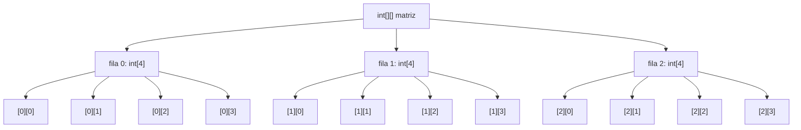
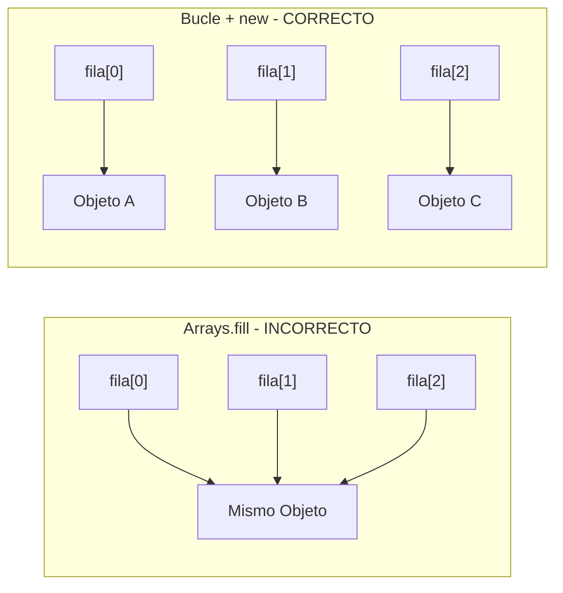
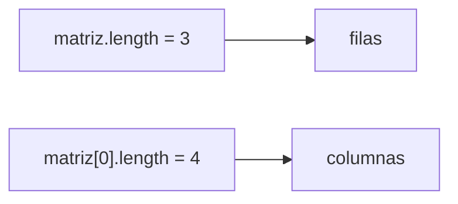
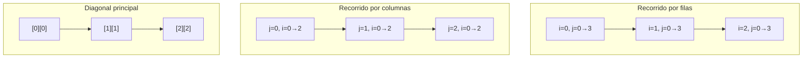
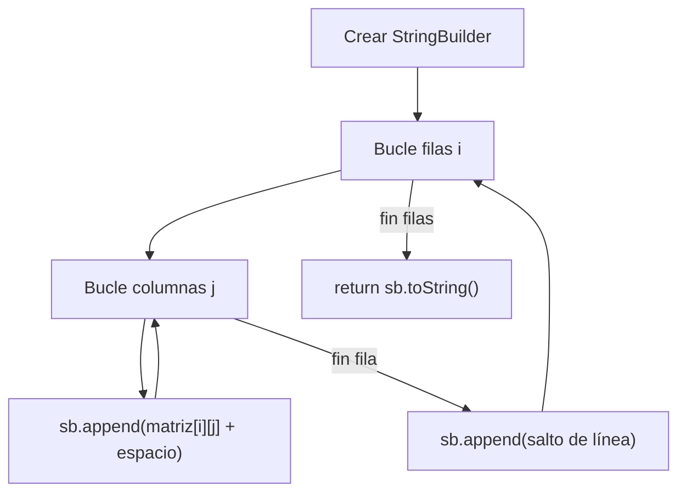
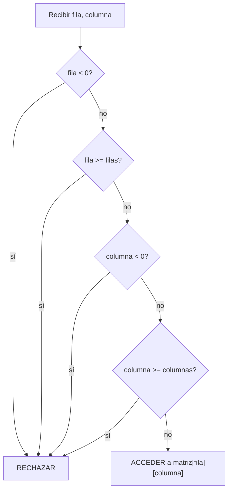
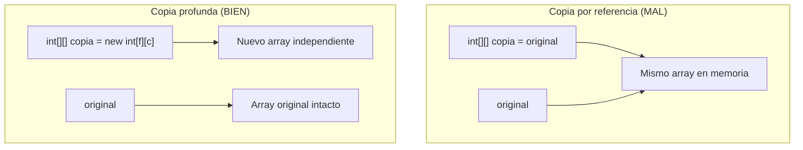
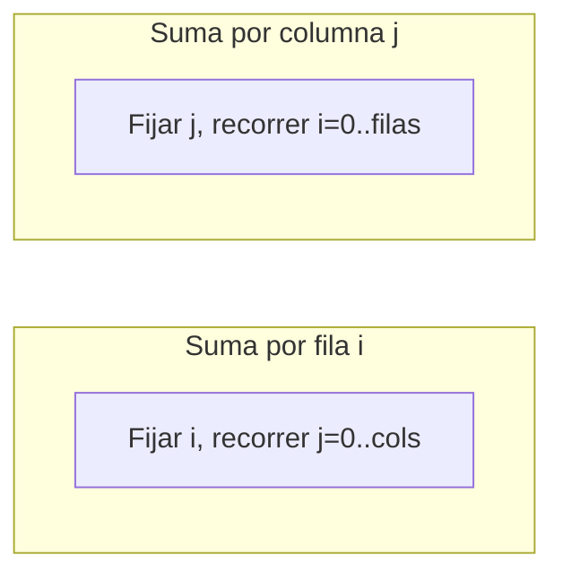

# Bloque I — Arrays Bidimensionales: Fundamentos

> Referencia para ejercicios `Ej01` a `Ej06` en `src/main/java/bloque1/`

## 1. ¿Qué es un array bidimensional?

Un array bidimensional es una **tabla de datos** organizada en filas y columnas. En Java, es literalmente un "array de arrays": cada posición del array exterior contiene otro array.

```java
int[][] matriz = new int[3][4]; // 3 filas, 4 columnas
```

En memoria, esto NO es una tabla plana. Es un array de 3 referencias, donde cada referencia apunta a un array de 4 enteros.



## 2. Declaración e inicialización

### Formas válidas

```java
// Forma 1: Solo declarar dimensiones (valores por defecto: 0 para int, null para objetos)
int[][] a = new int[filas][columnas];

// Forma 2: Inicialización directa con valores
int[][] b = {
    {1, 2, 3},
    {4, 5, 6},
    {7, 8, 9}
};

// Forma 3: Array de objetos (¡CUIDADO! Cada posición se debe instanciar individualmente)
Asiento[][] sala = new Asiento[filas][columnas];
for (int i = 0; i < filas; i++) {
    for (int j = 0; j < columnas; j++) {
        sala[i][j] = new Asiento(); // NUNCA usar Arrays.fill con objetos
    }
}
```

### La trampa de `Arrays.fill` con objetos



`Arrays.fill(fila, new Objeto())` crea UN solo objeto y pone la misma referencia en todas las posiciones. Modificar uno los modifica todos.

## 3. Dimensiones del array

```java
int filas = matriz.length;          // Número de filas
int columnas = matriz[0].length;    // Número de columnas (de la primera fila)
```



## 4. Recorridos fundamentales

### Por filas (el más natural)

```
→ → → →
→ → → →
→ → → →
```

```java
for (int i = 0; i < matriz.length; i++) {         // filas
    for (int j = 0; j < matriz[i].length; j++) {  // columnas
        // matriz[i][j]
    }
}
```

### Por columnas

```
↓ ↓ ↓ ↓
↓ ↓ ↓ ↓
↓ ↓ ↓ ↓
```

```java
for (int j = 0; j < matriz[0].length; j++) {      // columnas primero
    for (int i = 0; i < matriz.length; i++) {      // filas después
        // matriz[i][j]
    }
}
```

### Diagonal principal (solo matrices cuadradas)

```
↘
  ↘
    ↘
```

```java
for (int i = 0; i < matriz.length; i++) {
    // matriz[i][i]
}
```

### Diagonal inversa (solo matrices cuadradas)

```
      ↙
    ↙
  ↙
```

```java
int n = matriz.length;
for (int i = 0; i < n; i++) {
    // matriz[i][n - 1 - i]
}
```



## 5. Representación visual (pintar un array)

El patrón estándar para convertir un array bidi en String legible:



La idea clave: **StringBuilder** es la herramienta correcta para construir strings en bucles. Concatenar con `+` en un bucle crea objetos String temporales en cada iteración.

## 6. Validación de rango

Antes de acceder a `matriz[fila][columna]`, SIEMPRE valida:

```java
if (fila < 0 || fila >= matriz.length || columna < 0 || columna >= matriz[0].length) {
    // Fuera de rango → no acceder
}
```



## 7. Copia profunda vs referencia



Para copiar un array bidi hay que crear uno nuevo y copiar elemento a elemento:

```java
int[][] copia = new int[original.length][original[0].length];
for (int i = 0; i < original.length; i++) {
    for (int j = 0; j < original[i].length; j++) {
        copia[i][j] = original[i][j];
    }
}
```

## 8. Operaciones estadísticas

Para calcular sumas, máximos o mínimos **por fila** o **por columna**, el truco es saber qué índice se fija:



- **Suma de fila i:** recorrer `j` de 0 a columnas, sumando `matriz[i][j]`
- **Suma de columna j:** recorrer `i` de 0 a filas, sumando `matriz[i][j]`
- **Máximo de fila i:** empezar con `matriz[i][0]`, comparar con cada `matriz[i][j]`
