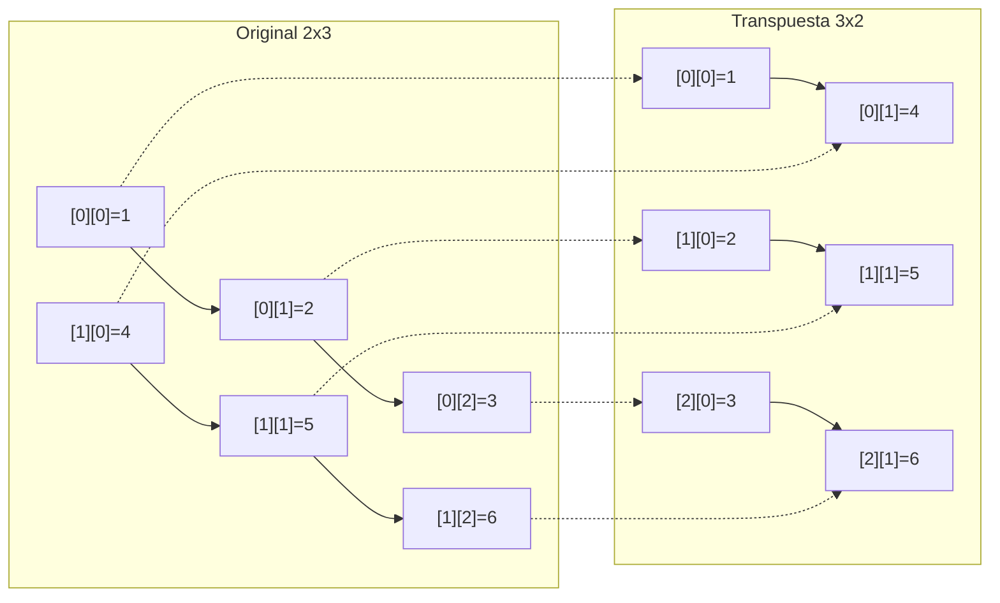
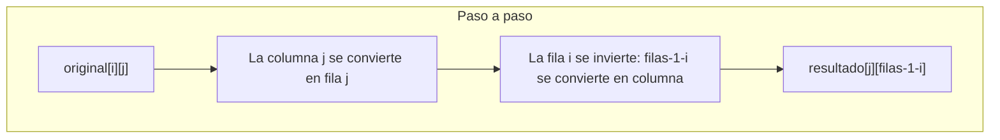
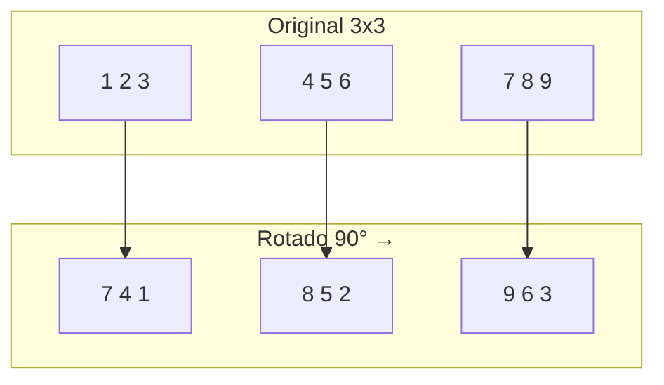
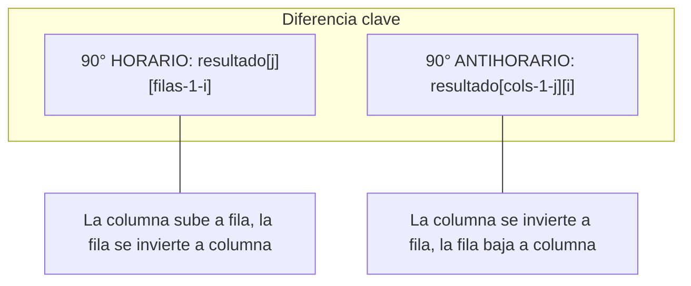
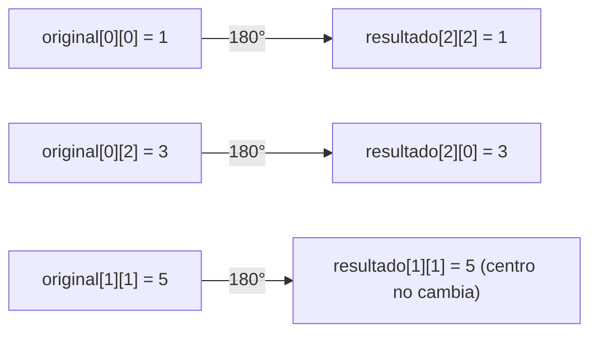
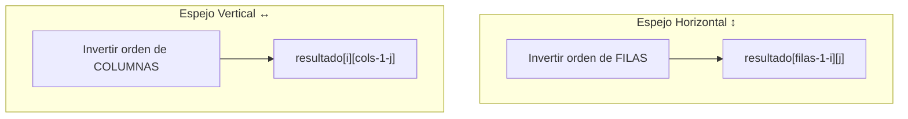
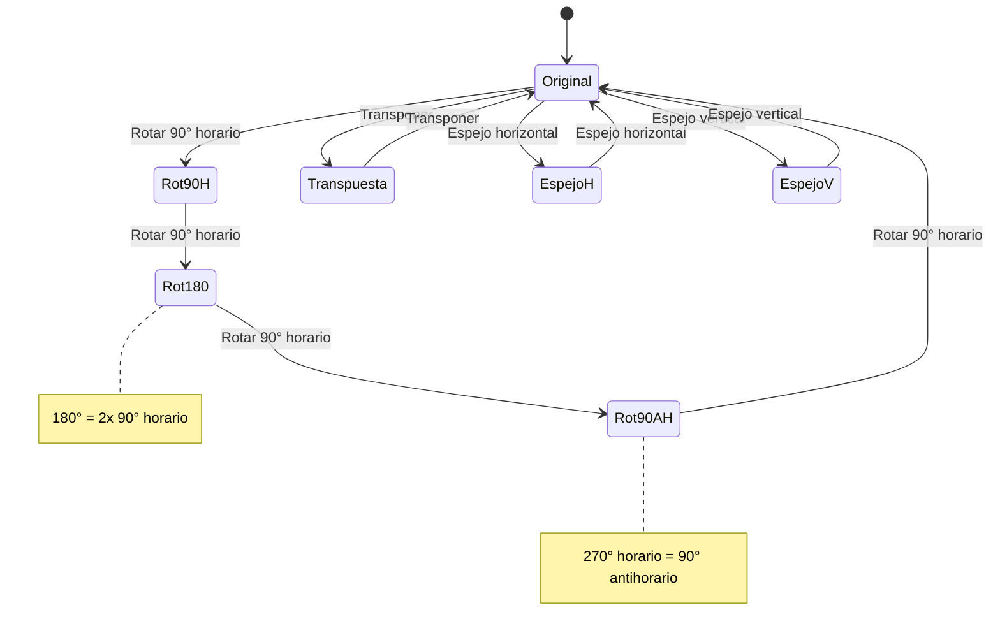
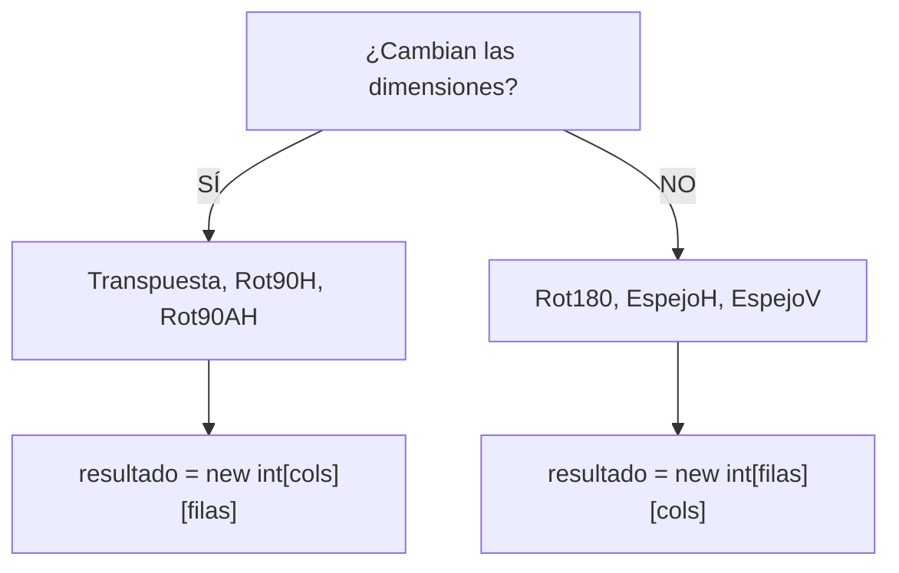

# Bloque II — Rotación y Transformación de Arrays Bidimensionales

> Referencia para ejercicios `Ej07` a `Ej12` en `src/main/java/bloque2/`

## 1. Transpuesta de una matriz

La transpuesta convierte filas en columnas y columnas en filas. Si la original es `MxN`, la transpuesta es `NxM`.

```
Original (2x3):        Transpuesta (3x2):
1  2  3                 1  4
4  5  6                 2  5
                        3  6
```

**Fórmula:** `transpuesta[j][i] = original[i][j]`



**Clave:** El nuevo array tiene dimensiones invertidas: `new int[columnas][filas]`.

## 2. Rotación 90° en sentido horario

La matriz se gira como un reloj. La primera columna se convierte en la primera fila (leída de abajo a arriba).

```
Original:               Rotado 90° horario:
1  2  3                 7  4  1
4  5  6                 8  5  2
7  8  9                 9  6  3
```

**Fórmula:** `resultado[j][filas - 1 - i] = original[i][j]`

O equivalentemente: `resultado[col][filas - 1 - fila] = original[fila][col]`



Para una matriz `MxN`, el resultado es `NxM`.



## 3. Rotación 90° en sentido antihorario

Giro contrario al reloj. La última columna se convierte en la primera fila.

```
Original:               Rotado 90° antihorario:
1  2  3                 3  6  9
4  5  6                 2  5  8
7  8  9                 1  4  7
```

**Fórmula:** `resultado[columnas - 1 - j][i] = original[i][j]`



## 4. Rotación 180°

Es equivalente a rotar 90° dos veces, o simplemente invertir filas y columnas.

```
Original:               Rotado 180°:
1  2  3                 9  8  7
4  5  6                 6  5  4
7  8  9                 3  2  1
```

**Fórmula:** `resultado[filas - 1 - i][columnas - 1 - j] = original[i][j]`



**Atajo mental:** es como leer la matriz al revés (última fila primero, dentro de cada fila de derecha a izquierda).

## 5. Espejo horizontal y vertical

### Espejo horizontal (voltear arriba-abajo)

Las filas se invierten de orden: la primera pasa a ser la última.

```
Original:         Espejo horizontal:
1  2  3           7  8  9
4  5  6           4  5  6
7  8  9           1  2  3
```

**Fórmula:** `resultado[filas - 1 - i][j] = original[i][j]`

### Espejo vertical (voltear izquierda-derecha)

Las columnas se invierten: la primera pasa a ser la última.

```
Original:         Espejo vertical:
1  2  3           3  2  1
4  5  6           6  5  4
7  8  9           9  8  7
```

**Fórmula:** `resultado[i][columnas - 1 - j] = original[i][j]`



## 6. Relación entre transformaciones



**Equivalencias útiles:**
- Rotar 90° horario = Transponer + Espejo vertical
- Rotar 90° antihorario = Transponer + Espejo horizontal
- Rotar 180° = Espejo horizontal + Espejo vertical

## 7. Cheat sheet de fórmulas

| Transformación | Dimensión resultado | Fórmula |
|---|---|---|
| Transpuesta | `[cols][filas]` | `r[j][i] = o[i][j]` |
| Rotar 90° horario | `[cols][filas]` | `r[j][filas-1-i] = o[i][j]` |
| Rotar 90° antihorario | `[cols][filas]` | `r[cols-1-j][i] = o[i][j]` |
| Rotar 180° | `[filas][cols]` | `r[filas-1-i][cols-1-j] = o[i][j]` |
| Espejo horizontal | `[filas][cols]` | `r[filas-1-i][j] = o[i][j]` |
| Espejo vertical | `[filas][cols]` | `r[i][cols-1-j] = o[i][j]` |


