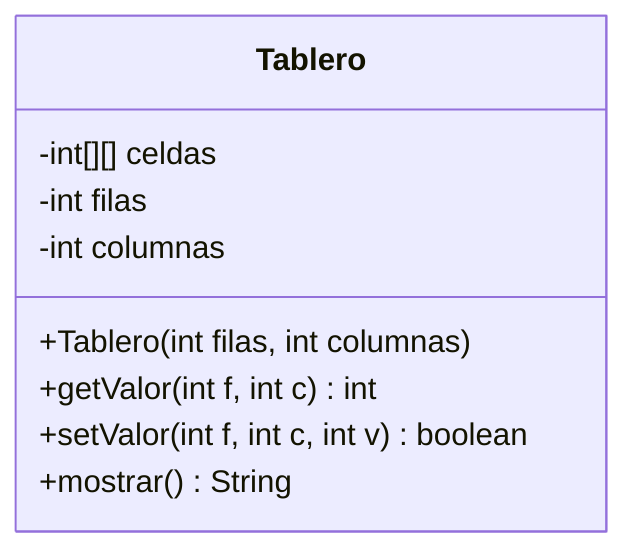
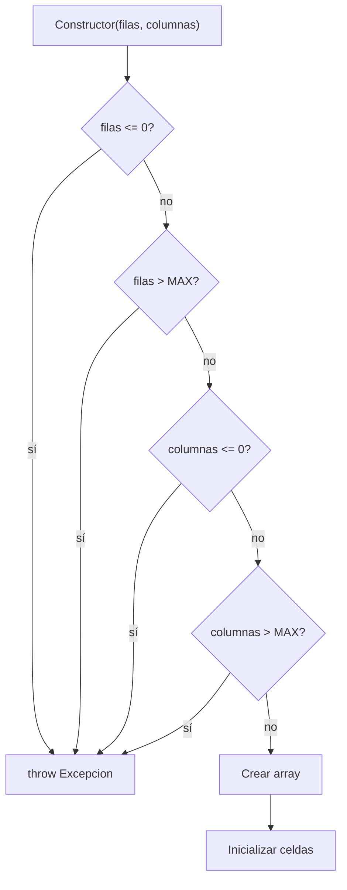
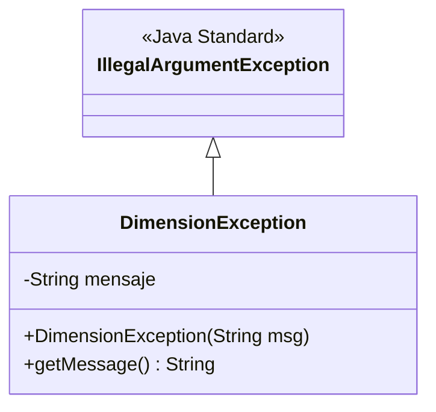
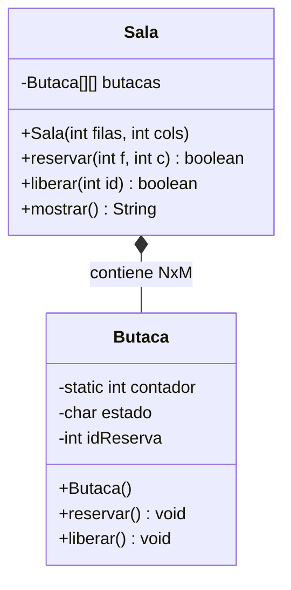
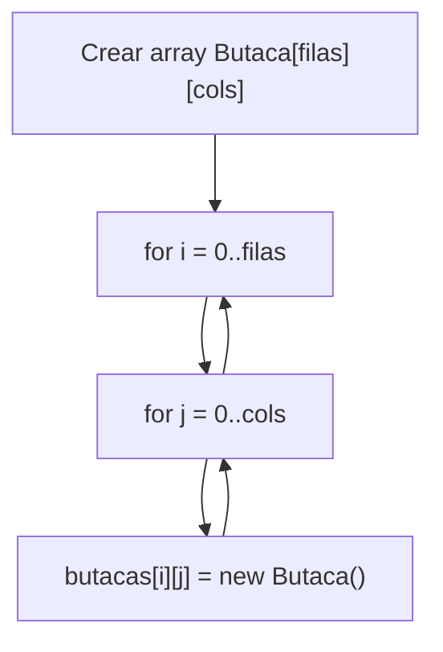
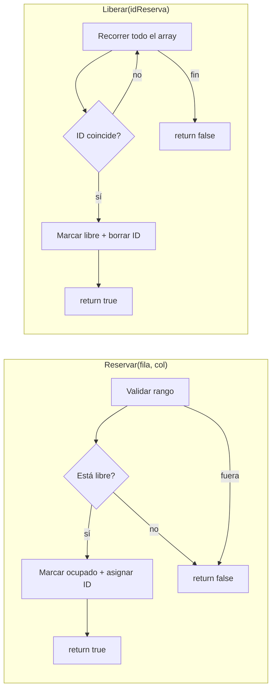
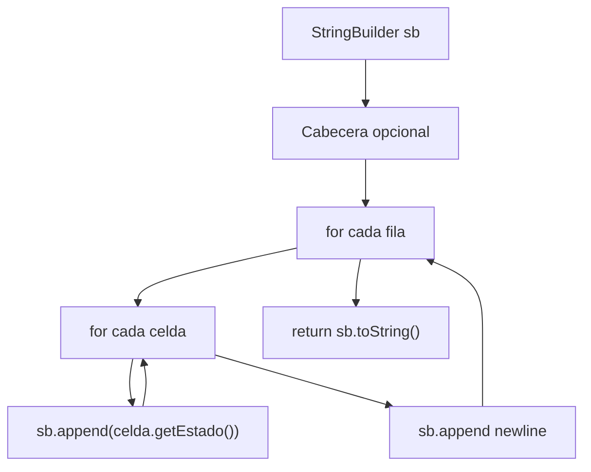

# Bloque III — Clases con Arrays Bidimensionales

> Referencia para ejercicios `Ej13` a `Ej18` en `src/main/java/bloque3/`

## 1. Encapsular un array bidi dentro de una clase

El paso fundamental: en vez de trabajar con `int[][]` sueltos, los metemos dentro de una clase que gestiona su acceso.

**Ventajas:**
- El array es `private` → nadie accede directamente
- Toda validación de rango se hace dentro de la clase
- Los métodos devuelven boolean/null si algo falla, nunca lanzan `ArrayIndexOutOfBoundsException`

## 2. Constructor con validaciones

**Patrón estándar:** Todas las validaciones ANTES de crear el array. Si alguna falla, lanzamos excepción y el objeto no se crea.

## 3. Excepciones personalizadas

**Patrón:** La excepción custom extiende `IllegalArgumentException` (o `RuntimeException`). El constructor recibe el mensaje y lo pasa a `super(msg)`.

## 4. Composición: array bidimensional de objetos

Cuando cada celda no es un `int` sino un objeto con su propio estado:

**Regla crítica:** Cada celda debe ser una instancia INDEPENDIENTE. Siempre bucle + `new`.

## 5. Métodos de negocio sobre el array

## 6. Representación visual (mostrar/toString)

Usa `StringBuilder` siempre. Nunca concatenes con `+` en bucles.
