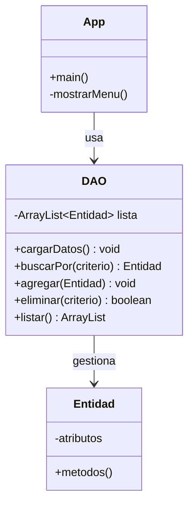
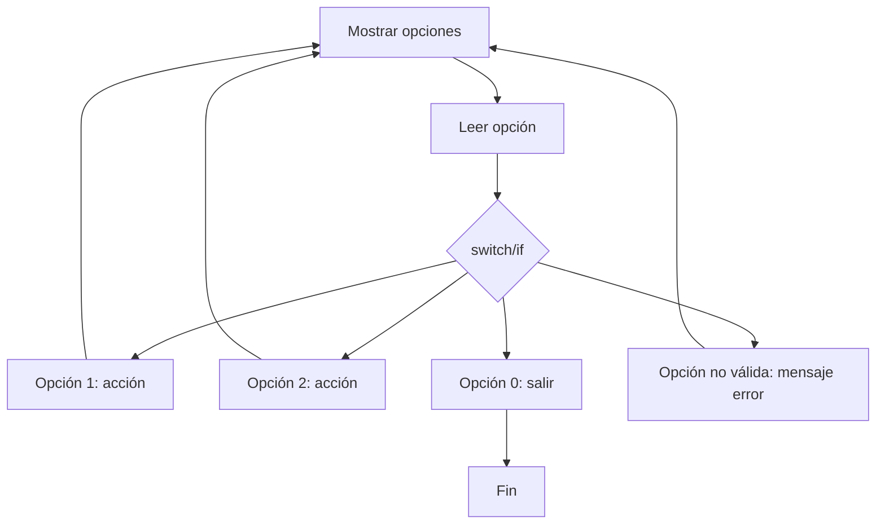
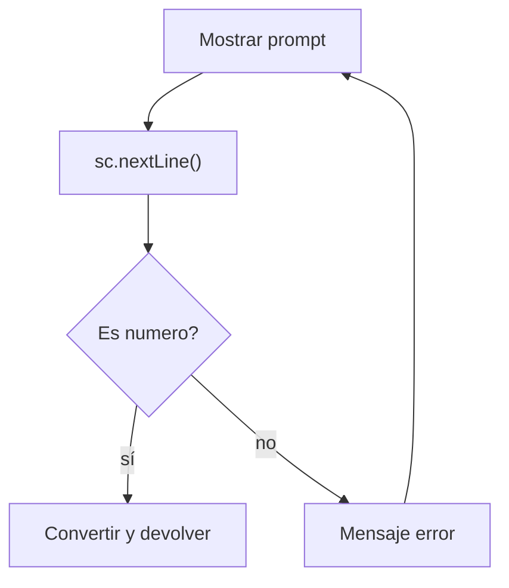
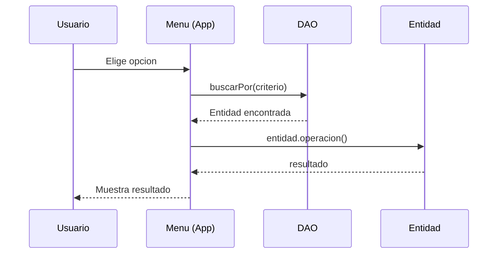

# Bloque IV — DAO y Menús

> Referencia para ejercicios `Ej19` a `Ej24` en `src/main/java/bloque4/`

## 1. Patrón DAO (Data Access Object)

El DAO centraliza el acceso a los datos. El resto del programa NUNCA manipula la lista directamente.



**Reglas del DAO:**
- `ArrayList` solo dentro del DAO
- Métodos de búsqueda, inserción, eliminación y listado
- Carga datos iniciales en un método `cargarDatos()`
- La lógica de negocio NO va en el DAO

## 2. Menú con Scanner



**Patrón estándar:**
```java
int opcion;
do {
    mostrarMenu();
    opcion = pedirEntero(sc);
    switch (opcion) {
        case 1: metodo1(); break;
        case 2: metodo2(); break;
        case 0: System.out.println("Saliendo..."); break;
        default: System.out.println("Opcion no valida");
    }
} while (opcion != 0);
```

## 3. Lectura robusta de entrada



**Clave:** Usar `sc.nextLine()` + `Integer.parseInt()` con try-catch para evitar `InputMismatchException`.

## 4. Integración Clase + DAO + Menú



## 5. Estructura de archivos típica

```
bloque4/
├── Ej19_DAO.java          (DAO simple con ArrayList)
├── Ej20_Menu.java          (Menú con Scanner)
├── Ej21_Entrada.java       (Lectura robusta)
├── Ej22_DAOAvanzado.java   (DAO con búsquedas complejas)
├── Ej23_Integracion.java   (Clase + DAO + Menú)
└── Ej24_Completo.java      (Ejercicio completo tipo examen)
```
