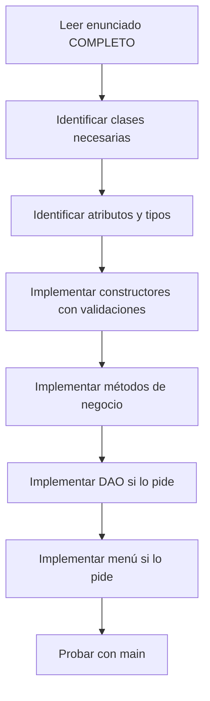
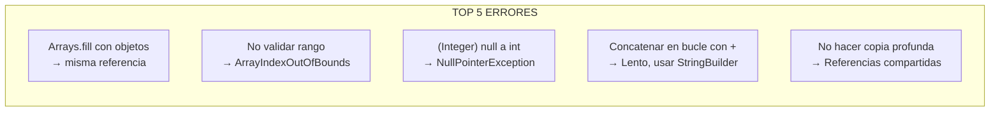
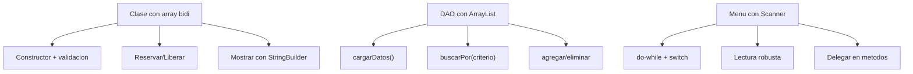
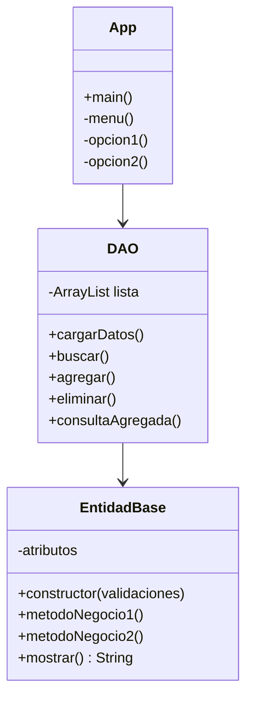

# Bloque V — Simulacros de Examen

> Referencia para ejercicios `Ej25` a `Ej30` en `src/main/java/bloque5/`

## 1. Estrategia ante un examen de arrays + clases + DAO

**Regla de oro:** No empieces a codificar sin haber leido TODO el enunciado. Marca los requisitos.

## 2. Errores frecuentes en examenes

## 3. Checklist pre-entrega

- [ ] Todas las clases compilan sin errores
- [ ] Constructor valida TODOS los parametros
- [ ] Métodos con array validan rango SIEMPRE
- [ ] Copia profunda donde se necesita (constructor, getter)
- [ ] StringBuilder en vez de concatenacion con +
- [ ] DAO devuelve copias de la lista, no la original
- [ ] main funciona y demuestra las funcionalidades

## 4. Patrones que SIEMPRE caen

## 5. Estructura de un ejercicio tipo examen completo

## 6. Tips de rendimiento en el examen

- **Empieza por la clase base** — es lo que mas puntua y lo mas facil
- **Luego el DAO** — es mecanico si ya tienes la clase
- **El menu al final** — es lo que menos puntua y depende de todo lo demas
- **Si te atascas, salta** — un metodo sin implementar no rompe el resto
- **Comenta tu intencion** — si no te da tiempo, al menos demuestra que sabias que hacer
