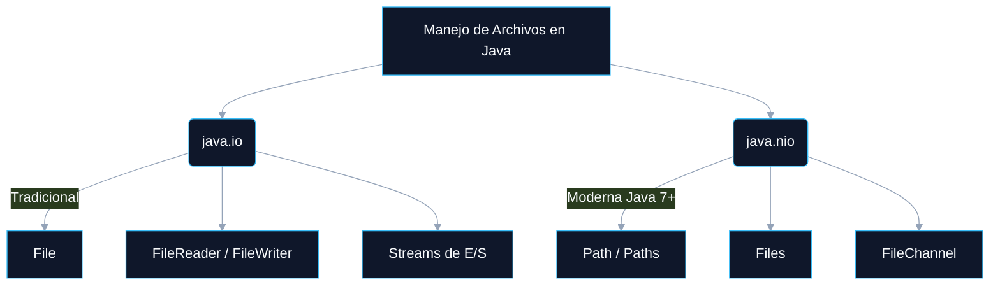
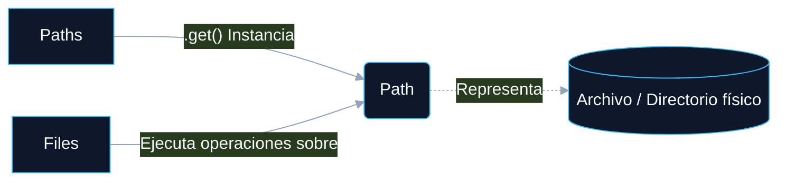

# LECTURA Y ESCRITURA DE INFORMACIÓN EN JAVA

<a id="indice"></a>
## ÍNDICE DINÁMICO
- [1. Archivos en Java. Clases File y Path](#sec1)
  - [1.1 Introducción al Manejo de Archivos en Java](#sec1_1)
  - [1.2 Manejo de Archivos con java.io.File](#sec1_2)
  - [1.3 Manejo de Archivos con java.nio.file](#sec1_3)
  - [1.4 Diferencias entre java.io y java.nio.file](#sec1_4)
  - [1.5 Conclusión](#sec1_5)
  - [1.6 Ejercicios Prácticos](#sec1_6)

---

<a id="sec1"></a>
# 1. Archivos en Java. Clases File y Path

<a id="sec1_1"></a>
## 1.1 Introducción al Manejo de Archivos en Java

En el desarrollo de aplicaciones en Java, gestionar archivos y directorios es una tarea fundamental para almacenar, leer y escribir información de forma eficiente. El lenguaje proporciona dos APIs principales para abordar este reto:



### Tabla Resumen de APIs

| API | Introducción | Clases Principales | Enfoque |
| :--- | :--- | :--- | :--- |
| **`java.io`** | Desde las primeras versiones de Java | `File`, `FileReader`, `FileWriter`, `BufferedReader`, `FileInputStream` | Tradicional, manejo orientado a Streams y bloqueante. |
| **`java.nio`** | Java 7 (con `java.nio.file`) | `Path`, `Files`, `Paths`, `FileChannel` | Moderno, optimizado, no bloqueante (NIO = New I/O) y mejor gestión de errores. |

> 💡 **TIPS Prácticos:** 
> Aunque `java.nio` es el estándar moderno, te encontrarás con `java.io.File` en el 90% de los proyectos *legacy* (antiguos). Conocer ambos es vital para un perfil Junior/Mid. Una forma rápida de convertir entre ambas es usar `file.toPath()` y `path.toFile()`.

> 🚀 **COMPLEMENTO (Fuera de temario):** 
> *NIO.2 (Non-blocking I/O)* no solo mejora el rendimiento trabajando directamente con el sistema de archivos nativo del SO, sino que permite "vigilar" carpetas en tiempo real usando `WatchService`, algo imposible de forma nativa con el clásico `java.io`.

[🏠 Volver al Índice](#indice)
<a id="sec1_2"></a>
## 1.2 Manejo de Archivos con java.io.File

La clase `File` del paquete `java.io` es la representación clásica en Java para rutas de archivos y directorios. Permite trabajar con el sistema de archivos proporcionando métodos para la creación, eliminación, consulta de propiedades y gestión estructural (no para leer o escribir el *contenido* del archivo, sino para manejar el archivo en sí).

[🏠 Volver al Índice](#indice)

---

<a id="sec1_2_1"></a>
### 1.2.1 Métodos de la Clase File

A continuación, se resumen los métodos más utilizados de la clase `File` para la gestión en el sistema de archivos:

| Método | Descripción | Retorno |
| :--- | :--- | :--- |
| `exists()` | Verifica si el archivo o directorio existe físicamente en la ruta especificada. | `boolean` |
| `createNewFile()` | Crea un archivo nuevo y vacío. Falla (retorna *false*) si el archivo ya existe. | `boolean` |
| `mkdir()` | Crea un directorio en la ruta indicada. | `boolean` |
| `mkdirs()` | Crea un directorio y **también sus directorios padres** si estos no existen. | `boolean` |
| `delete()` | Elimina un archivo o un directorio. **Ojo:** Si es directorio, debe estar vacío. | `boolean` |
| `isFile()` | Verifica si la ruta apunta específicamente a un archivo. | `boolean` |
| `isDirectory()` | Verifica si la ruta apunta específicamente a un directorio. | `boolean` |
| `length()` | Devuelve el tamaño del archivo en bytes (0 si no existe o es directorio). | `long` |
| `getName()` | Obtiene únicamente el nombre del archivo o directorio (sin la ruta). | `String` |
| `getAbsolutePath()` | Devuelve la ruta absoluta desde la raíz del sistema de archivos. | `String` |
| `list()` | Devuelve un array con los nombres de los archivos y carpetas dentro de un directorio. | `String[]` |

> 💡 **TIPS Prácticos:** 
> ¡Pregunta clásica de examen! Conoce bien la diferencia entre `mkdir()` y `mkdirs()`. Si intentas crear la ruta `"carpeta1/carpeta2"` y `carpeta1` no existe:
> - `mkdir()` fallará y devolverá `false`.
> - `mkdirs()` creará tanto `carpeta1` como `carpeta2` y devolverá `true`.

[🏠 Volver al Índice](#indice)

---

<a id="sec1_2_2"></a>
### 1.2.2 Creación de Archivos con File

La creación de archivos requiere la gestión de excepciones, concretamente `IOException`, ya que interactuamos con el sistema operativo y pueden ocurrir fallos (falta de permisos, disco lleno, etc.).

```java
import java.io.File;
import java.io.IOException;

public class CrearArchivo {
    public static void main(String[] args) {
        // 1. Definimos la ruta (aún no se crea físicamente)
        File archivo = new File("archivoEjemplo.txt");
        
        try {
            // 2. Intentamos crear el archivo físico
            if (archivo.createNewFile()) {
                System.out.println("Archivo creado: " + archivo.getName());
            } else {
                System.out.println("El archivo ya existe.");
            }
        } catch (IOException e) {
            System.out.println("Ocurrió un error al intentar crear el archivo.");
            e.printStackTrace();
        }
    }
}
```

> 🚀 **COMPLEMENTO (Fuera de temario):** 
> El método `createNewFile()` es **atómico**. Esto significa que verifica la existencia del archivo y lo crea en una sola operación ininterrumpida, lo que previene problemas de concurrencia si múltiples hilos intentan crear el mismo archivo a la vez.

[🏠 Volver al Índice](#indice)

---

<a id="sec1_2_3"></a>
### 1.2.3 Creación de Directorios con File

A diferencia de `createNewFile()`, los métodos `mkdir()` y `mkdirs()` no lanzan `IOException` obligatoria, por lo que no es estrictamente necesario envolverlos en un bloque `try-catch`, aunque su retorno (`boolean`) nos sirve para validar el éxito de la operación.

```java
import java.io.File;

public class CrearDirectorio {
    public static void main(String[] args) {
        // Instanciamos el objeto File apuntando al directorio
        File directorio = new File("MiDirectorio");
        
        // Ejecutamos la creación y evaluamos el resultado
        if (directorio.mkdir()) {
            System.out.println("Directorio creado con éxito.");
        } else {
            // Retornará false si el directorio ya existe o no hay permisos
            System.out.println("No se pudo crear el directorio.");
        }
    }
}
```

[🏠 Volver al Índice](#indice)
<a id="sec1_3"></a>
## 1.3 Manejo de Archivos con java.nio.file

La API `java.nio.file`, introducida en Java 7, ofrece una forma moderna y robusta de trabajar con archivos. Proporciona un rendimiento superior frente a `java.io`, mejor gestión de metadatos, manejo de errores más claro (lanzando excepciones específicas en lugar de devolver booleanos en muchas operaciones) y funcionalidades avanzadas como la lectura/escritura asíncrona.

[🏠 Volver al Índice](#indice)

---

<a id="sec1_3_1"></a>
### 1.3.1 Clases Clave en java.nio.file

El rediseño de NIO separa las responsabilidades de las rutas y las operaciones, que antes estaban unificadas en la vieja clase `File`:



- **`Path`**: Es una interfaz que representa la ruta de un archivo o directorio en el sistema operativo. (Sustituto directo de la parte de enrutamiento de `java.io.File`).
- **`Paths`**: Clase de utilidad (factory) cuyo único propósito es crear objetos `Path` mediante su método estático `get()`.
- **`Files`**: Contiene métodos utilitarios estáticos para manipular los archivos y directorios reales (crear, copiar, mover, borrar, leer, escribir).

[🏠 Volver al Índice](#indice)

---

<a id="sec1_3_2"></a>
### 1.3.2 Uso de Path y Files (Crear un archivo)

En `java.nio`, siempre usaremos `Paths.get()` para obtener la referencia de la ruta, y luego usaremos `Files` para operar sobre esa ruta.

```java
import java.nio.file.*;

public class ManejoArchivosNIO {
    public static void main(String[] args) {
        // 1. Instanciamos el Path
        Path ruta = Paths.get("archivoNIO.txt");
        
        try {
            // 2. Comprobamos existencia y operamos
            if (!Files.exists(ruta)) {
                Files.createFile(ruta);
                System.out.println("Archivo creado: " + ruta.toAbsolutePath());
            } else {
                System.out.println("El archivo ya existe.");
            }
        } catch (Exception e) {
            e.printStackTrace();
        }
    }
}
```

> 💡 **TIPS Prácticos:** 
> Observa la diferencia: Mientras `java.io.File` usaba `archivo.exists()`, en NIO es estático: `Files.exists(ruta)`. ¡No confundas la sintaxis en el examen!

[🏠 Volver al Índice](#indice)

---

<a id="sec1_3_3"></a>
### 1.3.3 Creación de Directorios con Files

La creación de directorios sigue exactamente el mismo patrón estático que la creación de archivos.

```java
import java.nio.file.*;

public class CrearDirectorioNIO {
    public static void main(String[] args) {
        Path rutaDirectorio = Paths.get("DirectorioNIO");
        
        try {
            if (!Files.exists(rutaDirectorio)) {
                // Equivalente a mkdir() en java.io
                Files.createDirectory(rutaDirectorio);
                System.out.println("Directorio creado: " + rutaDirectorio.toAbsolutePath());
            } else {
                System.out.println("El directorio ya existe.");
            }
        } catch (Exception e) {
            e.printStackTrace();
        }
    }
}
```

> 🚀 **COMPLEMENTO (Fuera de temario):** 
> Si necesitas el comportamiento equivalente a `mkdirs()` (crear directorios intermedios que no existen), en NIO debes usar `Files.createDirectories(ruta)`. El método en plural soluciona la creación en cascada.

[🏠 Volver al Índice](#indice)

---

<a id="sec1_3_4"></a>
### 1.3.4 Listado de Archivos con Files

NIO introduce la compatibilidad con **Streams** (de Java 8), lo que permite iterar y procesar listas de archivos de forma funcional y altamente optimizada.

```java
import java.nio.file.*;
import java.io.IOException;
import java.util.stream.Stream;

public class ListarArchivosNIO {
    public static void main(String[] args) {
        Path directorio = Paths.get("."); // "." representa el directorio actual
        
        // Uso de try-with-resources para asegurar el cierre del Stream
        try (Stream<Path> stream = Files.list(directorio)) {
            // Imprime cada ruta iterando con un Method Reference
            stream.forEach(System.out.println);
        } catch (IOException e) {
            e.printStackTrace();
        }
    }
}
```

> 💡 **TIPS Prácticos:** 
> El bloque `try (...) {` se llama **Try-with-resources**. Asegura que el recurso `Stream` se cierre automáticamente (evitando *Memory Leaks* o bloqueos de archivos en Windows). ¡Asegúrate de dominar esta estructura para sacar buena nota en buenas prácticas de código!

[🏠 Volver al Índice](#indice)

---

<a id="sec1_3_5"></a>
### 1.3.5 Eliminación de Archivos con Files.delete()

A diferencia de `java.io`, donde `delete()` simplemente devolvía `false` si fallaba (dejándote adivinar por qué), `Files.delete()` lanza excepciones descriptivas (`NoSuchFileException`, `DirectoryNotEmptyException`, etc.).

```java
import java.nio.file.*;

public class EliminarArchivoNIO {
    public static void main(String[] args) {
        Path archivo = Paths.get("archivoNIO.txt");
        
        try {
            Files.delete(archivo);
            System.out.println("Archivo eliminado.");
        } catch (Exception e) {
            // Imprimirá la causa exacta del fallo (no existe, está en uso...)
            e.printStackTrace();
        }
    }
}
```

[🏠 Volver al Índice](#indice)
<a id="sec1_4"></a>
## 1.4 Diferencias entre java.io y java.nio.file

Conocer cuándo y por qué utilizar cada API es crucial. A continuación, se presenta una tabla comparativa con las diferencias fundamentales:

| Característica | `java.io` (File) | `java.nio.file` (Path, Files) |
| :--- | :--- | :--- |
| **Manejo de archivos** | Tradicional, menos flexible. | Moderno, más potente. |
| **Operaciones de E/S** | Bloqueantes (detienen el hilo de ejecución). | No bloqueantes (permite asincronía). |
| **Creación de archivos** | `createNewFile()` | `Files.createFile()` |
| **Creación de directorios**| `mkdir()` y `mkdirs()` | `Files.createDirectory()` |
| **Eliminación** | `delete()` (devuelve `boolean`). | `Files.delete()` (lanza excepciones útiles). |
| **Listado de archivos** | `list()` y `listFiles()` | `Files.list()` (compatible con Streams). |
| **Rutas** | `getAbsolutePath()` | `toAbsolutePath()` |

> 🚀 **COMPLEMENTO (Fuera de temario):** 
> La diferencia "Bloqueante vs No Bloqueante" significa que si en `java.io` lees un archivo de 5GB, el hilo de tu programa se congela hasta que termine. En `java.nio`, puedes usar `AsynchronousFileChannel` para mandar a leer el archivo y que el programa siga haciendo otras cosas, avisándote mediante un `Future` o un `CompletionHandler` cuando termine.

[🏠 Volver al Índice](#indice)

---

<a id="sec1_5"></a>
## 1.5 Conclusión

A modo de resumen sobre las dos grandes APIs de Java para el sistema de archivos:

*   **`java.io.File`**: Sigue siendo útil y ampliamente documentado para operaciones muy simples con archivos o mantenimiento de aplicaciones *legacy* (código antiguo).
*   **`java.nio.file.Path` y `Files`**: Ofrecen una forma muchísimo más flexible, rápida y eficiente de trabajar con rutas y metadatos.
*   **Recomendación oficial**: Para aplicaciones modernas o nuevos proyectos, **se recomienda usar siempre `java.nio.file`**.

[🏠 Volver al Índice](#indice)

---

<a id="sec1_6"></a>
## 1.6 Ejercicios Prácticos

A continuación, se proponen una serie de ejercicios progresivos para asentar los conocimientos. 

> 💡 **TIPS Prácticos:** 
> Aunque los enunciados no lo especifiquen, **fuérzate a resolver del 1 al 4 usando `java.io` y del 5 al 10 usando `java.nio.file`** (o resuélvelos todos con NIO). Para los ejercicios de copia y movimiento (7, 8 y 9), investiga los métodos `Files.copy()` y `Files.move()`. Para el ejercicio 10, la clase `Files.walk()` te será de inmensa utilidad.

**Ejercicio 1: Comprobar si un Archivo Existe**
*   **Enunciado:** Escribe un programa que solicite al usuario un nombre de archivo y verifique si el archivo existe en el directorio actual.

**Ejercicio 2: Crear un Archivo**
*   **Enunciado:** Escribe un programa que cree un archivo llamado `datos.txt` en el directorio actual.

**Ejercicio 3: Crear un Directorio**
*   **Enunciado:** Crea un directorio llamado `MiCarpeta` si no existe.

**Ejercicio 4: Listar Archivos en un Directorio**
*   **Enunciado:** Muestra todos los archivos y subdirectorios del directorio actual.

**Ejercicio 5: Escribir en un Archivo**
*   **Enunciado:** Escribe el texto *"Hola, mundo!"* en un archivo `mensaje.txt`.

**Ejercicio 6: Leer el Contenido de un Archivo**
*   **Enunciado:** Lee y muestra en pantalla el contenido de `mensaje.txt`.

**Ejercicio 7: Copiar un Archivo**
*   **Enunciado:** Copia el archivo `mensaje.txt` a `copia_mensaje.txt`.

**Ejercicio 8: Mover un Archivo**
*   **Enunciado:** Mueve `copia_mensaje.txt` a una carpeta llamada `backup`.

**Ejercicio 9: Eliminar un Archivo**
*   **Enunciado:** Elimina el archivo `copia_mensaje.txt` en la carpeta `backup`.

**Ejercicio 10: Recorrer un Directorio y sus Subdirectorios**
*   **Enunciado:** Muestra todos los archivos y carpetas dentro de `MiCarpeta`, incluyendo subdirectorios.

[🏠 Volver al Índice](#indice)