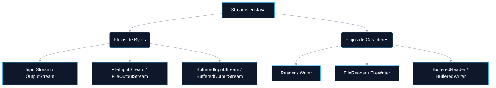

# LECTURA Y ESCRITURA DE INFORMACIÓN EN JAVA

<a id="indice"></a>
## ÍNDICE DINÁMICO
- [2. Lectura y Escritura de Archivos con Streams](#sec2)
  - [2.1 Introducción a los Streams en Java](#sec2_1)
  - [2.2 Flujos de Bytes (InputStream y OutputStream)](#sec2_2)
    - [2.2.1 Clases Principales para Flujos de Bytes](#sec2_2_1)
  - [2.3 Lectura de Archivos con FileInputStream](#sec2_3)
  - [2.4 Escritura de Archivos con FileOutputStream](#sec2_4)
  - [2.5 Uso de Buffers para Mejorar Rendimiento](#sec2_5)
  - [2.6 Flujos de Caracteres (Reader y Writer)](#sec2_6)
    - [2.6.1 Clases Principales para Flujos de Caracteres](#sec2_6_1)
  - [2.7 Lectura de Archivos con BufferedReader](#sec2_7)
  - [2.8 Escritura de Archivos con BufferedWriter](#sec2_8)
  - [2.9 Conclusión](#sec2_9)
  - [2.10 Ejercicios Prácticos](#sec2_10)

---

<a id="sec2"></a>
# 2. Lectura y Escritura de Archivos con Streams (InputStream y OutputStream)

<a id="sec2_1"></a>
## 2.1 Introducción a los Streams en Java

En Java, los **Streams** (Flujos de Datos) permiten la lectura y escritura de información de forma secuencial. Estos flujos pueden ser de dos tipos:

- **Flujos de bytes** (`InputStream` y `OutputStream`): Se utilizan para leer y escribir archivos binarios (imágenes, vídeos, etc.).
- **Flujos de caracteres** (`Reader` y `Writer`): Se utilizan para leer y escribir archivos de texto.



El paquete principal para trabajar con Streams en Java es `java.io`, aunque también se pueden manejar con `java.nio`.

> 💡 **TIPS Prácticos:**
> Recuerda la regla general: si el archivo contiene **texto**, usa los flujos de caracteres (`Reader`/`Writer`). Si contiene **datos binarios** (imágenes, audio, estructuras de datos), usa los flujos de bytes (`InputStream`/`OutputStream`). Confundir ambos tipos es un error clásico de examen.

[🏠 Volver al Índice](#indice)

---

<a id="sec2_2"></a>
## 2.2 Flujos de Bytes (InputStream y OutputStream)

Estos flujos trabajan con datos en formato binario, procesando los archivos byte a byte.

[🏠 Volver al Índice](#indice)

---

<a id="sec2_2_1"></a>
### 2.2.1 Clases Principales de java.io para Flujos de Bytes

| Clase | Descripción |
| :--- | :--- |
| `InputStream` | Clase abstracta base para lectura de bytes. |
| `FileInputStream` | Permite leer bytes desde un archivo. |
| `OutputStream` | Clase abstracta base para escritura de bytes. |
| `FileOutputStream` | Permite escribir bytes en un archivo. |
| `BufferedInputStream` | Mejora el rendimiento al leer bytes usando un buffer interno. |
| `BufferedOutputStream` | Mejora el rendimiento al escribir bytes usando un buffer interno. |

> 🚀 **COMPLEMENTO (Fuera de temario):**
> La jerarquía de clases en `java.io` sigue el patrón de diseño **Decorator**. `BufferedInputStream` no es una nueva implementación de lectura; simplemente *envuelve* a cualquier `InputStream` añadiendo capacidades de buffering. Este patrón se repite en todo el paquete: `BufferedOutputStream` envuelve `OutputStream`, etc.

[🏠 Volver al Índice](#indice)

---

<a id="sec2_3"></a>
## 2.3 Lectura de Archivos con FileInputStream

Para leer un archivo en formato binario, usamos `FileInputStream`, que lee el contenido byte a byte.

**Ejemplo 1: Leer un archivo byte a byte**

```java
import java.io.FileInputStream;
import java.io.IOException;

public class LeerArchivoBytes {
    public static void main(String[] args) {
        try (FileInputStream fis = new FileInputStream("archivoEjemplo.txt")) {
            int byteLeido;
            // read() devuelve -1 cuando se alcanza el final del archivo
            while ((byteLeido = fis.read()) != -1) {
                System.out.print((char) byteLeido); // Convierte el byte a carácter
            }
        } catch (IOException e) {
            e.printStackTrace();
        }
    }
}
```

**Explicación:**
- Se usa `FileInputStream` para leer el archivo.
- Se lee byte a byte hasta que `read()` devuelve `-1` (fin del archivo).
- Se convierte cada byte en carácter y se imprime.

> 💡 **TIPS Prácticos:**
> El valor `-1` como centinela de fin de archivo es un convenio universal en Java. El tipo de retorno de `read()` es `int` (no `byte`) precisamente para poder representar los 256 valores de un byte (0-255) *más* el valor especial `-1`. ¡Ojo si declaras la variable como `byte` en un examen!

[🏠 Volver al Índice](#indice)

---

<a id="sec2_4"></a>
## 2.4 Escritura de Archivos con FileOutputStream

Para escribir en un archivo en formato binario, usamos `FileOutputStream`.

**Ejemplo 2: Escribir un archivo byte a byte**

```java
import java.io.FileOutputStream;
import java.io.IOException;

public class EscribirArchivoBytes {
    public static void main(String[] args) {
        try (FileOutputStream fos = new FileOutputStream("archivoEscrito.txt")) {
            String mensaje = "Hola, esto es una prueba!";
            fos.write(mensaje.getBytes()); // Convertimos la cadena a bytes y escribimos
            System.out.println("Archivo escrito correctamente.");
        } catch (IOException e) {
            e.printStackTrace();
        }
    }
}
```

**Explicación:**
- Se usa `FileOutputStream` para escribir en un archivo.
- Se convierte la cadena a bytes con `getBytes()`.
- Se escribe la secuencia de bytes en el archivo.

> 🚀 **COMPLEMENTO (Fuera de temario):**
> Por defecto, `FileOutputStream` **sobreescribe** el archivo si ya existe. Para añadir contenido sin borrar el anterior, usa el constructor con el flag `append`: `new FileOutputStream("archivo.txt", true)`. ¡Este detalle aparece en la siguiente lección y es crítico para no perder datos!

[🏠 Volver al Índice](#indice)

---

<a id="sec2_5"></a>
## 2.5 Uso de Buffers para Mejorar Rendimiento

Los flujos de datos sin buffering pueden ser lentos porque realizan una operación de E/S por cada byte. Para mejorar la eficiencia, usamos `BufferedInputStream` y `BufferedOutputStream`.

**Ejemplo 3: Lectura con BufferedInputStream**

```java
import java.io.*;

public class LeerConBuffer {
    public static void main(String[] args) {
        try (BufferedInputStream bis = new BufferedInputStream(
                new FileInputStream("archivoEjemplo.txt"))) {
            int byteLeido;
            while ((byteLeido = bis.read()) != -1) {
                System.out.print((char) byteLeido);
            }
        } catch (IOException e) {
            e.printStackTrace();
        }
    }
}
```

**Explicación:**
- `BufferedInputStream` mejora la velocidad de lectura al leer **bloques de datos** en lugar de un byte a la vez.

**Ejemplo 4: Escritura con BufferedOutputStream**

```java
import java.io.*;

public class EscribirConBuffer {
    public static void main(String[] args) {
        try (BufferedOutputStream bos = new BufferedOutputStream(
                new FileOutputStream("archivoConBuffer.txt"))) {
            String mensaje = "Este es un mensaje con buffer.";
            bos.write(mensaje.getBytes());
            System.out.println("Archivo escrito con éxito.");
        } catch (IOException e) {
            e.printStackTrace();
        }
    }
}
```

**Explicación:**
- `BufferedOutputStream` almacena datos en un buffer y los escribe en bloque, mejorando el rendimiento.

> 💡 **TIPS Prácticos:**
> El tamaño de buffer por defecto es de **8 KB (8192 bytes)**. Puedes especificar uno mayor: `new BufferedInputStream(fis, 65536)`. Para archivos grandes, aumentar el tamaño de buffer reduce el número de accesos a disco y puede acelerar la lectura drásticamente.

[🏠 Volver al Índice](#indice)

---

<a id="sec2_6"></a>
## 2.6 Flujos de Caracteres (Reader y Writer)

Estos flujos están diseñados para manejar archivos de texto, evitando la conversión manual de bytes a caracteres. Trabajan con `char` en lugar de `byte`, lo que los hace más adecuados para texto.

[🏠 Volver al Índice](#indice)

---

<a id="sec2_6_1"></a>
### 2.6.1 Clases Principales de java.io para Flujos de Caracteres

| Clase | Descripción |
| :--- | :--- |
| `Reader` | Clase abstracta base para la lectura de caracteres. |
| `FileReader` | Permite leer caracteres desde un archivo. |
| `BufferedReader` | Mejora el rendimiento en la lectura de caracteres; permite leer líneas completas. |
| `Writer` | Clase abstracta base para la escritura de caracteres. |
| `FileWriter` | Permite escribir caracteres en un archivo. |
| `BufferedWriter` | Mejora el rendimiento en la escritura de caracteres. |

[🏠 Volver al Índice](#indice)

---

<a id="sec2_7"></a>
## 2.7 Lectura de Archivos con BufferedReader

`BufferedReader` permite leer archivos de texto de manera eficiente, **línea por línea**.

**Ejemplo 5: Leer un archivo línea por línea**

```java
import java.io.*;

public class LeerLineas {
    public static void main(String[] args) {
        try (BufferedReader br = new BufferedReader(new FileReader("archivoEjemplo.txt"))) {
            String linea;
            // readLine() devuelve null cuando llega al final del archivo
            while ((linea = br.readLine()) != null) {
                System.out.println(linea);
            }
        } catch (IOException e) {
            e.printStackTrace();
        }
    }
}
```

**Explicación:**
- `readLine()` permite leer el archivo **línea por línea**, evitando procesar carácter a carácter.

> 💡 **TIPS Prácticos:**
> `readLine()` devuelve `null` (no una cadena vacía ni `-1`) cuando llega al fin del archivo. Este es otro error de examen clásico: comparar con `""` o con `-1` en vez de con `null`.

[🏠 Volver al Índice](#indice)

---

<a id="sec2_8"></a>
## 2.8 Escritura de Archivos con BufferedWriter

`BufferedWriter` mejora la eficiencia al escribir en archivos de texto.

**Ejemplo 6: Escribir líneas en un archivo**

```java
import java.io.*;

public class EscribirLineas {
    public static void main(String[] args) {
        try (BufferedWriter bw = new BufferedWriter(new FileWriter("archivoTexto.txt"))) {
            bw.write("Primera línea.");
            bw.newLine(); // Inserta un salto de línea compatible con el SO actual
            bw.write("Segunda línea.");
            System.out.println("Archivo escrito correctamente.");
        } catch (IOException e) {
            e.printStackTrace();
        }
    }
}
```

**Explicación:**
- `BufferedWriter` usa `newLine()` para insertar saltos de línea.

> 🚀 **COMPLEMENTO (Fuera de temario):**
> `newLine()` es preferible a escribir `"\n"` directamente, porque inserta el separador de línea **específico del sistema operativo** (`\r\n` en Windows, `\n` en Linux/macOS). Usar `"\n"` en Windows puede generar archivos que otros programas no lean correctamente.

[🏠 Volver al Índice](#indice)

---

<a id="sec2_9"></a>
## 2.9 Conclusión

A modo de resumen sobre los cuatro tipos de flujos principales en `java.io`:

*   **`InputStream` y `OutputStream`**: Se usan para archivos binarios (imágenes, vídeos, datos compactos).
*   **`Reader` y `Writer`**: Se usan para archivos de texto, manejando caracteres de forma directa.
*   **`BufferedInputStream` y `BufferedOutputStream`**: Mejoran el rendimiento en archivos binarios usando un buffer intermedio.
*   **`BufferedReader` y `BufferedWriter`**: Son ideales para manipular archivos de texto, con soporte para lectura/escritura por líneas.

[🏠 Volver al Índice](#indice)

---

<a id="sec2_10"></a>
## 2.10 Ejercicios Prácticos

A continuación, se proponen una serie de ejercicios progresivos para asentar los conocimientos.

> 💡 **TIPS Prácticos:**
> En todos los ejercicios, **usa `try-with-resources`** para garantizar el cierre automático de los flujos. Para los ejercicios del 1 al 3, investiga cómo combinar lectura y escritura de forma encadenada. Para el ejercicio de búsqueda y reemplazo, recuerda que `BufferedReader` devuelve cadenas sobre las que puedes aplicar `String.replace()`.

**Ejercicio 1: Append en un archivo de números**
*   **Enunciado:** Investiga cómo puedes hacer que cada vez que se ejecute el fragmento de código que genera el archivo `numeros.txt`, en lugar de borrar el contenido anterior, se añadan 10 números nuevos sin borrar los anteriores.

**Ejercicio 2: Suma de archivos**
*   **Enunciado:** Crea un programa que escriba 10 números aleatorios en `datos1.txt`, y luego otros 10 en `datos2.txt`. Finalmente, escribe en `datosSumados.txt` la suma de cada una de las líneas correspondientes. No debes almacenar los números en variables; léelos desde los ficheros para realizar la suma.

> **Ejemplo de ejecución:**
> `datos1.txt`: `1 / 2 / 4` — `datos2.txt`: `4 / 6 / 7` — `datosSumados.txt`: `5 / 8 / 11`

**Ejercicio 3: Suma acumulativa**
*   **Enunciado:** Crea un programa que escriba cinco números aleatorios del 1 al 9 en cada línea. Luego lee todos los números del archivo y, en un nuevo archivo, añade a cada línea el valor de los números sumados hasta dicha línea. No uses variables intermedias para guardar los números.

> **Ejemplo de ejecución:**
> Original: `3 / 5 / 2 / 7 / 1` — Nuevo: `3 (suma:3) / 5 (suma:8) / 2 (suma:10) / 7 (suma:17) / 1 (suma:18)`

**Ejercicio 4: Leer un Archivo de Texto Línea por Línea**
*   **Enunciado:** Crea un programa que lea un archivo de texto `entrada.txt` línea por línea y muestre su contenido en consola.

**Ejercicio 5: Escribir un Archivo de Texto Línea por Línea**
*   **Enunciado:** Escribe un programa que cree un archivo `salida.txt` y escriba tres líneas en él.

**Ejercicio 6: Copiar un Archivo de Texto**
*   **Enunciado:** Crea un programa que copie el contenido de `entrada.txt` a `copia.txt`.

**Ejercicio 7: Contar Líneas en un Archivo**
*   **Enunciado:** Escribe un programa que cuente cuántas líneas tiene `entrada.txt`.

**Ejercicio 8: Leer un Archivo Binario**
*   **Enunciado:** Crea un programa que lea un archivo binario (`imagen.jpg`) y muestre su tamaño en bytes.

**Ejercicio 9: Copiar un Archivo Binario**
*   **Enunciado:** Escribe un programa que copie `imagen.jpg` a `copia_imagen.jpg`.

**Ejercicio 10: Contar Palabras en un Archivo**
*   **Enunciado:** Escribe un programa que cuente cuántas palabras tiene `entrada.txt`.

**Ejercicio 11: Buscar y Reemplazar en un Archivo**
*   **Enunciado:** Crea un programa que reemplace la palabra `"Java"` por `"Python"` en `entrada.txt` y guarde el resultado en `modificado.txt`.

**Ejercicio 12: Ordenar Líneas de un Archivo**
*   **Enunciado:** Escribe un programa que lea las líneas de `nombres.txt`, las ordene alfabéticamente y las guarde en `nombres_ordenados.txt`.

**Ejercicio 13: Contar la Frecuencia de Cada Palabra**
*   **Enunciado:** Escribe un programa que cuente cuántas veces aparece cada palabra en `entrada.txt`.

**Ejercicio 14: Verifica si existe el fichero para escribir en él**
*   **Enunciado:** Escribe un programa para verificar si el fichero `"salida.txt"` existe; si existe, elimínalo. Luego escribe en él el siguiente fragmento del Quijote:

> *"En un lugar de la Mancha, de cuyo nombre no quiero acordarme, no ha mucho tiempo que vivía un hidalgo de los de lanza en astillero, adarga antigua, rocín flaco y galgo corredor..."* *(primer párrafo del capítulo I)*

[🏠 Volver al Índice](#indice)
