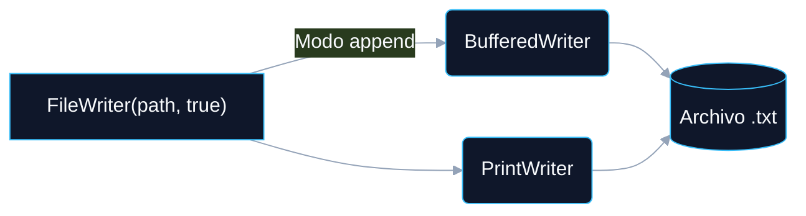

# LECTURA Y ESCRITURA DE INFORMACIÓN EN JAVA

<a id="indice"></a>
## ÍNDICE DINÁMICO
- [3. Agregar Información a un Archivo que ya Existe](#sec3)
  - [3.1 Clases y Métodos para Agregar Texto a un Archivo Existente](#sec3_1)
    - [3.1.1 FileWriter en modo append](#sec3_1_1)
    - [3.1.2 BufferedWriter](#sec3_1_2)
    - [3.1.3 PrintWriter](#sec3_1_3)
  - [3.2 ¿Por qué usar el modo Append?](#sec3_2)
  - [3.3 Manejo de Excepciones](#sec3_3)
  - [3.4 try-with-resources vs. try tradicional con finally](#sec3_4)
  - [3.5 Conclusión sobre try-with-resources](#sec3_5)
  - [3.6 Clases PrintWriter y Scanner](#sec3_6)
    - [3.6.1 Clase PrintWriter – Escritura en Archivos](#sec3_6_1)
    - [3.6.2 Clase Scanner – Lectura desde Archivos](#sec3_6_2)
    - [3.6.3 Comparativa y Ejemplo Combinado](#sec3_6_3)
  - [3.7 Ejercicios Prácticos (Append)](#sec3_7)
  - [3.8 Ejercicios Prácticos (PrintWriter y Scanner)](#sec3_8)

---

<a id="sec3"></a>
# 3. Agregar Información a un Archivo que ya Existe

Para agregar texto a un archivo que ya existe en Java, puedes utilizar varias clases de la biblioteca estándar. A continuación se explican las clases y métodos clave que se utilizan para este propósito y por qué se eligen.

<a id="sec3_1"></a>
## 3.1 Clases y Métodos para Agregar Texto a un Archivo Existente



[🏠 Volver al Índice](#indice)

---

<a id="sec3_1_1"></a>
### 3.1.1 FileWriter en Modo Append

- **Descripción:** La clase `FileWriter` se utiliza para escribir caracteres en un archivo. Si usas esta clase directamente sin opciones adicionales, sobrescribirá el contenido existente.
- **Método relevante:** `FileWriter(String pathname, boolean append)` — el segundo parámetro `true` indica modo *append* (agregar al final).
- **¿Por qué usarlo?** Es simple y directo. Con `append = true` agrega datos al final del archivo sin perder lo que ya tiene.

```java
FileWriter writer = new FileWriter("archivo.txt", true);
writer.write("Texto a agregar\n");
writer.close();
```

> 💡 **TIPS Prácticos:**
> ¡Atención en el examen! La diferencia entre `new FileWriter("archivo.txt")` (sobreescribe) y `new FileWriter("archivo.txt", true)` (agrega) es un argumento booleano. Olvidarlo provoca pérdida de datos y es un error muy difícil de detectar.

[🏠 Volver al Índice](#indice)

---

<a id="sec3_1_2"></a>
### 3.1.2 BufferedWriter

- **Descripción:** `BufferedWriter` envuelve a `FileWriter` y ofrece una escritura más eficiente usando un búfer (memoria intermedia) que agrupa los datos antes de escribirlos en disco.
- **Método relevante:** `BufferedWriter(Writer out)` — toma un objeto `Writer` (como `FileWriter`) y lo envuelve en un búfer.
- **¿Por qué usarlo?** Cuando se requiere escribir grandes volúmenes de datos, `BufferedWriter` reduce el número de operaciones de E/S, mejorando el rendimiento.

```java
BufferedWriter writer = new BufferedWriter(new FileWriter("archivo.txt", true));
writer.write("Texto a agregar\n");
writer.close();
```

[🏠 Volver al Índice](#indice)

---

<a id="sec3_1_3"></a>
### 3.1.3 PrintWriter

- **Descripción:** `PrintWriter` proporciona una interfaz más conveniente y flexible para imprimir datos, con métodos como `println()` y `printf()`, similares a los de consola.
- **Método relevante:** `PrintWriter(File file, String charsetName)` — permite especificar el archivo y la codificación.
- **¿Por qué usarlo?** Si deseas formateo avanzado (como con `printf()`), `PrintWriter` es la opción más adecuada. También maneja automáticamente la conversión de excepciones.

```java
PrintWriter writer = new PrintWriter(new FileWriter("archivo.txt", true));
writer.println("Texto a agregar");
writer.close();
```

[🏠 Volver al Índice](#indice)

---

<a id="sec3_2"></a>
## 3.2 ¿Por qué Usar el Modo "Append"?

El modo *append* es crucial para agregar contenido a un archivo **sin sobrescribir** lo que ya contiene. Cuando se utiliza un `FileWriter` con el segundo parámetro `true`, se asegura que cualquier nuevo texto se agregue al final del archivo sin perder datos previos.

> 💡 **TIPS Prácticos:**
> El modo *append* es especialmente útil en archivos de **log** o cualquier archivo que se actualice periódicamente (registros de errores, historiales de acceso, etc.). En el mundo profesional, casi todos los sistemas de logging usan esta técnica para no perder el historial.

[🏠 Volver al Índice](#indice)

---

<a id="sec3_3"></a>
## 3.3 Manejo de Excepciones

Es importante manejar las excepciones de entrada/salida (`IOException`) ya que las operaciones de archivo pueden fallar por varias razones (falta de permisos, problemas de disco, etc.). Se hace dentro de un bloque `try-catch`.

**Ejemplo Completo con Manejo de Excepciones:**

```java
import java.io.BufferedWriter;
import java.io.File;
import java.io.FileWriter;
import java.io.IOException;

public class AgregarTexto {
    public static void main(String[] args) {
        String archivo = "archivo.txt";
        String texto   = "Texto que quiero agregar.\n";

        try {
            // Crear BufferedWriter en modo append para agregar texto
            BufferedWriter writer = new BufferedWriter(new FileWriter(archivo, true));
            writer.write(texto); // Escribir el texto en el archivo
            writer.close();      // Cerrar el escritor (¡obligatorio!)

            System.out.println("Texto agregado correctamente.");
        } catch (IOException e) {
            System.out.println("Error al agregar texto al archivo: " + e.getMessage());
        }
    }
}
```

[🏠 Volver al Índice](#indice)

---

<a id="sec3_4"></a>
## 3.4 try-with-resources vs. try Tradicional con finally

`try-with-resources` es la **mejor práctica** en Java al trabajar con recursos que deben cerrarse después de su uso (flujos de archivos, conexiones de base de datos, etc.).

### Ventajas de try-with-resources

| Ventaja | Descripción |
| :--- | :--- |
| **Cierre Automático** | Los recursos se cierran solos al finalizar el bloque, incluso si ocurre una excepción. |
| **Menor riesgo de fugas** | Previene que archivos o conexiones queden abiertos accidentalmente. |
| **Simplicidad** | El código es más limpio y legible: no hay bloque `finally` con lógica de cierre. |
| **Mejor manejo de excepciones** | Si ocurre una excepción en el cierre, se combina con la original (*supressed exceptions*). |

**1. Usando try-with-resources (Forma recomendada):**

```java
import java.io.BufferedWriter;
import java.io.FileWriter;
import java.io.IOException;

public class EjemploTryWithResources {
    public static void main(String[] args) {
        String archivo = "archivo.txt";
        String texto   = "Texto que quiero agregar.\n";

        // El BufferedWriter se cierra automáticamente al salir del bloque try
        try (BufferedWriter writer = new BufferedWriter(new FileWriter(archivo, true))) {
            writer.write(texto);
        } catch (IOException e) {
            System.out.println("Error al agregar texto al archivo: " + e.getMessage());
        }
    }
}
```

**2. Usando un try tradicional con finally (Forma antigua y menos eficiente):**

```java
import java.io.BufferedWriter;
import java.io.FileWriter;
import java.io.IOException;

public class EjemploSinTryWithResources {
    public static void main(String[] args) {
        String         archivo = "archivo.txt";
        String         texto   = "Texto que quiero agregar.\n";
        BufferedWriter writer  = null;

        try {
            writer = new BufferedWriter(new FileWriter(archivo, true));
            writer.write(texto);
        } catch (IOException e) {
            System.out.println("Error al agregar texto: " + e.getMessage());
        } finally {
            // Se asegura de que el recurso se cierre, incluso si ocurre una excepción
            if (writer != null) {
                try {
                    writer.close();
                } catch (IOException e) {
                    System.out.println("Error al cerrar el escritor: " + e.getMessage());
                }
            }
        }
    }
}
```

> 🚀 **COMPLEMENTO (Fuera de temario):**
> `try-with-resources` solo funciona con objetos que implementen la interfaz `AutoCloseable` (o su subinterfaz `Closeable`). Cuando Java sale del bloque `try`, llama automáticamente a `close()` en **orden inverso** al de declaración. Puedes declarar múltiples recursos separados por `;` dentro del paréntesis.

[🏠 Volver al Índice](#indice)

---

<a id="sec3_5"></a>
## 3.5 Conclusión sobre try-with-resources

La principal razón para usar `try-with-resources` es que proporciona una forma **segura, concisa y eficiente** de gestionar recursos que deben cerrarse. Además de prevenir fugas de recursos y simplificar el código, garantiza que el recurso siempre se cierre adecuadamente, incluso si ocurre una excepción.

*   **`try-with-resources`**: La opción moderna y recomendada.
*   **`try-finally`**: La opción clásica, más verbosa y propensa a errores.

[🏠 Volver al Índice](#indice)

---

<a id="sec3_6"></a>
## 3.6 Clases PrintWriter y Scanner

Java proporciona múltiples clases dentro de `java.io` y `java.util` para leer y escribir datos en archivos. Dos de las más utilizadas por su simplicidad y potencia son `PrintWriter` (escritura) y `Scanner` (lectura).

[🏠 Volver al Índice](#indice)

---

<a id="sec3_6_1"></a>
### 3.6.1 Clase PrintWriter – Escritura en Archivos

`PrintWriter` permite escribir texto de manera muy cómoda en archivos. A diferencia de `FileWriter` o `BufferedWriter`, proporciona métodos como `print()`, `println()` y `printf()`, similares a los que usamos en consola.

**Importación:** `import java.io.PrintWriter;`

**Constructores más utilizados:**

| Constructor | Descripción |
| :--- | :--- |
| `PrintWriter(String filename)` | Crear directo a un archivo (sobreescribe). |
| `PrintWriter(FileWriter writer)` | Envuelve un `FileWriter`. |
| `PrintWriter(FileWriter writer, boolean autoFlush)` | Con vaciado automático del buffer. |

Para evitar sobrescribir, combinar con `FileWriter` en modo `append`:

```java
PrintWriter escritor = new PrintWriter(new FileWriter("archivo.txt", true));
```

**Métodos útiles:**

| Método | Descripción |
| :--- | :--- |
| `print(String)` | Escribe una cadena sin salto de línea. |
| `println(String)` | Escribe una cadena y añade salto de línea. |
| `printf(String, ...)` | Permite formatear texto con especificadores (`%d`, `%.2f`, etc.). |
| `close()` | Cierra el flujo. |

> 💡 **TIPS Prácticos:**
> ¡No olvides cerrar el flujo con `close()`! A diferencia de `BufferedWriter`, `PrintWriter` no lanza `IOException`, sino que establece un flag de error interno. Usa `checkError()` para verificar si ocurrió algún problema.

**Ejemplo de uso con PrintWriter:**

```java
import java.io.*;

public class EjemploPrintWriter {
    public static void main(String[] args) {
        try (PrintWriter writer = new PrintWriter(new FileWriter("datos.txt", true))) {
            writer.println("Nombre: Ana");
            writer.println("Edad: 30");
            writer.printf("Peso: %.2f kg%n", 60.5);
        } catch (IOException e) {
            System.out.println("Error escribiendo archivo: " + e.getMessage());
        }
    }
}
```

[🏠 Volver al Índice](#indice)

---

<a id="sec3_6_2"></a>
### 3.6.2 Clase Scanner – Lectura desde Archivos

`Scanner` es una clase versátil del paquete `java.util` que permite leer datos desde diferentes fuentes: teclado, cadenas, archivos, etc. Para archivos, se utiliza en combinación con `File`.

**Importación:**
```java
import java.util.Scanner;
import java.io.File;
```

**Constructores más comunes:**

| Constructor | Descripción |
| :--- | :--- |
| `Scanner(File fuente)` | Lee desde un archivo. |
| `Scanner(InputStream)` | Lee desde teclado (`System.in`). |
| `Scanner(String texto)` | Lee desde una cadena de texto. |

**Métodos útiles:**

| Método | Descripción |
| :--- | :--- |
| `hasNextLine()` | Devuelve `true` si hay otra línea disponible. |
| `nextLine()` | Lee una línea completa. |
| `next()` | Lee la siguiente palabra (token). |
| `nextInt()` | Lee el siguiente entero. |
| `nextDouble()` | Lee el siguiente número decimal. |
| `close()` | Cierra el recurso. |

**Ejemplo de uso con Scanner:**

```java
import java.util.Scanner;
import java.io.File;
import java.io.FileNotFoundException;

public class EjemploScanner {
    public static void main(String[] args) {
        File archivo = new File("datos.txt");

        try (Scanner lector = new Scanner(archivo)) {
            while (lector.hasNextLine()) {
                String linea = lector.nextLine();
                System.out.println("Leído: " + linea);
            }
        } catch (FileNotFoundException e) {
            System.out.println("Archivo no encontrado: " + e.getMessage());
        }
    }
}
```

> 🚀 **COMPLEMENTO (Fuera de temario):**
> `Scanner` usa un delimitador configurable (por defecto, espacios en blanco). Puedes cambiarlo con `scanner.useDelimiter(",")` para leer archivos CSV donde los campos están separados por comas. Esto lo hace extremadamente versátil para el procesamiento de datos estructurados.

[🏠 Volver al Índice](#indice)

---

<a id="sec3_6_3"></a>
### 3.6.3 Comparativa y Ejemplo Combinado

**Comparativa rápida PrintWriter vs Scanner:**

| Característica | `PrintWriter` | `Scanner` |
| :--- | :--- | :--- |
| **Uso principal** | Escritura de datos | Lectura de datos |
| **Métodos destacados** | `print()`, `println()`, `printf()` | `nextLine()`, `nextInt()`, `hasNextLine()` |
| **Cierre automático** | Recomendado `try-with-resources` | Recomendado `try-with-resources` |
| **Excepciones** | `IOException` | `FileNotFoundException` |

**Ejemplo combinado: escribir y leer desde archivo**

```java
import java.io.*;
import java.util.*;

public class PersonasArchivo {
    public static void main(String[] args) {
        Scanner teclado = new Scanner(System.in);

        System.out.print("Introduce tu nombre: ");
        String nombre = teclado.nextLine();
        System.out.print("Introduce tu edad: ");
        int edad = teclado.nextInt();

        // Escribir en el archivo (modo append)
        try (PrintWriter writer = new PrintWriter(new FileWriter("personas.txt", true))) {
            writer.println(nombre + "," + edad);
        } catch (IOException e) {
            System.out.println("Error al escribir: " + e.getMessage());
        }

        // Leer el archivo completo
        try (Scanner lector = new Scanner(new File("personas.txt"))) {
            System.out.println("Contenido del archivo:");
            while (lector.hasNextLine()) {
                System.out.println(lector.nextLine());
            }
        } catch (FileNotFoundException e) {
            System.out.println("Archivo no encontrado");
        }
    }
}
```

[🏠 Volver al Índice](#indice)

---

<a id="sec3_7"></a>
## 3.7 Ejercicios Prácticos (Append y Gestión de Archivos)

> 💡 **TIPS Prácticos:**
> Para los ejercicios que piden comprobar existencia del archivo, combina `File.exists()` (de la lección 1) con `FileWriter(path, true)`. Para añadir marcas de tiempo (ejercicio 7), investiga la clase `LocalDateTime` de `java.time`.

**Ejercicio 1: Verificar existencia y escribir**
*   **Enunciado:** Crea un programa que compruebe si un archivo llamado `notas.txt` existe. Si no existe, créalo y escribe `"Inicio del archivo de notas"`. Si ya existe, agrega `"Nueva nota agregada"`.

**Ejercicio 2: Usar ruta absoluta**
*   **Enunciado:** Utiliza una ruta absoluta para escribir en un archivo `registro.txt` dentro de la carpeta `C:/temp/`. Si no existe la carpeta, informa al usuario.

**Ejercicio 3: Eliminar archivo si existe**
*   **Enunciado:** Comprueba si un archivo `temp.txt` existe. Si existe, elimínalo. Luego, crea un nuevo archivo con el mismo nombre y escribe `"Archivo reiniciado"`.

**Ejercicio 4: Añadir múltiples líneas**
*   **Enunciado:** Escribe un programa que agregue las siguientes tres líneas a un archivo `log.txt`: `"Inicio de sesión"`, `"Acción realizada"`, `"Cierre de sesión"`.

**Ejercicio 5: Escribir usando PrintWriter**
*   **Enunciado:** Utiliza `PrintWriter` para agregar texto al archivo `info.txt` con formato:
```
Nombre: Juan
Edad: 30
```

**Ejercicio 6: Leer antes de escribir**
*   **Enunciado:** Lee todo el contenido de `comentarios.txt`. Si el archivo contiene la palabra `"ERROR"`, no escribas nada. Si no la contiene, agrega `"Todo correcto\n"`.

**Ejercicio 7: Añadir marcas de tiempo**
*   **Enunciado:** Agrega al archivo `acciones.txt` la frase `"Acción ejecutada en: "` seguida de la hora actual del sistema.

**Ejercicio 8: Crear archivo si no existe y usar PrintWriter**
*   **Enunciado:** Comprueba si `reporte.txt` existe. Si no existe, créalo y escribe `"Nuevo reporte creado"`. Luego, usa `PrintWriter` para agregar `"Fin del reporte"`.

**Ejercicio 9: Recibir nombre de archivo por consola**
*   **Enunciado:** Pide al usuario que introduzca el nombre de un archivo y un texto. Escribe ese texto en el archivo, añadiéndolo al final.

**Ejercicio 10: Añadir encabezado solo si está vacío**
*   **Enunciado:** Verifica si el archivo `datos.csv` está vacío. Si está vacío, escribe `"Nombre,Edad,Email"` como encabezado. Luego, agrega una línea con datos: `"Ana,28,ana@mail.com"`.

[🏠 Volver al Índice](#indice)

---

<a id="sec3_8"></a>
## 3.8 Ejercicios Prácticos (PrintWriter y Scanner)

**Ejercicio 1: Crear archivo y escribir una línea**
*   **Enunciado:** Crea un programa que escriba `"Hola, mundo"` en un archivo llamado `saludo.txt` usando `PrintWriter`.

**Ejercicio 2: Escribir varias líneas con PrintWriter**
*   **Enunciado:** Escribe tres frases distintas en un archivo llamado `frases.txt`.

**Ejercicio 3: Leer archivo línea por línea con Scanner**
*   **Enunciado:** Lee el contenido de un archivo llamado `frases.txt` e imprímelo por consola línea por línea.

**Ejercicio 4: Leer enteros desde un archivo**
*   **Enunciado:** Lee números enteros desde `numeros.txt` y muestra su suma total.

**Ejercicio 5: Solicitar datos y guardarlos**
*   **Enunciado:** Pide al usuario su nombre y edad, y guárdalos en `datos.txt` separados por coma.

**Ejercicio 6: Leer datos separados por coma**
*   **Enunciado:** Lee un archivo `datos.txt` con nombres y edades separados por coma. Muestra solo los nombres.

**Ejercicio 7: Contar palabras en un archivo**
*   **Enunciado:** Cuenta cuántas palabras hay en el archivo `texto.txt`.

**Ejercicio 8: Guardar tabla de multiplicar**
*   **Enunciado:** Pide un número por consola y guarda su tabla de multiplicar del 1 al 10 en `tabla.txt`.

**Ejercicio 9: Buscar una palabra en un archivo**
*   **Enunciado:** Busca si la palabra `"ERROR"` aparece en `log.txt`. Si aparece, imprime `"Error encontrado"`.

**Ejercicio 10: Leer un archivo y guardar solo líneas que contengan una palabra**
*   **Enunciado:** Lee un archivo `mensajes.txt` y guarda en `filtrados.txt` solo las líneas que contengan la palabra `"URGENTE"`.

[🏠 Volver al Índice](#indice)
