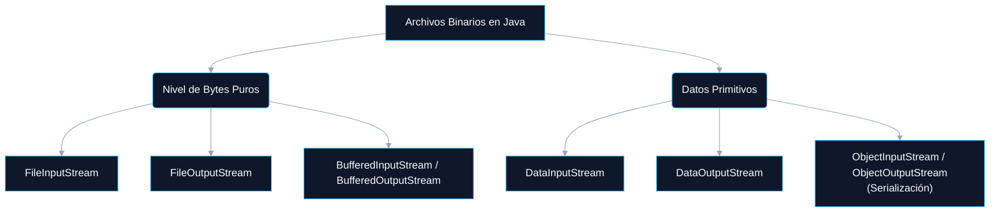

# LECTURA Y ESCRITURA DE INFORMACIÓN EN JAVA

<a id="indice"></a>
## ÍNDICE DINÁMICO
- [4. Archivos Binarios en Java (DataInputStream y DataOutputStream)](#sec4)
  - [4.1 Introducción a los Archivos Binarios](#sec4_1)
    - [4.1.1 Clases Principales](#sec4_1_1)
  - [4.2 Clases DataOutputStream y DataInputStream](#sec4_2)
    - [4.2.1 Escritura de Datos en un Archivo Binario](#sec4_2_1)
    - [4.2.2 Lectura de Datos desde un Archivo Binario](#sec4_2_2)
    - [4.2.3 Características Destacadas](#sec4_2_3)
    - [4.2.4 Casos de Uso Comunes](#sec4_2_4)
  - [4.3 Clases FileInputStream y FileOutputStream](#sec4_3)
    - [4.3.1 Clase FileOutputStream](#sec4_3_1)
    - [4.3.2 Clase FileInputStream](#sec4_3_2)
    - [4.3.3 Copia de Archivos Binarios](#sec4_3_3)
    - [4.3.4 Recomendaciones de Uso](#sec4_3_4)
  - [4.4 Ejercicios Prácticos](#sec4_4)

---

<a id="sec4"></a>
# 4. Archivos Binarios en Java (DataInputStream y DataOutputStream)

<a id="sec4_1"></a>
## 4.1 Introducción a los Archivos Binarios

Los **archivos binarios** almacenan datos en un formato compacto, sin utilizar caracteres legibles. Se utilizan para guardar información como imágenes, audio, vídeo, estructuras de datos complejas y cualquier tipo de contenido que no sea texto puro.



En Java, la lectura y escritura de archivos binarios se maneja con los flujos de datos del paquete `java.io`.

> 💡 **TIPS Prácticos:**
> La diferencia clave: un **archivo de texto** puede abrirse con el Bloc de Notas y leer su contenido. Un **archivo binario** se verá como caracteres extraños o ilegibles. Formatos como `.jpg`, `.mp3`, `.pdf`, `.class` (bytecode de Java) o `.bin` son binarios.

[🏠 Volver al Índice](#indice)

---

<a id="sec4_1_1"></a>
### 4.1.1 Clases Principales

| Clase | Descripción |
| :--- | :--- |
| `FileInputStream` | Permite leer bytes desde un archivo binario. |
| `FileOutputStream` | Permite escribir bytes en un archivo binario. |
| `DataInputStream` | Permite leer datos primitivos (`int`, `double`, etc.) en formato binario. |
| `DataOutputStream` | Permite escribir datos primitivos en un archivo binario. |
| `BufferedInputStream` | Mejora el rendimiento al leer archivos binarios con un buffer. |
| `BufferedOutputStream` | Mejora el rendimiento al escribir archivos binarios con un buffer. |

[🏠 Volver al Índice](#indice)

---

<a id="sec4_2"></a>
## 4.2 Clases DataOutputStream y DataInputStream

Cuando trabajamos con archivos binarios en Java, una de las tareas más habituales consiste en guardar **datos primitivos** (enteros, decimales, cadenas, booleanos, etc.) en formato binario: una representación compacta y no legible directamente.

Java proporciona dos clases fundamentales del paquete `java.io`: `DataOutputStream` y `DataInputStream`. Estas clases permiten escribir y leer directamente tipos de datos primitivos en su representación binaria, **sin necesidad de convertirlos previamente a texto** como ocurre con `PrintWriter` o `BufferedReader`.

[🏠 Volver al Índice](#indice)

---

<a id="sec4_2_1"></a>
### 4.2.1 Escritura de Datos en un Archivo Binario

La clase `DataOutputStream` se utiliza para escribir datos primitivos en un archivo binario. Se usa junto con `FileOutputStream`, que se encarga de abrir el flujo de bytes hacia el archivo físico en disco.

**Ejemplo 1: Escritura de Datos Primitivos en un Archivo Binario**

```java
import java.io.*;

public class EscribirArchivoBinario {
    public static void main(String[] args) {
        try (DataOutputStream dos = new DataOutputStream(new FileOutputStream("datos.bin"))) {
            dos.writeInt(25);            // Escribe un entero (4 bytes)
            dos.writeDouble(3.14);       // Escribe un double (8 bytes)
            dos.writeBoolean(true);      // Escribe un booleano (1 byte)
            dos.writeUTF("Hola, Java!"); // Escribe una cadena en formato UTF-8
            System.out.println("Datos escritos correctamente en datos.bin");
        } catch (IOException e) {
            e.printStackTrace();
        }
    }
}
```

**Explicación:**
- El flujo `DataOutputStream` encapsula un `FileOutputStream` que apunta al archivo `datos.bin`.
- Los métodos `writeInt`, `writeDouble`, `writeBoolean` y `writeUTF` guardan cada tipo de dato en su forma binaria correspondiente.
- El método `writeUTF` codifica la cadena en formato UTF-8 junto con su longitud, lo que permite una recuperación segura posterior.

| Método | Bytes escritos |
| :--- | :--- |
| `writeInt(25)` | 4 bytes |
| `writeDouble(3.14)` | 8 bytes |
| `writeBoolean(true)` | 1 byte |
| `writeUTF("Hola, Java!")` | 2 bytes (longitud) + bytes UTF-8 |

[🏠 Volver al Índice](#indice)

---

<a id="sec4_2_2"></a>
### 4.2.2 Lectura de Datos desde un Archivo Binario

La clase `DataInputStream` cumple la función inversa: permite leer los datos primitivos que previamente han sido almacenados en formato binario. Se usa junto con `FileInputStream`.

**Ejemplo 2: Lectura de Datos Primitivos desde un Archivo Binario**

```java
import java.io.*;

public class LeerArchivoBinario {
    public static void main(String[] args) {
        try (DataInputStream dis = new DataInputStream(new FileInputStream("datos.bin"))) {
            // Los datos deben leerse en el MISMO ORDEN en que fueron escritos
            int    numero  = dis.readInt();
            double decimal = dis.readDouble();
            boolean estado = dis.readBoolean();
            String  texto  = dis.readUTF();

            System.out.println("Número: "  + numero);
            System.out.println("Decimal: " + decimal);
            System.out.println("Booleano: "+ estado);
            System.out.println("Texto: "   + texto);
        } catch (IOException e) {
            e.printStackTrace();
        }
    }
}
```

**Explicación:**
- Los datos deben leerse en el **mismo orden** en que fueron escritos, ya que la codificación binaria no incluye información de tipo que permita reconocer automáticamente los valores.
- `readInt()`, `readDouble()`, `readBoolean()`, `readUTF()` leen exactamente en el mismo orden en que fueron escritos.

> 💡 **TIPS Prácticos:**
> ¡Regla de oro de los archivos binarios! El **orden de escritura = orden de lectura**, siempre. Si escribes `writeInt` → `writeDouble` → `writeUTF`, debes leer `readInt` → `readDouble` → `readUTF`. Cambiar el orden garantiza datos corruptos o excepción.

[🏠 Volver al Índice](#indice)

---

<a id="sec4_2_3"></a>
### 4.2.3 Características Destacadas

- **Compatibilidad con tipos primitivos:** `DataOutputStream`/`DataInputStream` trabajan directamente con `int`, `double`, `float`, `boolean`, `char`, `long`, `short` y `String` (con `writeUTF`/`readUTF`).
- **Orden estricto:** Los datos deben ser leídos exactamente en el mismo orden y tipo en que fueron escritos.
- **Eficiencia:** Al trabajar directamente con bytes, los archivos generados son más **compactos** que los equivalentes en texto.
- **Limitación:** No se pueden escribir **objetos completos** (para eso existe `ObjectOutputStream`, visto en la lección de Serialización).

[🏠 Volver al Índice](#indice)

---

<a id="sec4_2_4"></a>
### 4.2.4 Casos de Uso Comunes

Estas clases son especialmente útiles cuando se desea:

- **Guardar configuraciones** en formato binario (más compacto que texto).
- **Escribir registros estructurados**: por ejemplo, un fichero con puntuaciones de un videojuego.
- **Enviar datos primitivos por red** a través de sockets (`OutputStream` de un socket admite `DataOutputStream`).
- **Trabajar con ficheros binarios personalizados** para lectura/escritura eficiente.

> 🚀 **COMPLEMENTO (Fuera de temario):**
> Los formatos de archivo binarios propios (magic bytes + versión + datos) se usan en la industria para reducir el tamaño al máximo. Por ejemplo, guardar un `int` en binario ocupa 4 bytes fijos. En texto, el número `1234567890` ocupa 10 bytes. A escala de millones de registros, la diferencia es enorme.

[🏠 Volver al Índice](#indice)

---

<a id="sec4_3"></a>
## 4.3 Clases FileInputStream y FileOutputStream

Cuando trabajamos con archivos binarios en Java, la forma más directa y básica de manipularlos es mediante `FileInputStream` y `FileOutputStream`. Estas clases permiten el **acceso a nivel de bytes** a cualquier tipo de archivo, sin realizar ninguna conversión ni interpretación del contenido.

<a id="sec4_3_1"></a>
### 4.3.1 Clase FileOutputStream

`FileOutputStream` se utiliza para **escribir bytes** en un archivo binario. Al crear un objeto de esta clase, se establece una conexión directa con un archivo del sistema.

**Ejemplo: Escritura de bytes en un archivo**

```java
import java.io.*;

public class EscribirBytes {
    public static void main(String[] args) {
        String mensaje = "Hola, mundo en binario!";
        try (FileOutputStream fos = new FileOutputStream("salida.bin")) {
            fos.write(mensaje.getBytes()); // Convierte el String a bytes y los escribe
            System.out.println("Archivo escrito correctamente.");
        } catch (IOException e) {
            e.printStackTrace();
        }
    }
}
```

La cadena se convierte a un array de bytes con `getBytes()` y se escribe en el archivo. Cada carácter se guarda en su correspondiente representación en bytes (habitualmente UTF-8).

[🏠 Volver al Índice](#indice)

---

<a id="sec4_3_2"></a>
### 4.3.2 Clase FileInputStream

`FileInputStream` permite **leer archivos binarios byte a byte**. Es ideal cuando queremos procesar archivos cuyo contenido no es directamente legible o cuando queremos copiar datos sin interpretarlos.

**Ejemplo: Lectura de un archivo binario**

```java
import java.io.*;

public class LeerBytes {
    public static void main(String[] args) {
        try (FileInputStream fis = new FileInputStream("salida.bin")) {
            int byteLeido;
            while ((byteLeido = fis.read()) != -1) {
                System.out.print((char) byteLeido); // Muestra como carácter
            }
        } catch (IOException e) {
            e.printStackTrace();
        }
    }
}
```

Este programa lee los bytes almacenados en `salida.bin` y los convierte a caracteres usando un *cast* a `char`.

[🏠 Volver al Índice](#indice)

---

<a id="sec4_3_3"></a>
### 4.3.3 Copia de Archivos Binarios

Uno de los usos más frecuentes de `FileInputStream` y `FileOutputStream` es **copiar archivos binarios** (imágenes, PDFs, vídeos) byte a byte. Para mayor eficiencia, se usa un buffer de bytes.

**Ejemplo 3: Copiar un archivo binario**

```java
import java.io.*;

public class CopiarArchivoBinario {
    public static void main(String[] args) {
        try (FileInputStream  fis = new FileInputStream("imagen.jpg");
             FileOutputStream fos = new FileOutputStream("copia_imagen.jpg")) {

            byte[] buffer = new byte[1024]; // Buffer de 1 KB
            int bytesLeidos;
            // Lee bloques de hasta 1024 bytes hasta que no quede nada
            while ((bytesLeidos = fis.read(buffer)) != -1) {
                fos.write(buffer, 0, bytesLeidos); // Escribe solo los bytes leídos
            }
            System.out.println("Archivo binario copiado con éxito.");
        } catch (IOException e) {
            e.printStackTrace();
        }
    }
}
```

**Explicación:**
- Se usa un buffer de tamaño fijo (`byte[1024]`) para leer y escribir en bloques.
- `fis.read(buffer)` devuelve el número de bytes realmente leídos (puede ser menor que 1024 al final).
- `fos.write(buffer, 0, bytesLeidos)` escribe solo los bytes que se leyeron realmente (no basura del buffer).

> 🚀 **COMPLEMENTO (Fuera de temario):**
> La técnica de copiar con un array de bytes como buffer es la base de muchos algoritmos de procesamiento de archivos. Aumentar el tamaño del buffer (p. ej., `byte[65536]` = 64 KB) reduce las iteraciones del bucle y puede mejorar la velocidad de copia significativamente en discos modernos.

[🏠 Volver al Índice](#indice)

---

<a id="sec4_3_4"></a>
### 4.3.4 Recomendaciones de Uso

| Caso de uso | Clase recomendada |
| :--- | :--- |
| Lectura y escritura de archivos binarios | `FileInputStream` y `FileOutputStream` |
| Escritura de datos primitivos (`int`, `double`…) | `DataOutputStream` sobre `FileOutputStream` |
| Lectura de datos primitivos | `DataInputStream` sobre `FileInputStream` |
| Copia de archivos binarios | `FileInputStream` + `FileOutputStream` con buffer |
| Guardado de objetos Java completos | `ObjectOutputStream` sobre `FileOutputStream` |

[🏠 Volver al Índice](#indice)

---

<a id="sec4_4"></a>
## 4.4 Ejercicios Prácticos

> 💡 **TIPS Prácticos:**
> El **Ejercicio 1** (Pokémon) requiere elegir los tipos de datos más pequeños que representen cada valor. Por ejemplo, para valores entre 20 y 260, un `short` (2 bytes) es suficiente. El **Ejercicio 2** (cifrado) usa `Random` con semilla para generar la misma secuencia de números pseudoaleatorios tanto al cifrar como al descifrar.

**Ejercicio 1: Archivo binario de Pokémon**
*   **Enunciado:** Crea un archivo binario con la información de 50 Pokémon de forma aleatoria. La información a almacenar es: Número de Pokémon (1-1025), género, y estadísticas (HP, ataque, defensa, ataque especial, defensa especial y velocidad). Las estadísticas pueden tomar valores del 20 al 260; **usa los tipos de datos que minimicen el tamaño del fichero**.
Luego lee el contenido y genéralo en formato texto con el siguiente aspecto por Pokémon:
```
************************************************
* Número: 123                                  *
* Género: Hembra                               *
* Estadísticas:                                *
*   HP             (054) [----               ] *
*   Ataque         (189) [---------------    ] *
*   Defensa        (085) [-------            ] *
*   Ataque esp.    (154) [------------       ] *
*   Defensa esp.   (214) [-----------------  ] *
*   Velocidad      (078) [------             ] *
************************************************
```
*Los guiones deben ser proporcionales al valor: 260 → 20 guiones, 20 → 1 guión.*

**Ejercicio 2: Mensajes Cifrados**
*   **Enunciado:** Crea un programa que genere ficheros binarios con mensajes cifrados usando el siguiente algoritmo:
    - Genera números `short` pseudoaleatorios mediante `Random` con una semilla.
    - Cada `char` de la cadena sin cifrar se suma al número aleatorio y se guarda como `int`.
    - Para descifrar, se leen los `int` y se restan los números aleatorios de la misma semilla, convirtiéndolos a `char`.
    - Crea dos programas: uno para cifrar y otro para descifrar. Solo funcionan si conocen la semilla.

**Ejercicio 3: Guardar una Lista de Números en un Archivo Binario**
*   **Enunciado:** Escribe un programa que almacene una lista de 10 números enteros en un archivo binario llamado `numeros.bin` y luego los lea.

**Ejercicio 4: Guardar y Leer Cadenas en un Archivo Binario**
*   **Enunciado:** Crea un programa que guarde varias cadenas en un archivo binario y luego las lea (usa `writeUTF`/`readUTF`).

**Ejercicio 5: Copiar un Archivo Binario**
*   **Enunciado:** Crea un programa que copie un archivo binario (`imagen.jpg`) en otro archivo (`copia_imagen.jpg`).

**Ejercicio 6: Guardar un Objeto en un Archivo Binario**
*   **Enunciado:** Escribe un programa que guarde un objeto `Persona` en un archivo binario `persona.bin`.

**Ejercicio 7: Leer un Objeto desde un Archivo Binario**
*   **Enunciado:** Crea un programa que lea un objeto `Persona` desde el archivo `persona.bin`.

**Ejercicio 8: Guardar una Lista de Objetos en un Archivo Binario**
*   **Enunciado:** Modifica el programa anterior para guardar varias `Persona` en un archivo binario.

**Ejercicio 9: Leer una Lista de Objetos desde un Archivo Binario**
*   **Enunciado:** Crea un programa que lea una lista de `Persona` desde `personas.bin`.

**Ejercicio 10: Contar el Tamaño de un Archivo Binario**
*   **Enunciado:** Escribe un programa que cuente el tamaño de un archivo binario y lo muestre en bytes.

**Ejercicio 11: Comprobar si un Archivo Binario Existe**
*   **Enunciado:** Escribe un programa que verifique si un archivo binario existe antes de leerlo.

[🏠 Volver al Índice](#indice)
