# LECTURA Y ESCRITURA DE INFORMACIÓN EN JAVA

<a id="indice"></a>
## ÍNDICE DINÁMICO
- [5. Archivos de Acceso Aleatorio en Java (RandomAccessFile)](#sec5)
  - [5.1 Introducción a los Archivos de Acceso Aleatorio](#sec5_1)
  - [5.2 Características y Funcionalidades de RandomAccessFile](#sec5_2)
  - [5.3 Ejemplos Prácticos](#sec5_3)
    - [5.3.1 Escritura Secuencial y Lectura con Posicionamiento](#sec5_3_1)
    - [5.3.2 Actualización de un Registro](#sec5_3_2)
  - [5.4 Ventajas del Uso de RandomAccessFile](#sec5_4)
  - [5.5 Ejercicios Prácticos](#sec5_5)

---

<a id="sec5"></a>
# 5. Archivos de Acceso Aleatorio en Java (RandomAccessFile)

<a id="sec5_1"></a>
## 5.1 Introducción a los Archivos de Acceso Aleatorio

Los **archivos de acceso aleatorio** permiten leer y escribir datos en **posiciones específicas** de un archivo sin tener que recorrer secuencialmente todo su contenido. Esta característica es especialmente útil cuando se requiere actualizar registros individuales o acceder rápidamente a datos almacenados en posiciones fijas.

```mermaid
%%{init: {'theme': 'base', 'themeVariables': { 'primaryColor': '#1e293b', 'primaryTextColor': '#f8fafc', 'primaryBorderColor': '#38bdf8', 'lineColor': '#94a3b8', 'mainBkg': '#0f172a', 'nodeBorder': '#38bdf8', 'clusterBkg': '#1e293b', 'clusterBorder': '#38bdf8'}}}%%
graph LR
    A["Archivo (datos.dat)"] --> B["[reg0][reg1][reg2][reg3][reg4]"]
    C[RandomAccessFile] -->|"seek(pos)"| D["↓ Puntero"]
    D --> B
    style B fill:#1e293b,stroke:#38bdf8
    style D fill:#0f172a,stroke:#38bdf8
```



Java proporciona la clase `RandomAccessFile`, que **combina funcionalidades de lectura y escritura** y permite mover el puntero (*offset*) a cualquier posición del archivo para realizar operaciones.

Esta técnica es muy utilizada en aplicaciones donde el archivo se organiza en **registros de tamaño fijo** o cuando se requiere modificar datos sin reescribir el archivo completo.

> 💡 **TIPS Prácticos:**
> Piensa en `RandomAccessFile` como la aguja de un tocadiscos: puedes llevarla directamente a cualquier surco (posición) sin tener que escuchar toda la melodía desde el principio. Esto es imposible con los flujos secuenciales (`InputStream`/`BufferedReader`), que solo avanzan hacia adelante.

[🏠 Volver al Índice](#indice)

---

<a id="sec5_2"></a>
## 5.2 Características y Funcionalidades de RandomAccessFile

`RandomAccessFile` es única porque **no hereda ni de `InputStream` ni de `OutputStream`**, sino que implementa directamente las interfaces `DataInput` y `DataOutput`, lo que le da capacidad de lectura y escritura simultánea.

**Modo de Apertura:**
La clase `RandomAccessFile` puede abrirse en dos modos:
- `"r"`: Solo lectura.
- `"rw"`: Lectura y escritura.

```java
RandomAccessFile raf = new RandomAccessFile("datos.dat", "rw");
```

**Posicionamiento con `seek()`:**
Mueve el puntero a cualquier posición del archivo (en bytes desde el inicio).

```java
raf.seek(50); // Mueve el puntero a la posición byte 50
```

**Métodos de Lectura y Escritura de Datos Primitivos:**

| Escritura | Lectura | Bytes |
| :--- | :--- | :--- |
| `writeInt(int v)` | `readInt()` | 4 |
| `writeDouble(double v)` | `readDouble()` | 8 |
| `writeUTF(String s)` | `readUTF()` | Variable |
| `writeLong(long v)` | `readLong()` | 8 |
| `writeBoolean(boolean v)` | `readBoolean()` | 1 |

**Tamaño del Archivo:**
Con `length()` se puede conocer el tamaño total del archivo en bytes.

> 🚀 **COMPLEMENTO (Fuera de temario):**
> Para que `seek()` sea útil con registros, estos deben tener un **tamaño fijo**. Por ejemplo, si cada registro es un `int` (4 bytes), el registro número *n* empieza en la posición `n * 4`. Por eso, el `writeUTF` (tamaño variable) dificulta el acceso aleatorio a registros de cadenas: para cadenas de longitud fija, se suelen usar arrays de `char` rellenos con espacios.

[🏠 Volver al Índice](#indice)

---

<a id="sec5_3"></a>
## 5.3 Ejemplos Prácticos

<a id="sec5_3_1"></a>
### 5.3.1 Escritura Secuencial y Lectura con Posicionamiento

En este ejemplo se crea un archivo en modo lectura-escritura, se escriben varios números enteros y posteriormente se lee desde una posición específica usando `seek()`.

```java
import java.io.*;

public class AccesoAleatorioEjemplo {
    public static void main(String[] args) {
        try (RandomAccessFile raf = new RandomAccessFile("enteros.dat", "rw")) {

            // Escritura secuencial de 10 números enteros (cada int = 4 bytes)
            for (int i = 0; i < 10; i++) {
                raf.writeInt(i * 10); // Escribe: 0, 10, 20, 30, 40, 50, 60, 70, 80, 90
            }
            System.out.println("Se han escrito 10 números enteros.");

            // El 5º entero (índice 4) está en la posición 4 * 4 = 16 bytes
            raf.seek(4 * 4);
            int numero = raf.readInt();
            System.out.println("El número leído en la posición 5 es: " + numero); // 40
        } catch (IOException e) {
            e.printStackTrace();
        }
    }
}
```

> 💡 **TIPS Prácticos:**
> La fórmula para calcular la posición de un registro es: `posición = índice × tamaño_del_tipo`. Para un `int` (4 bytes), el registro 0 está en el byte 0, el registro 1 en el byte 4, el registro 2 en el byte 8, etc. ¡Este cálculo suele aparecer en exámenes!

[🏠 Volver al Índice](#indice)

---

<a id="sec5_3_2"></a>
### 5.3.2 Actualización de un Registro

Supongamos que tenemos un archivo con registros fijos de enteros. Actualizaremos el valor de un registro en una posición determinada sin tocar el resto.

```java
import java.io.*;

public class ActualizarRegistro {
    public static void main(String[] args) {
        try (RandomAccessFile raf = new RandomAccessFile("enteros.dat", "rw")) {

            // Posicionamos en el registro 3 (índice 2 → posición 2 * 4 = 8 bytes)
            raf.seek(2 * 4);
            int valorAnterior = raf.readInt();
            System.out.println("Valor anterior en la posición 3: " + valorAnterior);

            // Volvemos al inicio del mismo registro para sobreescribirlo
            raf.seek(2 * 4);
            raf.writeInt(999);
            System.out.println("Registro actualizado a 999.");
        } catch (IOException e) {
            e.printStackTrace();
        }
    }
}
```

> 🚀 **COMPLEMENTO (Fuera de temario):**
> Observa el patrón: leer → retroceder con `seek()` → escribir. Después de `readInt()`, el puntero avanza 4 bytes automáticamente. Hay que volver a la posición de inicio del registro antes de escribir. Esto es crítico y un error muy común al usar `RandomAccessFile`.

[🏠 Volver al Índice](#indice)

---

<a id="sec5_4"></a>
## 5.4 Ventajas del Uso de RandomAccessFile

| Ventaja | Descripción |
| :--- | :--- |
| **Flexibilidad** | Permite leer o modificar datos en cualquier parte del archivo sin procesar el resto. |
| **Eficiencia** | No es necesario procesar el archivo de forma secuencial para acceder a una parte específica. |
| **Actualización in-place** | Puede modificar un registro individual sin reescribir todo el archivo. |
| **Aplicaciones Especializadas** | Muy útil en bases de datos simples, archivos de registros fijos o sistemas de gestión de índices. |

[🏠 Volver al Índice](#indice)

---

<a id="sec5_5"></a>
## 5.5 Ejercicios Prácticos

> 💡 **TIPS Prácticos:**
> El **Ejercicio 1** (3 en raya) es el más completo: necesita usar `RandomAccessFile` para almacenar el tablero de juego (9 posiciones) y permitir deshacer movimientos. El truco del "deshacer" (comando `r`) es que cada `writeInt` te indica dónde está cada pieza; para deshacer, basta con sobreescribir esa posición con el valor de "vacío". Los ejercicios 2–11 son progresivos: empieza por el 2 antes de abordar los más complejos.

**Ejercicio 1: 3 en Raya con Acceso Aleatorio**
*   **Enunciado:** Crea un programa que permita jugar al 3 en raya. El tablero tendrá las posiciones 1-9:
```
1 2 3
4 5 6
7 8 9
```
- Si introduces un número (1-9): coloca el símbolo del jugador actual en esa posición (si es posible).
- Si introduces `r`: deshace el movimiento anterior. Puede usarse varias veces hasta reiniciar el tablero.
- El programa debe detectar si hay ganador o tablas.
- Debe emplearse un **archivo** para almacenar los movimientos.

**Ejercicio 2: Escribir y Leer Números Enteros**
*   **Enunciado:** Escribe un programa que almacene 5 números enteros en un archivo llamado `numerosRAF.dat` y luego lea el tercer número almacenado.

**Ejercicio 3: Actualizar un Registro Específico**
*   **Enunciado:** Crea un programa que lea el segundo número entero del archivo `numerosRAF.dat` y lo actualice a `555`, luego muestre el archivo completo.

**Ejercicio 4: Escribir y Leer Cadenas de Texto de Longitud Fija**
*   **Enunciado:** Escribe un programa que almacene 3 cadenas de texto de longitud fija (20 caracteres) en un archivo `cadenasRAF.dat` y luego lea la segunda cadena.

**Ejercicio 5: Leer el Último Registro**
*   **Enunciado:** Crea un programa que lea el último número entero almacenado en el archivo `numerosRAF.dat`.

**Ejercicio 6: Insertar un Registro sin Sobrescribir**
*   **Enunciado:** Desarrolla un programa que inserte un número entero en la posición 3 de `numerosRAF.dat`, desplazando los registros posteriores.

**Ejercicio 7: Eliminar el Último Registro**
*   **Enunciado:** Crea un programa que elimine el último número entero de `numerosRAF.dat` reduciendo el tamaño del archivo.

**Ejercicio 8: Mostrar Todo el Contenido del Archivo**
*   **Enunciado:** Desarrolla un programa que muestre todos los números enteros almacenados en `numerosRAF.dat` de manera secuencial.

**Ejercicio 9: Modificar un Registro Basado en su Valor**
*   **Enunciado:** Escribe un programa que busque un número específico en `numerosRAF.dat` y lo modifique a `9999` si lo encuentra.

**Ejercicio 10: Duplicar el Contenido del Archivo**
*   **Enunciado:** Crea un programa que lea todos los números enteros de `numerosRAF.dat` y los duplique, agregando los duplicados al final del archivo.

**Ejercicio 11: Registrar Información Estructurada**
*   **Enunciado:** Imagina un archivo que almacena registros de empleados, donde cada registro consta de un `ID` (`int`) y un `salario` (`double`). Escribe un programa que inserte 3 registros en `empleados.dat` y luego muestre el registro del empleado con el mayor salario.

[🏠 Volver al Índice](#indice)
