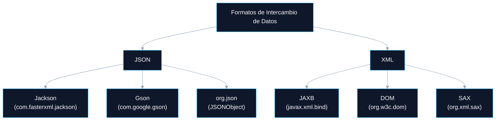

# LECTURA Y ESCRITURA DE INFORMACIÓN EN JAVA

<a id="indice"></a>
## ÍNDICE DINÁMICO
- [7. Manejo de Documentos en Diferentes Formatos (JSON, XML)](#sec7)
  - [7.1 JSON en Java](#sec7_1)
    - [7.1.1 Librerías Populares para Manejar JSON en Java](#sec7_1_1)
  - [7.2 Usando Jackson para Manejo de JSON](#sec7_2)
    - [7.2.1 Serializar un Objeto a JSON](#sec7_2_1)
    - [7.2.2 Deserializar JSON a Objeto](#sec7_2_2)
    - [7.2.3 Serializar una Lista de Objetos a JSON](#sec7_2_3)
    - [7.2.4 Leer una Lista desde un JSON](#sec7_2_4)
  - [7.3 XML en Java](#sec7_3)
    - [7.3.1 Librerías Populares para Manejo de XML](#sec7_3_1)
    - [7.3.2 Serializar un Objeto a XML con JAXB](#sec7_3_2)
    - [7.3.3 Deserializar un XML a Objeto](#sec7_3_3)
  - [7.4 Comparación JSON vs. XML](#sec7_4)
  - [7.5 Ejercicios Prácticos](#sec7_5)

---

<a id="sec7"></a>
# 7. Manejo de Documentos en Diferentes Formatos (JSON, XML)

El manejo de documentos en formatos como **JSON** y **XML** es esencial en la programación moderna para el intercambio de datos entre aplicaciones, servicios web y bases de datos. Java proporciona diversas bibliotecas para manejar estos formatos de manera eficiente.



<a id="sec7_1"></a>
## 7.1 JSON en Java

**JSON** (JavaScript Object Notation) es un formato ligero para el intercambio de datos. Es ampliamente utilizado en APIs REST y aplicaciones web por su facilidad de lectura y escritura.

> 💡 **TIPS Prácticos:**
> JSON usa una sintaxis muy similar a los objetos literales de JavaScript: `{"clave": "valor"}`. Para arrays: `[{...}, {...}]`. Al leer JSON en Java, el proceso se llama **deserialización** (JSON → objeto Java): lo contrario a la serialización de la lección anterior.

[🏠 Volver al Índice](#indice)

---

<a id="sec7_1_1"></a>
### 7.1.1 Librerías Populares para Manejar JSON en Java

| Librería | Paquete | Características |
| :--- | :--- | :--- |
| **Jackson** | `com.fasterxml.jackson` | La más completa y flexible. Recomendada para proyectos profesionales. |
| **Gson** | `com.google.gson` | Ligera y fácil de usar. Desarrollada por Google. |
| **org.json** | `org.json` | Básica, integrada en algunas versiones/frameworks Java. |

> 🚀 **COMPLEMENTO (Fuera de temario):**
> **Jackson** es la librería JSON por excelencia en el ecosistema Java empresarial. Frameworks como **Spring Boot** la usan internamente de forma automática para convertir objetos Java a JSON en las respuestas de las APIs REST. Conocerla es esencial para cualquier desarrollador backend Java.

[🏠 Volver al Índice](#indice)

---

<a id="sec7_2"></a>
## 7.2 Usando Jackson para Manejo de JSON

<a id="sec7_2_1"></a>
### 7.2.1 Serializar un Objeto a JSON

Para convertir un objeto Java a JSON, usamos la clase `ObjectMapper` de Jackson.

**Clase de modelo:**
```java
public class Persona {
    public String nombre;
    public int    edad;

    public Persona(String nombre, int edad) {
        this.nombre = nombre;
        this.edad   = edad;
    }

    // Constructor por defecto (Jackson lo necesita para deserializar)
    public Persona() {}
}
```

**Ejemplo 1: Convertir un Objeto a JSON**

```java
import com.fasterxml.jackson.databind.ObjectMapper;
import java.io.File;
import java.io.IOException;

public class JSONEjemplo {
    public static void main(String[] args) {
        Persona p = new Persona("Carlos", 30);
        ObjectMapper mapper = new ObjectMapper();

        try {
            // writeValue escribe el JSON en el archivo persona.json
            mapper.writeValue(new File("persona.json"), p);
            System.out.println("JSON generado en persona.json");
        } catch (IOException e) {
            e.printStackTrace();
        }
    }
}
```

**Salida (`persona.json`):**
```json
{
  "nombre": "Carlos",
  "edad": 30
}
```

> 💡 **TIPS Prácticos:**
> Para que Jackson pueda serializar/deserializar una clase, necesita: (1) que los atributos sean `public` **o** que tenga getters/setters, y (2) un **constructor sin parámetros**. Si falta el constructor vacío, obtendrás un error al deserializar.

[🏠 Volver al Índice](#indice)

---

<a id="sec7_2_2"></a>
### 7.2.2 Deserializar JSON a Objeto

Podemos leer un archivo JSON y convertirlo en un objeto Java.

**Ejemplo 2: Leer JSON y Convertirlo a Objeto**

```java
import java.io.File;
import java.io.IOException;
import com.fasterxml.jackson.databind.ObjectMapper;

public class LeerJSON {
    public static void main(String[] args) {
        ObjectMapper mapper = new ObjectMapper();

        try {
            // readValue lee el JSON del archivo y lo mapea a la clase Persona
            Persona p2 = mapper.readValue(new File("persona.json"), Persona.class);
            System.out.println("Objeto deserializado: " + p2.nombre + ", " + p2.edad);
        } catch (IOException e) {
            e.printStackTrace();
        }
    }
}
```

[🏠 Volver al Índice](#indice)

---

<a id="sec7_2_3"></a>
### 7.2.3 Serializar una Lista de Objetos a JSON

**Ejemplo 3: Convertir una Lista de Personas a JSON**

```java
import java.util.Arrays;
import java.util.List;
import java.io.File;
import java.io.IOException;
import com.fasterxml.jackson.databind.ObjectMapper;

public class SerializarListaJSON {
    public static void main(String[] args) {
        List<Persona> personas = Arrays.asList(
            new Persona("Ana",   25),
            new Persona("Luis",  35),
            new Persona("Sofía", 40)
        );

        ObjectMapper mapper = new ObjectMapper();

        try {
            mapper.writeValue(new File("personas.json"), personas);
            System.out.println("Lista serializada a JSON.");
        } catch (IOException e) {
            e.printStackTrace();
        }
    }
}
```

**Salida (`personas.json`):**
```json
[
  { "nombre": "Ana",   "edad": 25 },
  { "nombre": "Luis",  "edad": 35 },
  { "nombre": "Sofía", "edad": 40 }
]
```

[🏠 Volver al Índice](#indice)

---

<a id="sec7_2_4"></a>
### 7.2.4 Leer una Lista desde un JSON

Para deserializar una lista de objetos, necesitamos usar `TypeReference` para preservar la información del tipo genérico.

**Ejemplo 4: Leer un JSON y Convertirlo a Lista de Objetos**

```java
import java.util.List;
import java.io.File;
import java.io.IOException;
import com.fasterxml.jackson.databind.ObjectMapper;
import com.fasterxml.jackson.core.type.TypeReference;

public class LeerListaJSON {
    public static void main(String[] args) {
        ObjectMapper mapper = new ObjectMapper();

        try {
            // TypeReference conserva los genéricos en tiempo de ejecución
            List<Persona> personas = mapper.readValue(
                new File("personas.json"),
                new TypeReference<List<Persona>>() {}
            );

            for (Persona p : personas) {
                System.out.println("Nombre: " + p.nombre + ", Edad: " + p.edad);
            }
        } catch (IOException e) {
            e.printStackTrace();
        }
    }
}
```

> 🚀 **COMPLEMENTO (Fuera de temario):**
> `TypeReference<List<Persona>>() {}` crea una subclase anónima que "captura" el tipo genérico en tiempo de ejecución, evitando el problema de *type erasure* de Java. Es el patrón estándar de Jackson para deserializar colecciones genéricas.

[🏠 Volver al Índice](#indice)

---

<a id="sec7_3"></a>
## 7.3 XML en Java

**XML** (Extensible Markup Language) es otro formato estructurado comúnmente utilizado en configuraciones y comunicación de datos. Aunque más verboso que JSON, ofrece características avanzadas como validación con XSD y soporte para namespaces.

<a id="sec7_3_1"></a>
### 7.3.1 Librerías Populares para Manejo de XML

| Librería | Descripción |
| :--- | :--- |
| **JAXB** (`javax.xml.bind`) | Convierte objetos Java a XML y viceversa mediante anotaciones. |
| **DOM** (`org.w3c.dom`) | Manipula XML como un árbol de nodos en memoria. Ideal para modificar documentos XML. |
| **SAX** (`org.xml.sax`) | Procesa XML secuencialmente (orientado a eventos). Eficiente en memoria para archivos grandes. |

[🏠 Volver al Índice](#indice)

---

<a id="sec7_3_2"></a>
### 7.3.2 Serializar un Objeto a XML con JAXB

JAXB (*Java Architecture for XML Binding*) usa anotaciones para mapear clases a elementos XML.

**Clase de modelo con anotaciones JAXB:**

```java
import javax.xml.bind.annotation.XmlElement;
import javax.xml.bind.annotation.XmlRootElement;

@XmlRootElement // Define el elemento raíz del XML
public class Cliente {
    private String nombre;
    private int    edad;

    public Cliente() {} // Constructor vacío obligatorio para JAXB

    public Cliente(String nombre, int edad) {
        this.nombre = nombre;
        this.edad   = edad;
    }

    @XmlElement public String getNombre() { return nombre; }
    @XmlElement public int    getEdad()   { return edad;   }

    public void setNombre(String nombre) { this.nombre = nombre; }
    public void setEdad(int edad)        { this.edad   = edad;   }
}
```

**Ejemplo 5: Convertir un Objeto a XML**

```java
import javax.xml.bind.JAXBContext;
import javax.xml.bind.Marshaller;
import java.io.File;

public class SerializarXML {
    public static void main(String[] args) {
        try {
            Cliente cliente = new Cliente("Juan", 40);

            JAXBContext contexto  = JAXBContext.newInstance(Cliente.class);
            Marshaller  marshaller = contexto.createMarshaller();
            // Formatear el XML con indentación para mejor legibilidad
            marshaller.setProperty(Marshaller.JAXB_FORMATTED_OUTPUT, true);
            marshaller.marshal(cliente, new File("cliente.xml"));

            System.out.println("Cliente serializado a XML.");
        } catch (Exception e) {
            e.printStackTrace();
        }
    }
}
```

**Salida (`cliente.xml`):**
```xml
<cliente>
    <nombre>Juan</nombre>
    <edad>40</edad>
</cliente>
```

> 💡 **TIPS Prácticos:**
> En Java 9+, JAXB ya no viene incluido en el JDK por defecto (fue movido al módulo `java.xml.bind`). Para usarlo en proyectos modernos, es necesario añadir la dependencia `jakarta.xml.bind-api` a tu `pom.xml` (Maven) o `build.gradle` (Gradle).

[🏠 Volver al Índice](#indice)

---

<a id="sec7_3_3"></a>
### 7.3.3 Deserializar un XML a Objeto

**Ejemplo 6: Leer un XML y Convertirlo a Objeto**

```java
import javax.xml.bind.JAXBContext;
import javax.xml.bind.Unmarshaller;
import java.io.File;

public class LeerXML {
    public static void main(String[] args) {
        try {
            JAXBContext  contexto     = JAXBContext.newInstance(Cliente.class);
            Unmarshaller unmarshaller = contexto.createUnmarshaller();

            // unmarshal convierte el XML en un objeto Java
            Cliente cliente = (Cliente) unmarshaller.unmarshal(new File("cliente.xml"));
            System.out.println("Cliente deserializado: "
                + cliente.getNombre() + ", " + cliente.getEdad());
        } catch (Exception e) {
            e.printStackTrace();
        }
    }
}
```

> 🚀 **COMPLEMENTO (Fuera de temario):**
> El proceso JAXB completo para XML es: **Marshalling** (objeto → XML) con `Marshaller`, y **Unmarshalling** (XML → objeto) con `Unmarshaller`. Por analogía con JSON, ambos procesos son equivalentes a *serializar* y *deserializar*.

[🏠 Volver al Índice](#indice)

---

<a id="sec7_4"></a>
## 7.4 Comparación JSON vs. XML

| Característica | JSON | XML |
| :--- | :--- | :--- |
| **Simplicidad** | Más simple y ligero. | Más verboso (etiquetas de apertura/cierre). |
| **Legibilidad** | Más fácil de leer. | Más difícil de leer para humanos. |
| **Tamaño** | Archivos más pequeños. | Archivos más grandes por las etiquetas repetidas. |
| **Uso principal** | APIs REST, almacenamiento de datos, configuración. | Configuración empresarial, integración de sistemas, SOAP. |
| **Validación** | JSON Schema (menos extendido). | XSD (robusto y ampliamente soportado). |
| **Librerías Java** | Jackson, Gson | JAXB, DOM, SAX |

> 💡 **TIPS Prácticos:**
> Para proyectos nuevos, **usa JSON con Jackson**. Es el estándar de facto para APIs REST modernas, más compacto y más fácil de trabajar. Reserva XML para cuando interactúes con sistemas legacy, servicios SOAP, o cuando la validación formal del esquema (XSD) sea un requisito.

[🏠 Volver al Índice](#indice)

---

<a id="sec7_5"></a>
## 7.5 Ejercicios Prácticos

> 💡 **TIPS Prácticos:**
> Para realizar estos ejercicios necesitas las **dependencias de Jackson y JAXB** en tu proyecto. Si usas Maven, añade `jackson-databind` al `pom.xml`. Si usas IntelliJ sin Maven, descarga el JAR de Jackson desde [Maven Repository](https://mvnrepository.com/) y añádelo al classpath del proyecto.

**Ejercicio 1: Serializar un Objeto Producto en JSON**
*   **Enunciado:** Crea una clase `Producto` con los atributos `nombre` y `precio`. Serializa un objeto en un archivo `producto.json`.

> **Salida esperada (`producto.json`):**
> ```json
> {
>   "nombre": "Laptop",
>   "precio": 1200.99
> }
> ```

**Ejercicio 2: Leer un Archivo JSON y Convertirlo a Objeto**
*   **Enunciado:** Lee el archivo `producto.json` y conviértelo en un objeto `Producto`. Imprime sus datos.

**Ejercicio 3: Serializar y Deserializar una Lista de Pedidos**
*   **Enunciado:** Crea una lista de `Pedido` con atributos `cliente` y `monto`. Guárdala en `pedidos.json` y luego léela.

> **Salida esperada (`pedidos.json`):**
> ```json
> [
>   { "cliente": "Juan",  "monto": 150.75 },
>   { "cliente": "Ana",   "monto": 320.50 },
>   { "cliente": "Pedro", "monto":  99.99 }
> ]
> ```

**Ejercicio 4: Convertir un Objeto Factura a XML**
*   **Enunciado:** Crea una clase `Factura` con atributos `id` y `total`. Serializa un objeto en `factura.xml` usando JAXB.

> **Salida esperada (`factura.xml`):**
> ```xml
> <factura>
>     <id>1001</id>
>     <total>499.99</total>
> </factura>
> ```

**Ejercicio 5: Leer un XML y Convertirlo a Objeto**
*   **Enunciado:** Lee el archivo `factura.xml` y conviértelo a un objeto `Factura`. Imprime sus atributos.

**Ejercicio 6: Comparar el Tamaño de un Archivo JSON vs. XML**
*   **Enunciado:** Mide el tamaño de `producto.json` y `factura.xml` (usando `new File(...).length()`) y muestra cuál ocupa más espacio y cuánto.

**Ejercicio 7: Convertir un XML a JSON**
*   **Enunciado:** Lee el contenido de `factura.xml` deserializándolo con JAXB, y luego serializa el resultado en un archivo `factura.json` con Jackson.

**Ejercicio 8: Extraer un Valor Específico de un JSON**
*   **Enunciado:** Lee `pedidos.json` y muestra por consola solo los pedidos cuyo `monto` sea mayor a 200.

[🏠 Volver al Índice](#indice)
