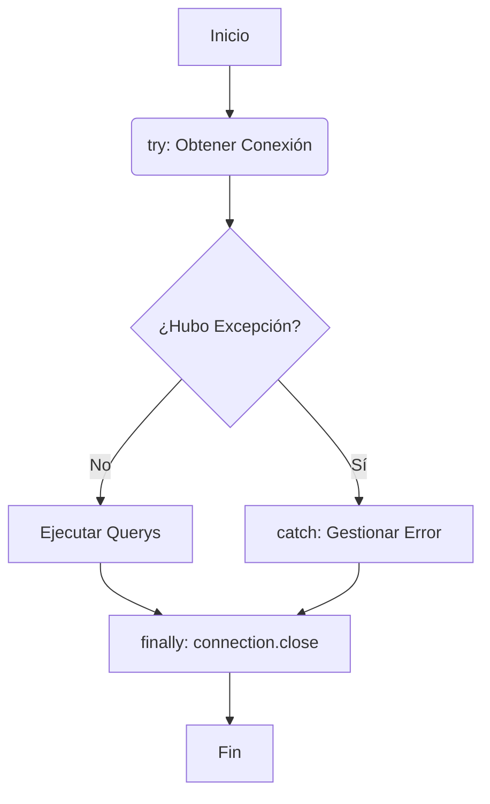
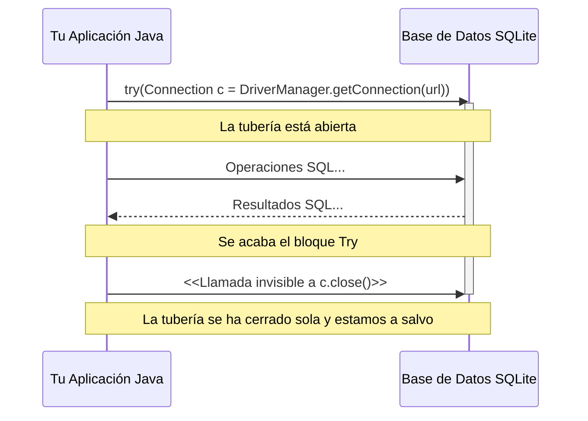

# 🧠 Teoría - Nivel 01: La Conexión Segura

A la hora de conectar Java con cualquier Base de Datos (MySQL, PostgreSQL o, en nuestro caso práctico, SQLite), necesitamos utilizar una tubería. Esa tubería es la interfaz `java.sql.Connection`.

El mayor problema al que se enfrentan los desarrolladores novatos es que olvidan cerrar la tubería. Dejar la conexión abierta provoca **Memory Leaks** (fugas de memoria) y termina saturando el servidor de base de datos hasta derribarlo (Error: *Too many connections*).

## 📊 Diagrama de Ciclo de Vida: El patrón Antiguo vs Try-With-Resources

El viejo estándar (Java 6) obligaba a usar un bloque `finally` para asegurar el cierre de la conexión, incluso si saltaba una excepción `SQLException`.



En **Java 7+**, todo recurso que implemente la interfaz `AutoCloseable` (como las conexiones, los statements y los ResultSets) puede instanciarse directamente entre los paréntesis del bloque `try`. De este modo, **Java garantiza su cierre de forma totalmente invisible** al abandonar el bloque.



## 🛠️ El Patrón Singleton para Conexiones
No obstante, en ocasiones queremos mantener una única conexión viva durante mucho tiempo en lugar de abrirla y cerrarla constantemente (por eficiencia). Ahí es donde brilla el patrón **Singleton**.

Un Singleton asegura que una clase sólo tenga **una** única instancia en toda su vida.
```java
public class MotorBD {
    // 1. Instancia estática privada
    private static Connection conexionUnica;
    
    // 2. Constructor privado (nadie puede hacer 'new MotorBD()')
    private MotorBD() {}
    
    // 3. Método estático global que te la entrega
    public static Connection getConexion() {
        // Lógica de si está nula o cerrada, crearla...
        return conexionUnica;
    }
}
```

En este Nivel 1 te tocará implementar la lógica para obtener la conexión mediante un Singleton y también crear un método independiente para validar si eres capaz de operar un bloque `Try-With-Resources`. ¡Vamos a por ello!
