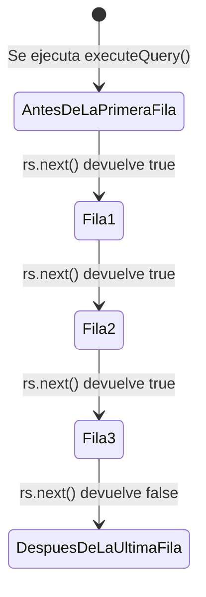

# 🧠 Teoría - Nivel 02: Extracción de Datos y Cursores (`ResultSet`)

Hasta ahora hemos aprendido a abrir una conexión y a ejecutar comandos simples usando `Statement.execute()`. Sin embargo, el 90% del tiempo de una aplicación consiste en **leer** datos de la base de datos usando sentencias `SELECT`.

Para esto, **JAMÁS** usamos `executeUpdate()`. El método reservado y estricto para extraer información es `executeQuery()`.

```java
ResultSet rs = stmt.executeQuery("SELECT id, titulo FROM libros");
```

## 🎯 El Misterio del Cursor

Cuando `executeQuery` devuelve el `ResultSet`, muchos alumnos cometen el error de intentar leer datos inmediatamente haciendo `rs.getString(1)`. ¡Esto provocará un fallo brutal!

El `ResultSet` no es una lista de Java. Es un **cursor** que apunta a los registros en la memoria de la base de datos. Y aquí está la trampa: **Al nacer, el cursor apunta a la NADA (antes de la primera fila)**.



Por lo tanto, es **estrictamente obligatorio** llamar a `rs.next()` al menos una vez antes de intentar leer. La forma profesional de leer todas las filas es un bucle `while`:

```java
while(rs.next()) {
    // Si entras aquí, es seguro leer la fila actual.
}
```

## ⚠️ Los Índices en JDBC empiezan en 1

Olvídate de lo que sabes sobre arrays en programación. En el universo de las Bases de Datos SQL, todo empieza a contar desde el número **1**.

Si ejecutas `SELECT id, titulo, autor FROM libros`:
- `rs.getInt(1)` -> Extrae el `id`.
- `rs.getString(2)` -> Extrae el `titulo`.
- `rs.getString("autor")` -> Extrae el `autor` por nombre de columna (más seguro y legible, aunque ligeramente más lento).

## 🛡️ PreparedStatement: La Armadura contra el Hackeo

Si necesitas concatenar variables en tu `SELECT` (por ejemplo, buscar libros de un autor específico), NUNCA concatenes Strings en Java (`"SELECT * FROM libros WHERE autor = '" + autor + "'"`). Esto permite inyección SQL.

Usa `PreparedStatement` poniendo interrogaciones `?`:

```java
String sql = "SELECT * FROM libros WHERE autor = ?";
PreparedStatement pstmt = conn.prepareStatement(sql);
pstmt.setString(1, "George Orwell"); // ¡Ojo! El índice del primer ? es 1, no 0.
ResultSet rs = pstmt.executeQuery();
```
