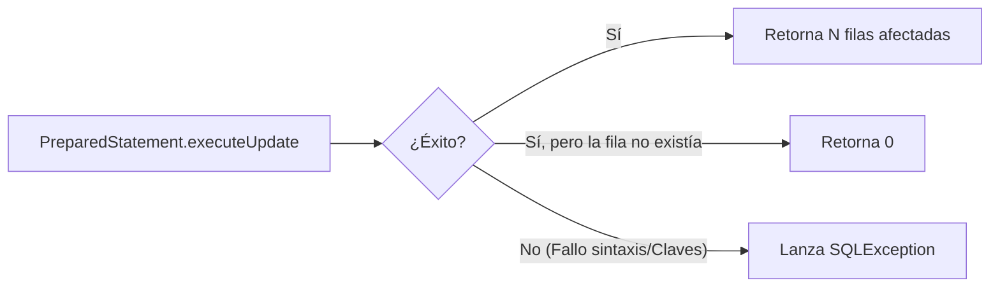

# 🧠 Teoría - Nivel 03: Mutaciones e Inserciones (DML)

Hasta ahora hemos leído datos (`SELECT`), pero las aplicaciones vivas modifican su entorno. Para insertar (`INSERT`), actualizar (`UPDATE`) y borrar (`DELETE`), JDBC expone el método estricto y único: **`executeUpdate()`**.

```java
int filasAfectadas = pstmt.executeUpdate();
```

## 🎯 ¿Qué devuelve executeUpdate?

A diferencia de `executeQuery()`, que devuelve un cursor complejo (`ResultSet`), las mutaciones en base de datos devuelven simplemente un **número entero (`int`)**. 
Este número representa **cuántas filas han sido alteradas o creadas**.



## ⚠️ La trampa del DELETE

Si haces un `DELETE FROM libros WHERE id = 999` y ese libro no existe, la base de datos no se rompe. Simplemente ignora la petición porque no hay nada que borrar. Por tanto, `executeUpdate()` **no lanzará una excepción**. Simplemente devolverá `0`. Esta es una trampa muy clásica en exámenes y proyectos.

## 🛡️ Insertar Valores Nulos de Forma Profesional

Si quieres insertar un libro que NO tiene archivo digital, no puedes poner `"null"` en formato texto, y tampoco es buena idea confiar en pasar el objeto `null` de Java directamente al statement. 

Para forzar a la base de datos a insertar su `NULL` real de forma segura y estandarizada, se utiliza:
```java
pstmt.setNull(indice, java.sql.Types.VARCHAR);
```
Esta mecánica se utiliza fuertemente en patrones de persistencia (como en tu DAO de la clase).
