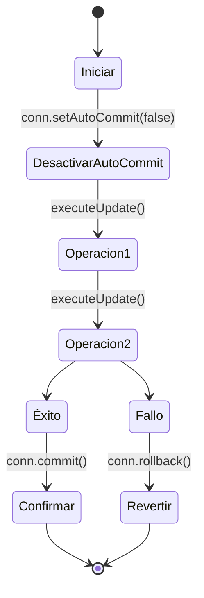

# 🧠 Teoría - Nivel 04: Transacciones y Claves Generadas

Entramos en el terreno de los Arquitectos Senior. En aplicaciones corporativas, las acciones rara vez ocurren aisladas. Por ejemplo, al crear un Préstamo en una biblioteca, hay que insertar el préstamo Y restar una copia del libro. Si la resta falla pero el préstamo se guarda, tu base de datos queda corrupta.

Para esto existe el **Control Transaccional**.

## 🛡️ Atomicidad (Todo o Nada)

Por defecto, cada instrucción SQL en JDBC se ejecuta y se guarda inmediatamente (`AutoCommit = true`). Para encadenar acciones atómicas, lo apagamos.



Si haces `setAutoCommit(false)` pero **olvidas hacer el `commit()`**, los datos se quedarán bloqueados en memoria y nunca llegarán a la tabla real. Si haces el `commit` pero hay un fallo y **no haces `rollback()`**, dejarás bloqueos persistentes (Deadlocks).

## 🔑 Recuperando IDs (`RETURN_GENERATED_KEYS`)

Cuando insertas en una tabla con ID autoincremental (`id INTEGER PRIMARY KEY AUTOINCREMENT`), necesitas saber qué ID le ha tocado a ese nuevo registro para usarlo en otras tablas.

Hacer un `SELECT MAX(id)` es peligroso porque si dos usuarios insertan a la vez, se pisarán.

**La forma correcta:**
```java
PreparedStatement pstmt = conn.prepareStatement(sql, Statement.RETURN_GENERATED_KEYS);
pstmt.executeUpdate();
ResultSet rsKeys = pstmt.getGeneratedKeys();
if(rsKeys.next()) {
    int idRecienCreado = rsKeys.getInt(1);
}
```
