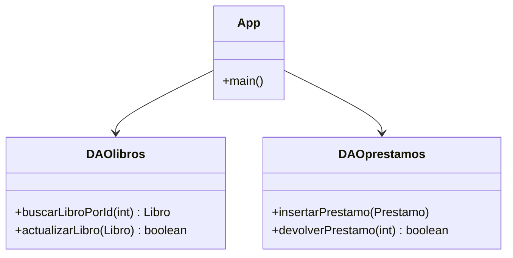

# 🧠 Teoría - Nivel 05: El Final Boss (Capa DAO)

¡Felicidades por llegar hasta aquí! En este bloque final vas a demostrar tu maestría implementando fragmentos del Patrón **DAO (Data Access Object)**, la misma estructura que utilizáis en tu proyecto de clase.

El patrón DAO consiste en aislar todo el código de SQL (los Statements, ResultSets y Connections) dentro de clases específicas (ej. `DAOlibros.java`), dejando al resto de tu aplicación totalmente limpia y desconectada de la base de datos.

## 🏁 Requisitos Corporativos del Desafío

Te enfrentarás a 5 misiones puramente técnicas:
1. **Buscar:** Devolver un DTO en base a un ID.
2. **Insertar Préstamo:** Una transacción compleja que involucra comprobar si hay copias disponibles antes de prestar.
3. **Devolver Préstamo:** Una transacción que debe cambiar el estado del préstamo y restaurar la copia al libro.
4. **Excepciones Duras:** Cómo lidiar con una Inserción que choca contra una clave ajena restrictiva.
5. **El Reto Maestro:** Todo el flujo encadenado de la vida real.

Tu misión es programar el interior de los métodos estáticos que simulan estos DAOs. ¡Buena suerte, arquitecto!
