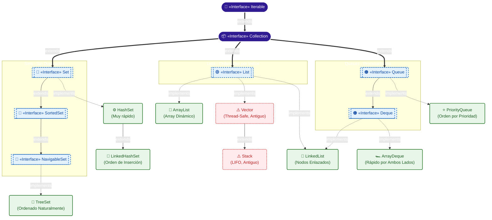

# Esquema Completo del Java Collections Framework (Collection)

---

## Leyenda y Guía de Referencia

### 1. Interfaces Principales

#### `Iterable<T>`
- **Definición**: Raíz de la jerarquía. Permite iterar sobre sus elementos usando un bucle `for-each`.
- **Casos de Uso**: Proporcionar acceso unificado y secuencial para recorrer colecciones.
- **Métodos Principales**:
  - 🔸 `iterator()`: Devuelve un objeto `Iterator` para recorrer paso a paso la estructura.
  - 🔸 `forEach(Consumer<? super T> action)`: Ejecuta una acción para cada elemento.

#### `Collection<E>`
- **Definición**: Interfaz base. Representa un grupo genérico de objetos conocidos como elementos. Todo modelo normal de listas y bolsas nace de aquí.
- **Métodos Principales**:
  - 🔸 `add(E e)` / `addAll(Collection<? extends E> c)`: Inserta elementos.
  - 🔸 `remove(Object o)` / `removeAll(Collection<?> c)`: Borra elementos específicos o en masa.
  - 🔸 `contains(Object o)`: Retorna `true` si el elemento existe en la colección.
  - 🔸 `size()` / `isEmpty()`: Para conocer su capacidad (tamaño) o comprobar si está libre de elementos.
  - 🔸 `clear()`: Vacía inmediatamente toda la estructura.
  - 🔸 `toArray()`: Vuelca su contenido hacia un array clásico.

---

### 2. Interfaces Específicas

#### `List<E>` (Listas ordenadas por índice)
- **Definición**: Colección en la que el orden de los elementos importa (secuencia ordenada). Permite duplicidad y accesos directos por posiciones índice.
- **Casos de Uso**: Cuando necesitas orden secuencial temporal y posibilidad de manipular por índice.
- **Métodos Exclusivos Mapeados por Índice**:
  - 🔹 `get(int index)`: Lee y devuelve lo que hay en una posición concreta.
  - 🔹 `set(int index, E element)`: Modifica una variable presente en la lista en un slot puntual.
  - 🔹 `add(int index, E element)`: Inserta forzosamente incrustando el objeto en la posición, desplazando lo demás.
  - 🔹 `remove(int index)` / `indexOf(Object o)`: Extrae por ubicación y descubre qué index posee un objeto dado.

#### `Set<E>` (Conjuntos puros)
- **Definición**: Colección que NO permite elementos duplicados en ninguno de sus estados. Modela el concepto de los conjuntos lógicos matemáticos.
- **Casos de Uso**: Retener un conjunto de Ids únicos de un sistema, listar usuarios que compraron hoy eliminando clones repetidos.
- *(Los métodos de base no cambian desde `Collection`; simplemente fallará la inserción devolviendo `false` a `add()` si detecta duplicidad).*

#### `SortedSet<E>` y `NavigableSet<E>` (Conjuntos ordenados automáticos)
- **Definición**: Extensiones directas sobre `Set` para que se pre-ordene interna y eficientemente (comparators o de la A-Z de base). `NavigableSet` te facilita búsqueda aproximativa en ese mismo orden.
- **Métodos Principales**:
  - 🔹 `first()` / `last()`: Devolver la cima primera inferior o última superior del conjunto al instante.
  - 🔹 `lower(E e)` / `higher(E e)`: Encontrar "cuál es el inmediatamente inferior" o "cuál es el inmediatamente superior" a un punto dado.

#### `Queue<E>` (Cola Lineal)
- **Definición**: Utilizadas para preparar una estructura esperando que un agente la acabe procesando, priorizando bajo política FIFO (First-In, First-Out; el primero en llegar será el primero en despacharse).
- **Métodos Principales**:
  - 🔹 `offer(E e)`: Acomoda el elemento con seguridad esquivando excepciones (mejor que `add()`).
  - 🔹 `poll()`: Retorna eliminando a la actual "Cabeza de Cola". Da `null` si estuviera vacía.
  - 🔹 `peek()`: Echa el vistazo retornando cual es la "Cabeza actual" reservada, pero sin eliminarla ni consumirla de la Cola.

#### `Deque<E>` (Double-Ended Queue)
- **Definición**: Cola de uso múltiple. Posee cabeza y cola simultáneas, se extrae o inserta por el primer final como en el último abarcando las ventajas del modelo Cola y modelo Pila a la vez.
- **Métodos Principales**:
  - 🔹 `addFirst(E e)` / `addLast(E e)`: Pone en la punta por delante / detrás.
  - 🔹 `pollFirst()` / `pollLast()`: Corta la cabeza actual por un frente / o la del otro.

---

### 3. Implementaciones concretas (Clases, Listas)

#### `ArrayList<E>`
- **Qué hace**: Lista montada alrededor de un array oculto escalable infinitamente solo pidiendo trozos de mayor capacidad a la CPU.
- **Cuándo usarla**: Siempre que lo dominante sean **las lecturas rápidas**. El acceso mediante Índice `list.get(200)` es lo más fulgurante.

#### `LinkedList<E>`
- **Qué hace**: Lista construyendo eslabones que conocen quién era el objeto anterior a sí mismos y quién viene luego. (A la vez implementa `Deque`).
- **Cuándo usarla**: Para uso puro como Cola doble por detrás de escena o si sabemos al 100% que la aplicación solo se pasa el día **inyectando cosas o eliminándolas en medio de la estructura**.

#### `Vector<E>` / `Stack<E>`
- **Qué hace**: Es un antecesor viejo de ArrayList con sincronizaciones bloqueantes predeterminadas de hilos que encarece los consumos. `Stack` le heredó para servir de Pila LIFO temporal pre-modernización Java 1.5.
- **Cuándo usarla**: Es código calificado de **LEGADO**. Totalmente desaconsejable a menos que trabajes adaptando el proyecto antiguo a otra librería. Prioridad sobre `ArrayDeque` si se busca montar una "Pila / Stack" de velocidad alta.

---

### 4. Implementaciones concretas (Clases, Sets)

#### `HashSet<E>`
- **Qué hace**: Emplea hashes subyacentes. El orden visual de lectura final que tendrás tú desde la consola al imprimirla ni existe ni importa.
- **Cuándo usarla**: Si precisas purgar repetidos a velocidad ultra-sonora en orden $\mathcal{O}(1)$. Colección Set predilecta de cada programador por defecto.

#### `LinkedHashSet<E>`
- **Qué hace**: Versión superior combinativa de array y eslabones de lista por dentro del map que logra retener en un historial el propio orden de inserción sin penalizar casi el hash.
- **Cuándo usarla**: Para evitar dobles registros (set), pero requieres forzosamente devolver el output listado **en el mismo orden que el listado llegó**.

#### `TreeSet<E>`
- **Qué hace**: Monta una ramificación (Árbol binario). Exige que al inicializarse se provea su norma de cómo será ordenado el set.
- **Cuándo usarla**: Para asegurar clasificaciones permanentes (si insertas una V se coloca sola junto a la U y la W) saltándose sobreesfuerzos al procesador si necesitas un `Collections.sort` a cada inserción pequeña.

---

### 5. Implementaciones concretas (Clases, Queues y Deques)

#### `PriorityQueue<E>`
- **Qué hace**: Una cola que renuncia al orden FIFO cronológico y usa una política de prioridad según norma intrínseca de sus elementos (o de Comparador inyectable).
- **Cuándo usarla**: Agendas VIP; donde entra un invitado con rango A a la cola general en el instante 01:20h, un invitado de prioridad C entra luego, e imprime de una vez quien es del tipo C para adelantar a todos pasándolo al frente.

#### `ArrayDeque<E>`
- **Qué hace**: Interfaz array dinámico enfundado en traje para hacer lo propio de `Deque`.
- **Cuándo usarla**: Utilizable 95% de ocasiones sobre `Stack` (muy pesada y vieja) si lo que precisas es armarte un sistema logico clásico LIFO "El último objeto entrado en la urna me lo devuelves el primero que te pida". Extremadamente más veloz sobre simulacros de `LinkedList`.
