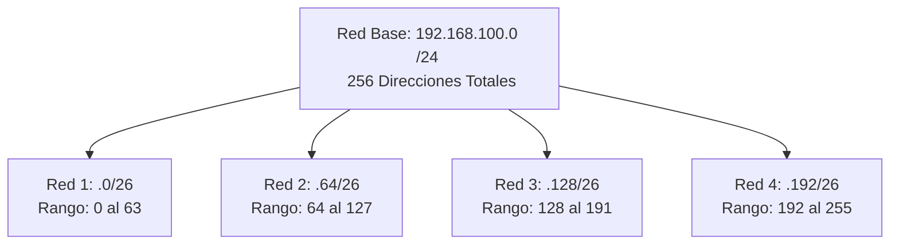

# Guía Profesional de Subnetting IPv4: Resolución Rápida y Directa

A continuación, se presenta la documentación técnica para la resolución de escenarios de direccionamiento IPv4 (Subnetting) utilizando el método del **"Salto de Red" (Block Size / Magic Number)**. Este enfoque minimiza el uso de cálculos binarios complejos, optimizando el tiempo de respuesta en exámenes y entornos de producción.

---

## 1. División de Redes (Subnetting por Requisitos)

Para calcular subredes de forma directa, se utilizan dos fórmulas matemáticas fundamentales dependiendo del requerimiento:
*   **Por cantidad de subredes:** $2^n \ge \text{Redes deseadas}$ (Donde $n$ = bits prestados a la porción de red).
*   **Por cantidad de equipos (hosts):** $2^m - 2 \ge \text{Equipos deseados}$ (Donde $m$ = bits que quedan para los equipos).

### Diagrama de División Lógica
El siguiente esquema ilustra cómo un bloque `/24` se divide físicamente en 4 bloques menores `/26` sin perder ninguna dirección IP.

### Ejercicio 1.A: Requerimiento por Cantidad de REDES
> **Caso:** Dada la red `192.168.100.0/24`, se requieren **4 subredes**.

**Metodología de resolución rápida:**
1.  **Fórmula:** $2^2 = 4$. Necesitamos pedir 2 bits prestados.
2.  **Nueva Máscara:** $/24 + 2 = \mathbf{/26}$. En decimal: `255.255.255.192` (Sumamos los bits 128 + 64).
3.  **Tamaño del Salto:** $256 - 192 \text{ (último octeto de la máscara)} = \mathbf{64}$. Las redes saltan de 64 en 64.

| Subred | Dirección de Red | Máscara | Primera IP (Equipo) | Última IP (Equipo) | IP de Broadcast |
| :--- | :--- | :--- | :--- | :--- | :--- |
| **Red 1** | `192.168.100.0` | `/26` | `192.168.100.1` | `192.168.100.62` | `192.168.100.63` |
| **Red 2** | `192.168.100.64` | `/26` | `192.168.100.65` | `192.168.100.126` | `192.168.100.127` |
| **Red 3** | `192.168.100.128` | `/26` | `192.168.100.129` | `192.168.100.190` | `192.168.100.191` |
| **Red 4** | `192.168.100.192` | `/26` | `192.168.100.193` | `192.168.100.254` | `192.168.100.255` |

> 📌 **Anotación Profesional:** El orden lógico en el diseño de redes siempre es: *Red $\rightarrow$ Primera IP asignable $\rightarrow$ Última IP asignable $\rightarrow$ Broadcast*. La Red y el Broadcast nunca se asignan a dispositivos finales.

### Ejercicio 1.B: Requerimiento por Cantidad de EQUIPOS
> **Caso:** Dada la red `192.168.200.0/24`, se requieren subredes que soporten **30 equipos** cada una.

**Metodología de resolución rápida:**
1.  **Fórmula:** $2^5 = 32$. (Restando 2 nos da 30 equipos útiles). Quedan 5 bits para equipos.
2.  **Nueva Máscara:** $32 \text{ bits totales} - 5 = \mathbf{/27}$. En decimal: `255.255.255.224`.
3.  **Tamaño del Salto:** $256 - 224 = \mathbf{32}$. Las redes saltan de 32 en 32.

*(Se representan las primeras 4 subredes de las 8 posibles)*

| Subred | Dirección de Red | Máscara | Primera IP (Equipo) | Última IP (Equipo) | IP de Broadcast |
| :--- | :--- | :--- | :--- | :--- | :--- |
| **Red 1** | `192.168.200.0` | `/27` | `192.168.200.1` | `192.168.200.30` | `192.168.200.31` |
| **Red 2** | `192.168.200.32` | `/27` | `192.168.200.33` | `192.168.200.62` | `192.168.200.63` |
| **Red 3** | `192.168.200.64` | `/27` | `192.168.200.65` | `192.168.200.94` | `192.168.200.95` |
| **Red 4** | `192.168.200.96` | `/27` | `192.168.200.97` | `192.168.200.126` | `192.168.200.127` |

---

## 2. Pertenencia de Red (¿En qué red está este equipo?)

Para identificar la red padre de una IP específica, no es necesario construir toda la tabla. Basta con encontrar el "salto" de la máscara e identificar en qué rango cae el último octeto.

### Ejercicios de Identificación Rápida

| Dirección IP a evaluar | Máscara Decimal | Tamaño del Salto (256 - Másc) | Rango Identificado | IP de Red Resultante |
| :--- | :--- | :--- | :--- | :--- |
| `192.168.100.150 /26` | `255.255.255.192` | $256 - 192 = \mathbf{64}$ | `128` al `191` | **`192.168.100.128`** |
| `192.168.100.80 /26` | `255.255.255.192` | $256 - 192 = \mathbf{64}$ | `64` al `127` | **`192.168.100.64`** |
| `10.0.0.45 /27` | `255.255.255.224` | $256 - 224 = \mathbf{32}$ | `32` al `63` | **`10.0.0.32`** |

> 📌 **Regla Mnemotécnica:** Multiplica el tamaño del salto hasta llegar al número más cercano (por debajo) del octeto de tu IP. Ej: Salto de 64 $\rightarrow$ $64 \times 1 = 64$, $64 \times 2 = 128$, $64 \times 3 = 192$. El 150 está entre 128 y 192, por lo tanto su red es la base inferior: **128**.

---

## 3. Visibilidad de Equipos (¿Qué equipos están en la misma red?)

Dos equipos pueden comunicarse directamente (sin pasar por la puerta de enlace / router) **única y exclusivamente si comparten la misma Dirección de Red** según su máscara configurada.

### Ejercicios de Visibilidad (Capa 2 / Capa 3)

| Equipo A | Equipo B | Red del Equipo A | Red del Equipo B | ¿Están en la misma Red? (Resolución) |
| :--- | :--- | :--- | :--- | :--- |
| `192.168.100.10 /26` | `192.168.100.60 /26` | `192.168.100.0` | `192.168.100.0` | ✅ **SÍ.** Ambos caen en el primer salto (0 al 63). Comunicación directa por Switch. |
| `192.168.100.60 /26` | `192.168.100.70 /26` | `192.168.100.0` | `192.168.100.64` | ❌ **NO.** Pertenecen a bloques distintos (0-63 vs 64-127). Requieren Router. |
| `172.16.5.30 /27` | `172.16.5.33 /27` | `172.16.5.0` | `172.16.5.32` | ❌ **NO.** El límite del salto de 32 separa ambas IPs. Requieren Router. |

---